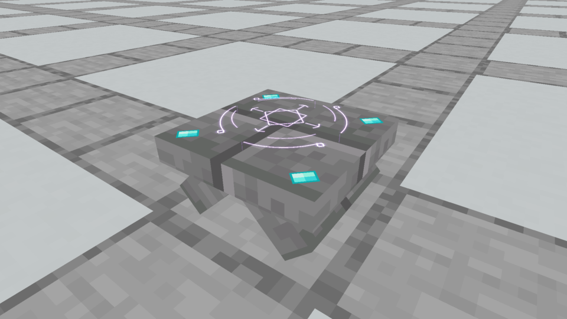

# Thicker broad tent table · superseded proportions

The owner reviewed this version and asked for a smaller, thicker top because the broad low slab still read too much as a table. Its supports were 3 model units thick and its 14×14 top was 2.25 units thick, ending at y7/16. Four small flat faceted chips sat on top. The [current version](../README.md) is compact stonework with four isolated gemstones on the vertical rim.

The unchanged native images, recordings, [capture evidence](capture-evidence.json), [audit](model-and-seam-audit.json) and [verification](verification.json) retain their previous artifact hashes. Their paths describe the original archive/build locations before this historical copy.
