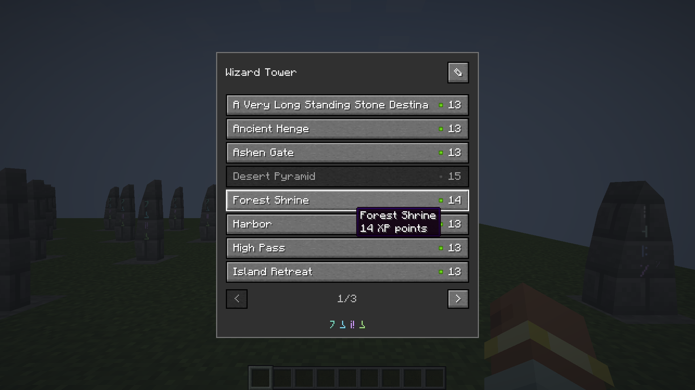
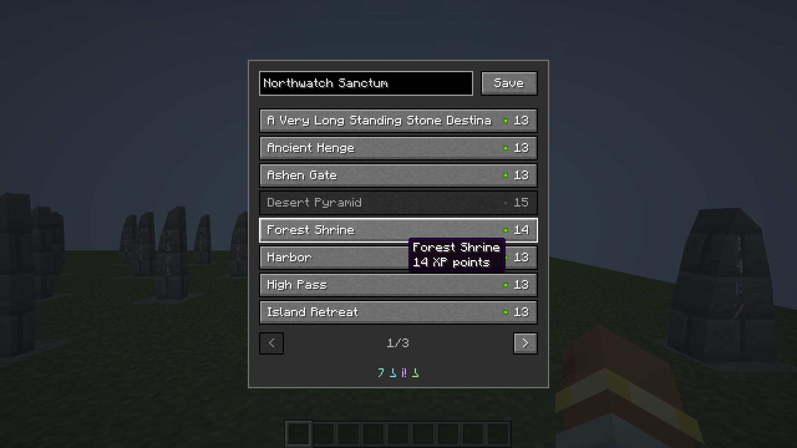

# Standing Stone button list

**Historical first button-list pass.** The [current inset-menu revision](../standing-stone-insets/README.md) narrows this layout, centers the source name, adds matching name/signature recesses and explicit ellipses, and previews alternate resource symbols in native Minecraft. The payment and verification records below remain evidence for this preceding package.

October 6, 2026. The owner selected **Flat List**, with native Minecraft buttons in place of the sketch's separator-only rows. The current stone's name and pencil are at the top; Save appears only while editing. Destinations have their names on the left and a resource symbol/whole charge on the right. Unaffordable buttons are disabled. There is no separate cost line or Travel button. Paging is below the list, and the unlabelled attunement mark is centered at the bottom. The source is represented in the header, rather than duplicated in its destination list.

The owner accepted ordinary **XP points** as the first payment: `round(12 + 12 × sqrt(distance / 1024))`, with three-dimensional distance between stones. The right-hand symbol in the native screen is a green-tinted frame of Minecraft's XP-orb texture. Names are shortened only where needed to preserve the reserved price space; full names and XP-point units remain in tooltips and narration. Enabled states update from the player's synchronized current level/progress. The server rechecks membership, actual arrival and current balance, charges through the existing event-aware XP helper, and consumes a travel session only on success. It refunds if a payment listener invalidates an endpoint or transfer fails. Alternate resources/material discounts remain deferred.

The browser views beside this record are **low-fidelity design previews**, not Minecraft screenshots. Their balance and costs are illustrative. All four light/dark and 736/320-width views pass local disabled-row, name editing, paging and simulated payment interactions without overflow or runtime errors; `preview-inspection.json` records these checks. The previous [three proposals](../standing-stone-menu-sketches/README.md) are historical.

## Native inspection and installation

Java 21 production build, Kithkyn compatibility, **107 unit tests** and all **18 focused Standing Stone Minecraft tests** pass. The world tests cover exact XP affordability/debit, consumed-session replay, canceled/modified point and level events, and complete refund when a payment listener removes the destination. The full Minecraft suite and remote multiplayer were not repeated in this menu/payment pass.

All nine final **1920×1080 actual Minecraft framebuffer captures** were visually inspected at GUI scales three and four (640×360 and 480×270 GUI units). Eleven live assertions pass against actual server endpoints and payloads: hidden editor, pencil/Save validation, server rename, twenty other peers across three pages, per-row affordability, zero-XP disabling, immediate destination click, arrival and the source-only network. A real trip begins with fourteen XP points, charges thirteen and leaves one. Native hover/focus tooltips remain visible in these captures.

The first client completed its assertions but stalled saving a distant fixture world and was stopped. The revised fixture keeps an unaffordable stone closer and waits for an actual editing frame. The final capture uses a valid minimum simulation setting and exits cleanly. These harness changes do not alter production travel.

All thirteen captured class hashes match the final package. All 335 compiled classes and 2,892 source resources match its contents. The previously approved apparatus tint and all **252 Plinth/Spellstone block/item models** are preserved byte for byte. [`verification.json`](verification.json) pins the package, logs, counts and native images.

The inspected jar is installed in **Prism → Kithkyn Testing** at SHA-256 `0373e5f199b37264807c50315e158dc2c630b5b24ab2ddd5326d94d77946d2f4`. [`prism-install.json`](prism-install.json) records the backup and verified atomic replacement. Minecraft was not restarted; restart that instance to load the change. Other mods and existing worlds were not changed.

