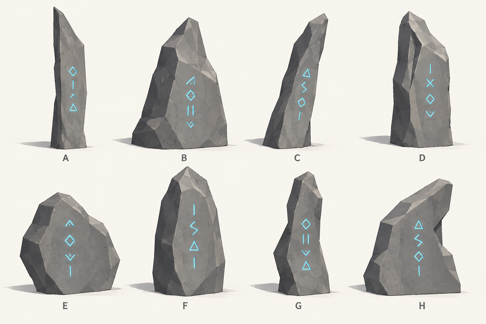
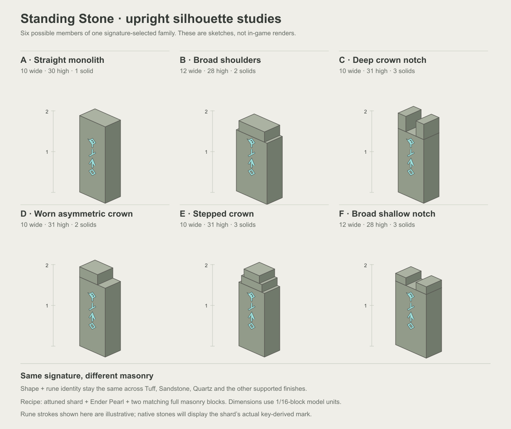

# Standing Stone shape studies

## Current direction: faceted whole-stone silhouettes

The owner rejected the first rectangular upright study on October 6, 2026 and supplied four real standing-stone photo references. The correction is about the **whole body**: angled long edges, lean, taper, changing thickness, broad polygon faces, asymmetric shoulders and sloping broken crowns. A rectangular shaft with a small altered cap does not meet this direction.

This second sheet is built-in image generation using the four supplied photographs as shape references. [The exact prompt](faceted-monoliths-v2-prompt.txt) and unchanged generated image are archived here. It is **concept art, not Minecraft rendering, final mesh geometry or a native texture asset**. The painted stone surface and cyan rune strokes are illustrative; shipped finishes must use the supported native material assets, and the actual shard's mark must supply rune identity. The owner approved this whole-body direction and requested Minecraft prototypes before expanding the shape family. The painted details remain illustrative.

A and C study thin blade-like slabs and leaning profiles. B and E study broad, irregular bodies with a strong shoulder or taper. D and F make the stone's depth and broad edge facets visible. G varies the long edges along the body. H studies a strongly sloping summit and broken side. Every silhouette is one coherent rough stone mass, without separate caps, feet or decorative architectural frames.

The concept must translate to a small number of broad native faces. Avoid noisy micro-facets and stacked-cuboid approximations that recreate the rejected rectangular columns. Front, side and crown should all contribute to volume. Native occupancy and collision need separate verification, including the available space for leaning or wider stones.

The PNG was visually inspected: eight A-H labels are legible; silhouettes are unclipped; taper, lean, asymmetric shoulders and varying visible depth distinguish the bodies. This sheet is presentation review only. Its subsequent [native Minecraft prototypes](../standing-stone-native-v1/README.md) translate three profiles into actual meshes with native material tiles and signature glyphs. Those captures, rather than this painted sheet, are evidence of client appearance. Payment implementation and Prism installation remain separate. [Provenance](faceted-monoliths-v2-provenance.json) records generation and source hashes.

## Historical rejected study: rectangular uprights

The owner selected **ancient upright monoliths with varied crowns and proportions** on October 6, 2026. This first attempt interpreted that too narrowly as six rectangular bodies with altered crowns. It is retained as rejected comparison evidence.

These are low-fidelity vector sketches, **not Minecraft captures or final textures**. The representative front rune strokes are illustrative. Native stones must display the actual glyphs/colors from the shard's `AttunementMark`. No final silhouette set or physical rune arrangement is approved yet.

The rejected designs fit within a two-block upright and use only one to three unrotated stone solids before splitting geometry across occupied blocks. A and B establish plain/narrow and broader proportions. C and F compare deep/narrow and shallow/broad crown notches. D suggests wear with an asymmetric crown. E has a stepped crown. Their fixed cuboid construction is not a constraint on the current direction.

The accepted appearance contract is in [Standing Stones](../../design/standing-stones.md): recipe masonry supplies the finish, the full copied key supplies a repeatable silhouette and rune mark, and the Pearl's Plinth selects payment independently. Visual duplicates never establish membership.

The SVG source and PNG are authored by `tools/sketch_standing_stones.py`; rasterization uses bundled Sharp. The PNG was visually inspected for consistent scale, legible labels and unclipped silhouettes. It contains no copied game/mod textures. This sketch does not verify block collision, occupancy, rune rendering or client appearance.

[Verification evidence](verification.json) records the 36-finish foundation's passing build, unit/world checks, 144 matching packaged finish resources, source hashes and remaining implementation boundaries.
