# Standing Stone icon amounts, fixed rows and corner mana

**Native appearance review · October 6, 2026.** These are unedited Minecraft 1.21.1 / NeoForge 21.1.72 framebuffer captures, inspected in the actual client. They supersede the [number-plus-heart/food and centered-mana review](../standing-stone-resources/README.md). The owner approved this version for shipping on October 6; later refinements remain possible.

## Actual health and food amounts

Health and hunger draw the number of full and half vanilla sprites that the cost represents. They no longer show a numeric multiplier beside one heart or food symbol. The three preview rows cost two, five and eight native points: **one full icon**, **two full icons and one half**, and **four full icons**. The last row is disabled. Native points remain exact integers in narration/hover descriptions.

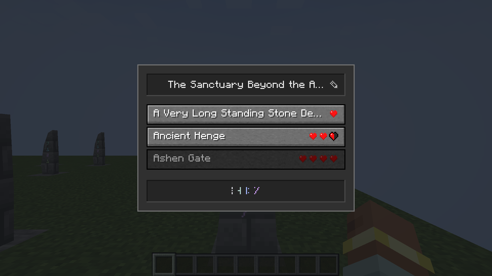

XP and mana retain whole **number then resource symbol**. The shared violet mana rune is used in the menu and HUD.

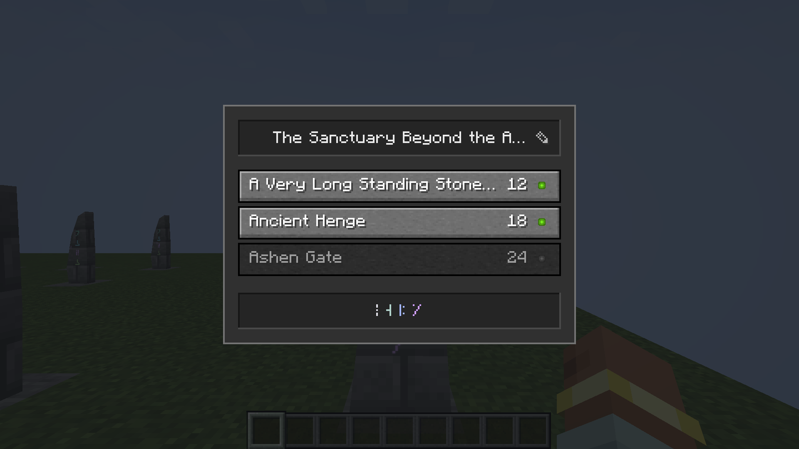

These four cost fixtures exercise appearance and disabled states only. The installed travel system still pays XP points; health, hunger and mana conversion rates/debits and Pearl/socket selectors remain deferred. Preview destination, page and rename actions send no requests and cannot debit resources.

## Fixed buttons and complete pages

Every destination button is **20 GUI pixels high**, with a **two-pixel gap**. Buttons do not squeeze to fit the window or grow on a short page. Six peers per server page keep the whole panel within the normal 320×240 minimum GUI. All twenty fixture destinations remain available across **6 / 6 / 6 / 2** entries. Arrows and page count disappear when there is only one page. The current stone remains outside the destination list.

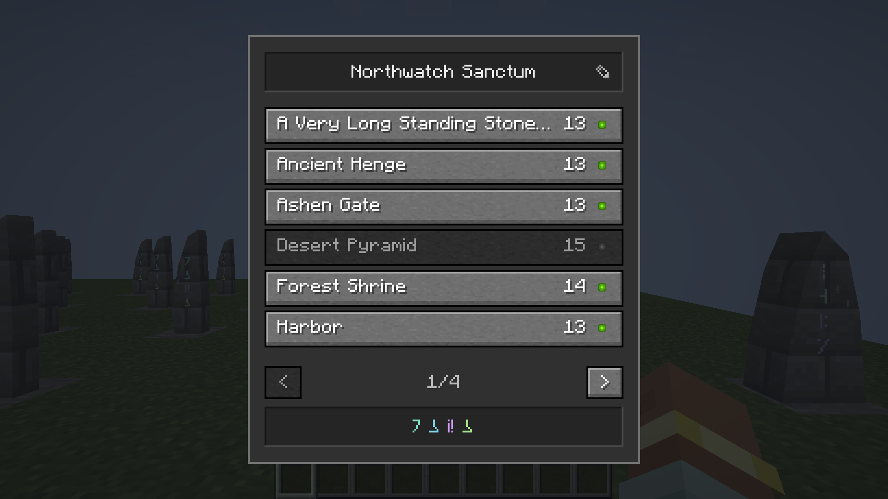

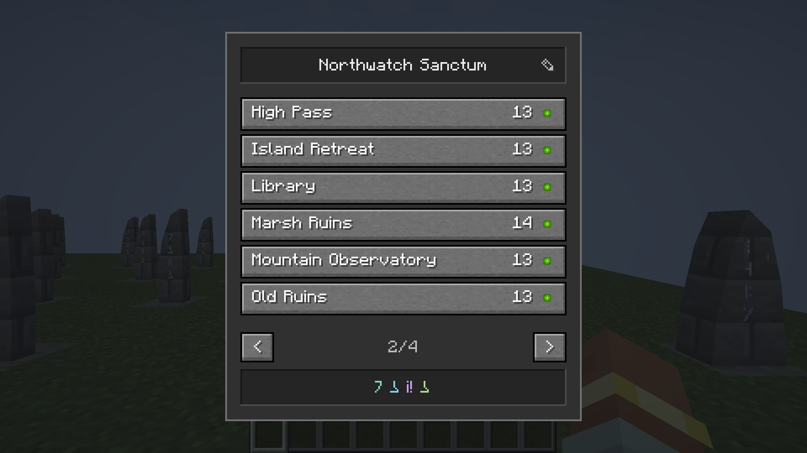

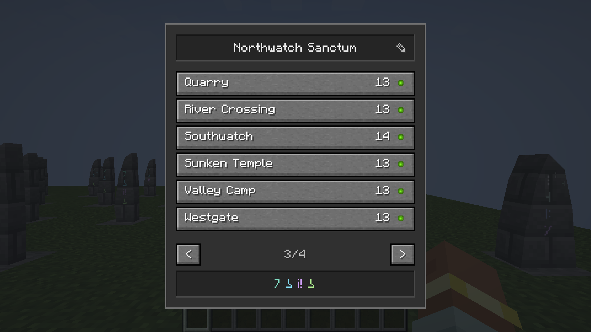

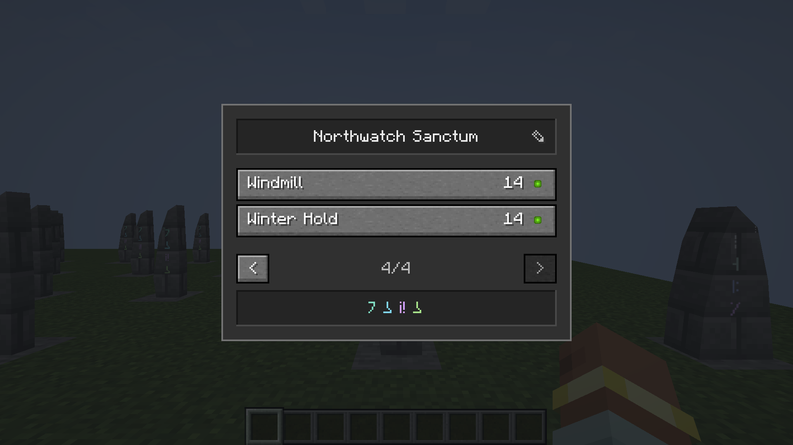

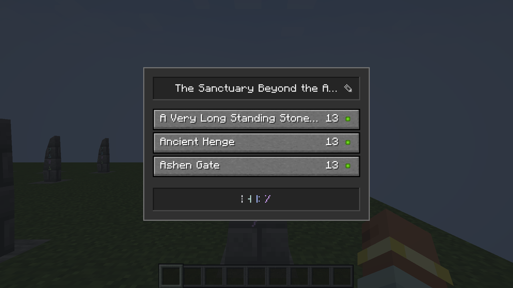

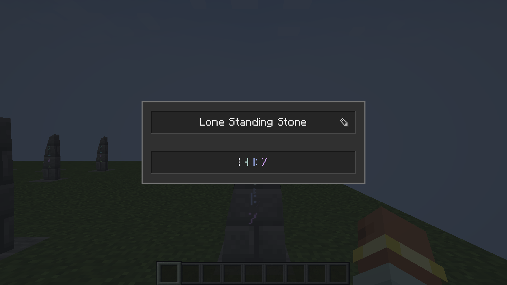

The inset name/signature, subtle pencil, bounded name ellipses and direct-click travel remain. [Wide GUI](native/list-wide.png), [editing](native/editing-wide.png), [saved rename](native/renamed-wide.png), [zero XP](native/unaffordable.png) and [actual arrival](native/after-travel.png) record the remaining menu states. GUI scale three and four naturally change physical pixel size; the logical 20-pixel row height is identical.

## Longer mana bar at the right edge

The mana fill is now **128 GUI pixels wide**, followed by the rounded whole balance and rune. The full drawing is 167×9 pixels, eight pixels from the right edge. On a wide GUI it sits beside the hotbar in the bottom-right corner. When that space is too narrow, it remains right-aligned and lifts above the occupied vanilla rows instead of covering the hotbar. The bar stays hidden at full mana and visible at zero.

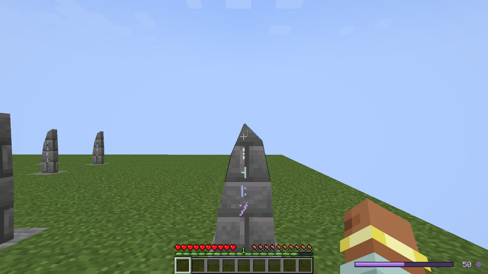

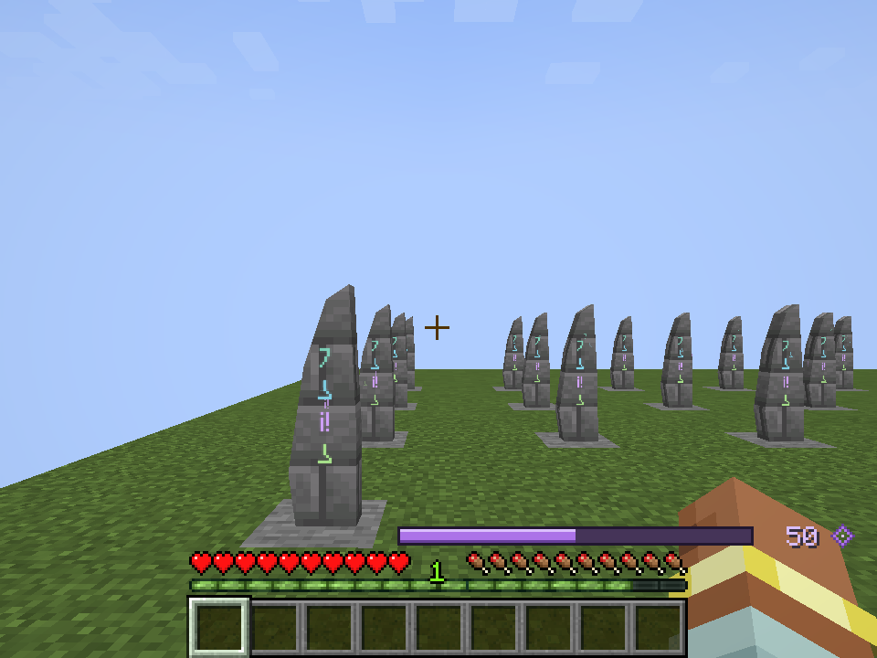

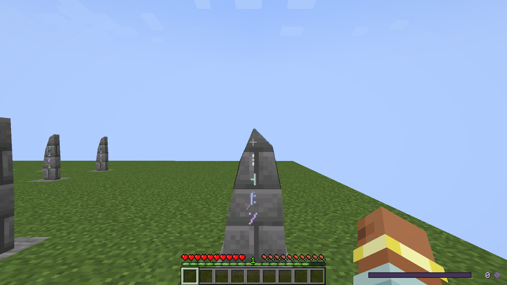

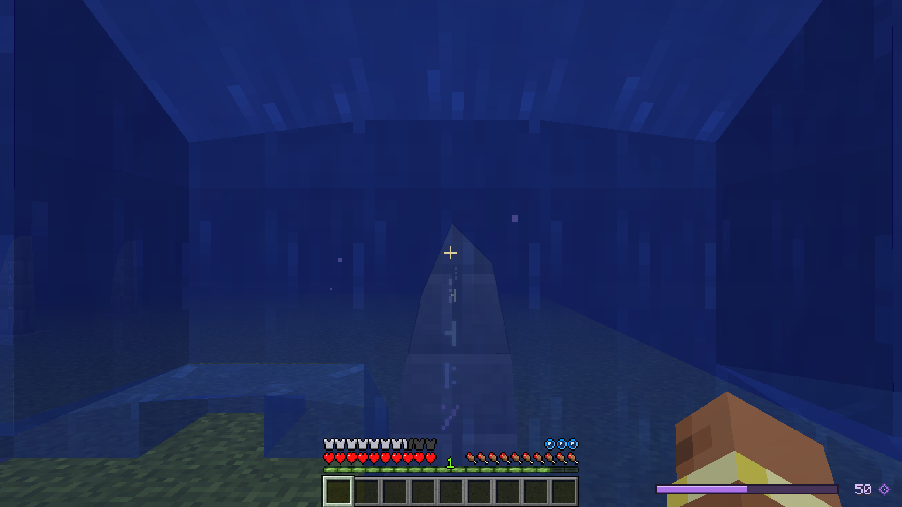

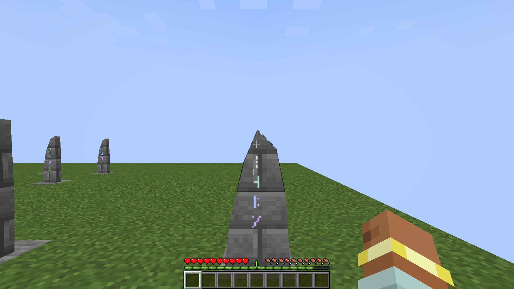

## Verification and installation

The final frozen-source Java 21 build and Kithkyn compatibility check pass. All **118 shared-snapshot JUnit tests**, **18 focused Standing Stone world tests** and **99 native assertions** pass. All **21 final framebuffer captures** were visually inspected. They cover 640×360, 480×270 and 320×240 GUI sizes, with 1920×1080 and 960×720 framebuffers. The real direct-click trip charges thirteen XP points from fourteen and arrives with one. The world server and client exit cleanly.

The [verification record](verification.json) pins source, capture and twenty loaded class hashes. Those classes match the installed review package. Matching six-row server pages and payload registration version **4** are included; client and server must use the same update. No saved key or payload field format changed. Remote multiplayer was not inspected.

The review overlays the compiled menu/cost/capture/shared-mana/HUD families and matching paging/payload/test families onto the preceding verified installed artifact. All **3,278 other package members** are byte-identical, including all **252 Plinth/Spellstone models**, approved apparatus tint, translations and artwork. Concurrent unrelated changes are excluded from the installed package. The frozen source input avoids simultaneous chat-test edits; the owned sources match that input. The [build/client log](native-build-world-and-capture.log), [focused world log](standing-stone-world-tests.log) and [capture manifest](native/capture.json) preserve the evidence.

Installed in **Prism → Kithkyn Testing** with SHA-256 `c5897ac3df89623aeeac3b6092eefd294d47714c2b8a4876e8af1a19743db5ff`. The [installation record](prism-install.json) includes the verified prior-jar backup. Minecraft was not restarted; restart the instance to load the update. Other mods and existing worlds were unchanged.

## Clean main release

The owner-approved release was checked independently in a clean main-based checkout: **107 scoped unit tests**, **18 Standing Stone world tests** and **99 native assertions** pass. All twenty captured classes match both the clean release jar and the accepted installed review. The clean checkout excludes eleven unrelated tests from the prior shared snapshot. Six [fresh release views](release-native/capture.json) were visually inspected: [hearts](release-native/cost-health.png), [food](release-native/cost-hunger.png), [full page](release-native/list-narrow.png), [partial page](release-native/last-page.png), [wide mana](release-native/mana-half.png) and [compact mana](release-native/mana-compact.png). The original twenty-one owner-reviewed frames above remain the primary gallery. [Release verification](release-verification.json), [build/client log](release-build-world-and-capture.log) and [world log](release-world-tests.log) preserve the independent proof.
