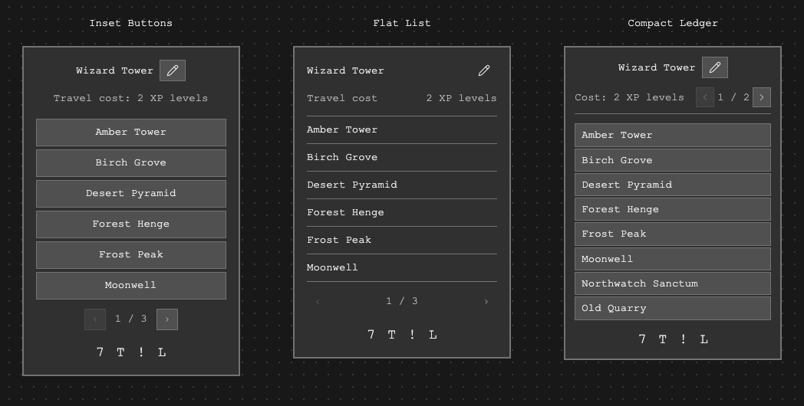

# Standing Stone menu layout sketches

October 6, 2026. **Historical design proposals.** The owner selected Flat List, retained Minecraft-style button rows, moved a symbol/amount to the right of each destination and removed the separate cost line. These are browser-rendered low-fidelity layouts, not Minecraft screenshots or implemented gameplay. See the [selected button-list implementation](../standing-stone-button-list/README.md).

The requested direction is a narrow centered menu with the current stone's name and a small pencil. Editing reveals a field and Save. A travel-cost line sits between the name and destinations; clicking a destination is the travel action. Pages expose longer lists. The shard mark is centered at the bottom without a label. The previous network heading, stone count, Current stone label, always-visible editor and separate Travel button were rejected.

| Proposal | Layout distinction |
| --- | --- |
| Inset Buttons | Centered name and cost, six separated destination buttons, compact centered paging beneath the list. |
| Flat List | Name aligned left with the pencil at the right, cost label/value aligned across the row, six contiguous destinations separated by fine rules, paging across the bottom. |
| Compact Ledger | Centered name, cost and page controls sharing the band above eight denser destination buttons, with the bottom reserved for the mark. |

All three start at the same 284-pixel preview width. This is a sketch measurement, not a final Minecraft GUI-unit choice. The shared neutral palette and monospaced type stand in for native Minecraft styling; final game font, textures, colored glyphs and GUI scales require native inspection after selection. Different page densities are proposals; server payloads remain bounded to eight entries. The current stone is represented in the header rather than duplicated as a destination in these sketches.

The previews support local pencil/Save, Escape to leave editing, paging, pointer/keyboard cost preview and simulated immediate arrival when a destination is clicked. No network requests, world travel or resource payment occur. The 1–4 XP-level values are illustrative layout content, not accepted pricing. In-game prices must come from server-authoritative destination quotes before direct travel; exact payment design remains separately unfinished.

Interaction references inspected for this pass were the centered actionable workspace rows in [Hex](https://mobbin.com/screens/3ba1c251-53e1-4628-9ddd-985a3e379024), the editable name within [Framer](https://mobbin.com/screens/92112e4f-1a75-444a-b1fd-ab67a0efa3c6), and the compact destination-like list in [Attio](https://mobbin.com/screens/04a64ace-78fc-4073-bcb3-0db84c68118e). They inform hierarchy and disclosure; their app chrome, workspace metadata and branding are not copied.

The editable in-conversation source is `standing-stone-menu-sketches.html` in the calling chat's explicitly writable visualization directory. Inspection images and `inspection.json` are stored beside this record. All three designs were rendered at **736- and 320-pixel browser widths**, in both themes, including 64-character names. The wrapper leaves 704/288 pixels for the content. Local name edits, pages, cost previews and immediate destination actions pass in all twelve views, without horizontal overflow or JavaScript errors. The first inspection caught the sandbox blocking form submission; the final version uses native button/Enter handling and was rechecked. The diagnostic rename image is not acceptance evidence.

Native appearance and gameplay tests are deferred until a layout is selected; no production Java, assets or Prism installation is changed in this pass.
