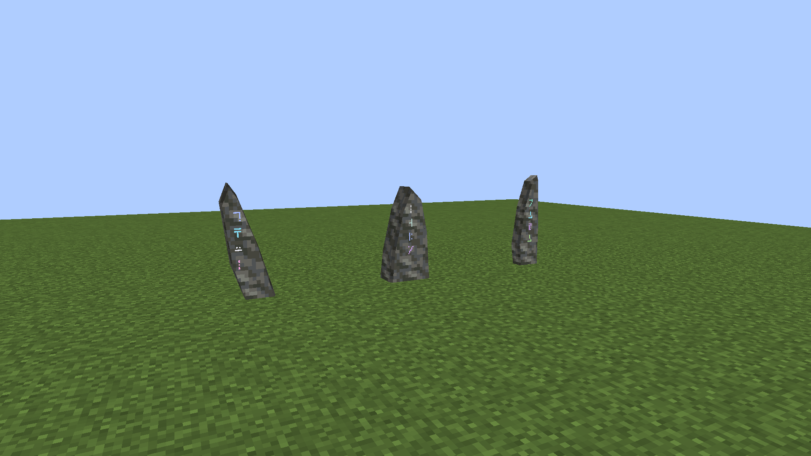
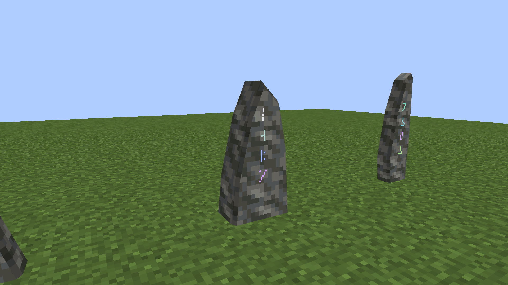
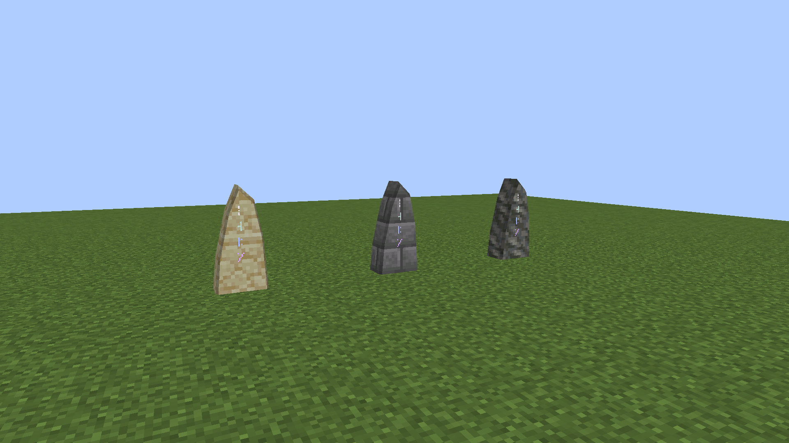
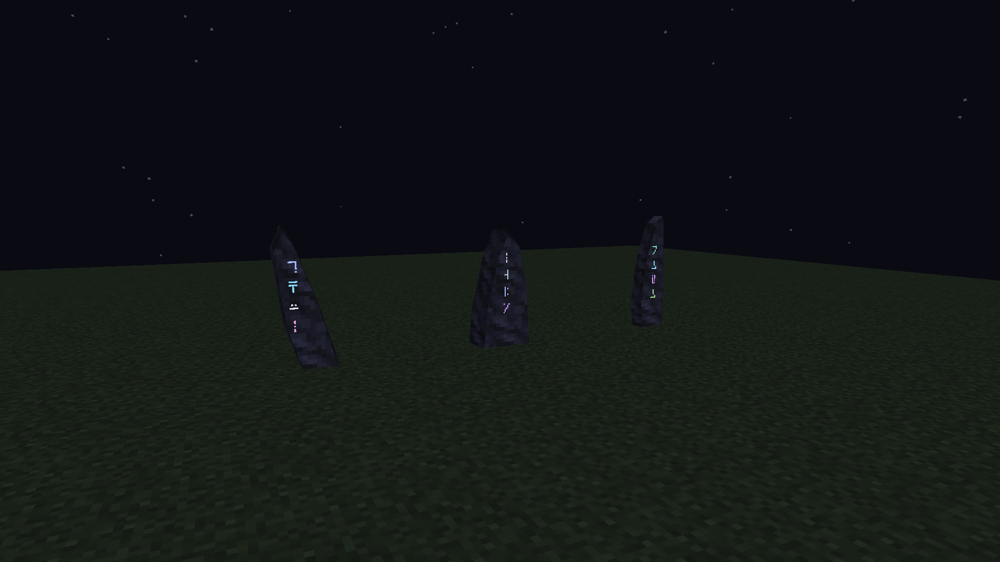

# Native Standing Stone prototypes

**Historical first pass.** The owner's follow-up edge simplification is recorded in the [current native comparison](../standing-stone-native-v2/README.md). The original meshes are archived in `meshes/` and are not packaged.

October 6, 2026. These are **actual Minecraft 1.21.1 / NeoForge 21.1.72 screenshots**, exported unchanged from the native client framebuffer at 1920×1080. They use the shipped models, vanilla 16×16 masonry tiles and the actual four-glyph/color mark calculated from each full attunement key. No illustration, shader, external render or comparison resource pack is used.

## Three whole-body silhouettes

From left to right in the camera view: **Leaning**, **Shoulder**, **Blade**. Each stone is one faceted mass with angled long sides, an irregular crown and visible depth. There is no added cap or foot. Heights range from 29/16 to 32/16 blocks. Seven outline points give 24 authored broad faces; splitting their external surfaces across two occupied blocks yields 20 lower and 14 upper baked faces. The split does not add an exposed interior cap or horizontal model seam.

## Close view

The broad receiving face, narrow edge bevel and four native glyphs are visible at player scale. Tuff uses its actual Minecraft tile; its pixel texture remains coarse while the silhouette uses a few sloping faces.

## Same key, different finish

Left to right: **Sandstone, Stone Bricks, Tuff**. All three carry the exact same full key and therefore the same Shoulder profile and rune/color mark. Material choice changes only the finish. This family is packaged for all 36 shared masonry variants; these three finishes were inspected in the native client.

## Night appearance

Rune ink stays legible against the naturally dark stone. It does not emit block light or add shader bloom. Colors and letters belong to the actual mark, rather than a decorative placeholder rune strip.

## Physical implementation and checks

Each stone occupies a two-block vertical column. Item placement requires the upper space; the lower half alone stores the endpoint. Either half opens the same network menu, and destroying either half removes both halves with one bound, named survival drop. Creative upper removal produces no duplicate. Facing supports all four horizontal directions. Quarter-model-unit collision bands conservatively enclose the silhouette and bevel inside those two blocks; collision is a voxel approximation rather than triangle-exact.

`build`, `verifyKithkynCompatibility` and `runGameTestServer` pass: **97 unit tests and all 164 required Minecraft tests**, with zero failures/errors/skips. New native tests cover blocked upper space, both-half survival removal, creative upper removal, all three profiles/facings and upper-half network interaction. All 36 finishes retain their existing real placement/drop and recipe checks. The geometry audit checks outward normals, atlas-safe UVs, face limits, joined halves and contained collision bands. Both generated-resource authors pass their drift checks.

[Capture metadata](capture.json) records actual poses, dimensions, keys, profiles and mesh hashes. [Verification](verification.json) records tests, image/package hashes, 444 matching packaged resources and native class parity. The raw successful [verification log](verification.log) and [native capture log](native-capture.log) are archived. Initial attempts exposed a test-fixture isolation issue and shared Gradle output/cache collisions; the successful runs use consistent class files. Captures were made after the passing test server exited, using an isolated temporary build and project cache.

These are the first three prototypes following the approved faceted concept direction. Additional silhouette designs remain to be iterated. Travel payment selection/charging, optional terrain maps and Prism installation remain outstanding; this visual pass does not claim final paid travel is complete.

Authoring: `tools/standing_stone_geometry.py` defines outlines/meshes; `tools/author_standing_stones.py` generates all finishes, item overrides, occupied-half models, loot and collision bands. Capture mode: `standing_models` in the existing `runEffectsCapture` development run.
