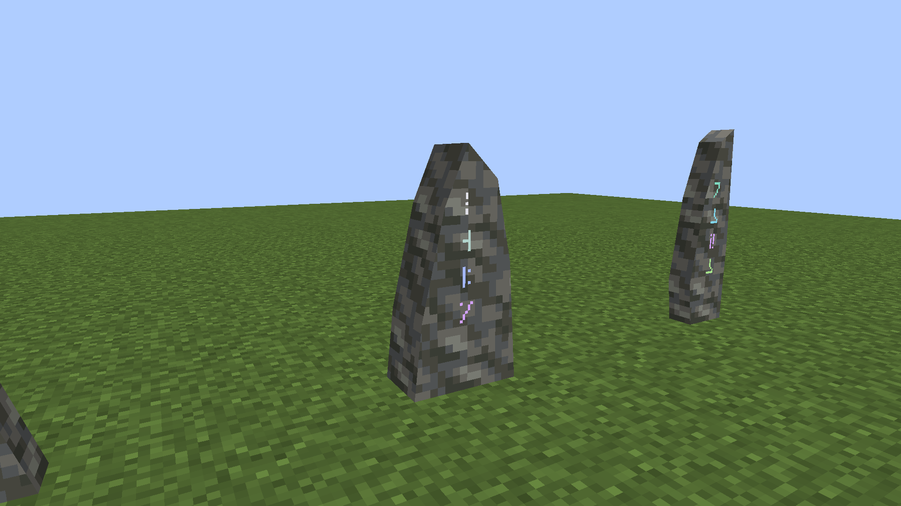
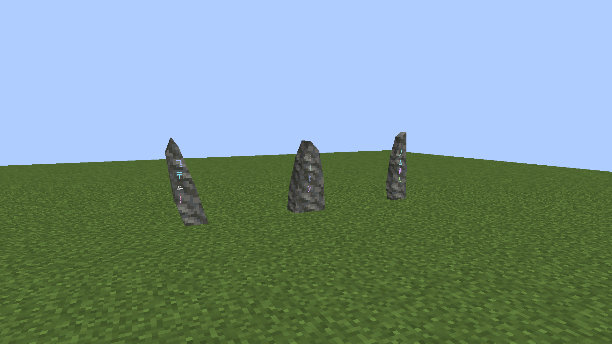
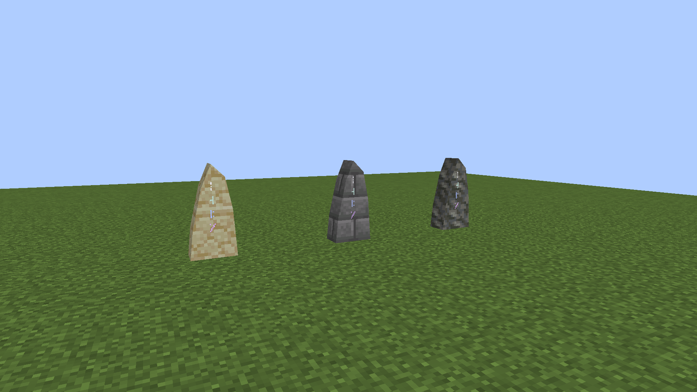
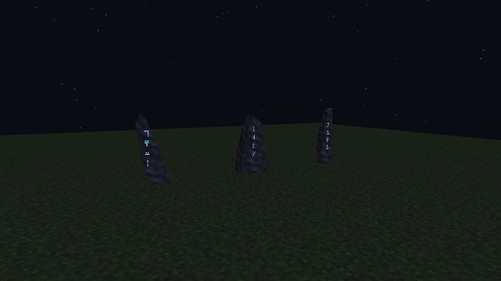

# Standing Stone edge simplification

October 6, 2026. **Actual Minecraft 1.21.1 / NeoForge 21.1.72 captures**, exported unchanged from the native client framebuffer at 1920×1080. The camera, lighting, keys, finishes and placements match the [first native pass](../standing-stone-native-v1/README.md).

This remains the approved body comparison. The [current rune appearance](../standing-stone-native-v3/README.md) adds luminous halos and drifting signature glyphs on these same meshes.

The owner liked the three forms and requested a small reduction in polygon complexity, particularly the carved-in edges. The front inset and its angled perimeter band have been removed. The broad front now meets each side directly. The outer outlines, thickness, height and four native signature glyphs are retained across all 36 finishes.

## Before and after

Before — inset front with an angled edge band:

After — direct front-to-side edges:

Each of the three profiles has the same face counts:

| Stone body | Before | After |
| --- | ---: | ---: |
| Authored faces | 24 | 17 |
| Baked lower half | 20 | 15 |
| Baked upper half | 14 | 10 |
| Whole placed stone / item | 34 | 25 |

This removes **9 of 34 baked body faces, about 26%**. Counts include the triangles/quads passed to the native OBJ baker; signature glyphs are rendered separately. Splitting surfaces at the block boundary adds no exposed interior cap.

## Three shapes

Left to right: **Leaning, Shoulder, Blade**. The sloping crowns, lean and asymmetric outlines remain intact.

## Finish and night checks

Left to right: **Sandstone, Stone Bricks, Tuff**, carrying the same complete key and therefore the same Shoulder shape and glyph/color mark. These finishes were physically inspected; all 36 use the same validated shared meshes.

Full-bright glyph ink remains legible against naturally dark stone. It does not emit block light or add shader bloom. There are no shaders, comparison packs or external renders in these captures.

## Verification

Java 21 `build` and `verifyKithkynCompatibility` pass: **97 unit tests**, zero failures/errors/skips. The mesh audit and both apparatus resource drift checks pass. All 444 generated Standing Stone resources match the packaged jar; all nine captured mesh hashes and all 26 captured travel class files match that package. [Capture metadata](capture.json) records poses and keys; [verification](verification.json), the [build log](verification.log) and the [native capture log](native-capture.log) preserve the checks.

The three outline profiles, front/back depths, generated collision source and rune renderer were checked against the previous revision and are unchanged. The first pass's 164 required Minecraft tests remain the recorded behavior evidence; the world suite was not repeated for this art-only change. Placement, endpoint storage, signature selection, recipes and travel mechanics retain their existing implementation.

The old meshes are archived in the [first pass's art folder](../standing-stone-native-v1/meshes/) for comparison and are not packaged. Further silhouette variants, travel payments, optional terrain maps and Prism installation are outside this art revision.
