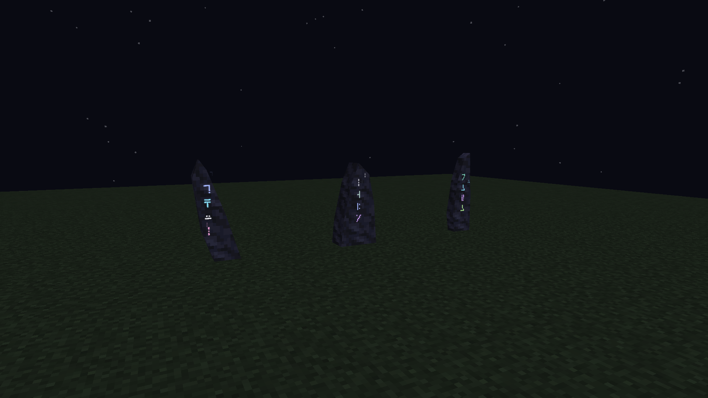
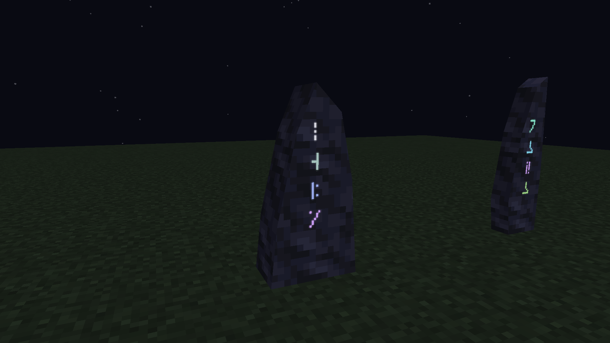

# Luminous Standing Stone runes

The current family has expanded to [sixteen native forms](../standing-stone-native-v4/README.md), with shape-specific inscription placement and all 36 finishes. This three-form review remains historical evidence for the shared glow and drifting glyph effect.

October 6, 2026. These are actual Minecraft 1.21.1 / NeoForge 21.1.72 captures of the native Standing Stone renderer. The stone uses the approved simplified meshes and vanilla masonry tiles. Its inscription and floating symbols use the actual Attunement Shard's four glyphs and colors from Minecraft's alternate font.

## In motion

The silent clip is encoded from the native client framebuffer at the recorded frame times. It contains no illustration, external render, shader, simulated animation or frame interpolation. The inscription has a gentle luminous pulse; tiny copies of individual signature glyphs move a short distance out and up, shrink slightly, then fade.

## Night appearance

Full-bright ink and a faint halo remain visible against the naturally dark stone. The crisp foreground uses Minecraft's text depth offset so the translucent halo cannot overwrite its strokes. The glow does not emit terrain light or add shader bloom.

Left to right: Leaning, Shoulder, Blade. The effect is shared by all 36 finishes and derives its colors and glyphs from the same full key as the stone's existing inscription.

## Particle preferences

Minimal disables floating glyphs and retains the glowing inscription. Decreased permits one trajectory per stone; All permits three. Motes are shown only within 24 blocks, drift for at most 3.6 seconds and stay within approximately half a block of their starting glyph. They use ordinary depth testing, so nearby solid blocks occlude them.

The trajectories are bounded, client-only rendering. They create no world entities, saved state or particle packets, and disappear immediately when their stone unloads or is removed. The main inscription and signature identity remain independent of the particle preference.

## Evidence

[Capture metadata](capture.json) records actual camera poses, keys, finishes, particle preferences, mesh hashes and animation frame times. [Verification](verification.json) and [verification log](verification.log) record the final checks. The [native capture log](native-capture.log) preserves the client run. Raw frames and their measured timing manifest are retained beside the clip.

Java 21 `test`, `jar` and `verifyKithkynCompatibility` pass with 103 unit tests and no failures/errors/skips. All 28 captured travel class files match the reviewed package; all nine mesh hashes match the approved v2 bodies. The 5.93-second H.264 clip uses 30 native frames at their measured times and passes a full decode.

This is a client presentation change. It does not change body geometry, collision, recipes, endpoints or travel payments. Native client inspection covers the three profiles, matching Tuff/Stone Bricks/Sandstone finishes, daytime, nighttime and all three particle preferences. Existing world behavior evidence remains in the earlier native passes.

The subsequent [combined apparatus installation](../apparatus-fixes-v1/prism-install.json) is now in Kithkyn Testing. Its installed jar hash matches that record, and its `StandingStoneRenderer` class hash matches this inspected night recording. Minecraft must be restarted to load it; this rune review did not replace the combined artifact.
