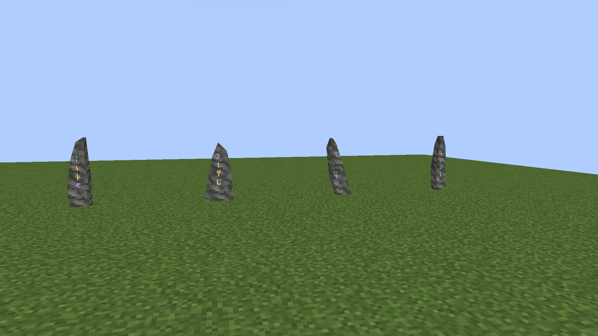
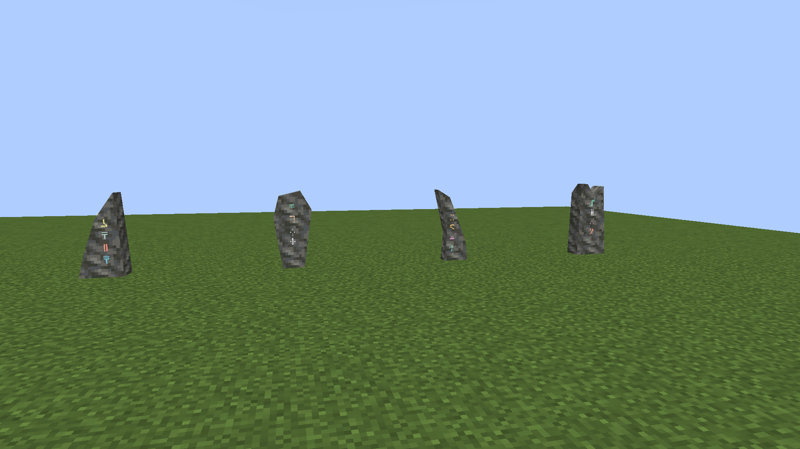
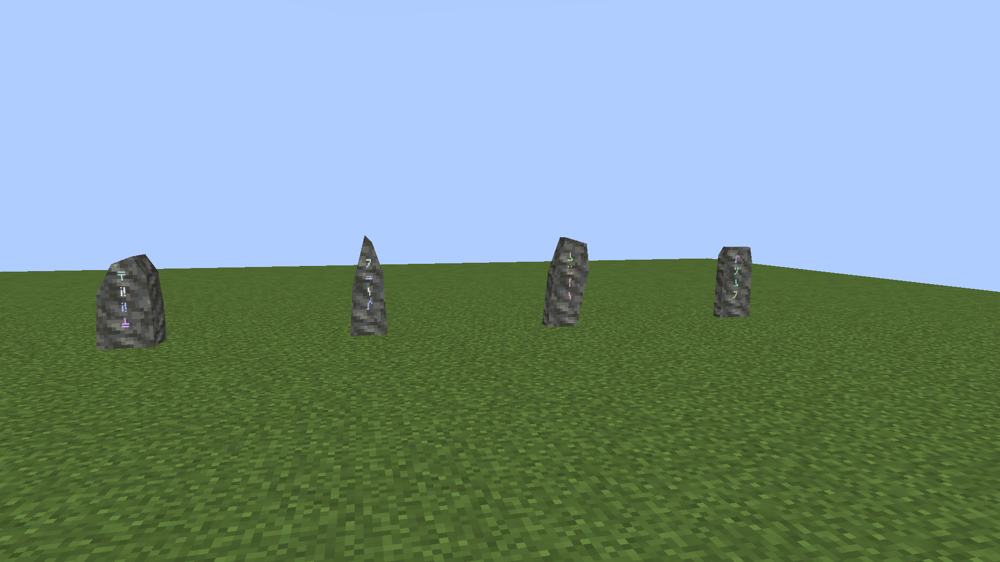
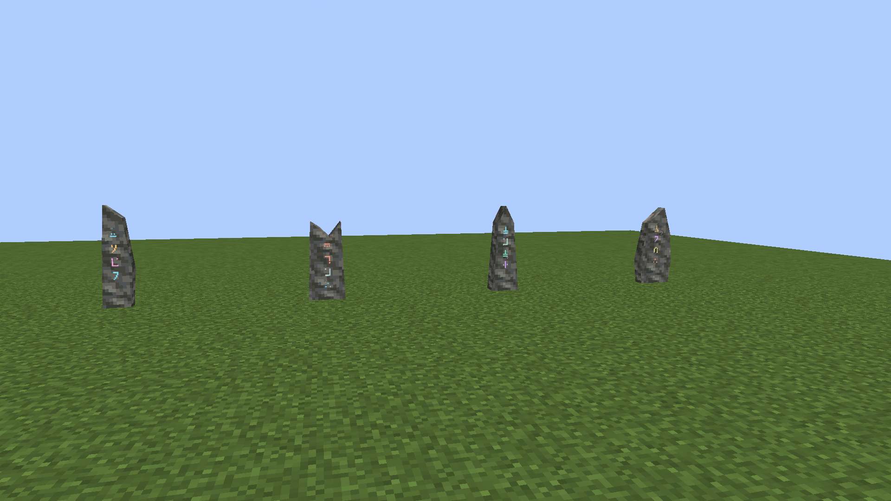
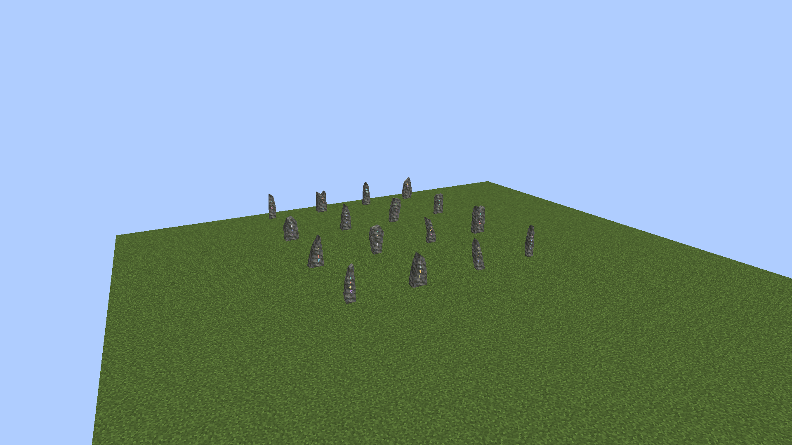
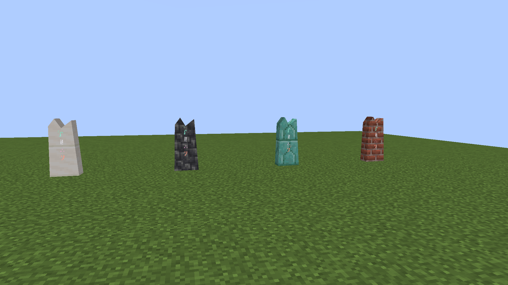
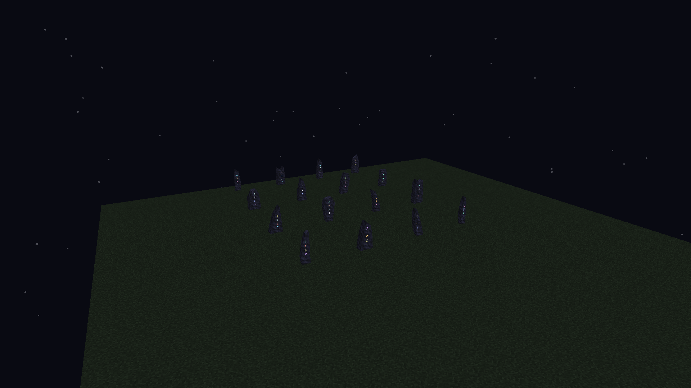

# Sixteen Standing Stone forms

**Owner-approved and locked, October 6, 2026.** The owner accepted the complete sixteen-model family with all 36 masonry finishes after reviewing these actual Minecraft captures. [Approval record](approval.json) pins the selected meshes, gallery and verified package.

October 6, 2026. This family keeps the approved Blade, Shoulder and Leaning meshes and adds thirteen native faceted silhouettes. All sixteen use the same 36 vanilla masonry finishes, giving 576 cosmetic combinations. Whole bodies have 17–25 baked faces; none exceeds the preceding family's maximum of 25.

## Actual Minecraft gallery

These views come directly from Minecraft 1.21.1 / NeoForge 21.1.72 with vanilla texture tiles and the native rune renderer. The four group views use Tuff so their silhouettes can be compared independently of finish. Names below are left to right.

Every displayed key comes from a reproducible native Attunement Shard blueprint using the accepted six offerings and a valid leyline layout. The capture uses the normal shard-to-stone factory. These are actual in-game models and inscriptions, with no external render or substitute animation.

**Blade, Shoulder, Leaning, Spire**

**Wedge, Crown, Fang, Cleft**

**Hunched, Taper, Slant, Tablet**

**Chisel, Saddle, Obelisk, Keel**

## Signature, finish and glow

The Attunement Shard's complete copied key determines the model and the four rune glyphs/colors. Two matching full masonry block offerings select the finish. Stones with the same full key share their same-dimension network regardless of finish. Coincidentally matching visible symbols or silhouettes never link different keys.

The Cleft form below uses one shared key in Quartz, Cobbled Deepslate, Prismarine Bricks and Bricks, left to right. Its shape and inscription remain the same.

The luminous pulse and drifting glyphs retain the preceding implementation. Per-form rune anchors keep all four glyphs fitted to each receiving face. All/Decreased/Minimal particle preferences still select three/one/zero nearby motes; the ink remains bright with Minimal. Glow does not emit terrain light.

## Selection policy and evidence

The sixteen-form expansion deliberately replaces the initial three-way prototype selection. The low four bits of the key's last byte choose a fixed named bucket; enum length does not determine the mapping. The three original review keys retain their selected forms. Other prototype keys may choose a different form when newly placed; no keys, rune marks or network identities are migrated. Fresh development worlds are used.

[Geometry ledger](geometry.json) records per-form dimensions, rune anchors and lower/upper/whole baked face counts. [Capture metadata](capture.json) records actual poses, keys, finishes, profile placements, mesh hashes and native animation times. Existing three-form art remains in v1–v3 for comparison.

## Verification and installation

Java 21 `build` and `verifyKithkynCompatibility` pass with **104 unit tests**, zero failures/errors/skips. The selected Standing Stone world suite passes **all 12 required tests**, including every form in all four facings, joined collision halves and all 36 finish recipes. The full world suite was not repeated for this expansion. Generator drift checks and the independent mesh audit pass.

All seven final native views were visually inspected: every form in Tuff, one shared signature in four finishes, and the full family at night. The 48 captured meshes, 30 compiled travel classes and 1,887 generated resources match the reviewed jar; the nine original meshes remain unchanged. The silent 5.97-second clip preserves 22 native frames at measured times and passes a full decode. [Verification](verification.json), [build log](build-verification.log), [world log](world-verification.log) and [client log](native-capture.log) retain the evidence. Concurrent edits after the source snapshot affect unrelated preview capture jobs only; the captured Standing Stone production files match the package.

The verified jar is installed in **Kithkyn Testing**, with the previous jar preserved in a verified backup. [Installation record](prism-install.json) pins source, installed and backup hashes. Restart Minecraft to load it. Native tests and captures use NeoForge 21.1.72; the existing Prism 21.1.248 profile was not relaunched. Other mods and player worlds were not changed.
