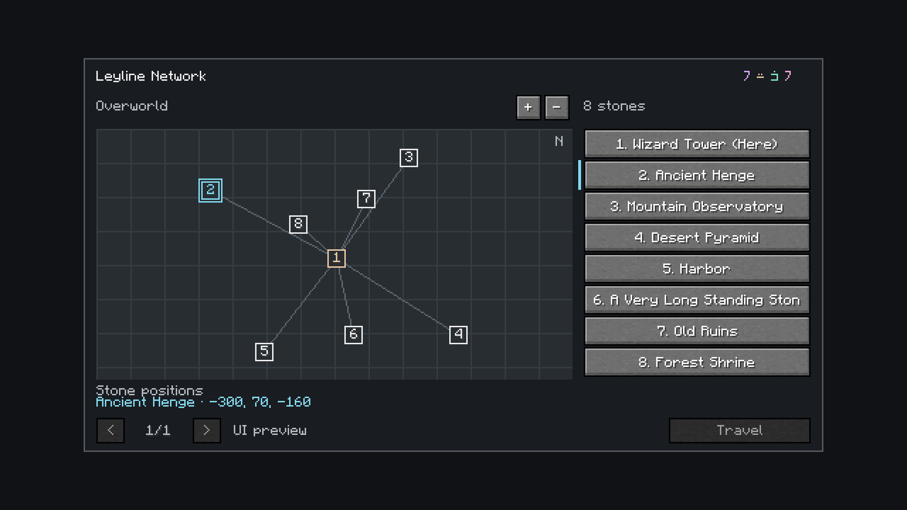

# Standing Stone network: native UI

**Superseded October 6, 2026:** the owner selected a clean list-only menu with current-stone naming and bottom signature. These map captures preserve the earlier iteration; see the [current native list inspection](../standing-stone-list/README.md).
**Current menu rechecked October 6, 2026.** The screen's source is unchanged from these inspected captures, and its installed class matches the tested sixteen-model package. [Current menu evidence](current-menu-verification.json) records that parity; no fresh client capture was needed for this check. The sixteen Standing Stone models are now approved and installed in Kithkyn Testing. These screenshots still use sample destinations, with Travel disabled only by the capture fixture.

**Captured and inspected October 6, 2026.** These are unchanged 1920×1080 Minecraft 1.21.1 / NeoForge 21.1.72 framebuffers from the actual native `StoneNetworkScreen`. Destination fixtures are used; this is not footage of player teleportation or proof of an Atlas terrain integration.

[Selected map pin](selected-map-pin.png) shows the real pin click selecting Desert Pyramid and the corresponding list row. [Narrow GUI](network-narrow.png) shows the full eight-row list at 480×270 GUI units, compared with the wide capture's 640×360. [Last-row selection](last-destination-selection.png) follows a real click on the eighth list widget. [Capture checks](checks.json) and [hash/source evidence](capture-evidence.json) record these actions and dimensions.

The first inspection caught default background blur affecting already-drawn labels/map; the screen now owns its backdrop. A subsequent inspection caught overly cramped marker digits; larger marker backplates keep them legible. Those internal attempts are excluded from this archive. The four final screenshots were visually inspected for sharp text, eight visible rows, selected pin/list agreement and footer clearance.

The native screen uses Minecraft's font/buttons and the existing key-derived four-rune mark. Its grid plots actual X/Z endpoint coordinates, with north up and warm source / cyan selection colors. Travel is intentionally disabled in these menu-only fixtures. The production screen enables it for a different selected endpoint, and server behavior is covered separately by Standing Stone GameTests.

No terrain, map mod, new raster UI art or real teleport video is shown here. At the time of this UI capture, the block used temporary vanilla Chiseled Stone Bricks; the subsequent [sixteen-model family](../standing-stone-native-v4/README.md) is now approved and installed. Paid travel/payment imbuements and the optional terrain-map integration remain outstanding. See [design](../../design/standing-stones.md), [payment discussion](../../design/standing-stone-payments.md) and [map research](../../research/standing-stone-maps.md).

Reproduce with Java 21: `./gradlew runEffectsCapture -Pcapture_kind=stone_network -Pcapture_output=build/standing-stone-ui -Pwith_kithkyn=false`. The capture client closes after four screenshots and saves actual click assertions to `checks.json`.
