# Standing Stone resources and mana HUD

**Historical review, superseded by [counted full/half costs, fixed-height rows and corner mana](../standing-stone-icons-corner/README.md).** Original verification and captures remain below.

October 6, 2026. Actual Minecraft review of the owner's number-first costs, correct health/food icon units, one shared mana resource mark and all three destination pages. This supersedes the [preceding inset menu](../standing-stone-insets/README.md); its narrower native buttons, centered recessed name/signature, subtle pencil, ellipses and conditional pagination remain.

All images below are **unedited native Minecraft framebuffer captures**, not browser studies. Final frames are 960×720 pixels. The menu was checked at GUI scales two and three (480×360 and 320×240 logical GUI sizes).

## Resource display

The amount comes **before** its icon. XP and mana are whole points. Health and hunger numbers count full icons: **2 Minecraft HP display as 1 heart; 2 food points display as 1 food icon.** Tooltips and narration retain exact native point amounts. An odd native point amount retains its half-icon remainder; this changes display units without rounding or changing any actual payment. The appearance fixtures use integer full-icon amounts.

| Resource | Symbol | Underlying preview point costs | Visible numbers |
| --- | --- | --- | --- |
| XP | Vanilla green XP orb | 12, 18, 24 XP points | 12, 18, 24 |
| Health | Vanilla full heart | 2, 4, 6 HP | 1, 2, 3 |
| Mana | Shared open violet rune | 10, 20, 30 mana | 10, 20, 30 |
| Hunger | Vanilla food icon | 2, 4, 6 food points | 1, 2, 3 |

The first two fixture rows are enabled and the final row is disabled. These are appearance examples, not approved exchange rates. **Only ordinary XP travel is live**. Alternate previews cannot send travel, rename or paging requests and spend no resources. Distance-based health/food/mana rates, affordability rules and material-selected travel payments remain separate work.

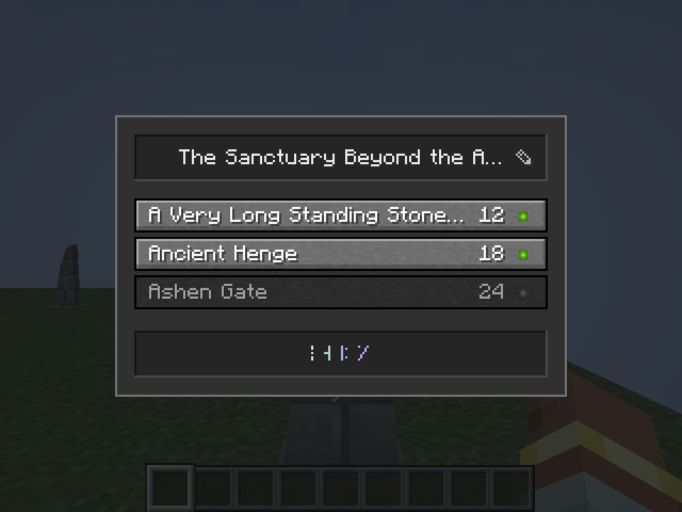

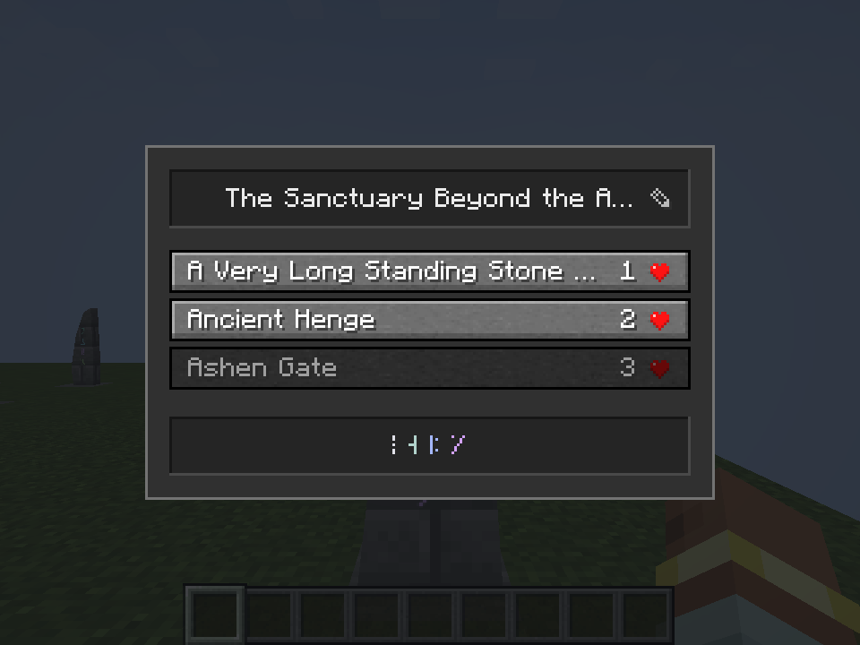

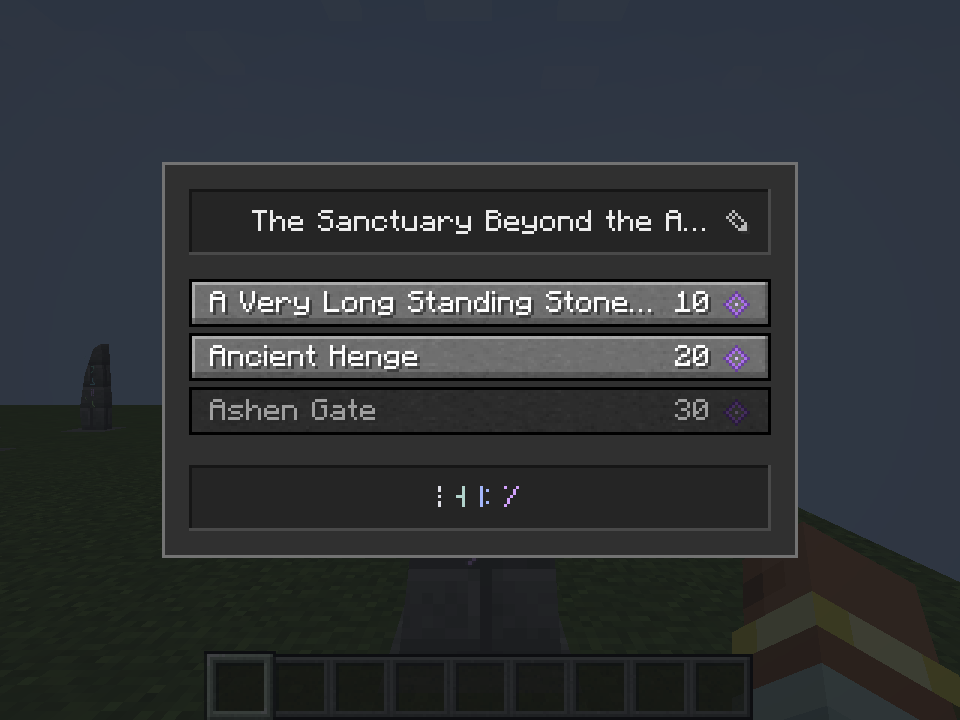

## Mana standard, first review

The [mana display direction](../../design/mana-display.md) uses a 9×9 native GUI-pixel open violet rune with a light center, paired with the retained violet palette. The HUD shows a whole-number balance, then the rune, then a five-pixel continuous meter. The same rune is used for menu mana costs. No image asset, external font or dependency is added. This is an implemented appearance review; the owner has not permanently locked it.

The meter uses synchronized native mana, including existing capacity/recovery. It stays hidden at full mana, remains visible at zero and sits above occupied vanilla resource rows. The native captures verify ordinary, empty, armored, full-hidden and underwater states. Armor/air remain readable, and mana does not cover the XP bar. The source also respects spectator mode/Hide GUI and reserves room for the selected-item name; vehicle health and extra heart rows were not independently visually captured in this pass.

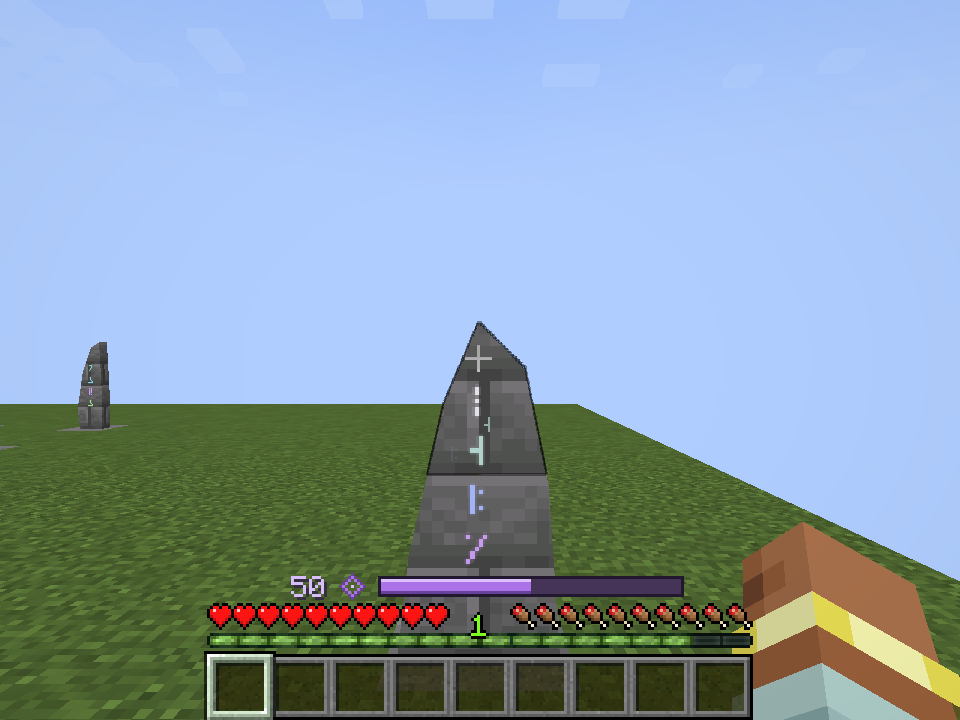

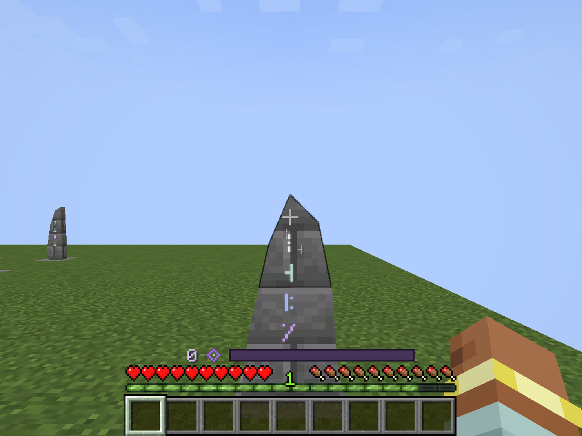

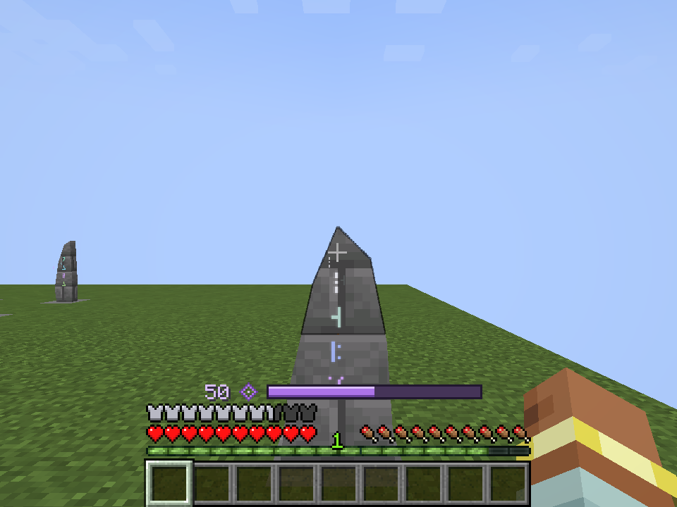

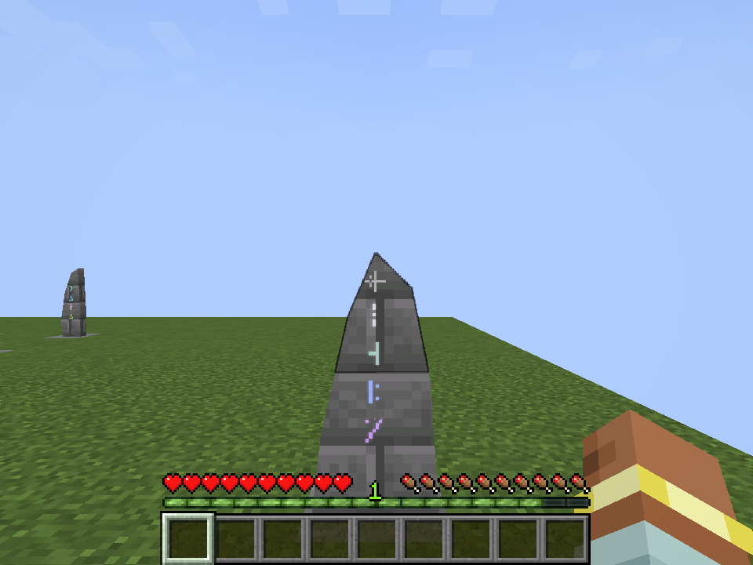

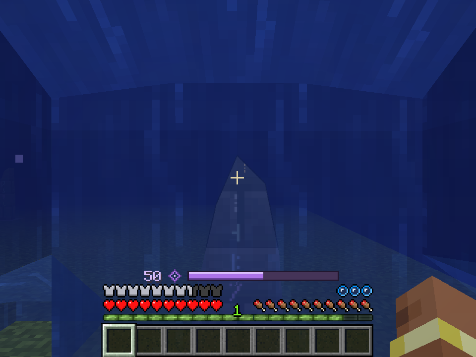

## Three actual pages

Twenty real same-key peers are available through native page requests: eight destinations, eight destinations, then four. Name and attunement remain visible on every page. The first page disables Previous; the final page disables Next. The shorter final list shrinks its panel. A source-only or single-page network shows no paging controls or page count.

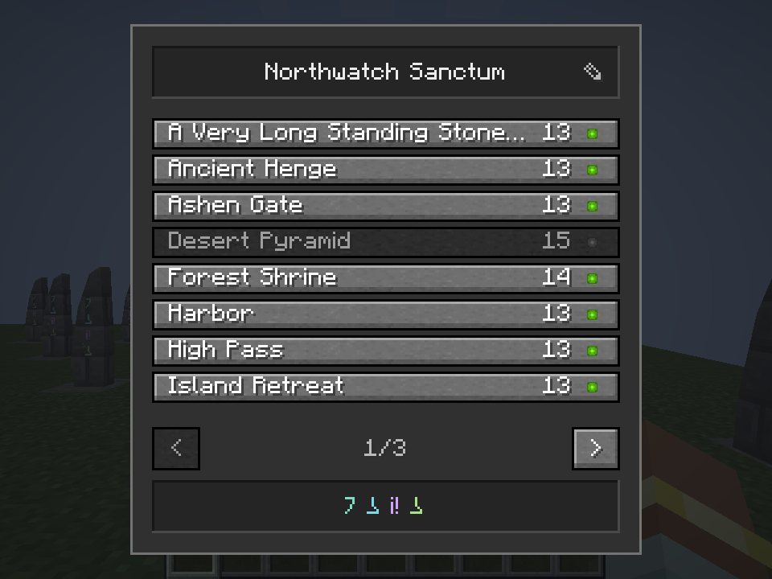

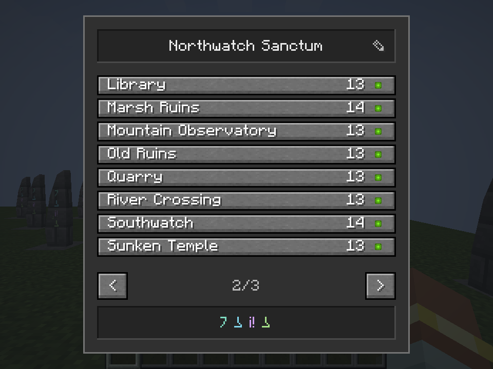

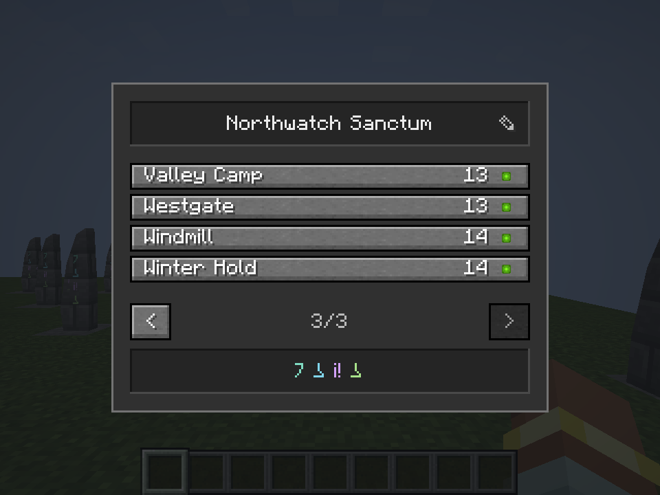

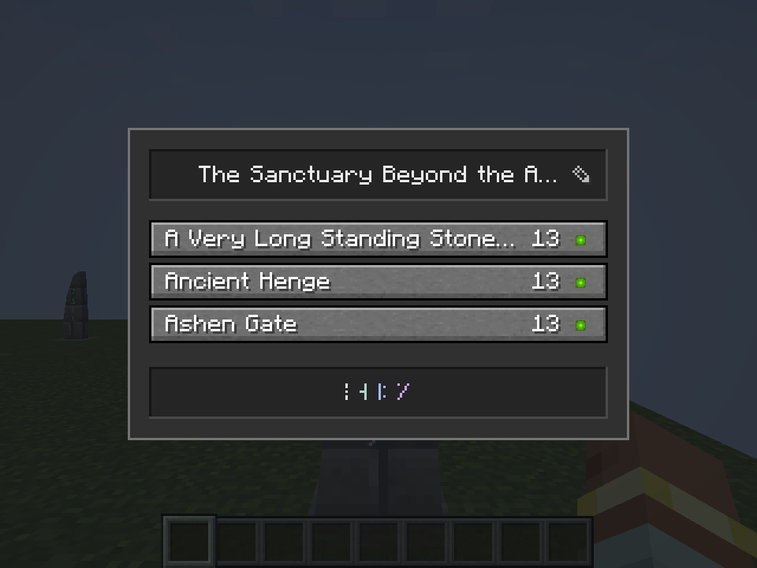

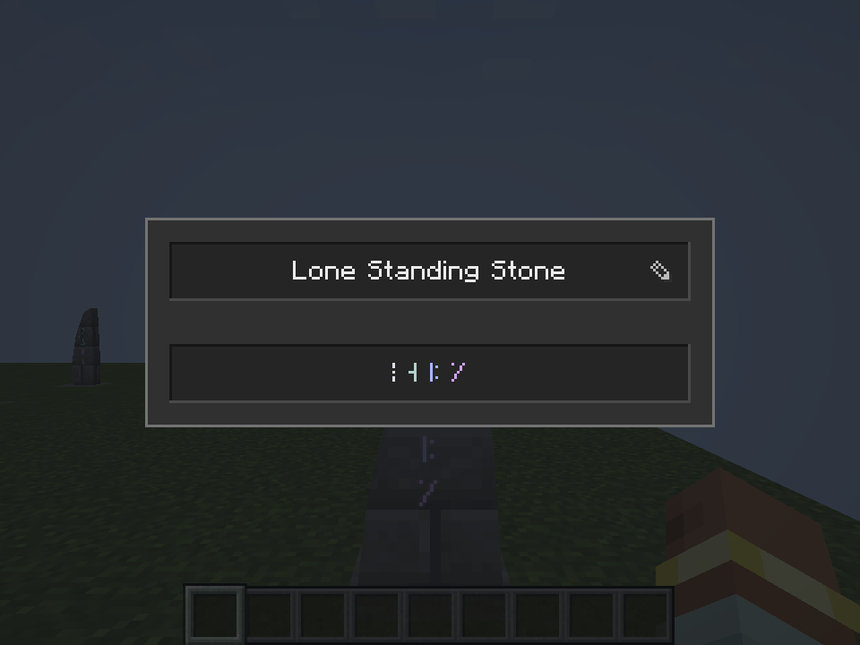

Additional visually inspected frames retain the [smaller GUI scale](native/list-wide.png), [editor](native/editing-wide.png), [saved name](native/renamed-wide.png), [zero-XP disabled list](native/unaffordable.png) and [actual paid arrival](native/after-travel.png).

## Verification and install

Java 21 `build` and Kithkyn version compatibility pass. All **114 shared-checkout unit tests** pass with zero failures/errors/skips. All **35 native assertions** pass, including actual rename/page requests, width/ellipsis checks, no self destination, affordability, health/food units, no-op alternate previews and synchronized mana/visibility. A direct live destination click charges thirteen XP points from fourteen, arrives at the endpoint and leaves one. All **19 final native frames** were visually inspected. The final isolated Minecraft review and build exit cleanly; fixture advancement/chat/toasts are suppressed only in the opt-in review harness. The distant-fare fixture stays within already loaded chunks. The world mechanics suite and remote multiplayer were not repeated for this client presentation change; the preceding XP pass's eighteen focused world tests remain its gameplay evidence.

The install is a UI-only overlay on the preceding verified artifact: menu/cost/capture/shared-mana/HUD class families and cost labels only. All **19 loaded class hashes** match the candidate. Every other package member remains byte-identical to the preceding installed package, including the approved apparatus tint and all **252 Plinth/Spellstone models**. Concurrent unrelated source changes are excluded from this review install. Health/mana/hunger travel payments are not implemented by this pass.

Installed into **Prism → Kithkyn Testing**, SHA-256 `3b37db7cd998d3788af8b7cf134b043d27dd24a8d67ae9ae380a0a3baa2cdf8e`. The previous jar was backed up and only the Vestige jar replaced atomically. Minecraft was not restarted; other mods and existing worlds were not changed. Restart Minecraft to load the update. [`verification.json`](verification.json), [`prism-install.json`](prism-install.json) and [`native-build-and-capture.log`](native-build-and-capture.log) preserve exact package/source/capture hashes, test results, installation and raw successful build/client evidence.
