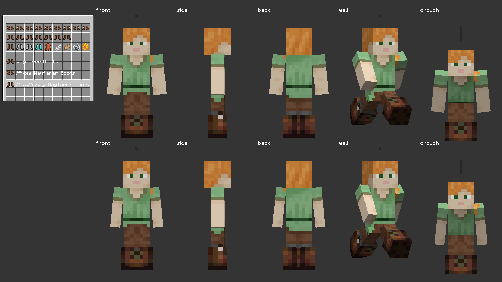
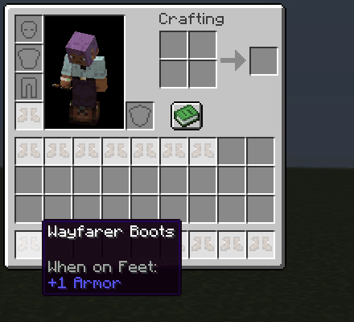

# Wayfarer Boots native artwork and readiness

October 8, 2026. The owner selected **Feather Tabs C** and approved the full boots package. These are the first native production exports of that direction: a 16×16 inventory sprite and a 64×32 vanilla armor atlas. The brown leather, ivory feather tabs and restrained worn green laces are fixed colors; leather dyeing is deferred. Exact export pixels are presented here for review; this does not invent a separate owner acceptance of unseen PNG hashes.

The screenshot comes from Minecraft 1.21.1 / NeoForge 21.1.72's main render target. It shows the registered boots beside ordinary leather/iron/chain/diamond boots, all sixteen variants, and front/side/back/walking/crouching armor poses. The selected inventory concept was exported proportionally onto a 16×16 canvas, preserving its feather accents and transparent margin. The independently generated worn study is mapped onto vanilla's actual leg UV net at native texel density. No custom robe geometry or cape is involved.

The built-in image generation tool authored the worn study. [Source and design brief](source/prompt.json), [exact generated source](source/worn-generated.png), [exporter](../../../tools/author_wayfarer_art.py), [sprite enlargement](sprite-enlarged.png) and [atlas enlargement](worn-atlas-enlarged.png) retain the art provenance and export settings. These enlargements use the exact production pixels. Run the exporter with `--check` using Pillow.

Native inventory tooltips show [plain](captures/hover-plain.png), [Nimble](captures/hover-nimble.png) and [Unfaltering](captures/hover-unfaltering.png). Only the adjective is italic; the ordinary title and +1 Armor are native components. The capture fixes hover coordinates through InventoryScreen's ordinary renderer, rather than relying on desktop cursor position.

The [silent video](readiness.mp4) preserves recorded frame timing. Its crop contains the ordinary native inventory, including equipped feet. A real integrated-server activation pays five mana and starts the actual 300-tick wearer/ability recovery. The fixture then sets mana to zero using the existing development control; ordinary mana regeneration and private server packets drive the display. Mana clears first; recovery continues independently. Every copy shares the recovery, while final variant mana prices produce different shortages. Both layers use vanilla white and top-to-bottom clearing, including their more opaque overlap.

[Capture metadata](captures/capture.json) records 76 original animation frames, title segments, real payment and the three loaded resource hashes. [Verification receipt](../../verification/wayfarer-2026-10-08/README.md) records source checks, native behavior and limits. No presentation fixture replaces collision, rendering, payment, prices or recovery. The client ran without optional Kithkyn; the separate native behavior batch loaded Kithkyn. Optional JEI/EMI screens are not part of this capture.
