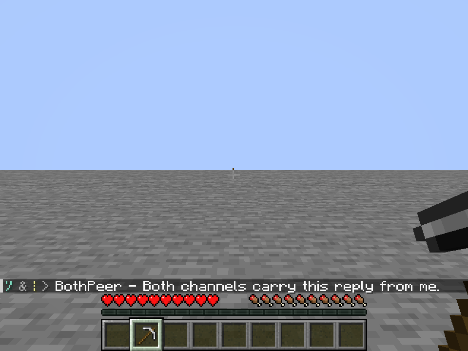

# Whispering Shell without the center flash

**Approved and shipped:** the subsequent [shipment record](../whispering-shell-shipped/README.md) contains exact-package world/client verification and the installation into Kithkyn Testing. This archive retains the earlier full-source no-flash review.

**Owner correction, October 6, 2026:** remove the extra channel-symbol flash beneath the crosshair. The Shell now displays its channel symbols only in ordinary chat and on the inventory item corner. The compact `symbol & symbol > sender - message` format and quiet send/receive sounds remain.

The implementation deletes the Shell GUI-layer registration, drawing method, timer, stored keys and logout cleanup. The existing cue packet now drives the sound only. No item artwork, binding, recipe, channel identity, slot activation, recipient rules or packet format changes.

[Native situation gallery](gallery.html) contains the same ten conversation scenarios with fresh captures after removal. The preview reuses the existing native fixture from the [preceding symbol review](../whispering-shell-symbol-chat/README.md), without changing production behavior or artwork. Historical center-flash screenshots remain in their original archives.

Verification is recorded in [verification.json](verification.json), [native client log](client.log) and [production log](production.log). This is a local development build; no installed pack or existing world was replaced. Remote human multiplayer, authenticated Mojang signing and subjective sound quality are outside this review.

**Final verification:** production build and Kithkyn compatibility pass. All **121 unit tests** pass with zero errors/failures/skips. All **ten native conversation scenarios** pass and all **thirteen unedited 960×720 frames** were visually inspected; outgoing and incoming frames have no center Shell symbols. The four loaded Eye/Shell assets match source/package hashes. All sixteen relevant class files match the preview; fourteen are byte-identical to the preceding verified review, with only the two client-feedback classes changed. The prior fourteen passing focused world tests remain applicable to those unchanged server/binding classes; they were not repeated for this drawing removal.

The [packaged mod](../../../run/whispering-shell-chat-only-production-build/libs/vestige-0.1.0.jar) is 7,736,213 bytes, SHA-256 `247be1710fcade6da4a546e911a93e46f9d38d1e4d14e76347ec79ff96449eb1`. Audited Java sources match the source archive. Capture fixtures and Paper overrides are excluded. A browser security policy rejected opening the existing local gallery tab; no workaround was attempted, and the tab was not updated. The new gallery and actual captures are saved here.

