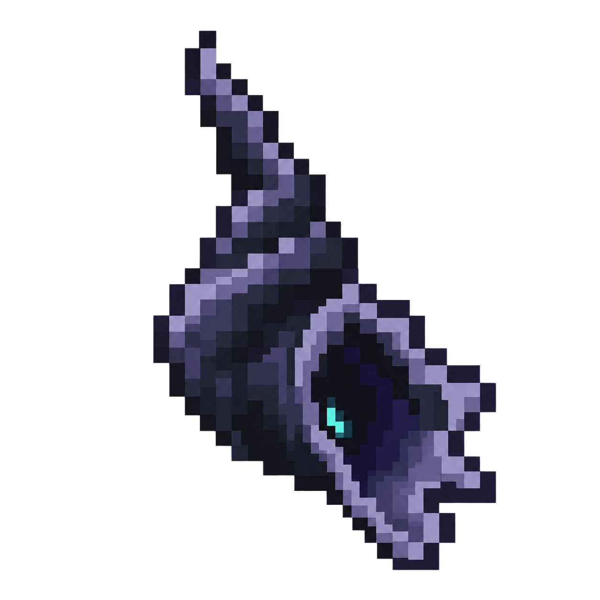
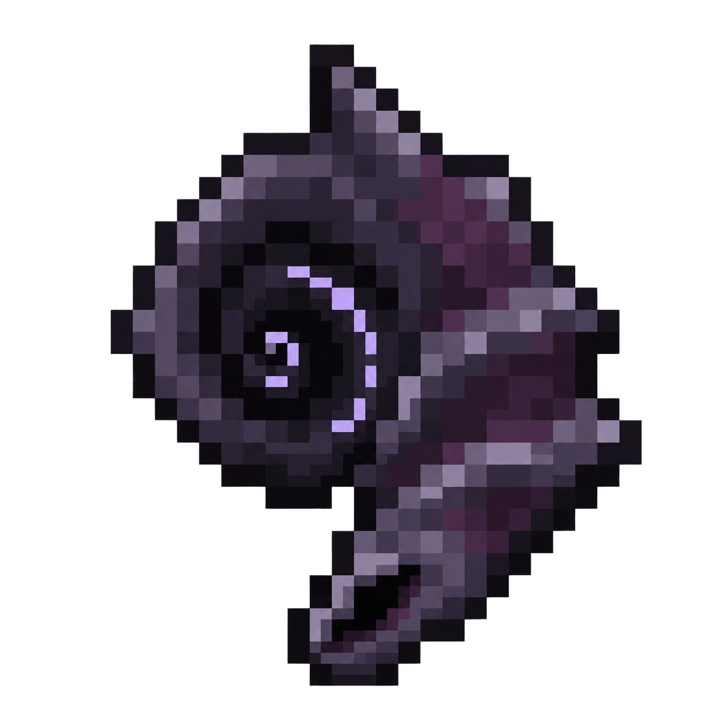

# Dark Whispering Shell concepts

**October 6, 2026. A selected as the shape direction; native texture review continues.** The owner rejected a literal ingredient illustration and requested a cooler dark, eerie shell whose finished appearance has its own identity, then selected the hollow conch direction. These replace the earlier beige nautilus studies. The recipe establishes magical construction without requiring visible sand, metal, shards or a pasted-on sensor.

## A: Hollow conch

A pointed blackened conch with an asymmetric flared mouth, slate-violet ridges and a small teal light deep inside. The elongated silhouette gives it a distinct held shape. The owner selected this direction for a simpler native texture; [the literal 16x16 draft and menu review](../whispering-shell-native-v1/README.md) retain its hollow opening and restrained light.

## B: Haunted spiral

A jagged charcoal/plum spiral with a hooked lower lip and a sparse violet trace winding inward. It reads more compactly as a spiral shell and gives the internal glow more emphasis.

## Generation and inspection

Both are fresh images generated with the **built-in image_gen tool**, using no source images. The complete final prompts are [A](prompt-a.txt) and [B](prompt-b.txt). They specify a dark original shell, coarse Minecraft pixel clusters, restrained internal light, transparent backgrounds and a 16x16 logical grid. [generation.json](generation.json) records the generated source paths, exact project copies, SHA-256 hashes and palette/alpha inspection. Source images are preserved and project copies are byte-for-byte unchanged.

Visual inspection confirms the requested dark body, different silhouettes, restrained inner light and absence of literal ingredient decorations. Both actual outputs are **1254x1254 concept images**. A has 413 fully opaque colors, B 261; both have 256 alpha values and substantial partially transparent pixels. They do not satisfy the requested literal 16x16 grid, eight-color palette or binary-alpha constraints and are not production sprites. A's native draft is authored separately on a literal pixel grid. The final held/offhand form, gameplay and installation remain outstanding.

The [behavior and recipe draft](../../design/whispering-shell.md) remains distinct from this visual study. [Pinned sculk acquisition facts](../../research/whispering-shell-sculk.md) support the current Sculk Sensor ingredient proposal. The [earlier literal studies](../whispering-shell-v1/README.md) remain historical art only.
