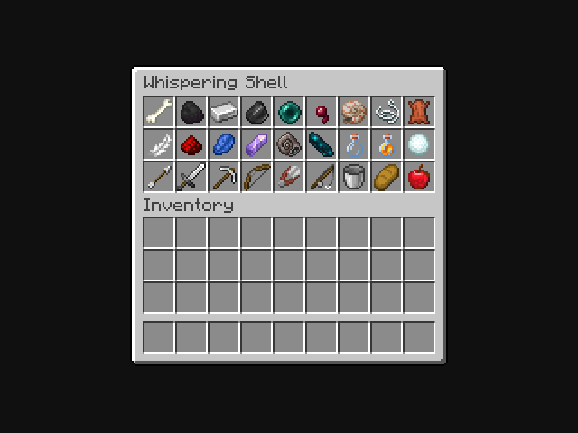
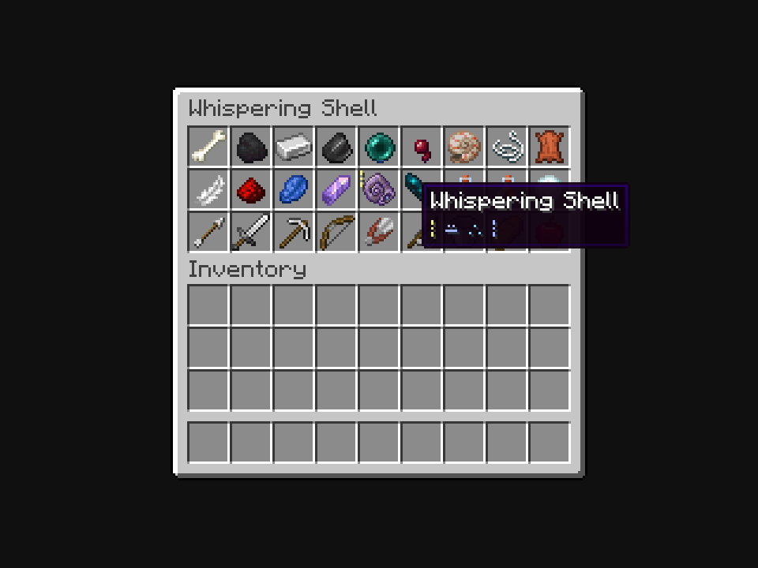
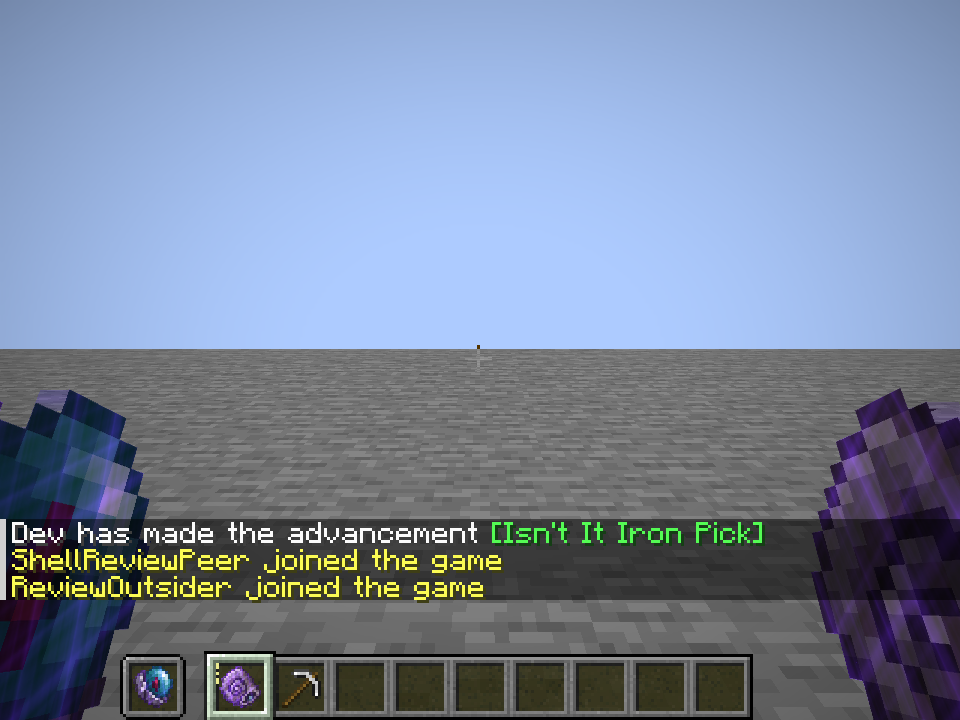
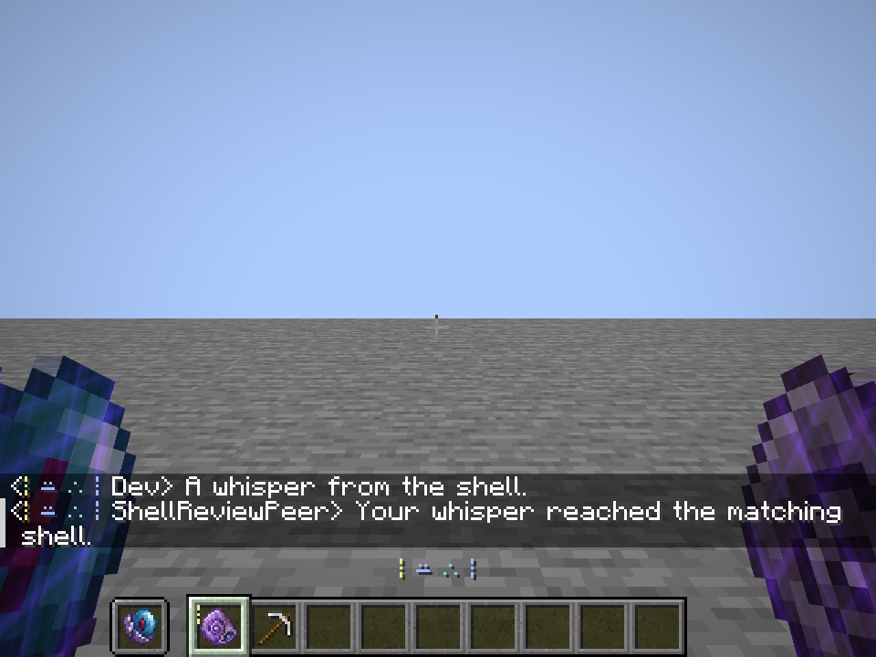

# Finished Whispering Shell and locked attuned item art

**October 6, 2026:** Homebound Eye **A, Centered pearl**, and Whispering Shell **B, Deep coil**, remain the owner's final artwork choices. The Shell is now a registered native item with atomic ritual crafting, verified shard binding, private player conversation and brief visual/audio feedback. This closes the previous appearance-only Shell review.

**Subsequent chat review:** the [current situation gallery and package](../whispering-shell-chat-review/README.md) adds nine Survival scenarios and fixes pulse overlap by moving it just below the crosshair. The original five frames, logs and package below retain their original closeout scope; recipe, artwork and server chat behavior are unchanged.

## Recipe and play

Place **one valid Attunement Shard, one Nautilus Shell and one Sculk Sensor** on three of the **four inner Plinths**, in any order. Leave the fourth offering surface and Spellstone center empty. Activate the normal ritual to produce one Shell. The craft consumes one of each offering, preserves installed sockets and copies the shard's complete original blueprint/key. Removing even the empty inner Plinth during crafting cancels without partial consumption. Recipe viewers expose the native recipe.

Matching Shells communicate on the same server. Any of the nine hotbar slots transmits ordinary typed chat, regardless of the selected slot; offhand also transmits. Direct main-inventory Shells listen. Multiple channels work simultaneously and each recipient receives one message and cue despite duplicate Shells. Distance and dimension do not limit online delivery. Moving all Shells into the main inventory returns speech to ordinary chat while retaining reception. Containers, dropped items and offline players do not participate. There is no recurring mana or durability charge.

The owner's hotbar activation and locked artwork are explicit decisions. Sculk Sensor, offhand activation, multiple channels, online range and no recurring cost are first-implementation defaults selected under the instruction to finish the item, following the [EchoLink review](../../research/echolink-whispering-shell.md). The [current design](../../design/whispering-shell.md) records those distinctions and the native integration boundary. Homebound Eye mechanics are unchanged. The previously approved ordinary **Amethyst Shard + Soul Sand + Ghast Tear → one Echo Shard** recipe remains shipped.

## Actual Minecraft appearance

These five unedited **960×720 native framebuffer captures** were visually inspected. The first menu uses the actual registered Shell, surrounded by vanilla items; it has no Paper carrier or replacement. Binding adds glint, an inventory rune badge and four colored tooltip runes independently of the artwork.










Both conversation directions traveled through native server player-chat handling: one actual Minecraft game client and two in-memory server packet clients, including a matching peer and an outsider. The matching peer receives both messages; the outsider receives **zero**. This is a local integrated-world delivery test, rather than a remote human multiplayer session. The fixture's temporary join/advancement text is cleared before the conversation views.

The pulse draws above chat, immediately above the hotbar, for eighteen ticks with an eight-tick fade. Send/receive cues dispatch a quiet, lowered Allay note. The final screenshots verify rune placement; subjective sound quality was not separately recorded or audited.

## Approved pixels and package

The [canonical lock-in](../attuned-items-locked/README.md) retains the exact original high-resolution artwork. Production PNGs add transparent 2048×2048 atlas padding, preserving every original RGBA pixel and alpha. Model normalization preserves the approved visible menu scale and aspect. There is no resampling, recoloring or redraw. The [capture manifest](captures/capture.json) pins all four loaded Eye/Shell model/texture hashes; they agree with source and production package.

Final package: [`vestige-0.1.0.jar`](../../../run/whispering-shell-finished-build/libs/vestige-0.1.0.jar), **7,691,019 bytes**, SHA-256 `7be52c8c70775fa08b1626899e35a8ce757c76d132bbf69c2ec96e97d9acecef`. This is an isolated build of the shared checkout, including its other concurrent work. No installed pack or existing world was replaced by this closeout.

The production jar contains the registered Shell, cue handler and required communication mixin declaration. It excludes the opt-in capture fixture and Paper model overrides. All fourteen checked Shell/integration Java source files agree with the final sources jar; all fourteen Shell class files agree between production and the native preview build. [Verification](verification.json) pins the package, checked sources/classes, loaded assets, frames and logs.

## Verification

- Final Java 21 production **build and Kithkyn compatibility pass**, with **114 JUnit tests**, zero failures/errors/skips. Seven focused Shell tests cover valid/tampered bindings, every recipe arrangement, full-key versus short-mark identity, all nine hotbar slots, offhand/main-inventory behavior, nested exclusion, tooltip and bounded cue codec.
- **Fourteen required Minecraft GameTests pass**, including six Shell tests and shard/attunement/Homebound Eye crafting regressions. Shell checks exercise atomic craft/cancel, socket retention, native player-chat packets, deduplication, multiple keys, distance/dimension, ordinary-chat return, invalid-binding privacy, queued private speech ordering, cancellation, fully filtered and hidden-chat recipients, preserved signature/body bytes and vanilla spam disconnect. The signature test supplies synthetic signature bytes; authenticated Mojang session signing was not exercised.
- Final native client completes successfully and verifies both private directions, outsider exclusion, loaded asset hashes, normal/advanced custom tooltip parity and actual item presentation. All five final frames were inspected, including the visible pulse above the hotbar.
- The gameplay suite passed before the final client-only pulse position/layer adjustment. Production build/unit checks were repeated after that adjustment; gameplay code did not change.

Evidence: [world tests and build](build.log), [final production package](final-package.log), [final native client](client.log). Earlier fixture failures remain in [first-tests.log](first-tests.log), [first client attempt](first-client-attempt/client.log) and [second client attempt](second-client-attempt/client.log). Corrected issues were shared metadata output isolation, the test clients' cue-channel declaration, one-item Plinth counts, peer hotbar activation and chat obscuring the initial pulse. These failed attempts are historical evidence, not passing checks.

## Reproduction

Use the configured Java 21 toolchain. These init scripts isolate both build output and generated mod metadata from concurrent runs. The client fixture is added only by the preview script.

```sh
python3 docs/art/attuned-items-locked/author_assets.py --check
./gradlew --project-cache-dir run/whispering-shell-finished-cache \
  -I docs/art/whispering-shell-finished/production-build.gradle \
  build verifyKithkynCompatibility runGameTestServer \
  '-Pgametest_filter=shell_|attunement|homebound_craft|homebound_cancel' \
  -Pgametest_directory=run/whispering-shell-finished-worldtests-final \
  -Pwith_kithkyn=false --offline --no-build-cache --no-configuration-cache \
  -Dorg.gradle.parallel=false
./gradlew --project-cache-dir run/whispering-shell-finished-preview-cache \
  -I docs/art/whispering-shell-finished/preview.gradle runEffectsCapture \
  -Pcapture_kind=shell_finished \
  -Pcapture_directory=run/whispering-shell-finished-client \
  -Pcapture_output=docs/art/whispering-shell-finished/captures \
  -Pwith_kithkyn=false --offline --no-build-cache --no-configuration-cache \
  -Dorg.gradle.parallel=false
```

Use a fresh GameTest directory when reproducing. The required mixins pin Minecraft 1.21.1's submission/recipient seam; a platform upgrade must verify that seam again. Compatibility with unrelated mods that replace player-chat delivery was not tested. Head, third-person, frame and dropped-item art views are outside these five captured views.
