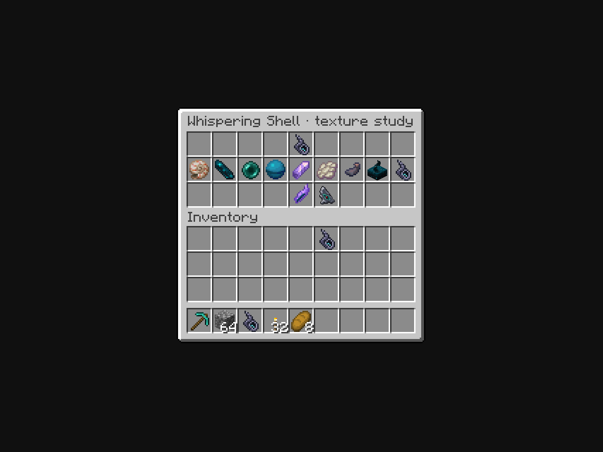
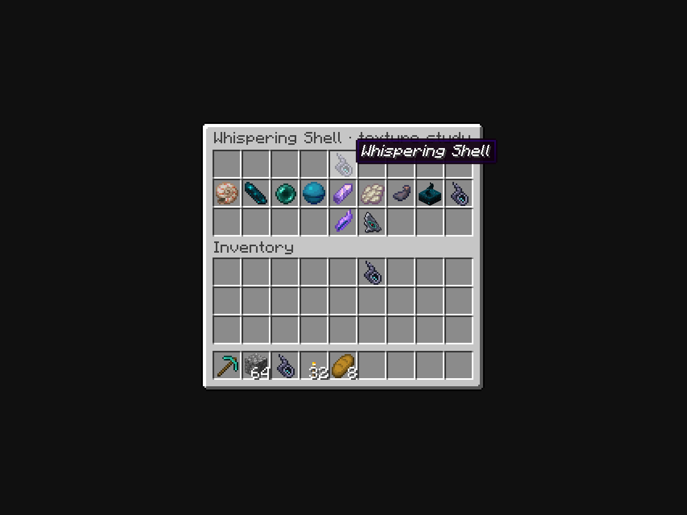

# Whispering Shell A: native menu texture draft

**Retired shape reference, October 6:** the owner discarded the previous Shell art basis, including the hollow conch. The current [four fresh Shell directions](../item-textures-native-v4/README.md) are shown individually among vanilla items. This folder preserves historical draft/capture evidence; it is no longer the required shape reference.

**October 6, 2026.** The owner selected the hollow-conch direction from [A's dark concept](../whispering-shell-dark-v1/README.md) and requested that it fit Minecraft's ordinary menus. This is a native texture draft for that review. Final texture approval, a registered Shell, crafting and communication remain outstanding.

## Actual Minecraft menus





The same texture was inspected at [GUI scale 2](captures/gui-2.png), including [its tooltip](captures/gui-2-hover.png). These are unedited screenshots from Minecraft Java 1.21.1 / NeoForge 21.1.72. A real vanilla `ChestMenu` and `ContainerScreen` render the items in chest, player inventory and hotbar slots. The preview includes Nautilus Shell, Echo Shard, Ender Pearl, Heart of the Sea, Amethyst Shard, Phantom Membrane, Ink Sac and Sculk Sensor, plus Vestige's Attunement Shard and Homebound Eye. The first wider-window review is retained in [captures-wide](captures-wide/capture.json).

Visual inspection finds a visible dark opening, readable pointed silhouette and restrained teal detail beside vanilla items at both scales. The draft has less luminous color than the neighboring Amethyst Shard and uses the same native item-rendering path. Its final aesthetic remains subject to owner review.

## Native source

[whispering-shell.png](whispering-shell.png) is an exact **16x16** RGBA texture with **90 opaque pixels**, **eight opaque colors** and **binary transparency**. The charcoal/indigo body has muted ridge highlights, a broad nearly black opening and two bright teal pixels inside. It has no external glow, partial-alpha fringe or high-resolution detail.

[texture-source.json](texture-source.json) is the independently authored literal pixel grid and palette. [author_texture.py](author_texture.py) deterministically exports it to the study PNG and preview-only resource. `python3 docs/art/whispering-shell-native-v1/author_texture.py --check` checks both exports for byte drift. Texture SHA-256: `26e9fe7e3d6f68e155284abe9711b3781d5d93b75b1d562a5e4995810ba8de4d`.

The built-in image generator also edited A as a simplification reference. Its [exact prompt](imagegen-refinement-prompt.txt), [unchanged output](imagegen-refinement.png) and [provenance/hash](imagegen.json) are retained. That output still has more than 16 logical pixels in height. The native grid is separately authored, rather than a resampled copy of the concept.

## Capture and limits

[isolated-preview.gradle](isolated-preview.gradle) adds only the study's preview sources/assets and uses a separate build folder. [WhisperingShellTextureCapture.java](preview-source/com/quzzar/vestige/apparatus/client/WhisperingShellTextureCapture.java) drives the native menu without opening a world: a plain host Screen delegates initialization and rendering to the vanilla ContainerScreen, avoiding its player-dependent tick. The appearance carrier is Paper with CustomModelData `202610060`, using `item/generated`; this does not register a Shell or alter ordinary production resources. The italic tooltip is the preview carrier's custom name, not a final Shell tooltip implementation.

[Capture metadata](captures/capture.json) records hashes of the assets actually loaded by Minecraft, including the native PNG, preview model, isolated Paper override, vanilla menu texture and three neighboring item textures. [Verification](verification.json) records file and screenshot hashes, pixel constraints, inspection scope and limitations. [Client log](native-client.log) records the completed isolated run. The initial compile-only failure from attempting to override a final native tick method is retained in [native-client-attempt1.log](native-client-attempt1.log); the host Screen resolves that issue.

Reproduce with Java 21 and the existing project cache:

```bash
./gradlew --project-cache-dir run/whispering-shell-preview-cache \
  -I docs/art/whispering-shell-native-v1/isolated-preview.gradle \
  runEffectsCapture -Pcapture_kind=shell_texture \
  -Pcapture_directory=run/whispering-shell-menu-client \
  -Pcapture_output=docs/art/whispering-shell-native-v1/captures \
  -Pwith_kithkyn=false --offline --no-build-cache --no-configuration-cache \
  -Dorg.gradle.parallel=false
```

Menu appearance is verified within this preview. Held/offhand forms, native attunement marks, crafting, multiplayer chat, effects and installation are not covered. The [recipe/behavior draft](../../design/whispering-shell.md) and [exact Sensor loot rates](../../research/whispering-shell-sculk.md#how-common-are-chest-sensors) are separate evidence.
