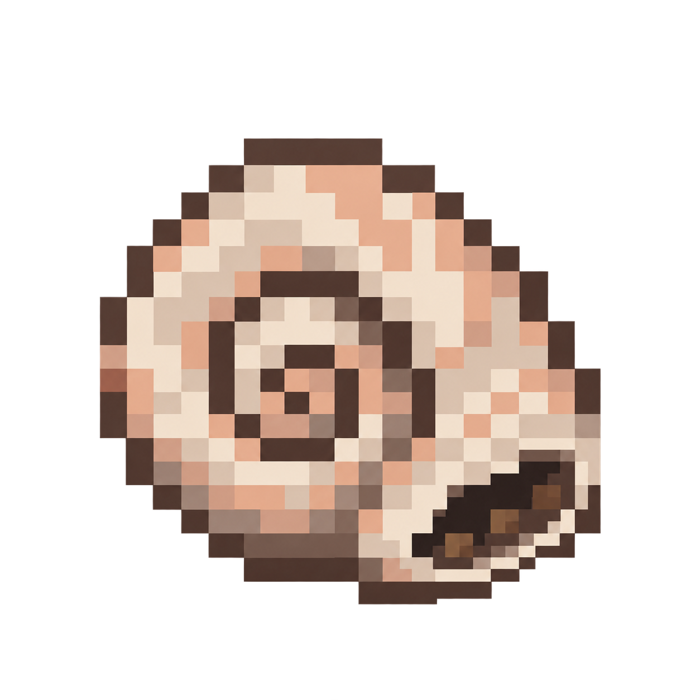

# Whispering Shell: first texture study

**Historical art: superseded by [dark shell concepts](../whispering-shell-dark-v1/README.md).** The owner rejected literal ingredient illustration and requested an independent dark, eerie shell. Neither beige variant is the current direction.

**October 6, 2026. Draft concepts, not approved or packaged.** The owner asked to iterate on a native Whispering Shell using their EchoLink as inspiration, then requested a simpler shell/shard/third-ingredient recipe with something whispery and dark. The current study proposes an ivory/peach nautilus spiral, a dusky mouth and three coarse brown grains along the inner rim, corresponding to the [Soul Sand recipe proposal](../../design/whispering-shell.md). The initial metal/crystal variant is preserved as historical art.

## Provenance

- Generated and revised with the **built-in image_gen tool**, requesting a transparent original item concept. No old skin or foreign mod art was supplied. The second generation edits only the first original concept after inspecting it.
- The current final prompt is [prompt-v2.txt](prompt-v2.txt). It asks to remove the copper and gem, keep the ivory nautilus form, deepen the mouth and add two or three brown grains for the proposed Soul Sand ingredient. It requests eight flat opaque colors on a strict 16x16 logical grid with binary transparency.
- [generation-v2.json](generation-v2.json) records the generated source path, project copy, SHA-256, dimensions and alpha/palette inspection. The project image is an unchanged byte-for-byte copy of the built-in output; no background-removal or resampling was applied.
- The initial [metal/crystal concept](whispering-shell-concept-v1.png), [prompt](prompt-v1.txt) and [generation record](generation-v1.json) preserve the superseded four-offering study, not a production asset.

## Inspection and next texture iteration

The silhouette, spiral, dark mouth and coarse brown grains are visible; the gem and clasp are removed. This is a **1254x1254 generated concept**, rather than a literal 16x16 sprite. Inspection found 372 fully opaque colors and 256 alpha values, with substantial partial transparency. The generated output does not meet the requested strict-grid, eight-color and binary-alpha constraints. Its color relationships and broad shell shape can guide iteration, but it must not be imported directly as the native item texture.

Finish the chosen direction on a true 16x16 grid with opaque shell and dark-rim pixels and fully transparent empty cells. Keep the spiral readable and the dark accent restrained. Compare at equal inventory scale with vanilla Nautilus Shell and Vestige's approved Attunement Shard, then review the actual native inventory and held/offhand appearance. No in-game Shell screenshot or gameplay verification exists yet.

See [EchoLink research](../../research/echolink-whispering-shell.md) for source facts and [the behavior draft](../../design/whispering-shell.md) for the distinct native proposal.
