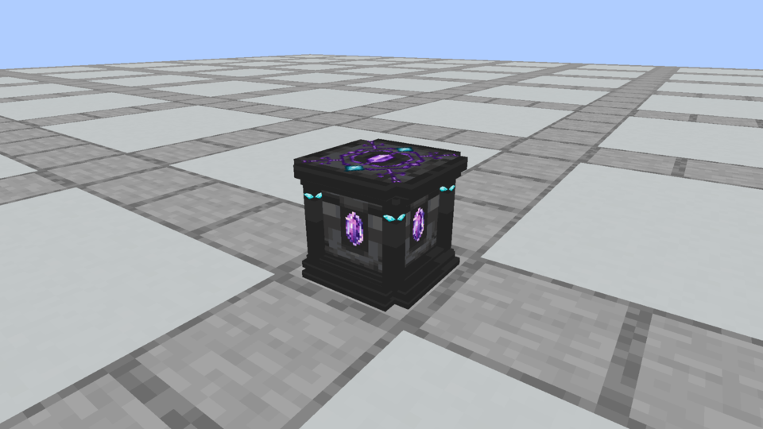
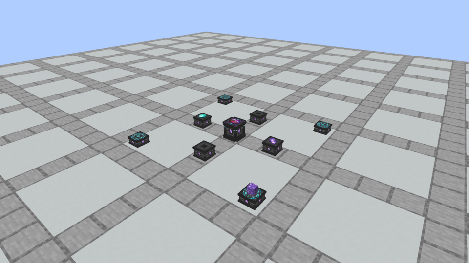
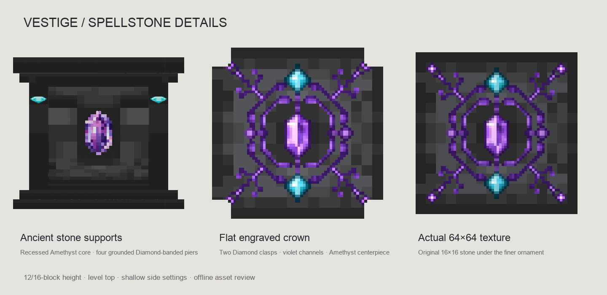

# Native apparatus blocks

**Current owner-approved direction, October 6:** The [interaction fixes](../art/apparatus-fixes-v1/README.md) lift only the cap by 1/64 block, eject covered offerings, route sounds and produce centered ordinary drops. The owner [locked in the Plinth and Spellstone edging](../art/plinth-framing/locked/README.md): narrow Plinth corner strips and outer cap/foot edges, plus Spellstone cap/support strips, using each finish's native texture at **217/255 brightness**. All 36 finishes share that relative shade in the world and inventory; column corner trim follows the shaft's UV phase and Quartz/Purpur pillar texture. The [earlier framing studies](../art/plinth-framing/README.md) are retained as historical comparisons. [smaller A Diamond chips](../art/spellstone-corner-details/refined-a/README.md) wrap the four vertical cap corners of a thick three-piece Spellstone. After hands-on review, the top is raised from y8/16 to **y10.25/16**, the Astral Seal sits below resting items, empty Plinth sockets show uninterrupted native stone, and hover highlighting follows the actual straight stone edges. Earlier low table, side-center gem sprites and empty carved plaques are superseded art.

Spellstone and Plinth each have **36 cosmetic stone/masonry finishes**. [Variants and construction grids](apparatus-variants.md) record the approved recipes; [playtesting](../leyline-playtesting.md) covers interactions and rituals. Cosmetic finishes share behavior and do not change shaping or identity.

| Role | Current shape | Physical and receiving height | Maximum footprint |
| --- | --- | --- | --- |
| Spellstone | Two thick inward-leaning supports and a smaller thick cap; four A corner chips | 10.25/16 | 12/16 square |
| Plinth | One square foot, continuous shaft and flat cap; material plates appear only when imbued | 14/16 | 12/16 square |

The Spellstone has three solid cuboids: two 22.5-degree supports, each 3.5 model units thick and 10 units deep, and a 12×12 cap from y7 to y10.25, 3.25 units thick. The supports keep their previous coordinates and finish at y9.99; the cap now clears them by 0.26 model units. Thirty-two flat trim quads follow the cap and angled supports, giving **90 baked faces** across 75 elements. Forty Diamond decorative quads retain the selected small A pattern: five native Diamond-colour pixels on each adjacent face of four corners, each pixel 0.5525 model units square. The top and side centers stay bare. All 36 block/item finishes use original Minecraft masonry and Diamond tiles, with no custom gemstone bitmap.

Collision and picking use quarter-model-unit slices to follow the tilted supports and preserve the triangular opening. The client draws the 36 edges of the **three original cuboids**, generated from the same model coordinates, instead of tracing the collision staircase. Hidden edges use ordinary depth testing. World tests verify clear picking through the opening, solid supports/top and that normal walking steps onto a slab but cannot step onto a Spellstone from any cardinal direction.

The Astral Seal retains its glyph and counter-rotating rings, now aligned to the new receiving surface. Its nominal hover is 0.002 block, breathing is ±0.001, and inner/glyph layer offsets are 0.002/0.001. Its highest glow layer remains less than 0.008 block above the stone; flat offerings rest at +0.02. Reference scrolls retain native item scale and depth occlusion; new crafted results use the ordinary dropped-item renderer. Inventory models show stonework without animated runes.

Standalone Plinths use three solids and **32 baked faces**, including sixteen flat trim faces. Base/cap forms have two solids and 22 faces; a middle shaft has one solid and twelve faces. Eight narrow corner faces continue through each column join, and rim strips appear only at the actual foot/cap. There are **no empty socket decals**. Adjacent segments retain matching native texture scale and phase; Quartz/Purpur use pillar textures. Only the exposed cap accepts ritual offerings. Any segment can hold its independent stored imbuement.

Installed material plates remain centered at local y8/16, sized 4×4 model units, protruding 1/32 block from the shaft. Each of four plates has a front and four thin edges, with no hidden back. The renderer emits these twenty faces only when a material is installed. Removal exposes the normal shaft texture immediately. Recipes, sockets, waterlogging, shaping and attunement semantics retain their existing behavior.

**October 6 feedback refinement:** ritual connection beams share the Astral Seal core’s pinkish-white `#f4e5ff`. Missing-item hints are opaque black silhouettes with native texture cutouts, without sampled color or gradient. Ritual inspection, completion and errors use movement, light, sound and particles; no chat/actionbar instructions or status notices. Scroll tooltips contain only their identification-dependent name.

## Current actual Minecraft captures

The [locked framing release](../art/plinth-framing/locked/README.md) records the approved edging and final packaging evidence.

[Refined A native views and ritual recordings](../art/spellstone-corner-details/refined-a/README.md) document the raised Spellstone, scroll occlusion, clean hover lines and empty/imbued Plinth columns. Earlier [selected A review](../art/spellstone-corner-details/locked-a/README.md), [simple Plinth](../art/apparatus-simple-plinth/README.md), [tent table](../art/spellstone-tent-table/README.md) and [October 4 leyline captures](../art/leyline-native/README.md) remain historical evidence. Their ritual mechanics remain applicable; their prior art does not describe the current shapes.

## Authoring and verification

- [Packaging author](../../tools/author_apparatus_models.py) generates material/color registrations, physical role shapes, 180 block models, 72 item models, construction recipes, loot, mining tags and recipe unlocks. [Shared framing](../../tools/apparatus_framing.py) owns the approved strip positions and shade; the preview and production authors use the same implementation. Use `--check` to detect drift.
- [Apparatus registry](../../src/main/java/com/quzzar/vestige/apparatus/ApparatusBlocks.java), [interactions](../../src/main/java/com/quzzar/vestige/apparatus/ApparatusBlock.java), [saved state](../../src/main/java/com/quzzar/vestige/apparatus/OfferingBlockEntity.java) and [renderer](../../src/main/java/com/quzzar/vestige/apparatus/client/OfferingRenderer.java) share one behavior per role.
- [World tests](../../src/main/java/com/quzzar/vestige/apparatus/ApparatusTest.java) exercise available native construction recipes/counts, mismatched slabs and superseded grids, placement, collision, mining/self drops, offerings, socket/result storage, persistence and client data. [Leyline tests](../../src/main/java/com/quzzar/vestige/apparatus/LeylineTest.java) verify mixed finishes craft unchanged recipes with identical shaping and attunement.

```bash
python3 tools/author_apparatus_models.py --check
python3 tools/audit_apparatus_detail.py --check
./gradlew build
./gradlew runGameTestServer
./gradlew runEffectsCapture -Pcapture_kind=apparatus -Pcapture_spells=spellstone,plinth -Pcapture_material=tuff -Pcapture_seconds=2 -Pcapture_output=build/apparatus-finish-review
```

Use a fresh capture output folder. `capture_material` is a canonical material ID from the manifest; the same option applies to ritual capture fixtures. Captures use an isolated fresh world and never alter normal player worlds. The [development status](../development-status.md) records final tests and installation boundaries.

## Historical three-block revision · October 3

Everything below records the preceding registered revision. Its dimensions, recipes, captures and ingredient-specific art are historical evidence, superseded by the current two-block implementation above.

Status: **registered and playable**, October 3, 2026. The owner authorized all three blocks for in-game testing and a complete Spellstone redesign. Spellstone is now a framed ancient altar with a stepped, corner-cut foundation, four stone supports, large recessed Amethyst and an engraved flat crown. After owner testing, Stone and Runic Pedestals are wider and flatter: their matching cap/foot width is 10½ units, with heights of 7 and 5 units. The accepted textures remain unchanged.

All three have block items, names, Creative Functional Blocks entries, the selected construction recipes, matching shaped collision, pickaxe mining and block drops. They share a persisted and synchronized single-item offering display. Native scroll discovery, spell crafting, hint feedback and structure validation are implemented in [Spellstone rituals](ritual-crafting.md). Supporting-block Spellshaping remains the next design stage; placement only offers an item and center activation performs the operation.

## In-game testing

Run the normal development client, then search Creative for **Spellstone**, **Stone Pedestal** and **Runic Pedestal**, or craft the [owner-selected recipes](material-crafting.md#construction-recipes). Install the same current build on server and clients.

```bash
./gradlew runClient
```

```text
/give @s vestige:spellstone
/give @s vestige:stone_pedestal
/give @s vestige:runic_pedestal
```

Right-click a stand with an item to place **one** on top. An occupied stand rejects additional items. Empty-hand right-click takes the item back into the inventory, with a drop fallback if necessary. Survival placement consumes one item; Creative makes an offering copy. Sneaking retains Minecraft's normal use bypass for building around a stand. Items rest on the surface without rotating or bobbing. They use Minecraft's native dropped-item (`GROUND`) model scale, without an extra shrink/enlargement factor; flat items remain laid down. Native model positioning offsets are canceled to center the offering on its surface. Ingredient shadows and finished scrolls also use native dropped-item scale. Wrong placements shake sideways. During success only the ingredients rise; pedestal models and the center reference remain grounded. The reference stays flat. Crafted outputs are ordinary dropped items created exactly above the Spellstone center, with no sideways toss; walking into them collects them without removing the reference. Existing stored results from earlier builds remain recoverable by empty-hand center use. Breaking/replacing a stand drops its offering, including its components. Harvest the block itself with a pickaxe. The block's item and its stored offering are separate drops; no item is packed invisibly into the block item.

Offers save with the world and synchronize both on initial chunk data and subsequent changes. Stands cannot be pushed by pistons. The display has no menu or hopper capability; ritual feedback and crafting use the same synchronized block entities.

## Actual Minecraft appearance

The following images are unchanged framebuffer captures from Minecraft 1.21.1 / NeoForge 21.1.72, using the registered blocks and current native textures. The [current capture records](../art/apparatus-v12/README.md) pin model and texture hashes. The comparison image includes real dropped ItemEntity copies beside the offerings.







The [native referenced-crafting recording](../art/apparatus-v12/rituals/ritual_reference_success.mp4) shows the transition from ingredient-only lifting to the finished flat scroll, with the reference retained throughout.

The arrangement is a visual test fixture: one Spellstone, four inner Stone Pedestals and four additional outer Runic Pedestals. Its distances match the playable ritual layout. [Ritual instructions](ritual-crafting.md) explain optional references, center activation and crafted output collection.

## Shapes and materials

| Block | Shape and art | Height | Widths |
|---|---|---:|---|
| Spellstone | Corner-cut stepped foundation/crown, four grounded supports with Diamond bands, recessed Amethyst, violet engraved top | 12/16 block (¾) | 13½-unit foundation/crown; 9-unit core |
| Stone Pedestal | Accepted mirrored Chiseled Deepslate top, fitted Amethyst, restrained molding | 7/16 block | 9½-unit shaft; 10½-unit cap/foot |
| Runic Pedestal | Same pedestal widths and gem, two units shorter, accepted fine cyan inscription | 5/16 block | 9½-unit shaft; 10½-unit cap/foot |

All offering surfaces stay level. The pedestal cap/foot overhang remains half a unit per side. Their matching moldings use widths 10½, 10¼ and 9¾, with base intervals 0–½, ½–⅞ and ⅞–1¼. Each pedestal's four central Amethyst sockets is 2 units tall to retain its fitted-gem proportions within the wider shaft. All pedestal texture bytes retain the accepted art; only model geometry changes.

Spellstone's former plain monolith and alternating inlays are superseded. Its new foundation steps from width 13½ at y 0–¾, to 12½ at ¾–1½, then 10¾ at 1½–2. A 9-unit carved core extends from y 2–10. Four 1½-unit corner supports span y 1½–10½, with fitted Diamond bands at 8¼–9. The apron spans 10–10¾ and the flat crown ends at y 12. The wider central Amethyst sockets are 4 units tall and 1/32 unit inset. Each side maps coherent Chiseled Deepslate carving around the gem.

The new **64-by-64 Spellstone top** carries nested angular violet inscriptions, branching channels, a pointed hexagonal Amethyst and two opposing Diamond clasps. The [selected source and exact generation/edit prompts](../art/apparatus-v10/README.md) are preserved. A targeted edit replaced the initial source's literal heart shape with a cut gemstone. The finished crown is one continuous corner-cut footprint, authored as three disjoint cuboids with shared UV coordinates; the texture decoration adds no geometry or raised crystal.

All tops retain the same **16-by-16 mirrored stone mapping**: output rows 0–7 sample Chiseled Deepslate rows 15–8; rows 8–15 retain 8–15. Horizontal coordinates remain unchanged. Stone Pedestal performs this with two UV regions. Both decorated tops bake the same stone, enlarged four times by nearest sampling, underneath their 64-by-64 inlays. Native Amethyst and Diamond remain 16-by-16. Their palette is decorative and grants no implicit trait or quality mechanic. Minecraft texels are attributed to Mojang in [CREDITS](../../CREDITS.md); no Iron assets are used.

The unchanged Runic design remains the owner's selected finer broken cyan ring, outlined central diamond and angular surrounding marks. Its [ninth-draft source](../art/apparatus-v9/rune-selected-source.png) is a large generated image, separate from the actual 64-by-64 native overlay. The rejected chunky 16-by-16 adaptation and old fine rune geometry remain retired.



## Implementation and authoring

- [Apparatus registry](../../src/main/java/com/quzzar/vestige/apparatus/ApparatusBlocks.java) registers blocks/items, the shared offering entity and Creative entries.
- [Apparatus block](../../src/main/java/com/quzzar/vestige/apparatus/ApparatusBlock.java) owns shaped collision, item interactions and removal drops.
- [Offering state](../../src/main/java/com/quzzar/vestige/apparatus/OfferingBlockEntity.java) owns one saved item and vanilla update packets.
- [Item renderer](../../src/main/java/com/quzzar/vestige/apparatus/client/OfferingRenderer.java) places flat and 3D items at each block's surface height.
- [World tests](../../src/main/java/com/quzzar/vestige/apparatus/ApparatusTest.java) exercise placement, consumption, collision/mining/drops, exact crafting, overwrite rejection, retrieval, save components and initial client data.

Native IDs are `vestige:spellstone`, `vestige:stone_pedestal`, `vestige:runic_pedestal` and shared block-entity type `vestige:offering`. JSON recipes use the owner's exact saved grids and one-block output; they require only Minecraft materials. Loot, recipe unlocks, blockstates and mining tags are packaged alongside the six block/inventory models.

The historical models contained **48, 28 and 27 cuboids**, respectively: 103 total. The active [model tool](../../tools/author_apparatus_models.py) now authors the two-block system. The archived [texture tool](../art/apparatus-v12/retired-resources/author_apparatus_textures.py.txt) and [offline preview tool](../art/apparatus-v12/retired-resources/preview_apparatus_models.py.txt) preserve the former deterministic implementation as non-executable text. These sources no longer write into packaged resources. The offline renderer is useful for authoring detail; its lighting differs from Minecraft. Texture preparation uses the selected archived source, area reduction and a hard alpha cutoff. Every unmarked stone pixel stays exact.

```bash
python3 tools/author_apparatus_models.py --check
./gradlew build
./gradlew runGameTestServer
./gradlew runEffectsCapture -Pwith_kithkyn=false -Pcapture_kind=apparatus -Pcapture_seconds=2 -Pcapture_output=build/apparatus-review
```

Use a fresh capture-output path each time. The opt-in capture client uses its existing isolated world/run directory, records the registered blocks and item display with resource hashes, then exits. Normal clients do not create a capture world.

[Current proportions and Minecraft comparisons](../art/apparatus-v12/README.md). [Selected texture provenance](../art/apparatus-v10/README.md). Original recipes, owner photographs, older glyph directions and rejected appearances remain archived under versions [one](../art/apparatus-v1/README.md), [three](../art/apparatus-v3/README.md), [six](../art/apparatus-v6/README.md), [seven](../art/apparatus-v7/README.md), [eight](../art/apparatus-v8/README.md) and [nine](../art/apparatus-v9/README.md). The earlier registration-deferred statements describe those historical drafts.

## Verification boundary

Model and texture drift, bounds/UV/reference checks and packaging are validated. Actual client screenshots cover all three blocks and resting flat/3D items with native lighting. Server world tests cover the newly implemented interactions and recipes. Native scrolls, discovery, structure validation and crafting are implemented in [Spellstone rituals](ritual-crafting.md). Supporting-block shaping and wider multiplayer playtesting remain further work. The implementation does not restore inherited wands or progression.
