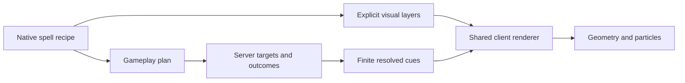

# Spell presentation and catalog expansion

October 2, 2026: **all 214 native spells have authored art directions**, including all 100 selected Pathfinder adaptations. The gallery contains actual primary-cast footage for the entire catalog. Gameplay and presentation remain separate data plans; wands, discovery and progression remain deferred. [Development status](../development-status.md) records actual verification and client inspection limits.

## Current visual library

[SpellVisual](../../src/main/java/com/quzzar/vestige/magic/presentation/SpellVisual.java) describes finite layers, RGB color, alpha, width/scale, explicitly resolved radius, attachment height and optional vanilla sound. Thirty-two shared shapes are available:

| Shape | Animated composition |
|---|---|
| arc / beam | Seeded lightning bends or straight ribbons between selected endpoints |
| sphere / ring | Shells, expanding pulses and rotating ground outlines |
| sparks / fire / smoke | Bounded colored particle emitters and moving trails |
| box | Translucent construct faces using the attached body's physical bounds |
| body | Three orbiting humanoid silhouettes for images and decoys |
| tree | Trunk, crown, roots and gently moving protective canopy |
| wave | Rippling vertical water sheet |
| rain | Finite falling streaks over the resolved volume |
| veil | Breathing translucent privacy or absence envelope |
| jet / splash / shield | Water jets and droplets; six-panel defensive shell |
| sigil / clock / eye | Rotating rune bands, visible clock hands and an upright iris |
| helix / chain / ripple | Coiling strands, interlocking tether links and advancing pressure rings |
| shards / slash / fangs | Faceted crystals, broad cutting crescents and closing paired teeth |
| tendrils / leaves / wings | Rooted sweeping stems, unfurling leaves and feather fans aligned with the attached body |
| flare / vortex / rays / motes | Surging flame tongues, a raised singularity with accretion arms, radiant strokes and orbiting comets |

[SpellVisualClient](../../src/main/java/com/quzzar/vestige/magic/presentation/client/SpellVisualClient.java) owns interpolation, seeded geometry, timing, particle settings, frame budgets and cosmetic cleanup. [ServerSpellVisuals](../../src/main/java/com/quzzar/vestige/magic/world/ServerSpellVisuals.java) owns finite leases, dimension/range-scoped observers, late snapshots and early termination. Payloads validate layers, points, sizes and duration. Seeds come from cosmetic cue identity; they do not advance gameplay RNG. Renderer budgets are 256 live cues, 4,096 quads per frame and 128 decorative particles per client tick. Beam/arc presets use a wider colored body and bright core; projectiles have a larger visible orb. Area-impact decoration resolves the same radius expression as its targeting. Emitters spread across the authored footprint and follow ordered beam/chain paths. Seeded glints keep sparks visible between particle emissions; particle-quality settings still apply. Rain strokes are wider/brighter and water panels retain more color in daylight. These are cosmetic changes, without trait, cost or damage changes.

Explicit selection and manifestation visuals use the server's actual ordered subjects. Projectiles attach cues to their live bodies and close them on impact. Wards may dissolve as their last binding is spent. The authoring helpers in [spell_visuals.py](../../tools/spell_visuals.py) and [spell_presentation.py](../../tools/spell_presentation.py) generate explicit JSON; no renderer spell-ID switch or inherent artistic trait behavior is introduced. Structural authored visuals retain path cores, water sheets, physical construct bounds and private shells. Each spell selects its own main and secondary motif, density, signed speed and scale through [spell_art.py](../../tools/spell_art.py), documented in [the art ledger](../spell-art-direction.md). The runtime never selects artwork from spell identity or trait names. Persistent bodies own their field: automatic decoration does not repeat the complete hero effect at every tick recipient. Direct projectile-hit graphs receive finite impact feedback even when they contain no nested selector. The built-in projectile damage path reuses its authored layers for a twenty-four-tick contact burst at the actual collision; it preserves default damage and lets the burst expire separately from the removed delivery body. Automatic decoration preserves stealth: invisibility has brief transition cues, without a persistent public shell or decorated renewal pulses. Success-only teleport/formation cues avoid showing a failed move as completed.

Private sensing uses owner-only cues and a separate bounded [SpellSensePayload](../../src/main/java/com/quzzar/vestige/magic/presentation/SpellSensePayload.java). Client camera ownership, contact movement prediction, positional-sound suppression, creature privacy and the clearly labeled item facade have explicit finite leases. Server behavior remains authoritative. Client perception clears on expiry, entity/dimension loss, disconnect and reload; another camera owner retains control.

The new constructs have original procedural bodies. Wall of Ice now uses real Minecraft ice blocks: staggered block-display models rise with frost and ice-chip particles, lift occupants, and settle into independently breakable terrain. After ten seconds, surviving spell-owned cells descend and shatter; broken or replaced cells stay changed. Its cosmetic phase replays show only the authored formation cues; the actual cast recording shows the physical wall and full lifecycle. Existing combat summons retain suitable vanilla models. Stationary plant/fey/elemental support forms have distinct finite roles; they do not implement full Pathfinder creature stat blocks. Item Facade is a glimmer/illusion label rather than an equipment model impersonation. Detailed vines, spectral weapons, new bestiary artwork and casting gestures can improve silhouettes later. Every current spell has connected animated presentation, without a promise of source artwork parity.

## Browse, replay and record

The [cast gallery](../effects-workshop.md) shows actual Minecraft primary casts for all 214 native spells. The full collection is visible by default. Each clip executes the native plan with eligible NPC/player fixtures, timing, recasts and recorded outcomes. Browser sketches and isolated effect studies have been removed. The native MP4s are silent and downloadable.

`./gradlew runEffectsCapture` creates a disposable flat test world in a separate game directory and exports Minecraft's rendered framebuffer with elapsed timestamps. The [encoder](../../tools/encode_native_capture.py) validates source/movie hashes, cast results and complete catalog coverage. Ordinary encounters capture the level before the GUI; player-only utilities capture the complete game frame. Flight uses the real player's third-person view. Food demonstrations hold ordinary client eat input and consume real inventory items.

`/vestige_magic effects <spell> [phase]` remains an operator diagnostic for a finite cosmetic phase with representative anchors. `cast` and `cast_balanced` execute actual targeting and gameplay. The gallery presents the latter kind of footage; no illustrative browser rendering is included. Custom casting gestures, bespoke creature/weapon artwork and broader multiplayer visual review remain future work. Current verification and inspected appearances are recorded in [development status](../development-status.md).

## Authoring and verification

A gameplay plan selects subjects, applies outcomes, schedules callbacks and owns transient state. A visual recipe chooses geometry, appearance, attachment and sound for that plan. Damage, radius, pulse count, costs and constraints determine balance; adding a visual does not change those values. Descriptive traits acquire no new runtime semantics.

Regenerate both converters, the spell reference/balance reports and `tools/export_spell_effects.py`; run their checks. `tools/test_spell_presentation.py` guards stealth, duplicate-cue avoidance and phase ordering. Java tests cover parsing, bounded payloads, target order and cue lifecycles; Minecraft tests exercise gameplay and cleanup. Browser tests cover the complete cast collection and navigation, with actual responsive playback inspection. Record the results honestly in development status before claiming client presentation verification.

## Source research and future selection

The [100-source selection](../pathfinder-spell-selection.md) contains 100 implemented adaptations. The [1,992-record inventory](../pathfinder-spell-inventory.md) remains indexed metadata for later review, pinned to Foundry PF2e commit `6b08de09b3d2b80db785bb6893df9da04e8cae86`. Source rank, rarity, book and edition are provenance rather than native tuning rules. Legacy aliases and reprints do not automatically become separate native spells. Historical [visual-library proposals](../research/pathfinder-visual-library-batch.md) and [36 selection plans](../../tools/pathfinder-selection-plans.json) are superseded by the implemented ledger where those sources were selected.

Wizardry remains behavioral/design inspiration. Its [beam particle](https://github.com/Electroblob77/Wizardry/blob/1.12.2/src/main/java/electroblob/wizardry/client/particle/ParticleBeam.java) and [particle families](https://github.com/Electroblob77/Wizardry/tree/1.12.2/src/main/java/electroblob/wizardry/client/particle) illustrate procedural reuse. Retired Redux reference code remains in Git history at `1f673c0d27ab055362a408fc00ce938b7f74a6ee`. Current geometry and native recipes are independently authored; no Iron, Pathfinder or Wizardry code/assets were copied. Historical [credits](../../CREDITS.md) and [license notices](../../LICENSE.md) remain.
