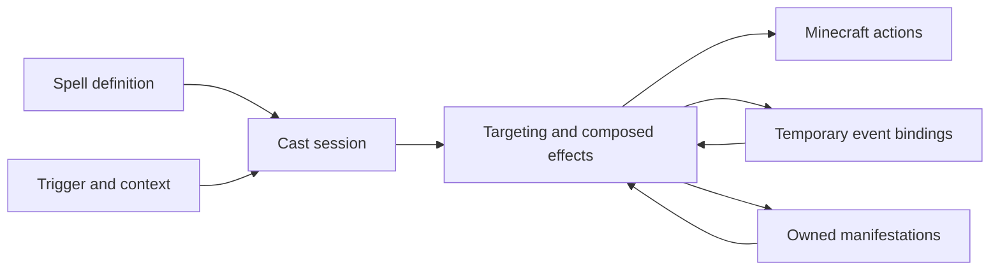

# Native spell runtime

Status: standalone spell catalog with two Pathfinder batches, October 1, 2026. The inherited gameplay layer has been removed; native wands, discovery, and progression are deferred by the project owner.

The [glossary](../../CONTEXT.md) and [trait catalog](trait-catalog.md) define the vocabulary. The [Iron ledger](iron-spell-conversions.md) describes 110 native adaptations, and the [Pathfinder ledger](pathfinder-spell-conversions.md) adds 100 independently authored PF2 adaptations. Historical prototypes remain design evidence.

## Structure

`SpellDefinition` is immutable: stable ID, rarity, traditions, flat trait profile, costs, triggers, effects, optional modes, and optional source provenance. A mode chooses alternate costs and effects without creating another spell identity or changing rarity. Source metadata preserves the exact upstream spell/school, revision, display name, cast type, and original cooldown. Those IDs do not require that upstream mod to be installed.

Rarity is common, uncommon, rare, or mythic. JSON without `rarity` defaults to common for compatibility; all checked-in definitions specify it. `vestige:spell/rarity` is a text condition fact. Rarity is independent of traits and has no implicit numerical effect. The [balance guide](spell-balance.md) and [catalog audit](../spell-balance-audit.md) explain relative ratings, formula calibration, and numerical boost checks. Raw ratings are not capped by rarity or automatically normalized.

`SpellRuntime` owns server-thread cast sessions, queued work, bindings, and manifestations. `SpellWorld` isolates world-dependent behavior. `MinecraftSpellWorld`, `SpellActions`, and `SpellManifestations` provide the native adapter. Spell definitions compose these primitives in JSON; there is no Java orchestration class per converted spell.



Traits are descriptive unless an effect or condition explicitly interprets them. Numerical values may read `amplify`, `range`, and `area`; each has an authored baseline of 1. `volatile` is the sole trait with inherent engine semantics. Capabilities are derived by traversing effects, modes, bindings, and impact/tick/end callbacks.

## State and lifecycle

- Casts resolve a separate trait profile and own scalar state, captured target anchors, charge time, and remaining work. Recasts resume the same actor/spell/mode session and pay once.
- Charge time delays initial execution. Channels use finite repeated plans and can be interrupted. Target selection occurs when each plan step executes, enabling separately aimed recasts.
- Bindings attach triggers and conditions to a subject with finite charges and lifetime. Attacker bindings receive a victim as the event target while dispatching on the attacker. Replacing/expiring a binding cancels its queued consequences.
- Manifestations own source/caster identity, values, backing state, bindings, and callbacks. Multiple projectiles and same-cast summon cohorts coexist. Reapplying attached fields from a new cast replaces matching prior state. Expiry, dispel, destruction, and owner loss remove owned backing/behavior.
- Tick callbacks operate on the backing subject. Immediate end callbacks handle repayment and similar terminal consequences. End callbacks do not run when the server stops, the owner disappears, or backing vanishes. Active casts, projectiles, fields, and summons are not restored after restart/reload. Vanilla status effects may remain until their ordinary duration expires.
- Container lock ownership is serialized on the block entity. Private-space room allocations and player return points are persistent. These persistence seams are independent of discovery/progression.
- Causal lineage follows synchronous actions, projectiles, and summons. Repeated activation keys are bounded within a branch, preventing reaction loops.

Resource costs are checked/spent atomically after charging. Time, cooldown, mana, health, hunger, and material consume/damage costs are supported. Failed payment spends nothing; effect/target failure after payment has no refund policy yet. The actor's temporary native energy budget is a resource seam, not a progression system. Original Iron cooldowns remain provenance. Authored `cooldown` costs are per-actor, per-spell recovery timers starting at initial payment; recasts share payment and recovery. Failed payment and cancelled charges do not start recovery, while paid failures and interruption retain it. Recovery is session state and resets on reload/restart. One active charge/channel per actor is permitted; dormant recasts do not block other spells.

Incoming damage and healing adapters emit calculating events before commit. Reactive wards, deferred damage, and healing suppression modify `PendingOutcome`; a committed outcome rejects further mutation. Other reserved trigger IDs in `SpellTriggerTypes` remain vocabulary until an adapter emits them.

## Authoring

Data packs load `data/<namespace>/runtime_spells/<path>.json`. Reload parses the complete replacement catalog and fails on invalid definitions instead of silently dropping spells.

```json
{
  "rarity": "common",
  "traditions": ["arcane"],
  "traits": {"vestige:force": 4, "vestige:amplify": 1, "vestige:range": 1},
  "costs": [{"type": "mana", "amount": 14}, {"type": "cooldown", "ticks": 40}],
  "triggers": [{"id": "primary", "event": "interact"}],
  "effects": [{
    "type": "create_manifestation",
    "target": {"selection": "self"},
    "manifestation": {
      "kind": "projectile", "duration": 100,
      "identifiers": {"item": "minecraft:amethyst_shard"},
      "values": {"speed": 1.5, "distance": {"product": [20, {"trait": "vestige:range"}]}},
      "on_hit": [{"type": "damage", "values": {"amount": {"product": [7, {"trait": "vestige:amplify"}]}}}]
    }
  }]
}
```

Unqualified identifiers resolve to `vestige`. Numbers are literals or single-operator `trait`, `fact`, `sum`, and `product` expressions. Facts resolve from manifestation/cast state, event data, or the world adapter. Missing numerical facts fail execution explicitly. Scalar identifier values use `{"id":"namespace:path"}`; ordinary strings remain text.

| Composition | Fields / behavior |
|---|---|
| `sequence` / `branch` | Ordered effects / condition plus `then` and `else` |
| `delay` / `repeat` | Positive tick delay / finite `count`, `interval`, and effects |
| `for_each` | Target selector and per-subject effects |
| `set_value` / `capture_value` / `store_target` | Stored scalar / snapshot of a resolved number / captured subject anchor |
| `await_recast` | Positive timeout for the remaining plan |
| `install_binding` | Target and binding ID, triggers, effects, duration, charges |
| `create_manifestation` | Target; kind, duration, values, identifiers; optional bindings, `on_hit`, `on_tick`, `on_end`, interval |
| `end_manifestation` | End the currently executing manifestation |

Targets: self, current, event target, stored target, entity ray, any-entity ray, block ray, aimed position, nearby entities, near target, beam, cone, chain, and melee. Selections can require a subject or permit an empty result. Relationships select any, allied, hostile, or owned creatures. Options include ray radius, cone angle, chained count/jump distance, query count, line of sight, and explicit through-block behavior. Distances are bounded to 128 blocks. Nearby queries use spherical distance.

Leaf outcomes are listed in `SpellActionTypes` and implemented in `SpellActions` (calculating reductions execute in the runtime). Families include damage/weapon damage/leech, healing/status/cleanse, movement/teleport/recall, explosions, mining/replacement, aggro/decoys, attributes/flight, inventory/private space, tether/grip, projectile steering, food energy, and dispel/dismissal.

Manifestations: projectile, summon, block lock, barrier, area, wall, portal, decoy, status, and tether. Projectiles support spread, rain, homing, piercing, gravity, item representation, held-item recovery, and impact graphs. Summons use native ownership/follow/combat handling with vanilla entities. Fields/portals use native particles and `SpellAnchor` backing with authored hit points, avoiding vanilla armor-stand break rules. Temporary attribute/flight changes own undo actions.

The parser rejects unknown execution types, invalid scalar types, non-finite numbers, fractional integer fields, duplicate trigger/mode IDs, and excessive nesting. Runtime budgets bound repeat counts and per-task work. See actual definitions and the ledger for supported behavior; the broader condition vocabulary is not a promise that every path currently resolves.

## Catalog and development controls

The pinned catalog has 110 native Iron adaptations across nine source schools. Pathfinder batches add 100 `vestige:pf2_<source_name>` definitions with source rank/cantrip/rarity and exact AoN references. These are separate native tuning decisions and do not implement tabletop slots, saves, heightening or action economy. Four additional examples remain: Force Arrow, Summon Zombie, Arcane Lock, and Interposing Earth. The latter is a one-hit ward, without PF2e saving-throw/terrain rules. Summon Zombie now uses native ownership and a vanilla zombie; inherited artifact predicates are gone.

```text
/vestige_magic list
/vestige_magic cast <spell>
/vestige_magic cast <spell> <mode>
/vestige_magic interrupt
/vestige_magic dispel
```

The operator `cast` command bypasses resource costs, cooldowns and discovery, retains timing and volatility, and can exercise recasts; `cast_balanced` exercises paid casting. Interrupt affects unfinished casts; dispel removes the caller's manifestations. These commands are the current playtest entrypoint.

All 214 spells have authored native costs/outcomes, paid cooldown enforcement and composed animation phases. The 100 selected Pathfinder sources are implemented as bounded native adaptations. Detailed creature/weapon artwork, character gestures, exhaustive encounter/multiplayer visual review, native wand controls, discovery, progression, refund policy, serialization of active effects and release playthroughs remain further work. Optional foreign Iron/Create/Kithkyn adapters are separate work; Kithkyn development co-loading alone does not implement interoperability.

## Shared native presentation

`for_each` accepts optional `visual` data and sends its exact ordered selection plus the original subject to presentation before executing the selected plans. It does not repeat the target query. A standalone `{"type":"visual","visual":{...}}` creates a finite cosmetic cue at the current subject. A manifestation accepts optional `visual` for an attached body/field; each projectile receives its own visual lease. Presentation adds no derived gameplay capability and does not change damage, costs or trait semantics.

A visual has `duration` (1–2400 ticks), a numeric/expression `radius` (resolved to 0.01–128 blocks), `height` (0–4 blocks), and 1–8 `layers`. Layers select one of the 32 shared shapes described in [presentation design](spell-presentation-and-expansion.md), with six-digit RGB `color`, `alpha` (0–1), `width` (0.005–2) and `scale` (0.05–4). Optional `sound` selects a vanilla sound ID, volume (0–2) and pitch (0.2–2). Optional `ends_with_bindings=true` closes an attached visual when all its owned bindings finish or expire, without removing otherwise-live gameplay backing. A consumed final reaction also emits a short cosmetic ripple; natural expiry, destruction and dispel close it without replaying impact feedback.

For geometry, `alpha` controls opacity and `width` controls ribbon/ring thickness. Optional layer `speed` (-3..3), `phase` (0..2π) and integer `count` (1..24) author signed motion, initial rotation and motif density; older JSON defaults to 1, 0 and 8. Particle emitters use `alpha` as emission probability; `scale` controls spread and spark size. Sparks use the authored tint; vanilla fire and smoke retain their own palettes. Presentation color never selects a gameplay damage type.

```json
{
  "duration": 8,
  "radius": 0.15,
  "height": 1.1,
  "layers": [
    {"shape":"arc","color":"87cfff","alpha":0.9,"width":0.07,"scale":1},
    {"shape":"sparks","color":"b8eaff","alpha":0.8,"width":0.04,"scale":1}
  ]
}
```

The server resolves dimensions, anchors, scale and lifetime; bounded client-bound notifications carry those results and a random seed. The client renders interpolated attached anchors or fixed resolved points. Observer entry receives the current age/snapshot; attached cues refresh once per second, allowing recovery after a client resource reload. Closed runtime state removes its owned cues. Changing levels/disconnecting clears client state. Entity ID plus UUID guards prevent attachment to a reused ID. A dropped or unavailable procedural projectile cue retains the visible item renderer as a fallback.

Limits are 33 points per cue, 256 simultaneous server/client cues, 4,096 rendered quads per frame and 128 emitted decorative particles per client tick. Particle settings reduce decorative emitters; procedural geometry remains independently rendered. These are bounded development limits, with crowd/load tuning still requiring client and multiplayer playtesting. Rendering uses original procedural geometry and vanilla particle/sound assets. See [presentation and expansion](spell-presentation-and-expansion.md) for the implementations, currently connected spells and next source families.

## Balance controls and outcome limits

`/vestige_magic cast_balanced <spell>` exercises native mana and recovery; `/vestige_magic mana [0..200]` inspects or sets test energy. Survival spends mana; Creative bypasses resource payment but retains cooldowns. The existing `cast` command bypasses both resources and recovery, retaining charge/channel timing and recasts. Neither command implements progression or discovery.

Numerical damage actions can author `max_hits_per_target` and an optional namespaced `hit_group`. The counter belongs to the cast and is shared by all of its projectiles, fields, and continuations. Suppressed hits record zero actual damage so leech cannot manufacture healing. Fangs hit each creature once per action and honor `max_targets`; beam, cone, melee and nearby selectors honor `count`. Grip collisions have a finite per-cast hit cap. Summons accept authored `health` and `attack_damage`; vanilla equipment, ranged AI, difficulty and attack cadence still affect actual combat throughput. Recasting a completed summon spell replaces its prior cohort using the original selected subject, even when its backing is a new entity.

Manifestation tick callbacks start one interval after creation, use their own elapsed schedule, and include a final pulse at expiry if the interval divides duration. A 120-tick field at interval ten has twelve callbacks regardless of server tick phase. Destruction/owner loss closes it sooner. Repeated plans still pulse immediately and put their final pulse at `(count - 1) × interval`. See the [complete review](../spell-balance-review.md) for authored ceilings and role tradeoffs.

## Rules references and reusable Pathfinder mechanics

`source.reference` optionally records `system`, `edition`, `publication`, integer `rank` (1–10), boolean `cantrip`, source `rarity`, and an absolute HTTP(S) `url`. `source.spell`, `revision`, and `name` remain required. Mod-specific `school`, `cast_type`, and `cooldown_ticks` are optional for a rules reference; older Iron definitions still require and retain them. Source fields never set native rarity, costs or execution.

Damage actions can select a Minecraft damage registry ID through `identifiers.damage_type`; omission retains indirect magic. The Pathfinder batch maps fire to `minecraft:in_fire`, cold to `minecraft:freeze`, lightning to `minecraft:lightning_bolt`, and other outcomes to ordinary native magic. These tags control vanilla immunities and native fire/freezing resistance bindings, independently of descriptive traits. `event/freezing` complements `event/fire`. `event/attacker` records the source entity UUID; `event_attacker` selects that living attacker with an optional distance bound. Native elemental actions retain `event/magical=true` so ordinary-attack bindings cannot mistake them for mundane attacks, and `target/distance` supports explicit near/far outcomes. Tagged conditions read `minecraft:undead`; no trait acquires inherent eligibility or resistance semantics.

Nearby queries can explicitly set `options.include_self=1` with relationship `any`, used by the life field so living enemies and the caster can both be healed. The default query behavior is unchanged.

The reusable `control` action temporarily assigns an existing Mob to a caster; an attached finite status manifestation owns cleanup. It refuses native summoned bodies and non-Mobs. Concurrent leases select the newest caster; expiry/dispel of an older lease cannot remove newer control, and final cleanup restores the original target without deleting the body. Dispel of an attached control effect releases ownership; summoned entities still use their existing banishment lifecycle. Normal reload/server cleanup releases every lease. No permanent pet or discovery system is introduced.

## Expansion utility primitives

`dwell_heal` is a numerical action with `amount`, `required_ticks` (1–2400) and `interval` (1–100). A field must call it at that interval for selected recipients. Per-recipient timestamps live in the manifestation's scalar state; a gap longer than the authored interval resets dwell. Once the threshold is reached, a shared per-cast hit claim permits one heal per creature. Occupancy is sampled: leaving and returning entirely between samples cannot be observed. The healing ceiling is counted once, independently of pulse count. `exclude_origin=1` prevents a field's own marker from consuming a recipient slot.

`random_teleport` attempts up to sixteen supported dry landings within a resolved horizontal `radius` of 1–16 blocks. It uses loaded space and collision checks; failed attempts skip that pulse and record `vestige:last_teleport=0`, successful placement records 1. The ordinary `teleport` action opts into the same landing checks through `grounded=1`. Both retain the caster's inventory and clear fall distance.

`detect_magic` privately reports presence within `radius` (0–64) using live native manifestation handles and equipped vanilla enchantments. Closed handles are removed on cleanup; cosmetic cues are excluded. `inspect_item` reports enchantment presence on the caster's main-hand item at completion. Both store `vestige:magic_found` as 0/1 and send feedback only to a player caster. They do not inspect unloaded space, arbitrary mod systems, containers or narrative magic, and never unlock discovery/progression.

Invisibility uses an attached status with `particles=0`, interval-one refreshes of a two-tick vanilla status and one committed-damage release binding. When its lease ends, the refresh expires within two ticks; a stronger external status is preserved. Standard vanilla visibility of armor, equipment and effect particles applies. Silent inert decoys use `inert=1`; summon taming finishes before authored health/attack values are applied. Following fields release when their captured creature leaves the dimension.

## Shared utility mechanics and observer leases

The 36 additional Pathfinder recipes use the same composed plans as the other spells. `construct` creates a bounded destructible native body: width ≤12, height ≤6, depth ≤12 and health ≤100. `solid=1` enables physical entity collision and native line-of-sight blocking; it creates no harvestable block. Placement validates occupancy, border, loading and player build permissions. Explicit `behavior` selects shared finite heal, protect, pressure, debilitate, extinguish or projectile-interception roles. Healing/pressure budgets are shared across recipients, not multiplied per pulse. Destruction dispatches `on_hit` once; cleanup dispatches the normal end lifecycle.

`block_wall` creates real conjured ice cells, currently used by Wall of Ice. Width is bounded to 1–9, height to 1–6, and depth is one block; orientation runs across the caster's horizontal facing. `rise_ticks` and `collapse_ticks` are bounded to 6–80 (defaults 24 and 20). Placement requires loaded, permitted, empty cells, solid support and safe headroom for the complete occupant lift. Vanilla block-display models emerge in staggered columns and rows while the server lifts occupants; completed cells become ordinary colliding, independently breakable blocks. Frost and ice-chip particles accompany both transitions. The invisible lifetime anchor has no collision and is invulnerable, so the wall cannot suffocate its own support.

Each cell has an individual ownership claim. Removing or replacing it relinquishes that claim, including replacing it with ordinary ice; the spell never refills a broken cell. Natural expiry retracts only surviving claimed cells, with a finite animation queue owned by the world adapter. Dispel, chunk unload, reload and server stop clean up immediately, including queued displays, without overwriting player replacements. Conjured ice cannot be harvested and produces no meltwater. Scheduled orphan checks clear cells left in a saved chunk without a live owner; active walls and displays are not serialized. This manifestation derives `alter_blocks` and `lift`, with no implicit damage.

`mobility` owns physical scale and reach modifiers, contact climbing, water-surface support or brief time absence. Climbing requires wall contact; water support requires feet near the surface and allows crouching/submersion. Growing validates clearance; release removes only owned modifiers and resolves obstructed body restoration. `guard` owns finite heavy-hit, melee-image, life-sharing or conditional-air reactions. Life-sharing spends actual health/absorption loss with a one-HP reserve and preserves causal lineage; environmental damage does not consume melee images.

`zone` owns entry-repulsion, two-way containment, slip reactions, water-sheet drag, rain traction, silence or privacy. Geometry/movement and protected-attack reactions are server authoritative. Positional sounds and creature render visibility have scoped client leases; music/UI-relative audio and already-running loops are not rewritten. These acoustic/perception forms are bounded adapters, not a universal third-party spell-component or stealth system. `utterance` explicitly marks a vocal delivery; Silence gates only marked plans.

`sensor` owns a stationary camera, private unseen outlines, coarse status reports or an item-facade glimmer/label. Camera updates call the client camera API without moving the player's server body; body damage ends the view. The sensor is limited to normally tracked chunks and native visibility. Server interaction/activation gates remain authoritative. Status reports are private and respect native obstruction. Item Facade preserves the real item/model/enchantments and identifies its illusion in the tooltip. Private visual leases never broadcast their answers to other players.

`transpose` validates the complete eligible ally formation before moving anyone. Ownership/team rules establish consent; same-team players also opt in with `/vestige_magic accept_magic true`. `create_water` adds one aimed cauldron layer. `gather_items` pulls at most eight eligible loose metal stacks without copying or changing their identity/count. `shape_stone` recasts to move one existing plain-stone cell to a safe destination; ore, containers and protected/occupied space are excluded. `passage` temporarily opens a two-high, three-deep plain-stone passage, evacuates occupants and restores only cells still owned as air, including before chunk save. Permanent stone reshaping is an explicit committed world change; ordinary constructs are transient entities.

`pet_cache` shelters an existing owned pet in an isolated private cell. It keeps original UUID, owner, health and equipment across actual dimension travel. A flushed emergency-return journal precedes movement; refused insertion restores the saved identity, normal cleanup returns the live pet, and startup retries interrupted returns. Crash duplicates are reconciled only when journal UUID/type/owner match. The journal stores cleanup obligations, not active cast plans or progression. Server stopping closes leases before final save; reload/dispel/dimension loss and chunk unload release their owned state.

The native world defaults `SpellWorld.canActivate` to true for other adapters. Minecraft checks it before resources, cooldown or continuation mutation. Remote view and absence gate actions; Silence checks the derived utterance capability. Limits, durations, coefficients and scaling are authored in data. Descriptive traits acquire no new implicit semantics.

The operator [effects workshop](../effects-workshop.md) walks default/mode plans and all visual callbacks. `/vestige_magic effects <spell> [phase]` plays one finite native cosmetic phase at sample anchors without executing gameplay. Use `cast` or `cast_balanced` for actual targeting, timing, reactions and world outcomes. The browser gallery exports spell metadata and actual Minecraft primary-cast footage for every spell. Browser sketches and isolated effect-study footage are removed.


### Owned native formations and live images (October 2, 2026)

`construct` can author `formation=vestige:tree`, while `zone` can author `formation=vestige:water`. The same bounded per-cell ledger powers these forms and `block_wall`. Placement validates supported loaded air, build permission, world border and the complete volume before starting. Ice validates occupant lifting clearance; trees reject occupied cells; water allows immersion. Every cell records its exact material and loses ownership permanently on removal or replacement. Cleanup checks the current material again, preserves all edits, and discards animated displays. Expiry queues retraction; dispel, backing loss, reload, shutdown and chunk unload clean up directly. Scheduled orphan ticks clear nonpersistent conjured blocks without drops.

A tree contains four vertical temporary logs and seventeen canopy leaves. Its existing consenting-recipient snapshot, range and shared protection pool remain; losing a trunk caps remaining health by one quarter of the original pool. Leaves can be broken independently. The water wall uses custom confined source/flowing water types sharing vanilla water appearance, fluid type and tags. Fluid ticks never propagate beyond owned cells, buckets cannot harvest it, and the owning lease grows/drains the volume. It retains immersion/extinguishing and additional drag for physical projectiles within the actual cells. Ultrawarm dimensions reject placement.

The `images` guard creates up to eight bounded visual copies (Mirror Image authors three). Each synchronizes a source entity ID plus UUID, follows its source, and reuses the source renderer. Copies cannot be targeted as actors, acquire AI or inventory, or serialize. A qualifying direct melee hit consumes exactly one; environmental fire, explosions and projectiles bypass the existing deterministic mitigation. Guard cleanup discards all copies. This is a finite native adaptation, not random tabletop target redirection.

Summoned tame creatures owned by NPCs remove the vanilla sit goal: it resolves only player owners and otherwise treats the owner as absent. Native ownership still identifies the living caster; shared threat selection and navigation support NPC combat/follow behavior. Player-owned tame creatures retain vanilla sitting behavior.
