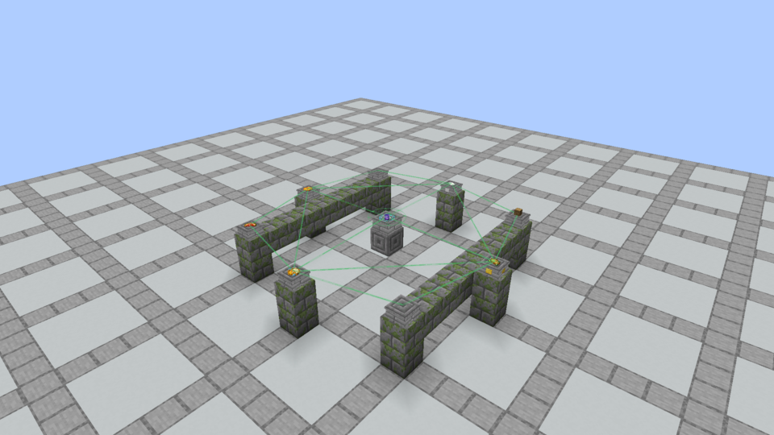
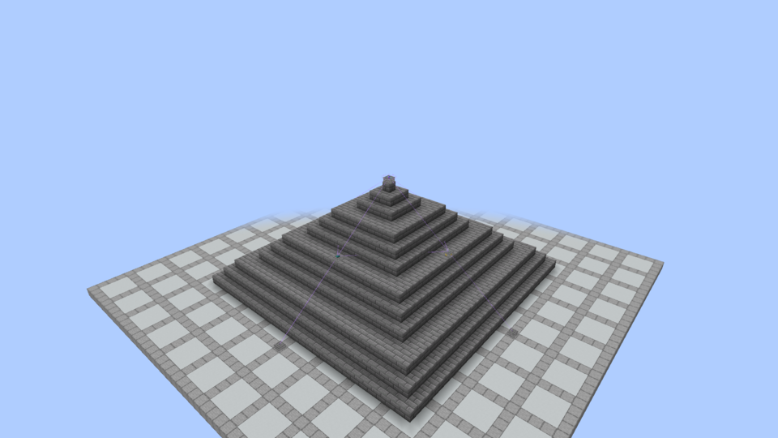

# Leyline crafting playtest

**October 6 feedback update installed:** ritual links/activation linework use pinkish-white; missing ingredients use solid black silhouettes. Rituals, scroll casts and device errors emit no chat/actionbar instructions or status. Scroll tooltips show only the identification-dependent name. The [native review](art/ritual-visual-feedback/README.md) verifies actual Minecraft/JEI views; [the installed build](art/ritual-visual-feedback/prism-install.json) is in Kithkyn Testing. Restart Minecraft to load it.

Implemented October 4, 2026. The accepted v3 calculator now drives native ritual scroll crafting. All 214 native spells retain explicit recipes and optional Iron ingredient alternatives. Iron is not required.

The latest build is installed in **Prism Launcher / Kithkyn Testing**. Its old world and backup were cleared at the owner's request; create a new world to test. The [current installation record](art/ritual-node-blasts/prism-install.json) pins the tested distributed-backfire build and instance versions. It includes the smaller A Spellstone corners, simple Plinth, centered sockets, retained waterlogging and current shared source. Restart Minecraft to load it.

## Prepared Spellstone review

The [A review recordings and fresh test scene](art/spellstone-corner-details/locked-a/README.md) show ready ingredients, missing-item silhouettes, sideways wrong-placement shake, successful ingredient lift/result placement, a completed failure blast and fragment discovery. The opt-in review client leaves four labelled development stations ready for manual activation in creative mode; gameplay interactions do not emit instructional messages. Empty-hand right-click a Spellstone to activate; empty-hand right-click a Plinth to retrieve an offering. Spare Flicker ingredients are supplied in inventory.

The current [backfire review](art/ritual-node-blasts/backfire-review.mp4) records local explosions in four/eight-slot circles and across distant elevated Plinths. Its empty outer node hurts a nearby creature while the gap stays safe. The older A failure footage shows the preceding single-center blast.

## Build the apparatus

Use one **Spellstone** and four **Plinths**. Add another four Plinths for an eight-slot recipe. Both layers use the same block.

Construction supports all [36 stone/masonry stair finishes](design/apparatus-variants.md), with matching full blocks (`B`) and slabs (`S`). `D` is Diamond; `A` is Amethyst Block:

```text
Spellstone (1)      Plinths (2)
D S D              S B S
B A B              . B .
B B B              S B S
```

Spellstone is [compact three-piece stonework with selected A corners](art/spellstone-corner-details/locked-a/README.md): two thick inclined supports, a visible opening and a smaller thick top stone. Supports are 3.5 model units thick; the 12×12 top is 3.25 units thick and receives scrolls at y10/16. Four smaller native Diamond pixel chips wrap the vertical cap corners onto their adjacent side faces; the side centers and top remain bare. The owner selected A from the October 6 corner studies. Its native Astral Seal keeps its glyph and animation, now close to the surface beneath resting items. Straight authored cuboid edges replace the stepped hover outline. Generated collision follows the supports and preserves the opening. Plinth has a flat 14/16-high cap/receiving surface, 12/16 foot/cap width and 10/16 shaft width. Mix any finishes within a ritual: they do not change magic. Stone Brick baseline IDs are `vestige:spellstone`/`vestige:plinth`; other finishes are `vestige:<material>_spellstone`/`vestige:<material>_plinth`. Tuff is `vestige:tuff_spellstone` and `vestige:tuff_plinth`. Use a fresh world; old Stone/Runic Pedestal IDs and migration hooks remain removed.

**Columns:** sneak-place Plinths on top of each other. They form one foot, a continuous square shaft and one flat top cap. Empty segments show their normal uninterrupted stone texture; any segment can hold its independent imbuement. Installed materials are thin plates protruding 1/32 block from the shaft. Texture phase agrees across joins; Quartz/Purpur use native pillar textures. Only the clear cap supplies an offering surface and enters a recipe. Covered supports add no slots or bonuses and retain recoverable contents. Breaking the top caps the next segment; adding a segment over an active surface cancels crafting before consumption. See [current models and native views](design/apparatus-models.md).

**Offering clearance and water:** place an item only when the block directly above its Plinth is air or unobstructed fluid. Water/lava blocks above are usable; a waterlogged solid block above is still a cover. Solid covers reject new offerings and ritual participation, without deleting stored items; covering an active surface cancels safely. Every Plinth in a column retains its own side imbuement socket, even when covered. Sneak-click a side with an empty hand to recover that segment's material.

Both Spellstones and Plinths support vanilla waterlogging across all finishes/column forms. Place them underwater or add/remove water with a bucket. Water state changes preserve references, offerings and sockets. Placing another Plinth above an occupied surface ejects its offering once beside the column while retaining its socket. Submerged Spellstones and exposed Plinths can craft normally. [Actual empty/imbued columns and submerged apparatus](art/apparatus-water/README.md) distinguish fixed stone detail from installed materials.

Creative test supplies:

```text
/give @s vestige:spellstone
/give @s vestige:plinth 8
/vestige_magic scroll vestige:fireball
/vestige_magic mana 100
```

## Arrange the nodes

Each ring has four nodes at equal horizontal offset and equal height. Cross means north/east/south/west; Diagonal means the four corners. The nearest complete ring is the inner layer. Additional rings are candidate outer layers; a reference selects the required recipe capacity, then ingredients select a unique matching arrangement. Ambiguous arrangements reject safely. Without a reference, a matching eight-slot recipe takes precedence over a matching four-slot recipe; otherwise four-slot recipes ignore the entire outer layer.

- Inner physical radius: at most 8 blocks. A diagonal offset of 5 means a radius of `5√2`, not 5.
- Outer physical radius: at most 16 blocks and greater than the inner radius.
- Each height step: −6 through +6 independently. Inner height is relative to Spellstone; outer height is relative to inner.
- Spacing is measured between block centers horizontally. The second distance is the nearest inner-to-outer gap, not the outer radius. Physical 3D beams visualize the nodes without changing this math.
- Four-slot recipes ignore outer geometry, offerings and sockets, even if the outer layer is incomplete or changes during the ritual.
- Nodes must be in loaded chunks. Activation never loads missing chunks. Foundations, walls, pillars and other decorative masonry do not affect the numbers.

Two larger examples are shown in actual Minecraft captures:

| Layout | Inner | Outer | Height steps | Node footprint |
|---|---|---|---|---|
| Nature henge | Cross offset 5 | Diagonal offset 4 | 0 / 0 | 11×11 |
| Divination pyramid | Cross offset 8 | Cross offset 16 | −6 / −6 | 33×33, height span 12 |

These are geometry examples. Each actual spell's complete descriptive trait set determines its own modifiers; the Life/Plant/Wood calculator example does not confer one fixed Nature bonus on every spell.





## Offer, inspect and craft

Right-click a Plinth's **top** to place one recipe ingredient. Empty-hand click retrieves the offering. A block item placed on the top is still a recipe ingredient.

Right-click a Plinth's **side** with a supported imbuement block to install its independent material socket. Only the 26 material families named in the [56 Spellshaping rules](spellshaping-recipes.md) qualify, including compound-only pieces. Any wool color uses the White Wool rules; any concrete color uses the White Concrete rules. Color changes neither spell effects nor Attunement keys, and the socket displays and returns the actual block installed. Carpets and concrete powder remain unsupported. Unsupported side clicks leave the held stack unchanged and do not place a block beside the Plinth. Sneak-click a side with an empty hand to recover its installed material. The socket remains when an offering is removed; breaking the Plinth returns both. A supported material without a recognized local offering pairing remains neutral. Recognized incompatible pairings reject safely before consuming offerings.

Place a reference scroll on Spellstone, then click it with an empty hand. Correct ingredient positions work with or without the reference. A reference shows missing ingredient silhouettes, steady correct positions and sideways shaking for misplaced ingredients. Completed incorrect referenced arrangements retain their existing knowledge/volatility risk. A backfire bursts at the Spellstone (radius four) and every participating Plinth (radius two), following each node’s height. Four-slot recipes affect four inner Plinths; eight-slot recipes affect all eight, including empty recipe positions. Overlapping spheres apply one strongest visible hit per creature. Terrain, nodes, sockets, the reference and loose items remain intact; participating offerings are consumed. Distant gaps outside every sphere remain safe. No reference means an incorrect arrangement rejects safely.

A correct ritual lifts ingredients while the stone remains grounded. At commitment it consumes each required offering once, returns container remainders, and creates a collectible drop above Spellstone. The reference stays flat. The result is a normal dropped item spawned precisely above the center with zero initial velocity; walk into it to collect it without removing the reference. Changes to active nodes, offerings or installed materials cancel before consumption. Supporting terrain is not part of the reservation. Producing a scroll does not identify its spell.

The [complete recipe ledger](ritual-recipes.md) lists ingredients and relative relationships for every spell. Both rings run through four relative positions clockwise, and the eight-slot recipe interleaves inner and outer slots. A quarter-turn preserves these relationships; reflection remains different. Unused positions inside an active eight-slot recipe stay empty.

## Check the actual cast

A crafted scroll stores **Amplify, Range, Area and Casting Cost**. These stored factors are not printed in chat, the actionbar or scroll tooltips. Scroll tooltips show only their name; identification still determines whether that name is known. Moving or rebuilding the apparatus later does not change that scroll. A reference's existing bonuses are never copied or stacked into the new result.

Effects read the scaling traits they already use. A self-only spell gains no reach, and a spell with no area consumer gains no coverage. Casting Cost still scales every existing cost component independently: mana, hunger, health, materials/durability, charge time and recovery. Recasts and lasting callbacks retain the original shaping and pay once. Definitions, descriptive ratings, rarity, discovery weights and unsupported capabilities do not change.

Final gameplay quantities round once after the complete expression. Costs of the same kind/item/operation compose before rounding; absent and rounded-zero components stay absent. Health **costs** convert native HP to hearts before rounding, then convert back, matching the calculator's heart field. Damage and healing outcomes round in native HP. Multipliers, fractions, velocities, probabilities, visual widths and intermediate expressions retain precision. Ordinary unshaped scrolls retain their existing runtime behavior.

A concrete four-slot Fireball potency example uses Cross offset **3**, with Plinths **2 blocks below** Spellstone. Its complete Fire/Evocation profile produces approximately +9.8% Amplify, +5.4% Range, +6.1% Area and +4.3% Casting Cost. The current authored 8-HP damage becomes **9 HP**, 28 mana becomes **29**, charge 20 ticks becomes **21**, and recovery 100 becomes **104**. A radius of 3 remains **3** after rounding. Test with enough mana in Survival; Creative resource bypass cannot demonstrate actual payment.

Fragment reconstruction retains its established trait intersection and weighted selection and produces an unshaped base scroll. Use its reference to craft a shaped version through the ingredient recipe. Native wands, equipment crafting and passive/free-item balancing remain separate future work.

## Verification

The Java evaluator matches 490 canonical calculator fixtures. Minecraft tests cover large geometry, shape/height changes, inactive outer isolation, ambiguity, ingredient commitment, storage, sockets and actual shaped spell effects. Actual client frames and successful henge/pyramid crafting recordings are archived under [native captures](art/leyline-native/).

## Spellshaping and Attunement playtest

Use an ordinary Fireball recipe. Install End Stone in the Blaze Rod Plinth, Bone Block in the Gunpowder Plinth and Copper Block in the Emerald Plinth. The output is **Scroll of Bleeding Reaching Shocking Fireball**, with italic augment words in game. Its blast remains the native Fireball; successful contacts add an electrical cue and finite wound. Put Amethyst Block in the Melon Plinth of Heal for **Mending Heal**, which restores actual additional health over three finite ticks. [The ledger](spellshaping-recipes.md) lists all routes, including the larger proposal boundary.

For an Attunement Shard, build both four-node layers and leave Spellstone's reference surface empty. Offer **2 Amethyst Shards, 1 Echo Shard, 1 Iron Ingot, 1 Diamond and 1 Lapis Lazuli** on any six of the eight Plinths, one item per surface. Leave two offering surfaces empty; their nodes and socket materials still enter the blueprint and must stay unchanged until commitment. Reproduce the complete ordered offering–socket pairs, empty offering positions and both ring geometries to reproduce the full key. A whole quarter-turn matches; moving only the outer layer or swapping socket pairings can change it. Four-node layouts cannot make shards. Advanced item tooltips show the full key and blueprint.
