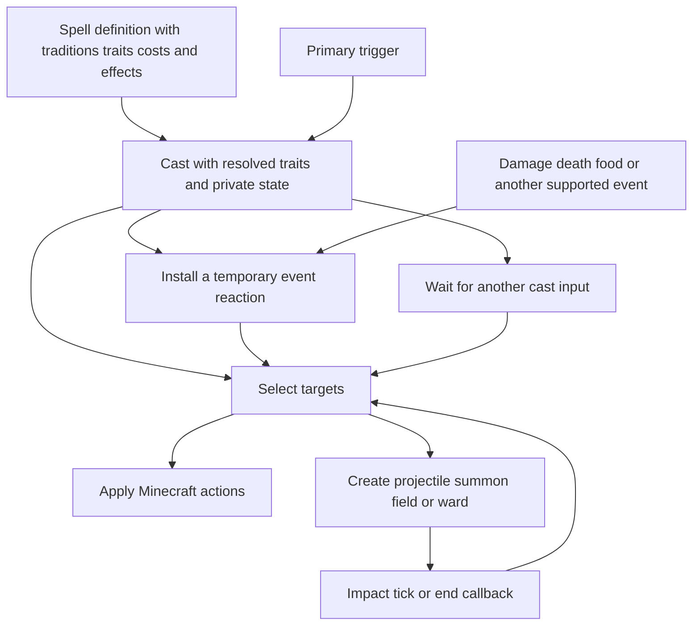

# Vestige spell reference

This guide explains the **214 spells currently defined in Vestige**: 110 native adaptations of the pinned Iron catalog, 100 Pathfinder 2e adaptations, and four native examples. It describes their behavior, rarity, traditions, trait ratings, targeting, timing, effects, and current presentation. Start with the worked examples, then use the catalog to inspect any spell in detail.

All 214 spells have an initial native gameplay balance pass: outcome tuning, resource costs, charge times, cooldowns, and limits. See the [complete balance review](spell-balance-review.md). Every definition has a composed animation recipe, including alternate modes and relevant callbacks. Dedicated creature/weapon models and some source rules remain deliberate adaptation limits; The [effects workshop](effects-workshop.md) now includes actual Minecraft recordings for every visual phase and eight real cast examples; exhaustive encounter and multiplayer review remains further work. Our own wands, discovery, and progression remain deferred. The spells run through Vestige without Iron installed. Pathfinder conversions use `pf2_` IDs; source rank, cantrip status, source rarity, publication and exact AoN URL are separate from native rarity and costs. See the [Pathfinder conversion ledger](design/pathfinder-spell-conversions.md). This reference describes the checked-in definitions and native Minecraft adapter as of October 1, 2026.

Jump to [spell structure](#how-to-read-a-spell), [trait behavior](#what-traits-actually-do), [worked examples](#worked-spell-examples), [current presentation](#shared-rules-and-current-presentation), [playtest commands](#trying-spells-now), or the [complete catalog](#complete-catalog).

The [100-source Pathfinder selection](pathfinder-spell-selection.md) lists all 100 implemented sources, including the latest 36. Earlier proposals are retained as design history. Browse and record their actual animation recipes in the [effects workshop](effects-workshop.md).

## How to read a spell

| Part | What it tells us | Example |
|---|---|---|
| Identity | Stable name used by commands and data packs | `vestige:fireball` |
| Rarity | Expected overall value and eventual availability, independent of traits | Common, uncommon, rare, or mythic |
| Traditions | The magical traditions associated with the spell; more than one is allowed | Arcane and primal |
| Traits | A flat set of names and numerical ratings | Fire 4, evocation 4, amplify 1 |
| Costs | Authored resources, charge, and recovery | 28 mana, 20 ticks of charge, 100 ticks of recovery |
| Triggers | Events that start the spell or activate its temporary reactions | Primary interaction; incoming damage |
| Targets | Which subjects an effect selects | A hostile creature on the aim ray; enemies near an impact |
| Effect plan | Ordered actions, delays, repetitions, branches, and callbacks | Launch, then damage and ignite on impact |
| Cast state | Values and target anchors owned by this particular cast | First portal position; damage deferred by Heartstop |
| Bindings | Temporary reactions attached to a subject | Echo the next three ordinary damage events |
| Manifestations | Owned things or ongoing effects created by a spell | Projectile, summon, field, portal, ward, tether |
| Source provenance | Historical source identity and tuning | Iron spell ID, school, revision, original cooldown |

A spell definition is immutable. Each cast resolves its own traits, captures its own state, and executes the effect plan while retaining its authored rarity. One Fireball definition can therefore produce casts with different numerical values without rewriting the catalog. The [rarity and balance guide](design/spell-balance.md) explains relative ratings, formula calibration, and modifier math, and the [catalog audit](spell-balance-audit.md) records current responses.



The same primitives implement many spells. Fireball and Magma Bomb share projectile and area targeting; Heartstop and Oakskin share incoming damage reactions; Portal and Wall of Fire share a captured first point and a recast continuation. There is no separate Java orchestration class for each converted spell.

### An actual definition in data

This is the complete [Force Arrow definition](../src/main/resources/data/vestige/runtime_spells/force_arrow.json), with formatting compressed for readability:

```json
{
  "rarity": "common",
  "traditions": [
    "arcane"
  ],
  "traits": {
    "vestige:force": 4,
    "vestige:evocation": 4,
    "vestige:amplify": 1,
    "vestige:range": 1
  },
  "costs": [
    {
      "type": "mana",
      "amount": 14
    },
    {
      "type": "cooldown",
      "ticks": 40
    }
  ],
  "triggers": [
    {
      "id": "vestige:primary",
      "event": "vestige:interact"
    }
  ],
  "effects": [
    {
      "type": "create_manifestation",
      "target": {
        "selection": "self"
      },
      "manifestation": {
        "kind": "vestige:projectile",
        "duration": 100,
        "values": {
          "damage": {
            "product": [
              7,
              {
                "trait": "vestige:amplify"
              }
            ]
          },
          "distance": {
            "product": [
              20,
              {
                "trait": "vestige:range"
              }
            ]
          },
          "speed": 1.5
        },
        "identifiers": {
          "item": "minecraft:amethyst_shard"
        }
      }
    }
  ]
}
```

The file path supplies the identity `vestige:force_arrow`. This example uses the projectile's default creature-impact damage path; Fireball instead supplies an explicit `on_hit` plan to select an area, damage its targets, and ignite them. Both execute through the same delivery implementation.

| Code boundary | Responsibility |
|---|---|
| [SpellDefinition](../src/main/java/com/quzzar/vestige/magic/definition/SpellDefinition.java) and [SpellRarity](../src/main/java/com/quzzar/vestige/magic/definition/SpellRarity.java) | Immutable identity, rarity, traditions, traits, costs, triggers, effects, modes, and provenance |
| [SpellEffects](../src/main/java/com/quzzar/vestige/magic/effect/SpellEffects.java) and [SpellValue](../src/main/java/com/quzzar/vestige/magic/expression/SpellValue.java) | Composed plans and numerical expressions |
| [RuntimeSpellLoader](../src/main/java/com/quzzar/vestige/magic/data/RuntimeSpellLoader.java) | Data pack definitions and catalog replacement on reload |
| [SpellRuntime](../src/main/java/com/quzzar/vestige/magic/runtime/SpellRuntime.java) | Cast sessions, continuations, reactions, owned manifestations, and cleanup |
| [MinecraftSpellWorld](../src/main/java/com/quzzar/vestige/magic/world/MinecraftSpellWorld.java) | Target selection, resources, facts, and Minecraft adapter boundary |
| [SpellActions](../src/main/java/com/quzzar/vestige/magic/world/SpellActions.java) and [SpellManifestations](../src/main/java/com/quzzar/vestige/magic/world/SpellManifestations.java) | Concrete world actions and native delivery or backing entities |

## What traits actually do

Traits describe magical character. `fire`, `blood`, `necromancy`, and `teleportation` do not automatically burn, drain life, summon undead, or move anyone. The effect plan supplies those behaviors. Multiple school traits can coexist, and source schools are provenance rather than exclusive native spell categories.

The initial 110 adaptations give each semantic trait a rating of **4**, with `amplify`, `range`, and `area` each at **1**. These are authoring conventions; raw magnitudes and totals do not measure spell power or determine rarity. The Pathfinder batch uses relative unit **1** for descriptive traits, with explicit outcome coefficients; source rank and rarity remain inert provenance. No existing trait profiles were rescaled. The four native examples have their own profiles. Formula coefficients determine what ratings produce, so equivalent scales can use smaller numbers when coefficients and other consumers are adjusted together. Missing traits have rating zero. The accepted built-in vocabulary has [50 traits](design/trait-catalog.md), and addon namespaces can extend it.

| Scaling trait | Common explicit use | Fireball formula |
|---|---|---|
| `amplify` | Multiply a damage or healing amount | `8 × amplify` damage |
| `range` | Multiply reach or projectile travel budget | `32 × range` blocks |
| `area` | Multiply a radius | `3 × area` blocks around impact |

A listed trait matters numerically only where the plan reads it. Heartstop lists all three scaling traits but reads none of them: its duration and repayment fraction are fixed. Portal reads `range`, while its endpoint lifetime stays fixed. Each catalog entry identifies **traits actually read** and **listed scaling traits unused by the plan**.

`volatile` is the sole trait with inherent runtime semantics: it can cause a cast to forfeit. None of the current 214 definitions authors it. Delivery and outcome words such as projectile, beam, damage, healing, shield, and summon are capabilities derived from effects, rather than additional traits.

## Worked spell examples

### Fireball as a projectile with an impact plan

**Traditions:** arcane and primal. **Traits:** fire 4, evocation 4, amplify 1, range 1, area 1. **Authored cost:** 28 mana, 20-tick charge (1 seconds), and a 5-second native cooldown.

The caster launches a projectile at speed 1 block per tick, with a travel budget of `32 × range` blocks. On impact, it selects up to six hostile living creatures within `3 × area` blocks, deals `8 × amplify` damage to each, and ignites them for two seconds. At baseline, the authored hit is eight health points, equivalent to four hearts before mitigation; burning is additional vanilla behavior.

For an illustrative cast resolved to amplify 2, range 1.5, and area 2, the formulas yield 16 damage, a 48-block travel budget, and a six-block radius. This is how trait scaling works; there is no normal wand interface for choosing those values yet.

**Current appearance:** a vanilla fire-charge item model travels with end-rod particles. Victims receive enchanted-hit particles and vanilla fire. Its impact plan supplies area damage; it does not currently draw a bespoke fireball explosion or destroy terrain.

### Heartstop as deferred damage

**Tradition:** occult. **Traits:** blood 4, abjuration 4, time 4, amplify 1, range 1, area 1. **Authored cost:** 80 mana, no initial charge, and a 30-second native cooldown.

The spell attaches a six-second status manifestation to the caster and initializes a damage accumulator. Its incoming damage binding runs before damage commits, stores the amount it defers, and reduces that pending amount to zero. When the manifestation ends normally, its end callback deals half the stored amount to the caster. For example, 20 deferred damage produces an authored repayment of 10 damage.

The binding has 10,000 finite charges. Amplify, range, and area do not change this recipe. Dispel and replacement can invoke the repayment callback; server stop, unavailable ownership, and removed backing close the effect without that callback. The active accumulator is not restored after restart.

**Current appearance:** an attached blood-colored shell/ring with sparks, plus composed reaction and repayment cues. A dedicated heartbeat overlay remains a possible art refinement.

### Echoing Strikes as an attacker reaction

**Tradition:** arcane. **Traits:** ender 4, evocation 4, time 4, amplify 1, range 1, area 1. **Authored cost:** 38 mana, no initial charge, and a 15-second native cooldown.

A ten-second status manifestation installs a binding on the attacker with three charges. Each eligible nonmagical damage event selects that event's victim and applies another hit worth `0.5 × reported event damage × amplify`. An event reporting eight damage therefore produces an authored four-damage echo at baseline. Range and area are unused.

The magical-event guard keeps its own magical echo from consuming further charges, and causal history also bounds repeated reactions. The native adapter currently classifies magical damage through Minecraft's `WITCH_RESISTANT_TO` damage-type tag.

**Current appearance:** default enchant particles on the caster and enchanted-hit particles on the victim. There are no custom spectral weapon models yet.

### Portal as a cast with a second placement

**Tradition:** arcane. **Traits:** ender 4, space 4, teleportation 4, amplify 1, range 1, area 1. **Authored cost:** 48 mana, no initial charge, and a 20-second native cooldown.

The first input captures an aimed position within `48 × range` blocks. The session waits up to 2,400 ticks, or two minutes, for another input of the same spell and mode. The next input captures a second position and creates linked endpoints for 1,200 ticks, or one minute. A resumed session pays once; the second placement is a continuation of the original cast.

Endpoints in the same dimension must be at least two blocks apart. They transfer eligible nearby entities in either direction, with a 30-tick per-entity cooldown to prevent immediate bouncing. Amplify and area are unused. The active endpoints are removed on reload or restart.

**Current appearance:** portal particles at both positions, with invisible native backing entities. Oriented portal frames and custom portal models are still absent.

### Raise Dead as an owned summon cohort

**Tradition:** occult. **Traits:** death 4, necromancy 4, conjuration 4, amplify 1, range 1, area 1. **Authored cost:** 60 mana, 30-tick charge (1.5 seconds), and a 30-second native cooldown.

The effect plan creates two zombies with iron swords and one skeleton with a bow. Leather helmets protect those bodies from ordinary daylight burning. The native ownership layer supplies following and combat behavior. Their maximum lifetime is 600 ticks, or thirty seconds; recasting the waiting session dismisses its cohort early.

None of its scaling traits is read. Its source school is Blood, while its native semantic profile emphasizes death, necromancy, and conjuration. This is an example of classifying the actual spell instead of copying its source school's label onto every adaptation.

**Current appearance:** vanilla equipped zombies and skeletons. Custom Iron undead bodies and advanced source AI are not reproduced.

### Root as a destructible restraint

**Tradition:** primal. **Traits:** plant 4, abjuration 4, amplify 1, range 1, area 1. **Authored cost:** 26 mana, 20-tick charge (1 seconds), and a 10-second native cooldown.

The spell selects an aimed hostile creature within `24 × range` blocks and creates a tether lasting four seconds. The tether has a backing anchor authored with ten health points and constrains the target around its initial position, with a radius of half a block. Every five ticks, it refreshes 25 ticks of vanilla Slowness V. Destroying or dispelling the anchor stops the tether and refreshes; the last slowness application can remain briefly until its own expiry.

Amplify and area are unused. Root is a restraint built from tether and status primitives; its plant trait does not independently create terrain or vines.

**Current appearance:** a finite plant-colored tether cue on its destructible anchor, with composed pulses. A detailed growing tendril mesh remains a possible art refinement.

### Chain Lightning as reusable chained targeting

**Traditions:** arcane and primal. **Traits:** lightning 4, evocation 4, amplify 1, range 1, area 1. **Authored cost:** 32 mana, 10-tick charge (0.5 seconds), and a 6-second native cooldown.

A chain selector finds an initial aimed hostile creature within `32 × range` blocks and follows up to three more nearby hostiles, for four targets total. Each jump has a fixed six-block search distance and respects the selector's visibility rules. Every selected creature receives `6 × amplify` damage. Area is unused, and range scales initial reach rather than the six-block jump distance.

**Current appearance:** enchanted-hit particles on the selected victims. Chaining is implemented as target selection; an animated lightning arc between victims has not been implemented.

## Pathfinder batch examples

The batches add 48, 16 and 36 independent definitions, for 100 `pf2_` IDs. The source rank/cantrip flag describes the published spell; these native costs and outcomes come from Vestige tuning. Source rarity is retained per spell, while native rarity reflects its Minecraft role.

| Spell / native ID | Native rarity | Mana / charge / recovery | Current native outcome |
|---|---|---|---|
| `pf2_electric_arc` | common | 8 / immediate / 1.2 s | Four HP each to at most two distinct creatures; sixteen-block initial reach, four-block visible jump. |
| `pf2_shield` | common | 6 / immediate / 3 s | Personal three-second ward, reducing one hit by three HP. Existing Iron Shield remains a stationary destructible barrier. |
| `pf2_bind_undead` | rare | 34 / 0.8 s / 15 s | Control one existing undead mob for eight seconds; expiry/dispel releases the body and restores its prior target. |
| `pf2_field_of_life` | rare | 40 / 1 s / 11 s | Six delayed one-second pulses: heal living creatures one HP or damage undead two HP, up to six creatures per pulse. Living enemies and the caster can receive healing. |
| `pf2_regenerate` | rare | 38 / 0.8 s / 13 s | Eight delayed healing pulses of 1.5 HP; fire damage ends the cast. |
| `pf2_gentle_breeze` | uncommon | 26 / 0.6 s / 8 s | Six HP once per living recipient after three seconds of continuous sampled occupancy; leaving resets progress, undead excluded. |
| `pf2_flicker` | uncommon | 28 / 0.5 s / 9 s | Four quarter-hit nonmagical reductions and three safe random teleport attempts over six seconds; blocked destinations skip the pulse. |
| `pf2_heal` / `pf2_harm` | uncommon | 24 / 0.6 s / 6 s | Eight HP restoration or harm to one aimed recipient, reversing living/undead eligibility. |
| `pf2_cataclysm` | mythic | 90 / 2 s / 30 s | Four eight-HP surges one second apart at a fixed area, with burning, slowing and a final launch. Maximum six targets per phase; leaving the area or interrupting the channel reduces the outcome. |

Pathfinder descriptive traits use relative unit one, with explicitly calibrated coefficients; source rank does not inflate trait ratings. Typed fire, freezing and lightning use Minecraft damage tags, while undead eligibility uses the entity-type tag. Tabletop saves, spell slots and automatic heightening are omitted. Full differences and citations appear in the [Pathfinder ledger](design/pathfinder-spell-conversions.md), and every executable plan appears below.

## Shared rules and current presentation

All time values use ticks; 20 ticks equal one second at the nominal server rate. Damage and healing amounts use health points; two health points equal one heart. Distances and radii use blocks. Projectile speeds are initial blocks per tick. Listed damage/healing values are authored amounts before world rules and reactions, not guaranteed final health changes.

An initial time cost delays execution. A repeated plan executes its first pulse immediately, then waits between pulses. For example, 25 pulses at four-tick intervals put the last pulse 96 ticks after the first. Recasts inside repeated plans can suspend execution longer. Manifestation tick callbacks are anchored to creation, begin after one interval, and include a final pulse at expiry when the duration is divisible by the interval. A 120-tick field at interval ten therefore has twelve pulses, regardless of server tick phase. Destruction, dispel, departure from the field, and mitigation reduce actual output.

Projectile duration is an upper bound. The native adapter also limits lifetime to `ceil(distance / speed)` ticks, and impact can end it earlier. The current projectile renderer uses a vanilla item model and an end-rod trail. Homing, spread, rain, gravity, and piercing change delivery behavior, without supplying custom models. Ordinary damage actions add enchanted-hit particles. Beam and cone selection do not automatically render a matching beam or cone.

All 214 spells author composed visual phases. Shared geometry includes arcs, beams, spheres, rings, boxes, body silhouettes, trees, water sheets, rain and veils; sparks, fire and smoke add emitters. Optional vanilla sounds are phase data. Solid entity constructs render their actual bounding boxes; Wall of Ice instead raises real, individually breakable ice blocks through vanilla block-display animation and frost particles, then retracts surviving owned cells. Ordinary summoned mobs retain vanilla bodies. The [effects workshop](effects-workshop.md) previews each phase and the `effects` command invokes the actual Minecraft renderer without gameplay. Appearance notes describe connected recipes, not completed visual playtesting of every spell.

Hostile, ally, and owned selections use the native relationship adapter. Hostile here means eligible creatures excluded by its ally rules, rather than a promise that every neutral creature is spared. Required selectors fail when no target exists; optional selectors accept an empty result. Target distance is bounded to 128 blocks, and several adapter values also have bounds. Vanilla status amplifier zero means level I, one means level II, and so on. `freeze` increases Minecraft's frozen-tick state; it does not inherently build an ice prison.

Reload or server stop closes active casts, reactions, projectiles, summons, and fields. Vanilla status applications may remain until their own expiry. Arcane Lock's container ownership and Pocket Dimension's room allocation and player return points are persistent exceptions. Active spell sessions are not serialized.

## Trying spells now

Use an operator account in a development world:

```text
/vestige_magic list
/vestige_magic cast vestige:fireball
/vestige_magic cast vestige:heartstop
/vestige_magic cast vestige:portal
/vestige_magic cast vestige:raise_dead
/vestige_magic interrupt
/vestige_magic dispel
```

`cast` explicitly bypasses resource costs and native cooldowns for development, while preserving charge/channel timing, recasts, and volatility. To exercise balance, use `/vestige_magic mana 100` followed by `/vestige_magic cast_balanced vestige:fireball` in Survival. Paid casts enforce authored mana and per-spell recovery; Creative bypasses resource payment but retains recovery. Recasts pay once and can resume during their existing cooldown. One active charge/channel per caster prevents simultaneous channel stacking; dormant recast sessions permit other spells. Players have 100 mana, full on first spawn and death/respawn, and recover 2 mana per second after a five-second expenditure delay. The mana gauge is visible only below full. Capacity progression remains deferred. Reload/restart resets active sessions and recovery timers. Normal wand controls, discovery, and progression remain deferred.

For Portal, aim at one position and cast, then aim somewhere else and cast again. For Raise Dead, cast once to summon and again to dismiss the waiting cohort. Interrupt stops unfinished casting work; dispel removes owned active manifestations. Spell-specific callbacks can make ending a spell consequential, as with Heartstop.

## Complete catalog

The groups below follow source schools for navigation; they are not native restrictions or trait hierarchies. Every entry includes its checked-in definition, classification, authored costs, explicit trait reads, a readable effect plan, current presentation, and adaptation notes. Numerical formulas preserve the data, including nested impact, tick, end, and event callbacks.

In plans, `fact(...)` reads cast, manifestation, event, or world state. `capture` snapshots a number; `store target` remembers a subject or position. Values without a formula are fixed. Projectile and field options are named explicitly where authored; the shared rules above and runtime design document cover adapter defaults and bounds. A selector's `angle` is its maximum deviation from the aim direction, and `radius` on a beam is its targeting tolerance. The legacy fact name `event/damage_amount` carries the pending healing amount during a healing reaction, as in Blight.

| Catalog group | Spells |
|---|---|
| [Native examples](#native-examples) | 4 |
| [Pathfinder adaptations](#pathfinder-adaptations) | 100 |
| [Blood source spells](#blood-source-spells) | 10 |
| [Ender source spells](#ender-source-spells) | 16 |
| [Evocation source spells](#evocation-source-spells) | 17 |
| [Fire source spells](#fire-source-spells) | 13 |
| [Holy source spells](#holy-source-spells) | 12 |
| [Ice source spells](#ice-source-spells) | 12 |
| [Lightning source spells](#lightning-source-spells) | 10 |
| [Nature source spells](#nature-source-spells) | 13 |
| [Eldritch source spells](#eldritch-source-spells) | 7 |

## Native examples

[Arcane Lock](#arcane-lock) · [Force Arrow](#force-arrow) · [Interposing Earth](#interposing-earth) · [Summon Zombie](#summon-zombie)

### Arcane Lock

Lock an aimed container for its owner; casting on an owned lock unlocks it.

| Property | Current definition |
|---|---|
| Native ID | `vestige:arcane_lock` |
| Rarity | uncommon |
| Traditions | arcane, occult |
| Trait ratings | `abjuration` 5, `amplify` 1, `range` 1 |
| Authored costs | 20 mana; native recovery 40 ticks (2 s) |
| Start triggers | primary on interact |
| Traits actually read | `range` |
| Listed scaling traits unused by plan | `amplify` |
| Definition | [arcane_lock.json](../src/main/resources/data/vestige/runtime_spells/arcane_lock.json) |

**Effect plan**

```text
Select aimed block; reach/radius 8 × range blocks; required
  Cosmetic selection cue: sigil (#b67cff) + chain (#f4deff) + sparks (#f4deff); radius 0.8 blocks; 24 ticks (1.2 s)
  If block/locked_by_actor equal true
    Remove this caster’s persistent container lock
  Otherwise
    Create block_lock, persistent; target: current subject; required
      Attached presentation: sigil (#b67cff) + chain (#f4deff) + sparks (#f4deff); radius 1 blocks; 200 ticks (10 s)
```

**Current appearance:** Composed native cue: sigil (#b67cff) + chain (#f4deff) + sparks (#f4deff); radius 0.8 blocks; 24 ticks (1.2 s). Composed native cue: sigil (#b67cff) + chain (#f4deff) + sparks (#f4deff); radius 1 blocks; 200 ticks (10 s).

**Adaptation notes:** Persistent container ownership blocks another player’s ordinary right-click access. It does not implement universal protection from breaking, automation, or other inventory access.

### Force Arrow

Launch a force projectile that damages its struck creature.

| Property | Current definition |
|---|---|
| Native ID | `vestige:force_arrow` |
| Rarity | common |
| Traditions | arcane |
| Trait ratings | `force` 4, `evocation` 4, `amplify` 1, `range` 1 |
| Authored costs | 14 mana; native recovery 40 ticks (2 s) |
| Start triggers | primary on interact |
| Traits actually read | `amplify`, `range` |
| Listed scaling traits unused by plan | None |
| Definition | [force_arrow.json](../src/main/resources/data/vestige/runtime_spells/force_arrow.json) |

**Effect plan**

```text
Create projectile, 100 ticks (5 s); target: caster; required
  Attached presentation: sphere (#f4deff) + shards (#b67cff) + helix (#f4deff) + sparks (#f4deff); radius 0.42 blocks; 200 ticks (10 s); sound minecraft:block.amethyst_block.chime
  damage = 7 × amplify
  distance = 20 × range
  speed = 1.5
  item = minecraft:amethyst_shard
  On creature impact: default damage = 7 × amplify HP
```

**Current appearance:** Attached native projectile body/trail: sphere (#f4deff) + shards (#b67cff) + helix (#f4deff) + sparks (#f4deff); radius 0.42 blocks; 200 ticks (10 s); sound minecraft:block.amethyst_block.chime; minecraft:amethyst_shard remains the visible fallback. Default creature-impact damage adds enchanted-hit particles on victims. Composed native cue: sphere (#f4deff) + shards (#b67cff) + helix (#f4deff) + sparks (#f4deff); radius 0.42 blocks; 200 ticks (10 s); sound minecraft:block.amethyst_block.chime.

**Adaptation notes:** Native example of projectile values and explicit scaling; uses the default impact damage path.

### Interposing Earth

A brief one-hit ward reduces the next incoming damage amount.

| Property | Current definition |
|---|---|
| Native ID | `vestige:interposing_earth` |
| Rarity | common |
| Traditions | arcane, primal |
| Trait ratings | `earth` 5, `stone` 3, `abjuration` 4, `conjuration` 2, `amplify` 1 |
| Authored costs | 8 mana; native recovery 60 ticks (3 s) |
| Start triggers | primary on interact |
| Traits actually read | `amplify` |
| Listed scaling traits unused by plan | None |
| Definition | [interposing_earth.json](../src/main/resources/data/vestige/runtime_spells/interposing_earth.json) |

**Effect plan**

```text
Create barrier, 60 ticks (3 s); target: caster; required
  Attached presentation: shards (#af8057) + shield (#f2d3a6) + sparks (#f2d3a6); radius 1.15 blocks; 60 ticks (3 s); ends when all owned reactions are spent/expired; sound minecraft:block.amethyst_block.resonate
  Binding earth_defense: 1 charge, 60 ticks (3 s)
    React on damage_calculating
    Reduce pending damage by 2 × amplify HP before commit
    End this manifestation
```

**Current appearance:** Barrier uses minecraft:enchant particles; backing marker, where needed, is invisible. Attached native presentation: shards (#af8057) + shield (#f2d3a6) + sparks (#f2d3a6); radius 1.15 blocks; 60 ticks (3 s); ends when all owned reactions are spent/expired; sound minecraft:block.amethyst_block.resonate. Composed native cue: shards (#af8057) + shield (#f2d3a6) + sparks (#f2d3a6); radius 1.15 blocks; 60 ticks (3 s); ends when all owned reactions are spent/expired; sound minecraft:block.amethyst_block.resonate.

**Adaptation notes:** Native ward example: three-second lifetime, one reaction, reduction of 2 × amplify. It does not raise a terrain wall or implement PF2e saves.

### Summon Zombie

Summon one owned zombie for thirty seconds.

| Property | Current definition |
|---|---|
| Native ID | `vestige:summon_zombie` |
| Rarity | uncommon |
| Traditions | arcane, occult |
| Trait ratings | `death` 4, `necromancy` 5, `conjuration` 3, `amplify` 1 |
| Authored costs | initial charge 20 ticks (1 s); 28 mana; native recovery 600 ticks (30 s) |
| Start triggers | primary on interact |
| Traits actually read | None |
| Listed scaling traits unused by plan | `amplify` |
| Definition | [summon_zombie.json](../src/main/resources/data/vestige/runtime_spells/summon_zombie.json) |

**Effect plan**

```text
Create summon, 600 ticks (30 s); target: caster; required
  Attached presentation: sigil (#57418f) + shards (#d992ff) + sparks (#d992ff); radius 1 blocks; 600 ticks (30 s)
  health = 16
  attack_damage = 3
  entity = minecraft:zombie
  head = minecraft:leather_helmet
```

**Current appearance:** Vanilla minecraft:zombie body. Composed native cue: sigil (#57418f) + shards (#d992ff) + sparks (#d992ff); radius 1 blocks; 600 ticks (30 s).

**Adaptation notes:** Vanilla zombie with a leather helmet and native ownership/follow/combat handling. This example has no recast dismissal continuation.

## Pathfinder adaptations

[Pathfinder Air Bubble](#pathfinder-air-bubble) · [Pathfinder Arctic Rift](#pathfinder-arctic-rift) · [Pathfinder Bind Undead](#pathfinder-bind-undead) · [Pathfinder Breathe Fire](#pathfinder-breathe-fire) · [Pathfinder Cataclysm](#pathfinder-cataclysm) · [Pathfinder Caustic Blast](#pathfinder-caustic-blast) · [Pathfinder Chain Lightning](#pathfinder-chain-lightning) · [Pathfinder Cinder Swarm](#pathfinder-cinder-swarm) · [Pathfinder Clairvoyance](#pathfinder-clairvoyance) · [Pathfinder Collective Transposition](#pathfinder-collective-transposition) · [Pathfinder Containment](#pathfinder-containment) · [Pathfinder Create Water](#pathfinder-create-water) · [Pathfinder Creation](#pathfinder-creation) · [Pathfinder Detect Magic](#pathfinder-detect-magic) · [Pathfinder Divine Lance](#pathfinder-divine-lance) · [Pathfinder Eclipse Burst](#pathfinder-eclipse-burst) · [Pathfinder Electric Arc](#pathfinder-electric-arc) · [Pathfinder Enfeeble](#pathfinder-enfeeble) · [Pathfinder Enlarge](#pathfinder-enlarge) · [Pathfinder Falling Stars](#pathfinder-falling-stars) · [Pathfinder False Vitality](#pathfinder-false-vitality) · [Pathfinder Fear](#pathfinder-fear) · [Pathfinder Field of Life](#pathfinder-field-of-life) · [Pathfinder Figment](#pathfinder-figment) · [Pathfinder Fire Shield](#pathfinder-fire-shield) · [Pathfinder Fireball](#pathfinder-fireball) · [Pathfinder Fleet Step](#pathfinder-fleet-step) · [Pathfinder Flicker](#pathfinder-flicker) · [Pathfinder Floating Flame](#pathfinder-floating-flame) · [Pathfinder Force Barrage](#pathfinder-force-barrage) · [Pathfinder Freezing Rain](#pathfinder-freezing-rain) · [Pathfinder Frostbite](#pathfinder-frostbite) · [Pathfinder Gecko Grip](#pathfinder-gecko-grip) · [Pathfinder Gentle Breeze](#pathfinder-gentle-breeze) · [Pathfinder Gentle Landing](#pathfinder-gentle-landing) · [Pathfinder Glass Shield](#pathfinder-glass-shield) · [Pathfinder Gouging Claw](#pathfinder-gouging-claw) · [Pathfinder Gravity Well](#pathfinder-gravity-well) · [Pathfinder Grease](#pathfinder-grease) · [Pathfinder Grim Tendrils](#pathfinder-grim-tendrils) · [Pathfinder Harm](#pathfinder-harm) · [Pathfinder Haste](#pathfinder-haste) · [Pathfinder Heal](#pathfinder-heal) · [Pathfinder Hydraulic Push](#pathfinder-hydraulic-push) · [Pathfinder Ignition](#pathfinder-ignition) · [Pathfinder Illusory Creature](#pathfinder-illusory-creature) · [Pathfinder Illusory Object](#pathfinder-illusory-object) · [Pathfinder Invisibility](#pathfinder-invisibility) · [Pathfinder Item Facade](#pathfinder-item-facade) · [Pathfinder Lightning Bolt](#pathfinder-lightning-bolt) · [Pathfinder Magic Passage](#pathfinder-magic-passage) · [Pathfinder Magnetic Attraction](#pathfinder-magnetic-attraction) · [Pathfinder Mirror Image](#pathfinder-mirror-image) · [Pathfinder Mud Pit](#pathfinder-mud-pit) · [Pathfinder Needle Darts](#pathfinder-needle-darts) · [Pathfinder Peaceful Bubble](#pathfinder-peaceful-bubble) · [Pathfinder Pet Cache](#pathfinder-pet-cache) · [Pathfinder Protection](#pathfinder-protection) · [Pathfinder Protector Tree](#pathfinder-protector-tree) · [Pathfinder Puff of Poison](#pathfinder-puff-of-poison) · [Pathfinder Read Aura](#pathfinder-read-aura) · [Pathfinder Regenerate](#pathfinder-regenerate) · [Pathfinder Repulsion](#pathfinder-repulsion) · [Pathfinder Resist Energy](#pathfinder-resist-energy) · [Pathfinder Revealing Light](#pathfinder-revealing-light) · [Pathfinder Rust Cloud](#pathfinder-rust-cloud) · [Pathfinder Scatter Scree](#pathfinder-scatter-scree) · [Pathfinder See the Unseen](#pathfinder-see-the-unseen) · [Pathfinder Shape Stone](#pathfinder-shape-stone) · [Pathfinder Share Life](#pathfinder-share-life) · [Pathfinder Shield](#pathfinder-shield) · [Pathfinder Shrink](#pathfinder-shrink) · [Pathfinder Silence](#pathfinder-silence) · [Pathfinder Slashing Gust](#pathfinder-slashing-gust) · [Pathfinder Slow](#pathfinder-slow) · [Pathfinder Soothe](#pathfinder-soothe) · [Pathfinder Spirit Blast](#pathfinder-spirit-blast) · [Pathfinder Spiritual Armament](#pathfinder-spiritual-armament) · [Pathfinder Spout](#pathfinder-spout) · [Pathfinder Status](#pathfinder-status) · [Pathfinder Summon Animal](#pathfinder-summon-animal) · [Pathfinder Summon Elemental](#pathfinder-summon-elemental) · [Pathfinder Summon Fey](#pathfinder-summon-fey) · [Pathfinder Summon Plant or Fungus](#pathfinder-summon-plant-or-fungus) · [Pathfinder Tangle Vine](#pathfinder-tangle-vine) · [Pathfinder Telekinetic Projectile](#pathfinder-telekinetic-projectile) · [Pathfinder Thunderstrike](#pathfinder-thunderstrike) · [Pathfinder Time Jump](#pathfinder-time-jump) · [Pathfinder Translocate](#pathfinder-translocate) · [Pathfinder Vampiric Feast](#pathfinder-vampiric-feast) · [Pathfinder Vitality Lash](#pathfinder-vitality-lash) · [Pathfinder Void Warp](#pathfinder-void-warp) · [Pathfinder Wall of Ice](#pathfinder-wall-of-ice) · [Pathfinder Wall of Stone](#pathfinder-wall-of-stone) · [Pathfinder Wall of Water](#pathfinder-wall-of-water) · [Pathfinder Water Breathing](#pathfinder-water-breathing) · [Pathfinder Water Walk](#pathfinder-water-walk) · [Pathfinder Weapon Storm](#pathfinder-weapon-storm) · [Pathfinder Wooden Double](#pathfinder-wooden-double) · [Pathfinder Zephyr Slip](#pathfinder-zephyr-slip)

### Pathfinder Air Bubble

Breathe through water or suffocation until safe air resumes, with a five-second maximum.

| Property | Current definition |
|---|---|
| Native ID | `vestige:pf2_air_bubble` |
| Rarity | common |
| Traditions | arcane, divine, primal |
| Trait ratings | `air` 1, `life` 1, `abjuration` 1, `amplify` 1, `range` 1, `area` 1 |
| Authored costs | 8 mana; native recovery 80 ticks (4 s) |
| Start triggers | primary on interact |
| Traits actually read | None |
| Listed scaling traits unused by plan | `amplify`, `area`, `range` |
| Source metadata | [Air Bubble](https://2e.aonprd.com/Spells.aspx?ID=1438); Player Core p. 314; remaster; rank 1; source rarity common; `aon-2026-10-01; Player Core errata Spring 2026, 1st Printing (2026-02-06)` |
| Definition | [pf2_air_bubble.json](../src/main/resources/data/vestige/runtime_spells/pf2_air_bubble.json) |

**Effect plan**

```text
Select caster; required
  Create guard, 100 ticks (5 s); target: current subject; required
    Attached presentation: ripple (#239dcc) + motes (#c2f4ff) + sparks (#c2f4ff); radius 1.15 blocks; 100 ticks (5 s); sound minecraft:block.amethyst_block.resonate
    budget = 1
    behavior = vestige:air
```

**Current appearance:** Composed native cue: ripple (#239dcc) + motes (#c2f4ff) + sparks (#c2f4ff); radius 1.15 blocks; 100 ticks (5 s); sound minecraft:block.amethyst_block.resonate.

**Adaptation notes:** A self-cast conditional rescue replaces a reaction targeting another creature. Only drowning/suffocation is prevented; ordinary attacks are unaffected.

### Pathfinder Arctic Rift

A wide cold rift deals twenty-two HP and heavily slows at most six enemies.

| Property | Current definition |
|---|---|
| Native ID | `vestige:pf2_arctic_rift` |
| Rarity | mythic |
| Traditions | arcane, primal |
| Trait ratings | `ice` 1, `evocation` 1, `amplify` 1, `range` 1, `area` 1 |
| Authored costs | initial charge 32 ticks (1.6 s); 64 mana; native recovery 300 ticks (15 s) |
| Start triggers | primary on interact |
| Traits actually read | `amplify`, `range` |
| Listed scaling traits unused by plan | `area` |
| Source metadata | [Arctic Rift](https://2e.aonprd.com/Spells.aspx?ID=1444); Player Core p. 316; remaster; rank 8; source rarity common; `aon-2026-10-01; Player Core errata Spring 2026, 1st Printing (2026-02-06)` |
| Definition | [pf2_arctic_rift.json](../src/main/resources/data/vestige/runtime_spells/pf2_arctic_rift.json) |

**Effect plan**

```text
Select creatures along aimed beam; hostile only; reach/radius 32 × range blocks; count=6, radius=1.2; optional when empty
  Cosmetic selection cue: beam (#a7ddff) + beam (#ffffff) + shards (#48badf) + slash (#e7fbff) + sparks (#e7fbff); radius 0.85 blocks; 24 ticks (1.2 s)
  Deal 22 × amplify HP minecraft:freeze damage; reset ordinary hit invulnerability frames
  Add 140 frozen ticks to vanilla freezing state, capped at 400
  Apply minecraft:slowness level 3 for 100 ticks (5 s)
```

**Current appearance:** Composed native cue: beam (#a7ddff) + beam (#ffffff) + shards (#48badf) + slash (#e7fbff) + sparks (#e7fbff); radius 0.85 blocks; 24 ticks (1.2 s). Damage actions add enchanted-hit particles on victims. Status applications use vanilla effect behavior and presentation.

**Adaptation notes:** Freezing/Slowness replace enfeebling, slowed actions and exact line geometry; no physical terrain rift.

### Pathfinder Bind Undead

Temporarily control one existing undead mob for eight seconds.

| Property | Current definition |
|---|---|
| Native ID | `vestige:pf2_bind_undead` |
| Rarity | rare |
| Traditions | arcane, divine, occult |
| Trait ratings | `death` 1, `necromancy` 1, `enchantment` 1, `amplify` 1, `range` 1, `area` 1 |
| Authored costs | initial charge 16 ticks (0.8 s); 34 mana; native recovery 300 ticks (15 s) |
| Start triggers | primary on interact |
| Traits actually read | `range` |
| Listed scaling traits unused by plan | `amplify`, `area` |
| Source metadata | [Bind Undead](https://2e.aonprd.com/Spells.aspx?ID=1449); Player Core p. 318; remaster; rank 3; source rarity common; `aon-2026-10-01; Player Core errata Spring 2026, 1st Printing (2026-02-06)` |
| Definition | [pf2_bind_undead.json](../src/main/resources/data/vestige/runtime_spells/pf2_bind_undead.json) |

**Effect plan**

```text
Select aimed living creature; hostile only; reach/radius 16 × range blocks; required
  Cosmetic selection cue: beam (#b299d0) + beam (#ffffff) + chain (#57418f) + sigil (#d992ff) + sparks (#d992ff); radius 0.85 blocks; 24 ticks (1.2 s)
  If target/entity_type belongs to minecraft:undead
    Create status, 160 ticks (8 s); target: current subject; required
      Attached presentation: chain (#57418f) + sigil (#d992ff) + sparks (#d992ff); radius 1.15 blocks; 160 ticks (8 s); sound minecraft:block.amethyst_block.resonate
    Temporarily control current mob; cast cleanup restores prior target and releases ownership
```

**Current appearance:** Composed native cue: beam (#b299d0) + beam (#ffffff) + chain (#57418f) + sigil (#d992ff) + sparks (#d992ff); radius 0.85 blocks; 24 ticks (1.2 s). Status uses minecraft:enchant particles; backing marker, where needed, is invisible. Attached native presentation: chain (#57418f) + sigil (#d992ff) + sparks (#d992ff); radius 1.15 blocks; 160 ticks (8 s); sound minecraft:block.amethyst_block.resonate. Composed native cue: chain (#57418f) + sigil (#d992ff) + sparks (#d992ff); radius 1.15 blocks; 160 ticks (8 s); sound minecraft:block.amethyst_block.resonate.

**Adaptation notes:** Finite ownership replaces permanent obedience and spoken orders; players and native summons cannot be claimed. Existing AI follows/fights for the caster.

### Pathfinder Breathe Fire

Breathe a short cone of fire into at most four enemies.

| Property | Current definition |
|---|---|
| Native ID | `vestige:pf2_breathe_fire` |
| Rarity | uncommon |
| Traditions | arcane, primal |
| Trait ratings | `fire` 1, `evocation` 1, `amplify` 1, `range` 1, `area` 1 |
| Authored costs | initial charge 8 ticks (0.4 s); 18 mana; native recovery 70 ticks (3.5 s) |
| Start triggers | primary on interact |
| Traits actually read | `amplify`, `range` |
| Listed scaling traits unused by plan | `area` |
| Source metadata | [Breathe Fire](https://2e.aonprd.com/Spells.aspx?ID=1457); Player Core p. 319; remaster; rank 1; source rarity common; `aon-2026-10-01; Player Core errata Spring 2026, 1st Printing (2026-02-06)` |
| Definition | [pf2_breathe_fire.json](../src/main/resources/data/vestige/runtime_spells/pf2_breathe_fire.json) |

**Effect plan**

```text
Select creatures in aimed cone; hostile only; reach/radius 7 × range blocks; count=4, angle=35; optional when empty
  Cosmetic selection cue: beam (#ff9d42) + beam (#ffffff) + flare (#f85b25) + ripple (#ffe4a1) + sparks (#ffe4a1); radius 0.85 blocks; 24 ticks (1.2 s)
  Deal 7 × amplify HP minecraft:in_fire damage; reset ordinary hit invulnerability frames
  Ignite for 2 s
```

**Current appearance:** Composed native cue: beam (#ff9d42) + beam (#ffffff) + flare (#f85b25) + ripple (#ffe4a1) + sparks (#ffe4a1); radius 0.85 blocks; 24 ticks (1.2 s). Damage actions add enchanted-hit particles on victims. Ignition uses vanilla burning visuals.

**Adaptation notes:** A single native cone replaces saves and damage dice; burning is deterministic on contact.

### Pathfinder Cataclysm

Channel four elemental surges into one fixed area for up to thirty-two direct HP per creature.

| Property | Current definition |
|---|---|
| Native ID | `vestige:pf2_cataclysm` |
| Rarity | mythic |
| Traditions | arcane, primal |
| Trait ratings | `earth` 1, `fire` 1, `ice` 1, `lightning` 1, `evocation` 1, `amplify` 1, `range` 1, `area` 1 |
| Authored costs | initial charge 40 ticks (2 s); 90 mana; native recovery 600 ticks (30 s) |
| Start triggers | primary on interact |
| Traits actually read | `amplify`, `area`, `range` |
| Listed scaling traits unused by plan | None |
| Source metadata | [Cataclysm](https://2e.aonprd.com/Spells.aspx?ID=1460); Player Core p. 319; remaster; rank 10; source rarity common; `aon-2026-10-01; Player Core errata Spring 2026, 1st Printing (2026-02-06)` |
| Definition | [pf2_cataclysm.json](../src/main/resources/data/vestige/runtime_spells/pf2_cataclysm.json) |

**Effect plan**

```text
Select aimed position; reach/radius 28 × range blocks; required
  Cosmetic selection cue: shards (#ffd45a) + flare (#fffbe1) + sparks (#fffbe1); radius 0.8 blocks; 24 ticks (1.2 s)
  Select creatures around current subject or impact; hostile only; reach/radius 5 × area blocks; count=6; optional when empty
    Cosmetic selection cue: shards (#ffd45a) + flare (#fffbe1) + sparks (#fffbe1); radius 5 × area blocks; 24 ticks (1.2 s); sound minecraft:entity.generic.explode
    Deal 8 × amplify HP minecraft:lightning_bolt damage; reset ordinary hit invulnerability frames
  Wait 20 ticks (1 s) before remaining steps
  Select creatures around current subject or impact; hostile only; reach/radius 5 × area blocks; count=6; optional when empty
    Cosmetic selection cue: shards (#ffd45a) + flare (#fffbe1) + sparks (#fffbe1); radius 5 × area blocks; 24 ticks (1.2 s); sound minecraft:entity.generic.explode
    Deal 8 × amplify HP minecraft:in_fire damage; reset ordinary hit invulnerability frames
    Ignite for 2 s
  Wait 20 ticks (1 s) before remaining steps
  Select creatures around current subject or impact; hostile only; reach/radius 5 × area blocks; count=6; optional when empty
    Cosmetic selection cue: shards (#ffd45a) + flare (#fffbe1) + sparks (#fffbe1); radius 5 × area blocks; 24 ticks (1.2 s); sound minecraft:entity.generic.explode
    Deal 8 × amplify HP minecraft:freeze damage; reset ordinary hit invulnerability frames
    Apply minecraft:slowness level 1 for 80 ticks (4 s)
  Wait 20 ticks (1 s) before remaining steps
  Select creatures around current subject or impact; hostile only; reach/radius 5 × area blocks; count=6; optional when empty
    Cosmetic selection cue: shards (#ffd45a) + flare (#fffbe1) + sparks (#fffbe1); radius 5 × area blocks; 24 ticks (1.2 s); sound minecraft:entity.generic.explode
    Deal 8 × amplify HP magic damage; reset ordinary hit invulnerability frames
    Launch target; strength 0.3; vertical impulse 0.7
```

**Current appearance:** Composed native cue: shards (#ffd45a) + flare (#fffbe1) + sparks (#fffbe1); radius 0.8 blocks; 24 ticks (1.2 s). Composed native cue: shards (#ffd45a) + flare (#fffbe1) + sparks (#fffbe1); radius 5 × area blocks; 24 ticks (1.2 s); sound minecraft:entity.generic.explode. Damage actions add enchanted-hit particles on victims. Ignition uses vanilla burning visuals. Status applications use vanilla effect behavior and presentation.

**Adaptation notes:** Four explicit native phases replace six simultaneous damage categories, massive terrain effects and flying-creature exceptions.

### Pathfinder Caustic Blast

Splash acid over a small three-target area.

| Property | Current definition |
|---|---|
| Native ID | `vestige:pf2_caustic_blast` |
| Rarity | common |
| Traditions | arcane, primal |
| Trait ratings | `acid` 1, `evocation` 1, `amplify` 1, `range` 1, `area` 1 |
| Authored costs | 8 mana; native recovery 30 ticks (1.5 s) |
| Start triggers | primary on interact |
| Traits actually read | `amplify`, `area`, `range` |
| Listed scaling traits unused by plan | None |
| Source metadata | [Caustic Blast](https://2e.aonprd.com/Spells.aspx?ID=1461); Player Core p. 319; remaster; cantrip 1; source rarity common; `aon-2026-10-01; Player Core errata Spring 2026, 1st Printing (2026-02-06)` |
| Definition | [pf2_caustic_blast.json](../src/main/resources/data/vestige/runtime_spells/pf2_caustic_blast.json) |

**Effect plan**

```text
Select aimed position; reach/radius 16 × range blocks; required
  Cosmetic selection cue: ripple (#8bac29) + motes (#e0ff8d) + sparks (#e0ff8d); radius 0.8 blocks; 24 ticks (1.2 s)
  Select creatures around current subject or impact; hostile only; reach/radius 1.5 × area blocks; count=3; optional when empty
    Cosmetic selection cue: ripple (#8bac29) + motes (#e0ff8d) + sparks (#e0ff8d); radius 1.5 × area blocks; 24 ticks (1.2 s); sound minecraft:entity.generic.explode
    Deal 3 × amplify HP magic damage; reset ordinary hit invulnerability frames
    Apply minecraft:weakness level 1 for 40 ticks (2 s)
```

**Current appearance:** Composed native cue: ripple (#8bac29) + motes (#e0ff8d) + sparks (#e0ff8d); radius 0.8 blocks; 24 ticks (1.2 s). Composed native cue: ripple (#8bac29) + motes (#e0ff8d) + sparks (#e0ff8d); radius 1.5 × area blocks; 24 ticks (1.2 s); sound minecraft:entity.generic.explode. Damage actions add enchanted-hit particles on victims. Status applications use vanilla effect behavior and presentation.

**Adaptation notes:** Three direct HP and brief Weakness replace acid dice and critical persistent damage; native damage is magic.

### Pathfinder Chain Lightning

Lightning jumps through up to six visible enemies for twelve HP each.

| Property | Current definition |
|---|---|
| Native ID | `vestige:pf2_chain_lightning` |
| Rarity | rare |
| Traditions | arcane, primal |
| Trait ratings | `lightning` 1, `evocation` 1, `amplify` 1, `range` 1, `area` 1 |
| Authored costs | initial charge 20 ticks (1 s); 42 mana; native recovery 180 ticks (9 s) |
| Start triggers | primary on interact |
| Traits actually read | `amplify`, `range` |
| Listed scaling traits unused by plan | `area` |
| Source metadata | [Chain Lightning](https://2e.aonprd.com/Spells.aspx?ID=1462); Player Core p. 319; remaster; rank 6; source rarity common; `aon-2026-10-01; Player Core errata Spring 2026, 1st Printing (2026-02-06)` |
| Definition | [pf2_chain_lightning.json](../src/main/resources/data/vestige/runtime_spells/pf2_chain_lightning.json) |

**Effect plan**

```text
Select aimed creature and chained nearby creatures; hostile only; reach/radius 24 × range blocks; count=6, jump=5; required
  Cosmetic selection cue: arc (#4bafff) + arc (#ffffff) + helix (#5594ff) + rays (#e5f4ff) + sparks (#e5f4ff); radius 0.85 blocks; 24 ticks (1.2 s); sound minecraft:block.amethyst_block.chime
  Deal 12 × amplify HP minecraft:lightning_bolt damage; reset ordinary hit invulnerability frames
```

**Current appearance:** Composed native cue: arc (#4bafff) + arc (#ffffff) + helix (#5594ff) + rays (#e5f4ff) + sparks (#e5f4ff); radius 0.85 blocks; 24 ticks (1.2 s); sound minecraft:block.amethyst_block.chime. Damage actions add enchanted-hit particles on victims.

**Adaptation notes:** A six-victim no-repeat chain replaces save-based chain continuation; each jump requires visibility.

### Pathfinder Cinder Swarm

A following firefly swarm burns its captured creature for ten direct HP over five seconds and briefly blinds it.

| Property | Current definition |
|---|---|
| Native ID | `vestige:pf2_cinder_swarm` |
| Rarity | uncommon |
| Traditions | arcane, primal |
| Trait ratings | `fire` 1, `conjuration` 1, `amplify` 1, `range` 1, `area` 1 |
| Authored costs | initial charge 12 ticks (0.6 s); 28 mana; native recovery 140 ticks (7 s) |
| Start triggers | primary on interact |
| Traits actually read | `amplify`, `area`, `range` |
| Listed scaling traits unused by plan | None |
| Source metadata | [Cinder Swarm](https://2e.aonprd.com/Spells.aspx?ID=1350); Rage of Elements p. 118; remaster; rank 4; source rarity common; `aon-2026-10-01; Rage of Elements errata 2.0 (2024-05-17)` |
| Definition | [pf2_cinder_swarm.json](../src/main/resources/data/vestige/runtime_spells/pf2_cinder_swarm.json) |

**Effect plan**

```text
Select aimed living creature; hostile only; reach/radius 18 × range blocks; required
  Store current target as target_anchor
  Create area, 100 ticks (5 s); target: current subject; required
    Attached presentation: motes (#f85b25) + flare (#ffe4a1) + sparks (#ffe4a1); radius 1.2 × area blocks; 100 ticks (5 s)
    radius = 1.2 × area
    follow_target = 1
    health = 8
    particles = 0
    particle = minecraft:enchant
    On tick callback every 20 ticks
      Select captured target; optional when empty
        Deal 2 × amplify HP minecraft:in_fire damage; reset ordinary hit invulnerability frames
        Apply minecraft:blindness level 1 for 25 ticks (1.25 s)
```

**Current appearance:** Area uses minecraft:enchant particles; backing marker, where needed, is invisible. Attached native presentation: motes (#f85b25) + flare (#ffe4a1) + sparks (#ffe4a1); radius 1.2 × area blocks; 100 ticks (5 s). Composed native cue: motes (#f85b25) + flare (#ffe4a1) + sparks (#ffe4a1); radius 1.2 × area blocks; 100 ticks (5 s). Damage actions add enchanted-hit particles on victims. Status applications use vanilla effect behavior and presentation.

**Adaptation notes:** Only the firefly-inspired variant, with a breakable marker and fixed five pulses. The ant variant, insect models, saves and forced movement are omitted; nearby bystanders take no pulse damage.

### Pathfinder Clairvoyance

See through a stationary sensor up to twenty blocks away for eight seconds; damage immediately ends the view.

| Property | Current definition |
|---|---|
| Native ID | `vestige:pf2_clairvoyance` |
| Rarity | rare |
| Traditions | arcane, occult |
| Trait ratings | `divination` 1, `space` 1, `amplify` 1, `range` 1, `area` 1 |
| Authored costs | initial charge 20 ticks (1 s); 32 mana; native recovery 300 ticks (15 s) |
| Start triggers | primary on interact |
| Traits actually read | `range` |
| Listed scaling traits unused by plan | `amplify`, `area` |
| Source metadata | [Clairvoyance](https://2e.aonprd.com/Spells.aspx?ID=1466); Player Core p. 320; remaster; rank 4; source rarity common; `aon-2026-10-01; Player Core errata Spring 2026, 1st Printing (2026-02-06)` |
| Definition | [pf2_clairvoyance.json](../src/main/resources/data/vestige/runtime_spells/pf2_clairvoyance.json) |

**Effect plan**

```text
Select aimed position; reach/radius 20 × range blocks; required
  Create sensor, 160 ticks (8 s); target: current subject; required
    Attached presentation: eye (#b67cff) + sigil (#f4deff) + sparks (#f4deff); radius 0.7 blocks; 160 ticks (8 s)
    behavior = vestige:camera
```

**Current appearance:** Composed native cue: eye (#b67cff) + sigil (#f4deff) + sparks (#f4deff); radius 0.7 blocks; 160 ticks (8 s).

**Adaptation notes:** Client camera changes while the server body stays vulnerable. Fixed sensor facing and normal tracked chunks replace arbitrary remote locations/panning; casting and interaction are blocked while viewing.

### Pathfinder Collective Transposition

Move three willing nearby allies into a supported formation at the aimed destination.

| Property | Current definition |
|---|---|
| Native ID | `vestige:pf2_collective_transposition` |
| Rarity | rare |
| Traditions | arcane, occult |
| Trait ratings | `space` 1, `conjuration` 1, `amplify` 1, `range` 1, `area` 1 |
| Authored costs | initial charge 20 ticks (1 s); 44 mana; native recovery 300 ticks (15 s) |
| Start triggers | primary on interact |
| Traits actually read | `range` |
| Listed scaling traits unused by plan | `amplify`, `area` |
| Source metadata | [Collective Transposition](https://2e.aonprd.com/Spells.aspx?ID=1978); Player Core 2 p. 243; remaster; rank 6; source rarity common; `aon-2026-10-01; Player Core 2 errata 1.1 (2024-12-16)` |
| Definition | [pf2_collective_transposition.json](../src/main/resources/data/vestige/runtime_spells/pf2_collective_transposition.json) |

**Effect plan**

```text
Select aimed position; reach/radius 16 × range blocks; required
  Move up to three consenting allies after validating the complete formation
Cosmetic cue at current subject: helix (#b67cff) + sigil (#f4deff) + sparks (#f4deff); radius 1 blocks; 24 ticks (1.2 s)
```

**Current appearance:** Composed native cue: helix (#b67cff) + sigil (#f4deff) + sparks (#f4deff); radius 1 blocks; 24 ticks (1.2 s).

**Adaptation notes:** Automatic fixed formation replaces independently chosen destinations. Every destination validates before any creature moves; players opt in through the development consent control.

### Pathfinder Containment

Enclose the aimed enemy within a two-way movement boundary for five seconds; outside hits spend a shared sixteen-HP pool.

| Property | Current definition |
|---|---|
| Native ID | `vestige:pf2_containment` |
| Rarity | rare |
| Traditions | arcane, occult |
| Trait ratings | `force` 1, `abjuration` 1, `amplify` 1, `range` 1, `area` 1 |
| Authored costs | initial charge 10 ticks (0.5 s); 36 mana; native recovery 300 ticks (15 s) |
| Start triggers | primary on interact |
| Traits actually read | `amplify`, `area`, `range` |
| Listed scaling traits unused by plan | None |
| Source metadata | [Containment](https://2e.aonprd.com/Spells.aspx?ID=1981); Player Core 2 p. 243; remaster; rank 4; source rarity common; `aon-2026-10-01; Player Core 2 errata 1.1 (2024-12-16)` |
| Definition | [pf2_containment.json](../src/main/resources/data/vestige/runtime_spells/pf2_containment.json) |

**Effect plan**

```text
Select aimed living creature; hostile only; reach/radius 14 × range blocks; required
  Create zone, 100 ticks (5 s); target: current subject; required
    Attached presentation: chain (#99aabf) + sigil (#eef5ff) + sparks (#eef5ff); radius 2 × area blocks; 100 ticks (5 s)
    radius = 2 × area
    particles = 0
    health = 16 × amplify
    behavior = vestige:containment
```

**Current appearance:** Composed native cue: chain (#99aabf) + sigil (#eef5ff) + sparks (#eef5ff); radius 2 × area blocks; 100 ticks (5 s).

**Adaptation notes:** Movement boundary and finite outside-attack durability replace an invulnerable tabletop sphere. It is traversable after breaking; inside attacks and terrain are not blocked.

### Pathfinder Create Water

Add one water layer to an aimed cauldron.

| Property | Current definition |
|---|---|
| Native ID | `vestige:pf2_create_water` |
| Rarity | common |
| Traditions | arcane, divine, primal |
| Trait ratings | `water` 1, `conjuration` 1, `amplify` 1, `range` 1, `area` 1 |
| Authored costs | 8 mana; native recovery 60 ticks (3 s) |
| Start triggers | primary on interact |
| Traits actually read | `range` |
| Listed scaling traits unused by plan | `amplify`, `area` |
| Source metadata | [Create Water](https://2e.aonprd.com/Spells.aspx?ID=1476); Player Core p. 322; remaster; rank 1; source rarity common; `aon-2026-10-01; Player Core errata Spring 2026, 1st Printing (2026-02-06)` |
| Definition | [pf2_create_water.json](../src/main/resources/data/vestige/runtime_spells/pf2_create_water.json) |

**Effect plan**

```text
Select aimed block; reach/radius 12 × range blocks; required
  Cosmetic selection cue: ripple (#239dcc) + motes (#c2f4ff) + sparks (#c2f4ff); radius 0.8 blocks; 24 ticks (1.2 s)
  Add one water layer to a permitted aimed cauldron
```

**Current appearance:** Composed native cue: ripple (#239dcc) + motes (#c2f4ff) + sparks (#c2f4ff); radius 0.8 blocks; 24 ticks (1.2 s).

**Adaptation notes:** A finite Minecraft utility volume replaces a gallon pool. Full cauldrons fail; no fluid source block, item duplication or damaging water attack.

### Pathfinder Creation

Assemble a temporary wooden cover, step or platform for twenty seconds.

| Property | Current definition |
|---|---|
| Native ID | `vestige:pf2_creation` |
| Rarity | uncommon |
| Traditions | arcane, primal |
| Trait ratings | `wood` 1, `plant` 1, `conjuration` 1, `amplify` 1, `range` 1, `area` 1 |
| Authored costs | initial charge 30 ticks (1.5 s); 26 mana; native recovery 240 ticks (12 s) |
| Start triggers | primary on interact |
| Traits actually read | `amplify`, `range` |
| Listed scaling traits unused by plan | `area` |
| Source metadata | [Creation](https://2e.aonprd.com/Spells.aspx?ID=1477); Player Core p. 322; remaster; rank 4; source rarity common; `aon-2026-10-01; Player Core errata Spring 2026, 1st Printing (2026-02-06)` |
| Definition | [pf2_creation.json](../src/main/resources/data/vestige/runtime_spells/pf2_creation.json) |

**Effect plan**

```text
Select aimed position; reach/radius 12 × range blocks; required
  Create construct, 400 ticks (20 s); target: current subject; required
    Attached presentation: box (#b58f60) + sigil (#99aabf) + shards (#eef5ff) + sparks (#eef5ff); radius 1 blocks; 400 ticks (20 s)
    width = 3
    height = 1
    depth = 0.5
    solid = 1
    health = 16 × amplify
    behavior = vestige:none
```

**Current appearance:** Composed native cue: box (#b58f60) + sigil (#99aabf) + shards (#eef5ff) + sparks (#eef5ff); radius 1 blocks; 400 ticks (20 s).

**Adaptation notes:** Finite presets replace arbitrary mundane objects. Geometry has collision and durability but produces no inventory items, containers or loot.

**Alternate mode: vestige:step**

Same authored mana, charge and recovery as the primary plan.

```text
Select aimed position; reach/radius 12 × range blocks; required
  Create construct, 400 ticks (20 s); target: current subject; required
    Attached presentation: box (#b58f60) + sigil (#99aabf) + shards (#eef5ff) + sparks (#eef5ff); radius 1 blocks; 400 ticks (20 s)
    width = 2
    height = 0.5
    depth = 2
    solid = 1
    health = 16 × amplify
    behavior = vestige:none
```

**Appearance:** Composed native cue: box (#b58f60) + sigil (#99aabf) + shards (#eef5ff) + sparks (#eef5ff); radius 1 blocks; 400 ticks (20 s).

**Alternate mode: vestige:platform**

Same authored mana, charge and recovery as the primary plan.

```text
Select aimed position; reach/radius 12 × range blocks; required
  Create construct, 400 ticks (20 s); target: current subject; required
    Attached presentation: box (#b58f60) + sigil (#99aabf) + shards (#eef5ff) + sparks (#eef5ff); radius 1 blocks; 400 ticks (20 s)
    width = 3
    height = 0.25
    depth = 3
    solid = 1
    health = 16 × amplify
    behavior = vestige:none
```

**Appearance:** Composed native cue: box (#b58f60) + sigil (#99aabf) + shards (#eef5ff) + sparks (#eef5ff); radius 1 blocks; 400 ticks (20 s).

### Pathfinder Detect Magic

Privately report whether native manifestations or equipped enchanted items are within sixteen blocks.

| Property | Current definition |
|---|---|
| Native ID | `vestige:pf2_detect_magic` |
| Rarity | common |
| Traditions | arcane, divine, occult, primal |
| Trait ratings | `mind` 1, `divination` 1, `amplify` 1, `range` 1, `area` 1 |
| Authored costs | initial charge 4 ticks (0.2 s); 8 mana; native recovery 60 ticks (3 s) |
| Start triggers | primary on interact |
| Traits actually read | `range` |
| Listed scaling traits unused by plan | `amplify`, `area` |
| Source metadata | [Detect Magic](https://2e.aonprd.com/Spells.aspx?ID=1485); Player Core p. 323; remaster; cantrip 1; source rarity common; `aon-2026-10-01; Player Core errata Spring 2026, 1st Printing (2026-02-06)` |
| Definition | [pf2_detect_magic.json](../src/main/resources/data/vestige/runtime_spells/pf2_detect_magic.json) |

**Effect plan**

```text
Select caster; required
  Privately report native manifestations or equipped enchanted items within 16 × range blocks; no discovery/progression
  Cosmetic cue at current subject: eye (#b67cff) + rays (#f4deff) + sparks (#f4deff); radius 16 × range blocks; 24 ticks (1.2 s)
```

**Current appearance:** Composed native cue: eye (#b67cff) + rays (#f4deff) + sparks (#f4deff); radius 16 × range blocks; 24 ticks (1.2 s).

**Adaptation notes:** Presence only, from loaded native state/equipped items. It does not inspect other mods, inventories or blocks, reveal hidden locations, or unlock discovery/progression.

### Pathfinder Divine Lance

Strike one creature with a five-HP spiritual lance.

| Property | Current definition |
|---|---|
| Native ID | `vestige:pf2_divine_lance` |
| Rarity | common |
| Traditions | divine |
| Trait ratings | `spirit` 1, `holy` 1, `evocation` 1, `amplify` 1, `range` 1, `area` 1 |
| Authored costs | 6 mana; native recovery 20 ticks (1 s) |
| Start triggers | primary on interact |
| Traits actually read | `amplify`, `range` |
| Listed scaling traits unused by plan | `area` |
| Source metadata | [Divine Lance](https://2e.aonprd.com/Spells.aspx?ID=1498); Player Core p. 325; remaster; cantrip 1; source rarity common; `aon-2026-10-01; Player Core errata Spring 2026, 1st Printing (2026-02-06)` |
| Definition | [pf2_divine_lance.json](../src/main/resources/data/vestige/runtime_spells/pf2_divine_lance.json) |

**Effect plan**

```text
Select aimed living creature; hostile only; reach/radius 20 × range blocks; required
  Cosmetic selection cue: beam (#fff1b0) + beam (#ffffff) + rays (#ffd45a) + helix (#fffbe1) + sparks (#fffbe1); radius 0.85 blocks; 24 ticks (1.2 s)
  Deal 5 × amplify HP magic damage; reset ordinary hit invulnerability frames
```

**Current appearance:** Composed native cue: beam (#fff1b0) + beam (#ffffff) + rays (#ffd45a) + helix (#fffbe1) + sparks (#fffbe1); radius 0.85 blocks; 24 ticks (1.2 s). Damage actions add enchanted-hit particles on victims.

**Adaptation notes:** Spirit damage uses native magic; deity sanctification and tabletop immunities are not imported.

### Pathfinder Eclipse Burst

An eclipse blast deals twenty HP and briefly blinds and weakens up to six enemies.

| Property | Current definition |
|---|---|
| Native ID | `vestige:pf2_eclipse_burst` |
| Rarity | mythic |
| Traditions | arcane, divine, primal |
| Trait ratings | `ice` 1, `void` 1, `evocation` 1, `amplify` 1, `range` 1, `area` 1 |
| Authored costs | initial charge 30 ticks (1.5 s); 62 mana; native recovery 280 ticks (14 s) |
| Start triggers | primary on interact |
| Traits actually read | `amplify`, `area`, `range` |
| Listed scaling traits unused by plan | None |
| Source metadata | [Eclipse Burst](https://2e.aonprd.com/Spells.aspx?ID=1508); Player Core p. 328; remaster; rank 7; source rarity common; `aon-2026-10-01; Player Core errata Spring 2026, 1st Printing (2026-02-06)` |
| Definition | [pf2_eclipse_burst.json](../src/main/resources/data/vestige/runtime_spells/pf2_eclipse_burst.json) |

**Effect plan**

```text
Select aimed position; reach/radius 28 × range blocks; required
  Cosmetic selection cue: vortex (#57418f) + rays (#d992ff) + sparks (#d992ff); radius 0.8 blocks; 24 ticks (1.2 s)
  Select creatures around current subject or impact; hostile only; reach/radius 4 × area blocks; count=6; optional when empty
    Cosmetic selection cue: vortex (#57418f) + rays (#d992ff) + sparks (#d992ff); radius 4 × area blocks; 24 ticks (1.2 s); sound minecraft:entity.generic.explode
    Deal 20 × amplify HP minecraft:freeze damage; reset ordinary hit invulnerability frames
    Apply minecraft:blindness level 1 for 60 ticks (3 s)
    Apply minecraft:weakness level 1 for 100 ticks (5 s)
```

**Current appearance:** Composed native cue: vortex (#57418f) + rays (#d992ff) + sparks (#d992ff); radius 0.8 blocks; 24 ticks (1.2 s). Composed native cue: vortex (#57418f) + rays (#d992ff) + sparks (#d992ff); radius 4 × area blocks; 24 ticks (1.2 s); sound minecraft:entity.generic.explode. Damage actions add enchanted-hit particles on victims. Status applications use vanilla effect behavior and presentation.

**Adaptation notes:** One cold impact replaces cold plus void rolls; undead take the cold component, with no permanent blindness or darkness terrain.

### Pathfinder Electric Arc

Arc to the aimed creature and at most one nearby enemy, dealing four HP to each.

| Property | Current definition |
|---|---|
| Native ID | `vestige:pf2_electric_arc` |
| Rarity | common |
| Traditions | arcane, primal |
| Trait ratings | `lightning` 1, `evocation` 1, `amplify` 1, `range` 1, `area` 1 |
| Authored costs | 8 mana; native recovery 24 ticks (1.2 s) |
| Start triggers | primary on interact |
| Traits actually read | `amplify`, `range` |
| Listed scaling traits unused by plan | `area` |
| Source metadata | [Electric Arc](https://2e.aonprd.com/Spells.aspx?ID=1509); Player Core p. 328; remaster; cantrip 1; source rarity common; `aon-2026-10-01; Player Core errata Spring 2026, 1st Printing (2026-02-06)` |
| Definition | [pf2_electric_arc.json](../src/main/resources/data/vestige/runtime_spells/pf2_electric_arc.json) |

**Effect plan**

```text
Select aimed creature and chained nearby creatures; hostile only; reach/radius 16 × range blocks; count=2, jump=4; required
  Cosmetic selection cue: arc (#d7baff) + arc (#ffffff) + helix (#b67cff) + motes (#f4deff) + sparks (#f4deff); radius 0.85 blocks; 24 ticks (1.2 s); sound minecraft:block.amethyst_block.chime
  Deal 4 × amplify HP magic damage; reset ordinary hit invulnerability frames
```

**Current appearance:** Composed native cue: arc (#d7baff) + arc (#ffffff) + helix (#b67cff) + motes (#f4deff) + sparks (#f4deff); radius 0.85 blocks; 24 ticks (1.2 s); sound minecraft:block.amethyst_block.chime. Damage actions add enchanted-hit particles on victims.

**Adaptation notes:** A visible four-block jump replaces independently selected Pathfinder targets; no Reflex save or heightening.

### Pathfinder Enfeeble

Weaken one creature’s melee attacks for six seconds.

| Property | Current definition |
|---|---|
| Native ID | `vestige:pf2_enfeeble` |
| Rarity | common |
| Traditions | arcane, divine, occult |
| Trait ratings | `life` 1, `necromancy` 1, `amplify` 1, `range` 1, `area` 1 |
| Authored costs | 10 mana; native recovery 70 ticks (3.5 s) |
| Start triggers | primary on interact |
| Traits actually read | `range` |
| Listed scaling traits unused by plan | `amplify`, `area` |
| Source metadata | [Enfeeble](https://2e.aonprd.com/Spells.aspx?ID=1513); Player Core p. 329; remaster; rank 1; source rarity common; `aon-2026-10-01; Player Core errata Spring 2026, 1st Printing (2026-02-06)` |
| Definition | [pf2_enfeeble.json](../src/main/resources/data/vestige/runtime_spells/pf2_enfeeble.json) |

**Effect plan**

```text
Select aimed living creature; hostile only; reach/radius 20 × range blocks; required
  Cosmetic selection cue: beam (#8be6c0) + beam (#ffffff) + tendrils (#57418f) + helix (#d992ff) + sparks (#d992ff); radius 0.85 blocks; 24 ticks (1.2 s)
  Apply minecraft:weakness level 2 for 120 ticks (6 s)
```

**Current appearance:** Composed native cue: beam (#8be6c0) + beam (#ffffff) + tendrils (#57418f) + helix (#d992ff) + sparks (#d992ff); radius 0.85 blocks; 24 ticks (1.2 s). Status applications use vanilla effect behavior and presentation.

**Adaptation notes:** Weakness II replaces save-dependent enfeebled degrees; no damage.

### Pathfinder Enlarge

Become physically one-and-a-half size for eight seconds, with one extra block of player reach.

| Property | Current definition |
|---|---|
| Native ID | `vestige:pf2_enlarge` |
| Rarity | uncommon |
| Traditions | arcane, primal |
| Trait ratings | `polymorph` 1, `transmutation` 1, `amplify` 1, `range` 1, `area` 1 |
| Authored costs | initial charge 10 ticks (0.5 s); 24 mana; native recovery 200 ticks (10 s) |
| Start triggers | primary on interact |
| Traits actually read | None |
| Listed scaling traits unused by plan | `amplify`, `area`, `range` |
| Source metadata | [Enlarge](https://2e.aonprd.com/Spells.aspx?ID=1514); Player Core p. 329; remaster; rank 2; source rarity common; `aon-2026-10-01; Player Core errata Spring 2026, 1st Printing (2026-02-06)` |
| Definition | [pf2_enlarge.json](../src/main/resources/data/vestige/runtime_spells/pf2_enlarge.json) |

**Effect plan**

```text
Select caster; required
  Create mobility, 160 ticks (8 s); target: current subject; required
    Attached presentation: shards (#af8057) + helix (#f2d3a6) + sparks (#f2d3a6); radius 1.15 blocks; 160 ticks (8 s); sound minecraft:block.amethyst_block.resonate
    factor = 1.5
    behavior = vestige:scale
```

**Current appearance:** Composed native cue: shards (#af8057) + helix (#f2d3a6) + sparks (#f2d3a6); radius 1.15 blocks; 160 ticks (8 s); sound minecraft:block.amethyst_block.resonate.

**Adaptation notes:** Actual synced body scale and explicit reach replace tabletop size categories and weapon damage bonuses; occupied growth is rejected.

### Pathfinder Falling Stars

Channel twelve falling stars; each creature can take at most six five-HP impacts.

| Property | Current definition |
|---|---|
| Native ID | `vestige:pf2_falling_stars` |
| Rarity | mythic |
| Traditions | arcane, primal |
| Trait ratings | `fire` 1, `earth` 1, `evocation` 1, `amplify` 1, `range` 1, `area` 1 |
| Authored costs | initial charge 36 ticks (1.8 s); 70 mana; native recovery 360 ticks (18 s) |
| Start triggers | primary on interact |
| Traits actually read | `amplify`, `area`, `range` |
| Listed scaling traits unused by plan | None |
| Source metadata | [Falling Stars](https://2e.aonprd.com/Spells.aspx?ID=1521); Player Core p. 330; remaster; rank 9; source rarity common; `aon-2026-10-01; Player Core errata Spring 2026, 1st Printing (2026-02-06)` |
| Definition | [pf2_falling_stars.json](../src/main/resources/data/vestige/runtime_spells/pf2_falling_stars.json) |

**Effect plan**

```text
Repeat 6 times, 8 ticks between iterations; first immediately
  Create projectile, 200 ticks (10 s); target: caster; required
    Attached presentation: sphere (#fffbe1) + rays (#ffd45a) + motes (#fffbe1) + sparks (#fffbe1); radius 0.42 blocks; 200 ticks (10 s); sound minecraft:item.firecharge.use
    speed = 1.5
    distance = 28 × range
    count = 2
    rain = 1
    item = minecraft:fire_charge
    On impact
      Select creatures around current subject or impact; hostile only; reach/radius 2 × area blocks; count=5; optional when empty
        Cosmetic selection cue: rays (#ffd45a) + motes (#fffbe1) + sparks (#fffbe1); radius 2 × area blocks; 24 ticks (1.2 s); sound minecraft:entity.generic.explode
        Deal 5 × amplify HP minecraft:in_fire damage; reset ordinary hit invulnerability frames; at most 6 hits per creature across this cast
        Ignite for 2 s
```

**Current appearance:** Attached native projectile body/trail: sphere (#fffbe1) + rays (#ffd45a) + motes (#fffbe1) + sparks (#fffbe1); radius 0.42 blocks; 200 ticks (10 s); sound minecraft:item.firecharge.use; minecraft:fire_charge remains the visible fallback. Composed native cue: sphere (#fffbe1) + rays (#ffd45a) + motes (#fffbe1) + sparks (#fffbe1); radius 0.42 blocks; 200 ticks (10 s); sound minecraft:item.firecharge.use. Composed native cue: rays (#ffd45a) + motes (#fffbe1) + sparks (#fffbe1); radius 2 × area blocks; 24 ticks (1.2 s); sound minecraft:entity.generic.explode. Damage actions add enchanted-hit particles on victims. Ignition uses vanilla burning visuals.

**Adaptation notes:** Rain projectiles replace four independently located elemental bursts; shared hit caps prevent overlap multiplication.

### Pathfinder False Vitality

Gain four temporary absorption HP for eight seconds.

| Property | Current definition |
|---|---|
| Native ID | `vestige:pf2_false_vitality` |
| Rarity | common |
| Traditions | arcane, occult |
| Trait ratings | `life` 1, `necromancy` 1, `amplify` 1, `range` 1, `area` 1 |
| Authored costs | 12 mana; native recovery 180 ticks (9 s) |
| Start triggers | primary on interact |
| Traits actually read | None |
| Listed scaling traits unused by plan | `amplify`, `area`, `range` |
| Source metadata | [False Vitality](https://2e.aonprd.com/Spells.aspx?ID=1523); Player Core p. 331; remaster; rank 2; source rarity common; `aon-2026-10-01; Player Core errata Spring 2026, 1st Printing (2026-02-06)` |
| Definition | [pf2_false_vitality.json](../src/main/resources/data/vestige/runtime_spells/pf2_false_vitality.json) |

**Effect plan**

```text
Select caster; required
  Cosmetic selection cue: helix (#c92551) + sigil (#ffd0b7) + sparks (#ffd0b7); radius 0.8 blocks; 24 ticks (1.2 s)
  Apply minecraft:absorption level 1 for 160 ticks (8 s)
```

**Current appearance:** Composed native cue: helix (#c92551) + sigil (#ffd0b7) + sparks (#ffd0b7); radius 0.8 blocks; 24 ticks (1.2 s). Status applications use vanilla effect behavior and presentation.

**Adaptation notes:** Vanilla Absorption I replaces tabletop temporary HP; recasts follow vanilla status replacement instead of adding pools.

### Pathfinder Fear

Frighten one enemy, reducing its melee strength and movement briefly.

| Property | Current definition |
|---|---|
| Native ID | `vestige:pf2_fear` |
| Rarity | common |
| Traditions | arcane, divine, occult, primal |
| Trait ratings | `emotion` 1, `mind` 1, `illusion` 1, `amplify` 1, `range` 1, `area` 1 |
| Authored costs | 10 mana; native recovery 70 ticks (3.5 s) |
| Start triggers | primary on interact |
| Traits actually read | `range` |
| Listed scaling traits unused by plan | `amplify`, `area` |
| Source metadata | [Fear](https://2e.aonprd.com/Spells.aspx?ID=1524); Player Core p. 331; remaster; rank 1; source rarity common; `aon-2026-10-01; Player Core errata Spring 2026, 1st Printing (2026-02-06)` |
| Definition | [pf2_fear.json](../src/main/resources/data/vestige/runtime_spells/pf2_fear.json) |

**Effect plan**

```text
Select aimed living creature; hostile only; reach/radius 16 × range blocks; required
  Cosmetic selection cue: beam (#e0b6ed) + beam (#ffffff) + eye (#57418f) + tendrils (#d992ff) + sparks (#d992ff); radius 0.85 blocks; 24 ticks (1.2 s)
  Apply minecraft:weakness level 2 for 80 ticks (4 s)
  Apply minecraft:slowness level 1 for 60 ticks (3 s)
```

**Current appearance:** Composed native cue: beam (#e0b6ed) + beam (#ffffff) + eye (#57418f) + tendrils (#d992ff) + sparks (#d992ff); radius 0.85 blocks; 24 ticks (1.2 s). Status applications use vanilla effect behavior and presentation.

**Adaptation notes:** Weakness II and Slowness replace frightened values and critical fleeing; native AI does not run a fear state.

### Pathfinder Field of Life

A six-second life field heals living creatures and hurts undead each second.

| Property | Current definition |
|---|---|
| Native ID | `vestige:pf2_field_of_life` |
| Rarity | rare |
| Traditions | divine, primal |
| Trait ratings | `life` 1, `holy` 1, `amplify` 1, `range` 1, `area` 1 |
| Authored costs | initial charge 20 ticks (1 s); 40 mana; native recovery 220 ticks (11 s) |
| Start triggers | primary on interact |
| Traits actually read | `amplify`, `area`, `range` |
| Listed scaling traits unused by plan | None |
| Source metadata | [Field of Life](https://2e.aonprd.com/Spells.aspx?ID=1526); Player Core p. 331; remaster; rank 6; source rarity common; `aon-2026-10-01; Player Core errata Spring 2026, 1st Printing (2026-02-06)` |
| Definition | [pf2_field_of_life.json](../src/main/resources/data/vestige/runtime_spells/pf2_field_of_life.json) |

**Effect plan**

```text
Select aimed position; reach/radius 18 × range blocks; required
  Create area, 120 ticks (6 s); target: current subject; required
    Attached presentation: leaves (#57d0c7) + rays (#e2fff3) + sparks (#e2fff3); radius 3 × area blocks; 120 ticks (6 s)
    radius = 3 × area
    particle = minecraft:happy_villager
    On tick callback every 20 ticks
      Select creatures around current subject or impact; reach/radius 3 × area blocks; count=6, include_self=1; optional when empty
        If target/entity_type belongs to minecraft:undead
          Deal 2 × amplify HP magic damage; reset ordinary hit invulnerability frames
        Otherwise
          Heal 1 × amplify HP
```

**Current appearance:** Area uses minecraft:happy_villager particles; backing marker, where needed, is invisible. Attached native presentation: leaves (#57d0c7) + rays (#e2fff3) + sparks (#e2fff3); radius 3 × area blocks; 120 ticks (6 s). Composed native cue: leaves (#57d0c7) + rays (#e2fff3) + sparks (#e2fff3); radius 3 × area blocks; 120 ticks (6 s). Damage actions add enchanted-hit particles on victims.

**Adaptation notes:** Indiscriminate living healing/undead damage is retained; no sustain action, restores HP rather than limbs.

### Pathfinder Figment

A stationary four-second light-and-sound figment draws nearby hostile mobs toward its one-hit marker.

| Property | Current definition |
|---|---|
| Native ID | `vestige:pf2_figment` |
| Rarity | common |
| Traditions | arcane, occult |
| Trait ratings | `mind` 1, `illusion` 1, `sonic` 1, `amplify` 1, `range` 1, `area` 1 |
| Authored costs | initial charge 4 ticks (0.2 s); 12 mana; native recovery 100 ticks (5 s) |
| Start triggers | primary on interact |
| Traits actually read | `area`, `range` |
| Listed scaling traits unused by plan | `amplify` |
| Source metadata | [Figment](https://2e.aonprd.com/Spells.aspx?ID=1528); Player Core p. 331; remaster; cantrip 1; source rarity common; `aon-2026-10-01; Player Core errata Spring 2026, 1st Printing (2026-02-06)` |
| Definition | [pf2_figment.json](../src/main/resources/data/vestige/runtime_spells/pf2_figment.json) |

**Effect plan**

```text
Select aimed position; reach/radius 12 × range blocks; required
  Create area, 80 ticks (4 s); target: current subject; required
    Attached presentation: motes (#d98bd0) + eye (#fff0fa) + sparks (#fff0fa); radius 0.6 blocks; 80 ticks (4 s); sound minecraft:block.amethyst_block.chime
    radius = 0.6 × area
    health = 1
    particles = 0
    particle = minecraft:enchant
    On tick callback every 5 ticks
      Draw hostile mobs within 6 blocks toward the current living lure
```

**Current appearance:** Area uses minecraft:enchant particles; backing marker, where needed, is invisible. Attached native presentation: motes (#d98bd0) + eye (#fff0fa) + sparks (#fff0fa); radius 0.6 blocks; 80 ticks (4 s); sound minecraft:block.amethyst_block.chime. Composed native cue: motes (#d98bd0) + eye (#fff0fa) + sparks (#fff0fa); radius 0.6 blocks; 80 ticks (4 s); sound minecraft:block.amethyst_block.chime.

**Adaptation notes:** A fixed wisp/lure replaces arbitrary images or sounds, skill checks and per-viewer disbelief. It deals no damage and can be struck to end it.

### Pathfinder Fire Shield

An eight-second fire shield blocks three hits and burns nearby attackers, with limited freezing resistance.

| Property | Current definition |
|---|---|
| Native ID | `vestige:pf2_fire_shield` |
| Rarity | rare |
| Traditions | arcane, primal |
| Trait ratings | `fire` 1, `abjuration` 1, `amplify` 1, `range` 1, `area` 1 |
| Authored costs | initial charge 12 ticks (0.6 s); 34 mana; native recovery 220 ticks (11 s) |
| Start triggers | primary on interact |
| Traits actually read | `amplify`, `range` |
| Listed scaling traits unused by plan | `area` |
| Source metadata | [Fire Shield](https://2e.aonprd.com/Spells.aspx?ID=1529); Player Core p. 331; remaster; rank 4; source rarity common; `aon-2026-10-01; Player Core errata Spring 2026, 1st Printing (2026-02-06)` |
| Definition | [pf2_fire_shield.json](../src/main/resources/data/vestige/runtime_spells/pf2_fire_shield.json) |

**Effect plan**

```text
Create status, 160 ticks (8 s); target: caster; required
  Attached presentation: flare (#f85b25) + shield (#ffe4a1) + sparks (#ffe4a1); radius 1.15 blocks; 160 ticks (8 s); ends when all owned reactions are spent/expired; sound minecraft:block.amethyst_block.resonate
  Binding pf2/fire_shield: 3 charges, 160 ticks (8 s)
    React on damage_calculating
    Reduce pending damage by 3 × amplify HP before commit
    Select attacking creature from current damage event; reach/radius 4 × range blocks; optional when empty
      Cosmetic selection cue: beam (#ff9d42) + beam (#ffffff) + flare (#f85b25) + shield (#ffe4a1) + sparks (#ffe4a1); radius 0.85 blocks; 24 ticks (1.2 s)
      Deal 2 × amplify HP minecraft:in_fire damage; reset ordinary hit invulnerability frames
  Binding pf2/fire_shield_cold: 4 charges, 160 ticks (8 s)
    React on damage_calculating when event/freezing equal true
    Reduce pending damage by 0.5 × fact(event/damage_amount) HP before commit
```

**Current appearance:** Status uses minecraft:enchant particles; backing marker, where needed, is invisible. Attached native presentation: flare (#f85b25) + shield (#ffe4a1) + sparks (#ffe4a1); radius 1.15 blocks; 160 ticks (8 s); ends when all owned reactions are spent/expired; sound minecraft:block.amethyst_block.resonate. Composed native cue: flare (#f85b25) + shield (#ffe4a1) + sparks (#ffe4a1); radius 1.15 blocks; 160 ticks (8 s); ends when all owned reactions are spent/expired; sound minecraft:block.amethyst_block.resonate. Composed native cue: beam (#ff9d42) + beam (#ffffff) + flare (#f85b25) + shield (#ffe4a1) + sparks (#ffe4a1); radius 0.85 blocks; 24 ticks (1.2 s). Damage actions add enchanted-hit particles on victims.

**Adaptation notes:** Automatic finite reactions replace choosing Shield Block and a physical held shield; only Minecraft freezing-tagged damage counts as cold.

### Pathfinder Fireball

A fireball bursts for fourteen direct HP and burning against up to five enemies.

| Property | Current definition |
|---|---|
| Native ID | `vestige:pf2_fireball` |
| Rarity | rare |
| Traditions | arcane, primal |
| Trait ratings | `fire` 1, `evocation` 1, `amplify` 1, `range` 1, `area` 1 |
| Authored costs | initial charge 20 ticks (1 s); 38 mana; native recovery 160 ticks (8 s) |
| Start triggers | primary on interact |
| Traits actually read | `amplify`, `area`, `range` |
| Listed scaling traits unused by plan | None |
| Source metadata | [Fireball](https://2e.aonprd.com/Spells.aspx?ID=1530); Player Core p. 331; remaster; rank 3; source rarity common; `aon-2026-10-01; Player Core errata Spring 2026, 1st Printing (2026-02-06)` |
| Definition | [pf2_fireball.json](../src/main/resources/data/vestige/runtime_spells/pf2_fireball.json) |

**Effect plan**

```text
Create projectile, 200 ticks (10 s); target: caster; required
  Attached presentation: sphere (#ffe4a1) + flare (#f85b25) + ripple (#ffe4a1) + sparks (#ffe4a1); radius 0.42 blocks; 200 ticks (10 s); sound minecraft:item.firecharge.use
  speed = 1.2
  distance = 28 × range
  item = minecraft:fire_charge
  On impact
    Cosmetic cue at current subject: flare (#f85b25) + ripple (#ffe4a1) + sparks (#ffe4a1); radius 3 × area blocks; 24 ticks (1.2 s); sound minecraft:entity.generic.explode
    Select creatures around current subject or impact; hostile only; reach/radius 3 × area blocks; count=5; optional when empty
      Cosmetic selection cue: flare (#f85b25) + ripple (#ffe4a1) + sparks (#ffe4a1); radius 3 × area blocks; 24 ticks (1.2 s); sound minecraft:entity.generic.explode
      Deal 14 × amplify HP minecraft:in_fire damage; reset ordinary hit invulnerability frames
      Ignite for 2 s
```

**Current appearance:** Attached native projectile body/trail: sphere (#ffe4a1) + flare (#f85b25) + ripple (#ffe4a1) + sparks (#ffe4a1); radius 0.42 blocks; 200 ticks (10 s); sound minecraft:item.firecharge.use; minecraft:fire_charge remains the visible fallback. Composed native cue: sphere (#ffe4a1) + flare (#f85b25) + ripple (#ffe4a1) + sparks (#ffe4a1); radius 0.42 blocks; 200 ticks (10 s); sound minecraft:item.firecharge.use. Composed native cue: flare (#f85b25) + ripple (#ffe4a1) + sparks (#ffe4a1); radius 3 × area blocks; 24 ticks (1.2 s); sound minecraft:entity.generic.explode. Damage actions add enchanted-hit particles on victims. Ignition uses vanilla burning visuals.

**Adaptation notes:** Native capped hostile-only blast differs from indiscriminate tabletop area damage; no terrain destruction.

### Pathfinder Fleet Step

Gain Speed III for five seconds.

| Property | Current definition |
|---|---|
| Native ID | `vestige:pf2_fleet_step` |
| Rarity | common |
| Traditions | arcane, primal |
| Trait ratings | `motion` 1, `transmutation` 1, `amplify` 1, `range` 1, `area` 1 |
| Authored costs | 10 mana; native recovery 100 ticks (5 s) |
| Start triggers | primary on interact |
| Traits actually read | None |
| Listed scaling traits unused by plan | `amplify`, `area`, `range` |
| Source metadata | [Fleet Step](https://2e.aonprd.com/Spells.aspx?ID=1531); Player Core p. 332; remaster; rank 1; source rarity common; `aon-2026-10-01; Player Core errata Spring 2026, 1st Printing (2026-02-06)` |
| Definition | [pf2_fleet_step.json](../src/main/resources/data/vestige/runtime_spells/pf2_fleet_step.json) |

**Effect plan**

```text
Select caster; required
  Cosmetic selection cue: helix (#57d0c7) + leaves (#e2fff3) + sparks (#e2fff3); radius 0.8 blocks; 24 ticks (1.2 s)
  Apply minecraft:speed level 3 for 100 ticks (5 s)
```

**Current appearance:** Composed native cue: helix (#57d0c7) + leaves (#e2fff3) + sparks (#e2fff3); radius 0.8 blocks; 24 ticks (1.2 s). Status applications use vanilla effect behavior and presentation.

**Adaptation notes:** Vanilla movement speed replaces the fixed tabletop speed bonus.

### Pathfinder Flicker

For six seconds, reduce four nonmagical hits by a quarter and attempt a short safe random teleport every two seconds.

| Property | Current definition |
|---|---|
| Native ID | `vestige:pf2_flicker` |
| Rarity | uncommon |
| Traditions | arcane, occult |
| Trait ratings | `space` 1, `teleportation` 1, `abjuration` 1, `amplify` 1, `range` 1, `area` 1 |
| Authored costs | initial charge 10 ticks (0.5 s); 28 mana; native recovery 180 ticks (9 s) |
| Start triggers | primary on interact |
| Traits actually read | None |
| Listed scaling traits unused by plan | `amplify`, `area`, `range` |
| Source metadata | [Flicker](https://2e.aonprd.com/Spells.aspx?ID=1532); Player Core p. 332; remaster; rank 4; source rarity common; `aon-2026-10-01; Player Core errata Spring 2026, 1st Printing (2026-02-06)` |
| Definition | [pf2_flicker.json](../src/main/resources/data/vestige/runtime_spells/pf2_flicker.json) |

**Effect plan**

```text
Create status, 120 ticks (6 s); target: caster; required
  Attached presentation: vortex (#b67cff) + motes (#f4deff) + sparks (#f4deff); radius 1.15 blocks; 120 ticks (6 s); ends when all owned reactions are spent/expired; sound minecraft:block.amethyst_block.resonate
  particles = 0
  Binding pf2/flicker: 4 charges, 120 ticks (6 s)
    React on damage_calculating when event/magical equal false
    Reduce pending damage by 0.25 × fact(event/damage_amount) HP before commit
  On tick callback every 40 ticks
    Select caster; required
      Attempt safe random self-teleport within 3 blocks; loaded, dry supported landing; an obstructed pulse is skipped
      If last_teleport equal 1
        Cosmetic cue at current subject: vortex (#b67cff) + motes (#f4deff) + sparks (#f4deff); radius 0.8 blocks; 8 ticks (0.4 s)
```

**Current appearance:** Status uses minecraft:enchant particles; backing marker, where needed, is invisible. Attached native presentation: vortex (#b67cff) + motes (#f4deff) + sparks (#f4deff); radius 1.15 blocks; 120 ticks (6 s); ends when all owned reactions are spent/expired; sound minecraft:block.amethyst_block.resonate. Composed native cue: vortex (#b67cff) + motes (#f4deff) + sparks (#f4deff); radius 1.15 blocks; 120 ticks (6 s); ends when all owned reactions are spent/expired; sound minecraft:block.amethyst_block.resonate. Composed native cue: vortex (#b67cff) + motes (#f4deff) + sparks (#f4deff); radius 0.8 blocks; 8 ticks (0.4 s).

**Adaptation notes:** Native magical damage bypasses the finite mitigation, a broader exception than source force. Unsafe random destinations skip that pulse; no phased entity state or unseen geometry.

### Pathfinder Floating Flame

A fixed floating flame pulses fifteen direct HP over five seconds to each lingering enemy.

| Property | Current definition |
|---|---|
| Native ID | `vestige:pf2_floating_flame` |
| Rarity | uncommon |
| Traditions | arcane, primal |
| Trait ratings | `fire` 1, `conjuration` 1, `amplify` 1, `range` 1, `area` 1 |
| Authored costs | initial charge 12 ticks (0.6 s); 22 mana; native recovery 100 ticks (5 s) |
| Start triggers | primary on interact |
| Traits actually read | `amplify`, `area`, `range` |
| Listed scaling traits unused by plan | None |
| Source metadata | [Floating Flame](https://2e.aonprd.com/Spells.aspx?ID=1533); Player Core p. 332; remaster; rank 2; source rarity common; `aon-2026-10-01; Player Core errata Spring 2026, 1st Printing (2026-02-06)` |
| Definition | [pf2_floating_flame.json](../src/main/resources/data/vestige/runtime_spells/pf2_floating_flame.json) |

**Effect plan**

```text
Select aimed position; reach/radius 18 × range blocks; required
  Create area, 100 ticks (5 s); target: current subject; required
    Attached presentation: flare (#f85b25) + helix (#ffe4a1) + sparks (#ffe4a1); radius 2 × area blocks; 100 ticks (5 s)
    radius = 2 × area
    particle = minecraft:flame
    On tick callback every 10 ticks
      Select creatures around current subject or impact; hostile only; reach/radius 2 × area blocks; count=3; optional when empty
        Deal 1.5 × amplify HP minecraft:in_fire damage; reset ordinary hit invulnerability frames
```

**Current appearance:** Area uses minecraft:flame particles; backing marker, where needed, is invisible. Attached native presentation: flare (#f85b25) + helix (#ffe4a1) + sparks (#ffe4a1); radius 2 × area blocks; 100 ticks (5 s). Composed native cue: flare (#f85b25) + helix (#ffe4a1) + sparks (#ffe4a1); radius 2 × area blocks; 100 ticks (5 s). Damage actions add enchanted-hit particles on victims.

**Adaptation notes:** A stationary field replaces sustained manual movement; no tabletop action-per-round sustain.

### Pathfinder Force Barrage

Three homing force bolts deliver up to nine HP to an aimed enemy.

| Property | Current definition |
|---|---|
| Native ID | `vestige:pf2_force_barrage` |
| Rarity | uncommon |
| Traditions | arcane, occult |
| Trait ratings | `force` 1, `evocation` 1, `amplify` 1, `range` 1, `area` 1 |
| Authored costs | initial charge 8 ticks (0.4 s); 18 mana; native recovery 70 ticks (3.5 s) |
| Start triggers | primary on interact |
| Traits actually read | `amplify`, `range` |
| Listed scaling traits unused by plan | `area` |
| Source metadata | [Force Barrage](https://2e.aonprd.com/Spells.aspx?ID=1536); Player Core p. 332; remaster; rank 1; source rarity common; `aon-2026-10-01; Player Core errata Spring 2026, 1st Printing (2026-02-06)` |
| Definition | [pf2_force_barrage.json](../src/main/resources/data/vestige/runtime_spells/pf2_force_barrage.json) |

**Effect plan**

```text
Create projectile, 200 ticks (10 s); target: caster; required
  Attached presentation: sphere (#f4deff) + shards (#b67cff) + helix (#f4deff) + sparks (#f4deff); radius 0.42 blocks; 200 ticks (10 s); sound minecraft:block.amethyst_block.chime
  speed = 0.9
  distance = 24 × range
  count = 3
  targeted = 1
  homing = 0.25
  item = minecraft:amethyst_shard
  On impact
    Deal 3 × amplify HP magic damage; reset ordinary hit invulnerability frames; at most 3 hits per creature across this cast
    Cosmetic cue at current subject: shards (#b67cff) + helix (#f4deff) + sparks (#f4deff); radius 0.9 blocks; 24 ticks (1.2 s); sound minecraft:entity.generic.explode
```

**Current appearance:** Attached native projectile body/trail: sphere (#f4deff) + shards (#b67cff) + helix (#f4deff) + sparks (#f4deff); radius 0.42 blocks; 200 ticks (10 s); sound minecraft:block.amethyst_block.chime; minecraft:amethyst_shard remains the visible fallback. Composed native cue: sphere (#f4deff) + shards (#b67cff) + helix (#f4deff) + sparks (#f4deff); radius 0.42 blocks; 200 ticks (10 s); sound minecraft:block.amethyst_block.chime. Damage actions add enchanted-hit particles on victims. Composed native cue: shards (#b67cff) + helix (#f4deff) + sparks (#f4deff); radius 0.9 blocks; 24 ticks (1.2 s); sound minecraft:entity.generic.explode.

**Adaptation notes:** Fixed three-bolt version replaces one/two/three-action options; native projectiles can miss or be blocked.

### Pathfinder Freezing Rain

An eight-second rain patch makes moving grounded creatures slide and obscures native perception across its edge.

| Property | Current definition |
|---|---|
| Native ID | `vestige:pf2_freezing_rain` |
| Rarity | uncommon |
| Traditions | arcane, primal |
| Trait ratings | `ice` 1, `water` 1, `conjuration` 1, `amplify` 1, `range` 1, `area` 1 |
| Authored costs | initial charge 20 ticks (1 s); 30 mana; native recovery 240 ticks (12 s) |
| Start triggers | primary on interact |
| Traits actually read | `area`, `range` |
| Listed scaling traits unused by plan | `amplify` |
| Source metadata | [Freezing Rain](https://2e.aonprd.com/Spells.aspx?ID=1388); Rage of Elements p. 173; remaster; rank 5; source rarity common; `aon-2026-10-01; Rage of Elements errata 2.0 (2024-05-17)` |
| Definition | [pf2_freezing_rain.json](../src/main/resources/data/vestige/runtime_spells/pf2_freezing_rain.json) |

**Effect plan**

```text
Select aimed position; reach/radius 18 × range blocks; required
  Create zone, 160 ticks (8 s); target: current subject; required
    Attached presentation: rain (#b7e4fa) + shards (#48badf) + ripple (#e7fbff) + sparks (#e7fbff); radius 4 × area blocks; 160 ticks (8 s)
    radius = 4 × area
    particles = 0
    behavior = vestige:rain
```

**Current appearance:** Composed native cue: rain (#b7e4fa) + shards (#48badf) + ripple (#e7fbff) + sparks (#e7fbff); radius 4 × area blocks; 160 ticks (8 s).

**Adaptation notes:** A velocity traction approximation and scoped creature rendering replace general weather, tabletop concealment and all block visibility; no terrain freezing or damage.

### Pathfinder Frostbite

Chill an aimed creature for four HP and briefly weaken it.

| Property | Current definition |
|---|---|
| Native ID | `vestige:pf2_frostbite` |
| Rarity | common |
| Traditions | arcane, primal |
| Trait ratings | `ice` 1, `evocation` 1, `amplify` 1, `range` 1, `area` 1 |
| Authored costs | 6 mana; native recovery 20 ticks (1 s) |
| Start triggers | primary on interact |
| Traits actually read | `amplify`, `range` |
| Listed scaling traits unused by plan | `area` |
| Source metadata | [Frostbite](https://2e.aonprd.com/Spells.aspx?ID=1539); Player Core p. 332; remaster; cantrip 1; source rarity common; `aon-2026-10-01; Player Core errata Spring 2026, 1st Printing (2026-02-06)` |
| Definition | [pf2_frostbite.json](../src/main/resources/data/vestige/runtime_spells/pf2_frostbite.json) |

**Effect plan**

```text
Select aimed living creature; hostile only; reach/radius 16 × range blocks; required
  Cosmetic selection cue: beam (#a7ddff) + beam (#ffffff) + shards (#48badf) + motes (#e7fbff) + sparks (#e7fbff); radius 0.85 blocks; 24 ticks (1.2 s)
  Deal 4 × amplify HP minecraft:freeze damage; reset ordinary hit invulnerability frames
  Add 140 frozen ticks to vanilla freezing state, capped at 400
  Apply minecraft:weakness level 1 for 40 ticks (2 s)
```

**Current appearance:** Composed native cue: beam (#a7ddff) + beam (#ffffff) + shards (#48badf) + motes (#e7fbff) + sparks (#e7fbff); radius 0.85 blocks; 24 ticks (1.2 s). Damage actions add enchanted-hit particles on victims. Status applications use vanilla effect behavior and presentation.

**Adaptation notes:** Weakness on hit replaces critical-save physical vulnerability; vanilla freezing replaces cold presentation.

### Pathfinder Gecko Grip

Climb when touching a wall for eight seconds; crouch to release the grip.

| Property | Current definition |
|---|---|
| Native ID | `vestige:pf2_gecko_grip` |
| Rarity | uncommon |
| Traditions | arcane, primal |
| Trait ratings | `plant` 1, `motion` 1, `transmutation` 1, `amplify` 1, `range` 1, `area` 1 |
| Authored costs | initial charge 10 ticks (0.5 s); 18 mana; native recovery 160 ticks (8 s) |
| Start triggers | primary on interact |
| Traits actually read | None |
| Listed scaling traits unused by plan | `amplify`, `area`, `range` |
| Source metadata | [Gecko Grip](https://2e.aonprd.com/Spells.aspx?ID=1541); Player Core p. 333; remaster; rank 2; source rarity common; `aon-2026-10-01; Player Core errata Spring 2026, 1st Printing (2026-02-06)` |
| Definition | [pf2_gecko_grip.json](../src/main/resources/data/vestige/runtime_spells/pf2_gecko_grip.json) |

**Effect plan**

```text
Select caster; required
  Create mobility, 160 ticks (8 s); target: current subject; required
    Attached presentation: leaves (#4bba6b) + sigil (#d7ff9d) + sparks (#d7ff9d); radius 1.15 blocks; 160 ticks (8 s); sound minecraft:block.amethyst_block.resonate
    behavior = vestige:climb
```

**Current appearance:** Composed native cue: leaves (#4bba6b) + sigil (#d7ff9d) + sparks (#d7ff9d); radius 1.15 blocks; 160 ticks (8 s); sound minecraft:block.amethyst_block.resonate.

**Adaptation notes:** Client/server wall-contact velocity replaces arbitrary surface adhesion and ceiling crawling; no general flight.

### Pathfinder Gentle Breeze

A six-second restorative field heals each living visitor six HP once after three seconds of uninterrupted sampled occupancy.

| Property | Current definition |
|---|---|
| Native ID | `vestige:pf2_gentle_breeze` |
| Rarity | uncommon |
| Traditions | divine, occult, primal |
| Trait ratings | `air` 1, `life` 1, `conjuration` 1, `amplify` 1, `range` 1, `area` 1 |
| Authored costs | initial charge 12 ticks (0.6 s); 26 mana; native recovery 160 ticks (8 s) |
| Start triggers | primary on interact |
| Traits actually read | `amplify`, `area`, `range` |
| Listed scaling traits unused by plan | None |
| Source metadata | [Gentle Breeze](https://2e.aonprd.com/Spells.aspx?ID=1316); Rage of Elements p. 70; remaster; rank 2; source rarity common; `aon-2026-10-01; Rage of Elements errata 2.0 (2024-05-17)` |
| Definition | [pf2_gentle_breeze.json](../src/main/resources/data/vestige/runtime_spells/pf2_gentle_breeze.json) |

**Effect plan**

```text
Select aimed position; reach/radius 14 × range blocks; required
  Create area, 120 ticks (6 s); target: current subject; required
    Attached presentation: ripple (#57d0c7) + leaves (#e2fff3) + sparks (#e2fff3); radius 3 × area blocks; 120 ticks (6 s)
    radius = 3 × area
    particles = 0
    particle = minecraft:enchant
    On tick callback every 5 ticks
      Select creatures around current subject or impact; reach/radius 3 × area blocks; count=4, include_self=1, exclude_origin=1; optional when empty
        If target/entity_type belongs to minecraft:undead
        Otherwise
          Heal 6 × amplify HP once per creature per cast after 60 ticks (3 s) continuously sampled occupancy; checks every 5 ticks, leaving resets progress
```

**Current appearance:** Area uses minecraft:enchant particles; backing marker, where needed, is invisible. Attached native presentation: ripple (#57d0c7) + leaves (#e2fff3) + sparks (#e2fff3); radius 3 × area blocks; 120 ticks (6 s). Composed native cue: ripple (#57d0c7) + leaves (#e2fff3) + sparks (#e2fff3); radius 3 × area blocks; 120 ticks (6 s).

**Adaptation notes:** A missing five-tick sample resets dwell; reentry cannot earn a second heal in the same cast. Undead are excluded; medical skill, affliction saves and temperature systems are omitted.

### Pathfinder Gentle Landing

Gain five seconds of Slow Falling.

| Property | Current definition |
|---|---|
| Native ID | `vestige:pf2_gentle_landing` |
| Rarity | common |
| Traditions | arcane, primal |
| Trait ratings | `air` 1, `abjuration` 1, `amplify` 1, `range` 1, `area` 1 |
| Authored costs | 8 mana; native recovery 80 ticks (4 s) |
| Start triggers | primary on interact |
| Traits actually read | None |
| Listed scaling traits unused by plan | `amplify`, `area`, `range` |
| Source metadata | [Gentle Landing](https://2e.aonprd.com/Spells.aspx?ID=1542); Player Core p. 333; remaster; rank 1; source rarity common; `aon-2026-10-01; Player Core errata Spring 2026, 1st Printing (2026-02-06)` |
| Definition | [pf2_gentle_landing.json](../src/main/resources/data/vestige/runtime_spells/pf2_gentle_landing.json) |

**Effect plan**

```text
Select caster; required
  Cosmetic selection cue: wings (#57d0c7) + motes (#e2fff3) + sparks (#e2fff3); radius 0.8 blocks; 24 ticks (1.2 s)
  Apply minecraft:slow_falling level 1 for 100 ticks (5 s)
```

**Current appearance:** Composed native cue: wings (#57d0c7) + motes (#e2fff3) + sparks (#e2fff3); radius 0.8 blocks; 24 ticks (1.2 s). Status applications use vanilla effect behavior and presentation.

**Adaptation notes:** A self buff replaces the falling-target reaction; must be cast before impact.

### Pathfinder Glass Shield

A three-second glass ward blocks three HP once and lashes a nearby attacker for three HP.

| Property | Current definition |
|---|---|
| Native ID | `vestige:pf2_glass_shield` |
| Rarity | common |
| Traditions | arcane, primal |
| Trait ratings | `glass` 1, `force` 1, `abjuration` 1, `amplify` 1, `range` 1, `area` 1 |
| Authored costs | 16 mana; native recovery 80 ticks (4 s) |
| Start triggers | primary on interact |
| Traits actually read | `amplify`, `range` |
| Listed scaling traits unused by plan | `area` |
| Source metadata | [Glass Shield](https://2e.aonprd.com/Spells.aspx?ID=1333); Rage of Elements p. 94; remaster; cantrip 1; source rarity common; `aon-2026-10-01; Rage of Elements errata 2.0 (2024-05-17)` |
| Definition | [pf2_glass_shield.json](../src/main/resources/data/vestige/runtime_spells/pf2_glass_shield.json) |

**Effect plan**

```text
Create status, 60 ticks (3 s); target: caster; required
  Attached presentation: shards (#99aabf) + shield (#eef5ff) + sparks (#eef5ff); radius 1.15 blocks; 60 ticks (3 s); ends when all owned reactions are spent/expired; sound minecraft:block.amethyst_block.resonate
  Binding pf2/glass_shield: 1 charge, 60 ticks (3 s)
    React on damage_calculating
    Reduce pending damage by 3 × amplify HP before commit
    Select attacking creature from current damage event; reach/radius 3 × range blocks; optional when empty
      Cosmetic selection cue: beam (#d0f5ff) + beam (#ffffff) + shards (#99aabf) + shield (#eef5ff) + sparks (#eef5ff); radius 0.85 blocks; 24 ticks (1.2 s)
      Deal 3 × amplify HP magic damage; reset ordinary hit invulnerability frames
```

**Current appearance:** Status uses minecraft:enchant particles; backing marker, where needed, is invisible. Attached native presentation: shards (#99aabf) + shield (#eef5ff) + sparks (#eef5ff); radius 1.15 blocks; 60 ticks (3 s); ends when all owned reactions are spent/expired; sound minecraft:block.amethyst_block.resonate. Composed native cue: shards (#99aabf) + shield (#eef5ff) + sparks (#eef5ff); radius 1.15 blocks; 60 ticks (3 s); ends when all owned reactions are spent/expired; sound minecraft:block.amethyst_block.resonate. Composed native cue: beam (#d0f5ff) + beam (#ffffff) + shards (#99aabf) + shield (#eef5ff) + sparks (#eef5ff); radius 0.85 blocks; 24 ticks (1.2 s). Damage actions add enchanted-hit particles on victims.

**Adaptation notes:** Automatic mitigation and magic retaliation replace raising/blocking a glass shield, saves, and critical shards; terrain is unchanged.

### Pathfinder Gouging Claw

A short claw sweep wounds one enemy for six HP and a brief lingering injury.

| Property | Current definition |
|---|---|
| Native ID | `vestige:pf2_gouging_claw` |
| Rarity | common |
| Traditions | arcane, primal |
| Trait ratings | `polymorph` 1, `transmutation` 1, `amplify` 1, `range` 1, `area` 1 |
| Authored costs | 6 mana; native recovery 20 ticks (1 s) |
| Start triggers | primary on interact |
| Traits actually read | `amplify`, `range` |
| Listed scaling traits unused by plan | `area` |
| Source metadata | [Gouging Claw](https://2e.aonprd.com/Spells.aspx?ID=1546); Player Core p. 333; remaster; cantrip 1; source rarity common; `aon-2026-10-01; Player Core errata Spring 2026, 1st Printing (2026-02-06)` |
| Definition | [pf2_gouging_claw.json](../src/main/resources/data/vestige/runtime_spells/pf2_gouging_claw.json) |

**Effect plan**

```text
Select creatures in aimed melee sweep; hostile only; reach/radius 3 × range blocks; count=1, angle=45; required
  Cosmetic selection cue: slash (#c92551) + fangs (#ffd0b7) + sparks (#ffd0b7); radius 0.8 blocks; 24 ticks (1.2 s)
  Deal 6 × amplify HP magic damage; reset ordinary hit invulnerability frames
  Apply minecraft:wither level 1 for 40 ticks (2 s)
```

**Current appearance:** Composed native cue: slash (#c92551) + fangs (#ffd0b7) + sparks (#ffd0b7); radius 0.8 blocks; 24 ticks (1.2 s). Damage actions add enchanted-hit particles on victims. Status applications use vanilla effect behavior and presentation.

**Adaptation notes:** Wither substitutes for persistent bleed; no weapon equipment change or attack roll.

### Pathfinder Gravity Well

Collapse the formation of at most four enemies toward one aimed anchor with a single inward impulse.

| Property | Current definition |
|---|---|
| Native ID | `vestige:pf2_gravity_well` |
| Rarity | uncommon |
| Traditions | arcane, occult |
| Trait ratings | `force` 1, `space` 1, `motion` 1, `amplify` 1, `range` 1, `area` 1 |
| Authored costs | initial charge 10 ticks (0.5 s); 24 mana; native recovery 180 ticks (9 s) |
| Start triggers | primary on interact |
| Traits actually read | `amplify`, `area`, `range` |
| Listed scaling traits unused by plan | None |
| Source metadata | [Gravity Well](https://2e.aonprd.com/Spells.aspx?ID=1997); Player Core 2 p. 246; remaster; rank 3; source rarity common; `aon-2026-10-01; Player Core 2 errata 1.1 (2024-12-16)` |
| Definition | [pf2_gravity_well.json](../src/main/resources/data/vestige/runtime_spells/pf2_gravity_well.json) |

**Effect plan**

```text
Select aimed position; reach/radius 18 × range blocks; required
  Create area, 1 ticks (0.05 s); target: current subject; required
    Attached presentation: vortex (#57418f) + sigil (#d992ff) + sparks (#d992ff); radius 1 blocks; 24 ticks (1.2 s)
    particles = 0
    On tick callback every 1 ticks
      Select creatures around current subject or impact; hostile only; reach/radius 4 × area blocks; count=4; optional when empty
        Pull target toward effect origin; strength 0.7 × amplify; vertical impulse 0
Select aimed position; reach/radius 18 × range blocks; required
  Cosmetic cue at current subject: vortex (#57418f) + sigil (#d992ff) + sparks (#d992ff); radius 4 × area blocks; 24 ticks (1.2 s)
```

**Current appearance:** Area uses minecraft:enchant particles; backing marker, where needed, is invisible. Attached native presentation: vortex (#57418f) + sigil (#d992ff) + sparks (#d992ff); radius 1 blocks; 24 ticks (1.2 s). Composed native cue: vortex (#57418f) + sigil (#d992ff) + sparks (#d992ff); radius 1 blocks; 24 ticks (1.2 s). Composed native cue: vortex (#57418f) + sigil (#d992ff) + sparks (#d992ff); radius 4 × area blocks; 24 ticks (1.2 s).

**Adaptation notes:** One zero-damage native impulse replaces Reflex saves and forced grid distance; no persistent vortex or repeating damage.

### Pathfinder Grease

A four-second patch slows and nudges up to three hostile creatures each half-second.

| Property | Current definition |
|---|---|
| Native ID | `vestige:pf2_grease` |
| Rarity | common |
| Traditions | arcane, primal |
| Trait ratings | `oil` 1, `earth` 1, `conjuration` 1, `amplify` 1, `range` 1, `area` 1 |
| Authored costs | initial charge 6 ticks (0.3 s); 16 mana; native recovery 100 ticks (5 s) |
| Start triggers | primary on interact |
| Traits actually read | `area`, `range` |
| Listed scaling traits unused by plan | `amplify` |
| Source metadata | [Grease](https://2e.aonprd.com/Spells.aspx?ID=1547); Player Core p. 333; remaster; rank 1; source rarity common; `aon-2026-10-01; Player Core errata Spring 2026, 1st Printing (2026-02-06)` |
| Definition | [pf2_grease.json](../src/main/resources/data/vestige/runtime_spells/pf2_grease.json) |

**Effect plan**

```text
Select aimed position; reach/radius 14 × range blocks; required
  Create area, 80 ticks (4 s); target: current subject; required
    Attached presentation: ripple (#ffd45a) + motes (#fffbe1) + sparks (#fffbe1); radius 2 × area blocks; 80 ticks (4 s)
    radius = 2 × area
    particles = 0
    particle = minecraft:enchant
    On tick callback every 10 ticks
      Select creatures around current subject or impact; hostile only; reach/radius 2 × area blocks; count=3; optional when empty
        Apply minecraft:slowness level 2 for 15 ticks (0.75 s)
        Push target away; strength 0.08; vertical impulse 0
```

**Current appearance:** Area uses minecraft:enchant particles; backing marker, where needed, is invisible. Attached native presentation: ripple (#ffd45a) + motes (#fffbe1) + sparks (#fffbe1); radius 2 × area blocks; 80 ticks (4 s). Composed native cue: ripple (#ffd45a) + motes (#fffbe1) + sparks (#fffbe1); radius 2 × area blocks; 80 ticks (4 s). Status applications use vanilla effect behavior and presentation.

**Adaptation notes:** Slowness and small caster-relative impulses approximate slippery footing. No prone state, real friction changes, object greasing or permanent blocks.

### Pathfinder Grim Tendrils

A narrow void line damages four creatures at most, leaving brief lingering injuries.

| Property | Current definition |
|---|---|
| Native ID | `vestige:pf2_grim_tendrils` |
| Rarity | uncommon |
| Traditions | arcane, occult |
| Trait ratings | `void` 1, `necromancy` 1, `amplify` 1, `range` 1, `area` 1 |
| Authored costs | initial charge 10 ticks (0.5 s); 18 mana; native recovery 70 ticks (3.5 s) |
| Start triggers | primary on interact |
| Traits actually read | `amplify`, `range` |
| Listed scaling traits unused by plan | `area` |
| Source metadata | [Grim Tendrils](https://2e.aonprd.com/Spells.aspx?ID=1548); Player Core p. 334; remaster; rank 1; source rarity common; `aon-2026-10-01; Player Core errata Spring 2026, 1st Printing (2026-02-06)` |
| Definition | [pf2_grim_tendrils.json](../src/main/resources/data/vestige/runtime_spells/pf2_grim_tendrils.json) |

**Effect plan**

```text
Select creatures along aimed beam; hostile only; reach/radius 14 × range blocks; count=4, radius=0.5; optional when empty
  Cosmetic selection cue: beam (#b397e0) + beam (#ffffff) + tendrils (#57418f) + helix (#d992ff) + sparks (#d992ff); radius 0.85 blocks; 24 ticks (1.2 s)
  If target/entity_type belongs to minecraft:undead
  Otherwise
    Deal 6 × amplify HP magic damage; reset ordinary hit invulnerability frames
    Apply minecraft:wither level 1 for 60 ticks (3 s)
```

**Current appearance:** Composed native cue: beam (#b397e0) + beam (#ffffff) + tendrils (#57418f) + helix (#d992ff) + sparks (#d992ff); radius 0.85 blocks; 24 ticks (1.2 s). Damage actions add enchanted-hit particles on victims. Status applications use vanilla effect behavior and presentation.

**Adaptation notes:** Wither replaces persistent bleed; eligible undead are excluded from void damage.

### Pathfinder Harm

A ranged void pulse heals undead for eight HP or harms one living creature for eight HP.

| Property | Current definition |
|---|---|
| Native ID | `vestige:pf2_harm` |
| Rarity | uncommon |
| Traditions | divine |
| Trait ratings | `void` 1, `death` 1, `necromancy` 1, `amplify` 1, `range` 1, `area` 1 |
| Authored costs | initial charge 12 ticks (0.6 s); 24 mana; native recovery 120 ticks (6 s) |
| Start triggers | primary on interact |
| Traits actually read | `amplify`, `range` |
| Listed scaling traits unused by plan | `area` |
| Source metadata | [Harm](https://2e.aonprd.com/Spells.aspx?ID=1552); Player Core p. 334; remaster; rank 1; source rarity common; `aon-2026-10-01; Player Core errata Spring 2026, 1st Printing (2026-02-06)` |
| Definition | [pf2_harm.json](../src/main/resources/data/vestige/runtime_spells/pf2_harm.json) |

**Effect plan**

```text
Select aimed living creature; reach/radius 16 × range blocks; required
  Cosmetic selection cue: beam (#c895ff) + beam (#ffffff) + tendrils (#57418f) + rays (#d992ff) + sparks (#d992ff); radius 0.85 blocks; 24 ticks (1.2 s)
  If target/entity_type belongs to minecraft:undead
    Heal 8 × amplify HP
  Otherwise
    Deal 8 × amplify HP magic damage; reset ordinary hit invulnerability frames
```

**Current appearance:** Composed native cue: beam (#c895ff) + beam (#ffffff) + tendrils (#57418f) + rays (#d992ff) + sparks (#d992ff); radius 0.85 blocks; 24 ticks (1.2 s). Damage actions add enchanted-hit particles on victims.

**Adaptation notes:** One ranged form only; eligibility uses the undead tag rather than a tabletop negative-healing rule. No area/touch variants or automatic heightening.

### Pathfinder Haste

Gain Speed II and Haste II for eight seconds.

| Property | Current definition |
|---|---|
| Native ID | `vestige:pf2_haste` |
| Rarity | uncommon |
| Traditions | arcane, occult, primal |
| Trait ratings | `time` 1, `motion` 1, `transmutation` 1, `amplify` 1, `range` 1, `area` 1 |
| Authored costs | 24 mana; native recovery 240 ticks (12 s) |
| Start triggers | primary on interact |
| Traits actually read | None |
| Listed scaling traits unused by plan | `amplify`, `area`, `range` |
| Source metadata | [Haste](https://2e.aonprd.com/Spells.aspx?ID=1553); Player Core p. 335; remaster; rank 3; source rarity common; `aon-2026-10-01; Player Core errata Spring 2026, 1st Printing (2026-02-06)` |
| Definition | [pf2_haste.json](../src/main/resources/data/vestige/runtime_spells/pf2_haste.json) |

**Effect plan**

```text
Select caster; required
  Cosmetic selection cue: clock (#ffd45a) + rays (#fffbe1) + sparks (#fffbe1); radius 0.8 blocks; 24 ticks (1.2 s)
  Apply minecraft:speed level 2 for 160 ticks (8 s)
  Apply minecraft:haste level 2 for 160 ticks (8 s)
```

**Current appearance:** Composed native cue: clock (#ffd45a) + rays (#fffbe1) + sparks (#fffbe1); radius 0.8 blocks; 24 ticks (1.2 s). Status applications use vanilla effect behavior and presentation.

**Adaptation notes:** Movement and mining speed replace a restricted extra action; no extra spell casts or attack timer bypass.

### Pathfinder Heal

A ranged vitality pulse heals one living creature for eight HP or harms undead for eight HP.

| Property | Current definition |
|---|---|
| Native ID | `vestige:pf2_heal` |
| Rarity | uncommon |
| Traditions | divine, primal |
| Trait ratings | `life` 1, `holy` 1, `necromancy` 1, `amplify` 1, `range` 1, `area` 1 |
| Authored costs | initial charge 12 ticks (0.6 s); 24 mana; native recovery 120 ticks (6 s) |
| Start triggers | primary on interact |
| Traits actually read | `amplify`, `range` |
| Listed scaling traits unused by plan | `area` |
| Source metadata | [Heal](https://2e.aonprd.com/Spells.aspx?ID=1554); Player Core p. 335; remaster; rank 1; source rarity common; `aon-2026-10-01; Player Core errata Spring 2026, 1st Printing (2026-02-06)` |
| Definition | [pf2_heal.json](../src/main/resources/data/vestige/runtime_spells/pf2_heal.json) |

**Effect plan**

```text
Select aimed living creature; reach/radius 16 × range blocks; required
  Cosmetic selection cue: beam (#a8ffc9) + beam (#ffffff) + wings (#57d0c7) + leaves (#e2fff3) + sparks (#e2fff3); radius 0.85 blocks; 24 ticks (1.2 s)
  If target/entity_type belongs to minecraft:undead
    Deal 8 × amplify HP magic damage; reset ordinary hit invulnerability frames
  Otherwise
    Heal 8 × amplify HP
```

**Current appearance:** Composed native cue: beam (#a8ffc9) + beam (#ffffff) + wings (#57d0c7) + leaves (#e2fff3) + sparks (#e2fff3); radius 0.85 blocks; 24 ticks (1.2 s). Damage actions add enchanted-hit particles on victims.

**Adaptation notes:** One ranged form only; no action-count variants, area form, self fallback, saves or automatic heightening. Living enemies can be healed.

### Pathfinder Hydraulic Push

A water jet deals seven HP and forcefully pushes one creature.

| Property | Current definition |
|---|---|
| Native ID | `vestige:pf2_hydraulic_push` |
| Rarity | uncommon |
| Traditions | arcane, primal |
| Trait ratings | `water` 1, `motion` 1, `amplify` 1, `range` 1, `area` 1 |
| Authored costs | initial charge 8 ticks (0.4 s); 16 mana; native recovery 60 ticks (3 s) |
| Start triggers | primary on interact |
| Traits actually read | `amplify`, `range` |
| Listed scaling traits unused by plan | `area` |
| Source metadata | [Hydraulic Push](https://2e.aonprd.com/Spells.aspx?ID=1561); Player Core p. 336; remaster; rank 1; source rarity common; `aon-2026-10-01; Player Core errata Spring 2026, 1st Printing (2026-02-06)` |
| Definition | [pf2_hydraulic_push.json](../src/main/resources/data/vestige/runtime_spells/pf2_hydraulic_push.json) |

**Effect plan**

```text
Select aimed living creature; hostile only; reach/radius 20 × range blocks; required
  Cosmetic selection cue: jet (#278bcf) + splash (#a1eaff) + ripple (#239dcc) + helix (#c2f4ff) + sparks (#c2f4ff); radius 0.85 blocks; 24 ticks (1.2 s); sound minecraft:entity.player.splash.high_speed
  Deal 7 × amplify HP magic damage; reset ordinary hit invulnerability frames
  Push target away; strength 1.2; vertical impulse 0.35
```

**Current appearance:** Composed native cue: jet (#278bcf) + splash (#a1eaff) + ripple (#239dcc) + helix (#c2f4ff) + sparks (#c2f4ff); radius 0.85 blocks; 24 ticks (1.2 s); sound minecraft:entity.player.splash.high_speed. Damage actions add enchanted-hit particles on victims.

**Adaptation notes:** Native velocity replaces fixed-grid push distance and critical doubling.

### Pathfinder Ignition

Burn one aimed creature; six direct HP within three blocks, four farther away, plus a short burn.

| Property | Current definition |
|---|---|
| Native ID | `vestige:pf2_ignition` |
| Rarity | common |
| Traditions | arcane, primal |
| Trait ratings | `fire` 1, `evocation` 1, `amplify` 1, `range` 1, `area` 1 |
| Authored costs | 6 mana; native recovery 20 ticks (1 s) |
| Start triggers | primary on interact |
| Traits actually read | `amplify`, `range` |
| Listed scaling traits unused by plan | `area` |
| Source metadata | [Ignition](https://2e.aonprd.com/Spells.aspx?ID=1565); Player Core p. 336; remaster; cantrip 1; source rarity common; `aon-2026-10-01; Player Core errata Spring 2026, 1st Printing (2026-02-06)` |
| Definition | [pf2_ignition.json](../src/main/resources/data/vestige/runtime_spells/pf2_ignition.json) |

**Effect plan**

```text
Select aimed living creature; hostile only; reach/radius 16 × range blocks; required
  Cosmetic selection cue: beam (#ff9d42) + beam (#ffffff) + flare (#f85b25) + slash (#ffe4a1) + sparks (#ffe4a1); radius 0.85 blocks; 24 ticks (1.2 s)
  If target/distance less_than_or_equal 3
    Deal 6 × amplify HP minecraft:in_fire damage; reset ordinary hit invulnerability frames
  Otherwise
    Deal 4 × amplify HP minecraft:in_fire damage; reset ordinary hit invulnerability frames
  Ignite for 2 s
```

**Current appearance:** Composed native cue: beam (#ff9d42) + beam (#ffffff) + flare (#f85b25) + slash (#ffe4a1) + sparks (#ffe4a1); radius 0.85 blocks; 24 ticks (1.2 s). Damage actions add enchanted-hit particles on victims. Ignition uses vanilla burning visuals.

**Adaptation notes:** Melee reach gives a deterministic bonus; normal hits burn rather than using a critical-hit gate.

### Pathfinder Illusory Creature

A stationary one-hit wolf-shaped decoy distracts hostile mobs for at most six seconds.

| Property | Current definition |
|---|---|
| Native ID | `vestige:pf2_illusory_creature` |
| Rarity | uncommon |
| Traditions | arcane, occult |
| Trait ratings | `mind` 1, `illusion` 1, `amplify` 1, `range` 1, `area` 1 |
| Authored costs | initial charge 10 ticks (0.5 s); 22 mana; native recovery 160 ticks (8 s) |
| Start triggers | primary on interact |
| Traits actually read | `range` |
| Listed scaling traits unused by plan | `amplify`, `area` |
| Source metadata | [Illusory Creature](https://2e.aonprd.com/Spells.aspx?ID=1567); Player Core p. 336; remaster; rank 2; source rarity common; `aon-2026-10-01; Player Core errata Spring 2026, 1st Printing (2026-02-06)` |
| Definition | [pf2_illusory_creature.json](../src/main/resources/data/vestige/runtime_spells/pf2_illusory_creature.json) |

**Effect plan**

```text
Select aimed position; reach/radius 12 × range blocks; required
  Create decoy, 120 ticks (6 s); target: current subject; required
    Attached presentation: eye (#d98bd0) + motes (#fff0fa) + sparks (#fff0fa); radius 0.65 blocks; 120 ticks (6 s)
    count = 1
    health = 1
    attack_damage = 0
    inert = 1
    entity = minecraft:wolf
```

**Current appearance:** Vanilla minecraft:wolf body. Composed native cue: eye (#d98bd0) + motes (#fff0fa) + sparks (#fff0fa); radius 0.65 blocks; 120 ticks (6 s).

**Adaptation notes:** Uses a silent inert vanilla wolf silhouette with no attacks; movement, belief damage and per-observer disbelief are omitted. The proxy is targetable, not a fully nonphysical image.

### Pathfinder Illusory Object

Show a stationary, non-solid object silhouette for ten seconds.

| Property | Current definition |
|---|---|
| Native ID | `vestige:pf2_illusory_object` |
| Rarity | common |
| Traditions | arcane, occult |
| Trait ratings | `illusion` 1, `dream` 1, `amplify` 1, `range` 1, `area` 1 |
| Authored costs | initial charge 10 ticks (0.5 s); 12 mana; native recovery 100 ticks (5 s) |
| Start triggers | primary on interact |
| Traits actually read | `range` |
| Listed scaling traits unused by plan | `amplify`, `area` |
| Source metadata | [Illusory Object](https://2e.aonprd.com/Spells.aspx?ID=1569); Player Core p. 337; remaster; rank 1; source rarity common; `aon-2026-10-01; Player Core errata Spring 2026, 1st Printing (2026-02-06)` |
| Definition | [pf2_illusory_object.json](../src/main/resources/data/vestige/runtime_spells/pf2_illusory_object.json) |

**Effect plan**

```text
Select aimed position; reach/radius 16 × range blocks; required
  Create construct, 200 ticks (10 s); target: current subject; required
    Attached presentation: box (#c7a8ef) + sigil (#d98bd0) + eye (#fff0fa) + sparks (#fff0fa); radius 1 blocks; 200 ticks (10 s)
    width = 3
    height = 2
    depth = 2
    health = 1
    solid = 0
    behavior = vestige:none
```

**Current appearance:** Composed native cue: box (#c7a8ef) + sigil (#d98bd0) + eye (#fff0fa) + sparks (#fff0fa); radius 1 blocks; 200 ticks (10 s).

**Adaptation notes:** An original translucent crate-sized preset replaces unrestricted object modeling; collision and resources stay unchanged and an attack removes the fragile image.

### Pathfinder Invisibility

Stay invisible for eight seconds; dealing committed damage ends this cast and its two-tick refresh.

| Property | Current definition |
|---|---|
| Native ID | `vestige:pf2_invisibility` |
| Rarity | uncommon |
| Traditions | arcane, occult |
| Trait ratings | `shadow` 1, `illusion` 1, `amplify` 1, `range` 1, `area` 1 |
| Authored costs | initial charge 8 ticks (0.4 s); 26 mana; native recovery 200 ticks (10 s) |
| Start triggers | primary on interact |
| Traits actually read | None |
| Listed scaling traits unused by plan | `amplify`, `area`, `range` |
| Source metadata | [Invisibility](https://2e.aonprd.com/Spells.aspx?ID=1577); Player Core p. 339; remaster; rank 2; source rarity common; `aon-2026-10-01; Player Core errata Spring 2026, 1st Printing (2026-02-06)` |
| Definition | [pf2_invisibility.json](../src/main/resources/data/vestige/runtime_spells/pf2_invisibility.json) |

**Effect plan**

```text
Select caster; required
  Cosmetic cue at current subject: motes (#d98bd0) + ripple (#fff0fa) + sparks (#fff0fa); radius 0.7 blocks; 24 ticks (1.2 s)
Create status, 160 ticks (8 s); target: caster; required
  particles = 0
  Binding pf2/invisibility_release: 1 charge, 160 ticks (8 s)
    React on damage_dealt
    End this manifestation
  On tick callback every 1 ticks
    Select caster; required
      Apply minecraft:invisibility level 1 for 2 ticks (0.1 s)
  On normal end
    Select caster; required
      Cosmetic cue at current subject: motes (#d98bd0) + ripple (#fff0fa) + sparks (#fff0fa); radius 0.7 blocks; 24 ticks (1.2 s)
```

**Current appearance:** Composed native cue: motes (#d98bd0) + ripple (#fff0fa) + sparks (#fff0fa); radius 0.7 blocks; 24 ticks (1.2 s). Status uses minecraft:enchant particles; backing marker, where needed, is invisible. Status applications use vanilla effect behavior and presentation.

**Adaptation notes:** Uses vanilla invisibility: armor/held items remain visible. Only committed damage ends the buff; failed swings and other hostile actions are not detected. External longer invisibility is not removed.

### Pathfinder Item Facade

Overlay an illusory pristine-condition label and held-item glimmer for ten seconds.

| Property | Current definition |
|---|---|
| Native ID | `vestige:pf2_item_facade` |
| Rarity | common |
| Traditions | arcane, occult |
| Trait ratings | `illusion` 1, `transmutation` 1, `amplify` 1, `range` 1, `area` 1 |
| Authored costs | initial charge 10 ticks (0.5 s); 10 mana; native recovery 100 ticks (5 s) |
| Start triggers | primary on interact |
| Traits actually read | None |
| Listed scaling traits unused by plan | `amplify`, `area`, `range` |
| Source metadata | [Item Facade](https://2e.aonprd.com/Spells.aspx?ID=1579); Player Core p. 340; remaster; rank 1; source rarity common; `aon-2026-10-01; Player Core errata Spring 2026, 1st Printing (2026-02-06)` |
| Definition | [pf2_item_facade.json](../src/main/resources/data/vestige/runtime_spells/pf2_item_facade.json) |

**Effect plan**

```text
Select caster; required
  Create sensor, 200 ticks (10 s); target: current subject; required
    Attached presentation: eye (#99aabf) + motes (#eef5ff) + sparks (#eef5ff); radius 0.7 blocks; 200 ticks (10 s)
    behavior = vestige:facade
```

**Current appearance:** Composed native cue: eye (#99aabf) + motes (#eef5ff) + sparks (#eef5ff); radius 0.7 blocks; 200 ticks (10 s).

**Adaptation notes:** The initial native facade is a clearly labeled cosmetic tooltip/glimmer, not a full model replacement. Actual item identity, durability, enchantments and inventory data remain authoritative.

### Pathfinder Lightning Bolt

A narrow lightning line deals fourteen HP to up to five enemies.

| Property | Current definition |
|---|---|
| Native ID | `vestige:pf2_lightning_bolt` |
| Rarity | rare |
| Traditions | arcane, primal |
| Trait ratings | `lightning` 1, `evocation` 1, `amplify` 1, `range` 1, `area` 1 |
| Authored costs | initial charge 16 ticks (0.8 s); 36 mana; native recovery 140 ticks (7 s) |
| Start triggers | primary on interact |
| Traits actually read | `amplify`, `range` |
| Listed scaling traits unused by plan | `area` |
| Source metadata | [Lightning Bolt](https://2e.aonprd.com/Spells.aspx?ID=1586); Player Core p. 341; remaster; rank 3; source rarity common; `aon-2026-10-01; Player Core errata Spring 2026, 1st Printing (2026-02-06)` |
| Definition | [pf2_lightning_bolt.json](../src/main/resources/data/vestige/runtime_spells/pf2_lightning_bolt.json) |

**Effect plan**

```text
Select creatures along aimed beam; hostile only; reach/radius 28 × range blocks; count=5, radius=0.5; optional when empty
  Cosmetic selection cue: beam (#dfd9ff) + beam (#ffffff) + rays (#5594ff) + ripple (#e5f4ff) + sparks (#e5f4ff); radius 0.85 blocks; 24 ticks (1.2 s)
  Deal 14 × amplify HP minecraft:lightning_bolt damage; reset ordinary hit invulnerability frames
```

**Current appearance:** Composed native cue: beam (#dfd9ff) + beam (#ffffff) + rays (#5594ff) + ripple (#e5f4ff) + sparks (#e5f4ff); radius 0.85 blocks; 24 ticks (1.2 s). Damage actions add enchanted-hit particles on victims.

**Adaptation notes:** Native line and target cap replace Reflex saves and uncapped grid line; no terrain ignition.

### Pathfinder Magic Passage

Open a two-high, three-deep ordinary-stone passage for twelve seconds, then restore unchanged air cells.

| Property | Current definition |
|---|---|
| Native ID | `vestige:pf2_magic_passage` |
| Rarity | rare |
| Traditions | arcane, primal |
| Trait ratings | `space` 1, `stone` 1, `transmutation` 1, `amplify` 1, `range` 1, `area` 1 |
| Authored costs | initial charge 20 ticks (1 s); 44 mana; native recovery 400 ticks (20 s) |
| Start triggers | primary on interact |
| Traits actually read | `range` |
| Listed scaling traits unused by plan | `amplify`, `area` |
| Source metadata | [Magic Passage](https://2e.aonprd.com/Spells.aspx?ID=1591); Player Core p. 342; remaster; rank 5; source rarity uncommon; `aon-2026-10-01; Player Core errata Spring 2026, 1st Printing (2026-02-06)` |
| Definition | [pf2_magic_passage.json](../src/main/resources/data/vestige/runtime_spells/pf2_magic_passage.json) |

**Effect plan**

```text
Select aimed block; reach/radius 16 × range blocks; required
  Create passage, 240 ticks (12 s); target: current subject; required
    Attached presentation: wave (#bbd1e9) + sigil (#af8057) + vortex (#f2d3a6) + sparks (#f2d3a6); radius 1 blocks; 240 ticks (12 s)
    depth = 3
```

**Current appearance:** Composed native cue: wave (#bbd1e9) + sigil (#af8057) + vortex (#f2d3a6) + sparks (#f2d3a6); radius 1 blocks; 240 ticks (12 s).

**Adaptation notes:** Fixed tunnel geometry replaces arbitrary Pathfinder passage dimensions. Ores/containers are excluded; exit and permissions validate first, occupants move to a checked exit before restoration.

### Pathfinder Magnetic Attraction

Pull up to eight nearby loose metal stacks toward your hand.

| Property | Current definition |
|---|---|
| Native ID | `vestige:pf2_magnetic_attraction` |
| Rarity | common |
| Traditions | arcane, primal |
| Trait ratings | `metal` 1, `motion` 1, `transmutation` 1, `amplify` 1, `range` 1, `area` 1 |
| Authored costs | 12 mana; native recovery 100 ticks (5 s) |
| Start triggers | primary on interact |
| Traits actually read | `range` |
| Listed scaling traits unused by plan | `amplify`, `area` |
| Source metadata | [Magnetic Attraction](https://2e.aonprd.com/Spells.aspx?ID=944); Secrets of Magic p. 114; legacy; rank 2; source rarity common; `aon-2026-10-01; Secrets of Magic errata 2.0 (2024-12-16)` |
| Definition | [pf2_magnetic_attraction.json](../src/main/resources/data/vestige/runtime_spells/pf2_magnetic_attraction.json) |

**Effect plan**

```text
Select caster; required
  Cosmetic selection cue: helix (#99aabf) + shards (#eef5ff) + sparks (#eef5ff); radius 0.8 blocks; 24 ticks (1.2 s)
  Pull up to eight loose eligible metal stacks without copying them
```

**Current appearance:** Composed native cue: helix (#99aabf) + shards (#eef5ff) + sparks (#eef5ff); radius 0.8 blocks; 24 ticks (1.2 s).

**Adaptation notes:** A concrete ingot/nugget/raw-metal whitelist replaces arbitrary metal-material rules. Existing item entities/stacks remain intact; no equipped-item theft or copying.

### Pathfinder Mirror Image

Three copies of the caster’s live model and equipment each absorb up to five HP of an eligible direct incoming attack.

| Property | Current definition |
|---|---|
| Native ID | `vestige:pf2_mirror_image` |
| Rarity | uncommon |
| Traditions | arcane, occult |
| Trait ratings | `illusion` 1, `light` 1, `amplify` 1, `range` 1, `area` 1 |
| Authored costs | initial charge 10 ticks (0.5 s); 26 mana; native recovery 200 ticks (10 s) |
| Start triggers | primary on interact |
| Traits actually read | `amplify` |
| Listed scaling traits unused by plan | `area`, `range` |
| Source metadata | [Mirror Image](https://2e.aonprd.com/Spells.aspx?ID=197); Core Rulebook p. 352; legacy; rank 2; source rarity common; `aon-2026-10-01; Core Rulebook errata 4.0 (2023-01-03)` |
| Definition | [pf2_mirror_image.json](../src/main/resources/data/vestige/runtime_spells/pf2_mirror_image.json) |

**Effect plan**

```text
Select caster; required
  Create guard, 160 ticks (8 s); target: current subject; required
    Attached presentation: motes (#d98bd0) + sigil (#fff0fa) + sparks (#fff0fa); radius 1.6 blocks; 160 ticks (8 s)
    budget = 3
    per_hit = 5 × amplify
    behavior = vestige:images
```

**Current appearance:** Composed native cue: motes (#d98bd0) + sigil (#fff0fa) + sparks (#fff0fa); radius 1.6 blocks; 160 ticks (8 s).

**Adaptation notes:** Finite deterministic mitigation replaces random target redirection. Projectiles, environmental fire and explosions bypass this initial direct-melee form; images do not block area damage.

### Pathfinder Mud Pit

A six-second mud patch strongly slows at most four hostile creatures, fading shortly after they leave.

| Property | Current definition |
|---|---|
| Native ID | `vestige:pf2_mud_pit` |
| Rarity | uncommon |
| Traditions | arcane, primal |
| Trait ratings | `earth` 1, `water` 1, `conjuration` 1, `amplify` 1, `range` 1, `area` 1 |
| Authored costs | initial charge 8 ticks (0.4 s); 24 mana; native recovery 140 ticks (7 s) |
| Start triggers | primary on interact |
| Traits actually read | `area`, `range` |
| Listed scaling traits unused by plan | `amplify` |
| Source metadata | [Mud Pit](https://2e.aonprd.com/Spells.aspx?ID=2009); Player Core 2 p. 248; remaster; rank 1; source rarity common; `aon-2026-10-01; Player Core 2 errata 1.1 (2024-12-16)` |
| Definition | [pf2_mud_pit.json](../src/main/resources/data/vestige/runtime_spells/pf2_mud_pit.json) |

**Effect plan**

```text
Select aimed position; reach/radius 16 × range blocks; required
  Create area, 120 ticks (6 s); target: current subject; required
    Attached presentation: ripple (#af8057) + shards (#f2d3a6) + sparks (#f2d3a6); radius 2.5 × area blocks; 120 ticks (6 s)
    radius = 2.5 × area
    particles = 0
    particle = minecraft:enchant
    On tick callback every 10 ticks
      Select creatures around current subject or impact; hostile only; reach/radius 2.5 × area blocks; count=4; optional when empty
        Apply minecraft:slowness level 3 for 15 ticks (0.75 s)
```

**Current appearance:** Area uses minecraft:enchant particles; backing marker, where needed, is invisible. Attached native presentation: ripple (#af8057) + shards (#f2d3a6) + sparks (#f2d3a6); radius 2.5 × area blocks; 120 ticks (6 s). Composed native cue: ripple (#af8057) + shards (#f2d3a6) + sparks (#f2d3a6); radius 2.5 × area blocks; 120 ticks (6 s). Status applications use vanilla effect behavior and presentation.

**Adaptation notes:** Slowness III approximates difficult terrain; existing blocks and actual friction are unchanged. A destructible marker owns the finite field.

### Pathfinder Needle Darts

Three needles converge on one aimed creature for at most six direct HP.

| Property | Current definition |
|---|---|
| Native ID | `vestige:pf2_needle_darts` |
| Rarity | common |
| Traditions | arcane, divine, occult, primal |
| Trait ratings | `metal` 1, `evocation` 1, `amplify` 1, `range` 1, `area` 1 |
| Authored costs | 6 mana; native recovery 20 ticks (1 s) |
| Start triggers | primary on interact |
| Traits actually read | `amplify`, `range` |
| Listed scaling traits unused by plan | `area` |
| Source metadata | [Needle Darts](https://2e.aonprd.com/Spells.aspx?ID=1375); Rage of Elements p. 144; remaster; cantrip 1; source rarity common; `aon-2026-10-01; Rage of Elements errata 2.0 (2024-05-17)` |
| Definition | [pf2_needle_darts.json](../src/main/resources/data/vestige/runtime_spells/pf2_needle_darts.json) |

**Effect plan**

```text
Create projectile, 200 ticks (10 s); target: caster; required
  Attached presentation: sphere (#eef5ff) + shards (#99aabf) + motes (#eef5ff) + sparks (#eef5ff); radius 0.42 blocks; 200 ticks (10 s); sound minecraft:block.amethyst_block.chime
  speed = 1.5
  distance = 20 × range
  count = 3
  targeted = 1
  item = minecraft:iron_nugget
  On impact
    Deal 2 × amplify HP magic damage; reset ordinary hit invulnerability frames; at most 3 hits per creature across this cast
    Cosmetic cue at current subject: shards (#99aabf) + motes (#eef5ff) + sparks (#eef5ff); radius 0.9 blocks; 24 ticks (1.2 s); sound minecraft:entity.generic.explode
```

**Current appearance:** Attached native projectile body/trail: sphere (#eef5ff) + shards (#99aabf) + motes (#eef5ff) + sparks (#eef5ff); radius 0.42 blocks; 200 ticks (10 s); sound minecraft:block.amethyst_block.chime; minecraft:iron_nugget remains the visible fallback. Composed native cue: sphere (#eef5ff) + shards (#99aabf) + motes (#eef5ff) + sparks (#eef5ff); radius 0.42 blocks; 200 ticks (10 s); sound minecraft:block.amethyst_block.chime. Damage actions add enchanted-hit particles on victims. Composed native cue: shards (#99aabf) + motes (#eef5ff) + sparks (#eef5ff); radius 0.9 blocks; 24 ticks (1.2 s); sound minecraft:entity.generic.explode.

**Adaptation notes:** Iron-looking delivery replaces held-metal material selection, weaknesses, and critical bleed; no material is consumed.

### Pathfinder Peaceful Bubble

A traversable ten-second bubble conceals creatures across its edge from native targeting and rendering.

| Property | Current definition |
|---|---|
| Native ID | `vestige:pf2_peaceful_bubble` |
| Rarity | uncommon |
| Traditions | arcane, occult |
| Trait ratings | `dream` 1, `illusion` 1, `abjuration` 1, `amplify` 1, `range` 1, `area` 1 |
| Authored costs | initial charge 20 ticks (1 s); 24 mana; native recovery 240 ticks (12 s) |
| Start triggers | primary on interact |
| Traits actually read | `area` |
| Listed scaling traits unused by plan | `amplify`, `range` |
| Source metadata | [Peaceful Bubble](https://2e.aonprd.com/Spells.aspx?ID=1624); Player Core p. 348; remaster; rank 4; source rarity uncommon; `aon-2026-10-01; Player Core errata Spring 2026, 1st Printing (2026-02-06)` |
| Definition | [pf2_peaceful_bubble.json](../src/main/resources/data/vestige/runtime_spells/pf2_peaceful_bubble.json) |

**Effect plan**

```text
Select caster; required
  Create zone, 200 ticks (10 s); target: current subject; required
    Attached presentation: veil (#d6d9c3) + leaves (#57d0c7) + ripple (#e2fff3) + sparks (#e2fff3); radius 4 × area blocks; 200 ticks (10 s)
    radius = 4 × area
    particles = 0
    behavior = vestige:privacy
```

**Current appearance:** Composed native cue: veil (#d6d9c3) + leaves (#57d0c7) + ripple (#e2fff3) + sparks (#e2fff3); radius 4 × area blocks; 200 ticks (10 s).

**Adaptation notes:** Scoped creature privacy replaces universal sound, weather, scrying and shelter rules. No damage prevention, solid wall, private-room teleport or general sleep guarantee.

### Pathfinder Pet Cache

Shelter your existing tame companion for ten seconds, returning the same UUID and inventory afterward.

| Property | Current definition |
|---|---|
| Native ID | `vestige:pf2_pet_cache` |
| Rarity | uncommon |
| Traditions | arcane, divine, occult, primal |
| Trait ratings | `space` 1, `life` 1, `conjuration` 1, `amplify` 1, `range` 1, `area` 1 |
| Authored costs | initial charge 20 ticks (1 s); 20 mana; native recovery 200 ticks (10 s) |
| Start triggers | primary on interact |
| Traits actually read | `range` |
| Listed scaling traits unused by plan | `amplify`, `area` |
| Source metadata | [Pet Cache](https://2e.aonprd.com/Spells.aspx?ID=1627); Player Core p. 348; remaster; rank 1; source rarity common; `aon-2026-10-01; Player Core errata Spring 2026, 1st Printing (2026-02-06)` |
| Definition | [pf2_pet_cache.json](../src/main/resources/data/vestige/runtime_spells/pf2_pet_cache.json) |

**Effect plan**

```text
Select aimed living creature; reach/radius 12 × range blocks; required
  Create pet_cache, 200 ticks (10 s); target: current subject; required
    Attached presentation: sigil (#b67cff) + wings (#f4deff) + sparks (#f4deff); radius 0.8 blocks; 200 ticks (10 s)
```

**Current appearance:** Composed native cue: sigil (#b67cff) + wings (#f4deff) + sparks (#f4deff); radius 0.8 blocks; 200 ticks (10 s).

**Adaptation notes:** Owned non-riding, non-leashed companions only. Uses an isolated private-dimension cell and persistent emergency-return journal; an unavailable private world rejects the cast.

### Pathfinder Protection

Reduce four incoming hits by twenty percent within eight seconds.

| Property | Current definition |
|---|---|
| Native ID | `vestige:pf2_protection` |
| Rarity | uncommon |
| Traditions | divine, occult |
| Trait ratings | `holy` 1, `abjuration` 1, `amplify` 1, `range` 1, `area` 1 |
| Authored costs | 16 mana; native recovery 180 ticks (9 s) |
| Start triggers | primary on interact |
| Traits actually read | None |
| Listed scaling traits unused by plan | `amplify`, `area`, `range` |
| Source metadata | [Protection](https://2e.aonprd.com/Spells.aspx?ID=1641); Player Core p. 351; remaster; rank 1; source rarity common; `aon-2026-10-01; Player Core errata Spring 2026, 1st Printing (2026-02-06)` |
| Definition | [pf2_protection.json](../src/main/resources/data/vestige/runtime_spells/pf2_protection.json) |

**Effect plan**

```text
Create status, 160 ticks (8 s); target: caster; required
  Attached presentation: shield (#ffd45a) + wings (#fffbe1) + sparks (#fffbe1); radius 1.15 blocks; 160 ticks (8 s); ends when all owned reactions are spent/expired; sound minecraft:block.amethyst_block.resonate
  Binding pf2/protection: 4 charges, 160 ticks (8 s)
    React on damage_calculating
    Reduce pending damage by 0.2 × fact(event/damage_amount) HP before commit
```

**Current appearance:** Status uses minecraft:enchant particles; backing marker, where needed, is invisible. Attached native presentation: shield (#ffd45a) + wings (#fffbe1) + sparks (#fffbe1); radius 1.15 blocks; 160 ticks (8 s); ends when all owned reactions are spent/expired; sound minecraft:block.amethyst_block.resonate. Composed native cue: shield (#ffd45a) + wings (#fffbe1) + sparks (#fffbe1); radius 1.15 blocks; 160 ticks (8 s); ends when all owned reactions are spent/expired; sound minecraft:block.amethyst_block.resonate.

**Adaptation notes:** Percentage damage prevention replaces AC and saving-throw bonuses; no alignment filtering.

### Pathfinder Protector Tree

Grow an oak tree from real temporary logs and leaves. Its sixteen-HP pool protects three consenting adjacent allies for ten seconds.

| Property | Current definition |
|---|---|
| Native ID | `vestige:pf2_protector_tree` |
| Rarity | rare |
| Traditions | primal |
| Trait ratings | `plant` 1, `wood` 1, `abjuration` 1, `amplify` 1, `range` 1, `area` 1 |
| Authored costs | initial charge 20 ticks (1 s); 38 mana; native recovery 300 ticks (15 s) |
| Start triggers | primary on interact |
| Traits actually read | `amplify`, `area`, `range` |
| Listed scaling traits unused by plan | None |
| Source metadata | [Protector Tree](https://2e.aonprd.com/Spells.aspx?ID=2015); Player Core 2 p. 249; remaster; rank 1; source rarity common; `aon-2026-10-01; Player Core 2 errata 1.1 (2024-12-16)` |
| Definition | [pf2_protector_tree.json](../src/main/resources/data/vestige/runtime_spells/pf2_protector_tree.json) |

**Effect plan**

```text
Select aimed position; reach/radius 12 × range blocks; required
  Create construct, 200 ticks (10 s); target: current subject; required
    Attached presentation: leaves (#4bba6b) + rays (#d7ff9d) + sparks (#d7ff9d); radius 3 × area blocks; 200 ticks (10 s)
    width = 0.7
    height = 3
    depth = 0.7
    solid = 1
    health = 16 × amplify
    radius = 3 × area
    count = 3
    behavior = vestige:protect
    formation = vestige:tree
```

**Current appearance:** Composed native cue: leaves (#4bba6b) + rays (#d7ff9d) + sparks (#d7ff9d); radius 3 × area blocks; 200 ticks (10 s).

**Adaptation notes:** Loaded supported air and room for the entire canopy are required. Recipients are captured on placement and must stay within three blocks. Each missing trunk removes a quarter of the maximum protection; damage spends the shared pool. Only surviving owned blocks retract at expiry; edits, replacements and holes are preserved. No log or leaf loot.

### Pathfinder Puff of Poison

A close poison puff deals three HP and poisons one creature for three seconds.

| Property | Current definition |
|---|---|
| Native ID | `vestige:pf2_puff_of_poison` |
| Rarity | common |
| Traditions | arcane, primal |
| Trait ratings | `poison` 1, `evocation` 1, `amplify` 1, `range` 1, `area` 1 |
| Authored costs | 6 mana; native recovery 30 ticks (1.5 s) |
| Start triggers | primary on interact |
| Traits actually read | `amplify`, `range` |
| Listed scaling traits unused by plan | `area` |
| Source metadata | [Puff of Poison](https://2e.aonprd.com/Spells.aspx?ID=2016); Player Core 2 p. 249; remaster; cantrip 1; source rarity common; `aon-2026-10-01; Player Core 2 errata 1.1 (2024-12-16)` |
| Definition | [pf2_puff_of_poison.json](../src/main/resources/data/vestige/runtime_spells/pf2_puff_of_poison.json) |

**Effect plan**

```text
Select aimed living creature; hostile only; reach/radius 10 × range blocks; required
  Cosmetic selection cue: beam (#a4cc64) + beam (#ffffff) + motes (#8bac29) + tendrils (#e0ff8d) + sparks (#e0ff8d); radius 0.85 blocks; 24 ticks (1.2 s)
  Deal 3 × amplify HP magic damage; reset ordinary hit invulnerability frames
  Apply minecraft:poison level 1 for 60 ticks (3 s)
```

**Current appearance:** Composed native cue: beam (#a4cc64) + beam (#ffffff) + motes (#8bac29) + tendrils (#e0ff8d) + sparks (#e0ff8d); radius 0.85 blocks; 24 ticks (1.2 s). Damage actions add enchanted-hit particles on victims. Status applications use vanilla effect behavior and presentation.

**Adaptation notes:** Native magic impact plus vanilla Poison replaces poison dice and critical persistent damage; vanilla immunities apply to the status.

### Pathfinder Read Aura

After two seconds of examination, privately report whether the currently held object is enchanted.

| Property | Current definition |
|---|---|
| Native ID | `vestige:pf2_read_aura` |
| Rarity | common |
| Traditions | arcane, divine, occult, primal |
| Trait ratings | `mind` 1, `divination` 1, `amplify` 1, `range` 1, `area` 1 |
| Authored costs | initial charge 40 ticks (2 s); 10 mana; native recovery 80 ticks (4 s) |
| Start triggers | primary on interact |
| Traits actually read | None |
| Listed scaling traits unused by plan | `amplify`, `area`, `range` |
| Source metadata | [Read Aura](https://2e.aonprd.com/Spells.aspx?ID=1646); Player Core p. 352; remaster; cantrip 1; source rarity common; `aon-2026-10-01; Player Core errata Spring 2026, 1st Printing (2026-02-06)` |
| Definition | [pf2_read_aura.json](../src/main/resources/data/vestige/runtime_spells/pf2_read_aura.json) |

**Effect plan**

```text
Select caster; required
  Privately report whether the caster’s current held item has a vanilla enchantment; no item identification or discovery unlock
  Cosmetic cue at current subject: eye (#ffd45a) + sigil (#fffbe1) + sparks (#fffbe1); radius 0.85 blocks; 24 ticks (1.2 s)
```

**Current appearance:** Composed native cue: eye (#ffd45a) + sigil (#fffbe1) + sparks (#fffbe1); radius 0.85 blocks; 24 ticks (1.2 s).

**Adaptation notes:** Main-hand item at completion is the inspection target; only vanilla enchantment presence is recognized. No full item identification, stored discovery or observer-wide result.

### Pathfinder Regenerate

Regenerate twelve HP over eight seconds unless fire damage ends the effect.

| Property | Current definition |
|---|---|
| Native ID | `vestige:pf2_regenerate` |
| Rarity | rare |
| Traditions | divine, primal |
| Trait ratings | `life` 1, `transmutation` 1, `amplify` 1, `range` 1, `area` 1 |
| Authored costs | initial charge 16 ticks (0.8 s); 38 mana; native recovery 260 ticks (13 s) |
| Start triggers | primary on interact |
| Traits actually read | `amplify` |
| Listed scaling traits unused by plan | `area`, `range` |
| Source metadata | [Regenerate](https://2e.aonprd.com/Spells.aspx?ID=1648); Player Core p. 352; remaster; rank 7; source rarity common; `aon-2026-10-01; Player Core errata Spring 2026, 1st Printing (2026-02-06)` |
| Definition | [pf2_regenerate.json](../src/main/resources/data/vestige/runtime_spells/pf2_regenerate.json) |

**Effect plan**

```text
Create status, 160 ticks (8 s); target: caster; required
  Attached presentation: leaves (#57d0c7) + helix (#e2fff3) + sparks (#e2fff3); radius 1.15 blocks; 160 ticks (8 s); ends when all owned reactions are spent/expired; sound minecraft:block.amethyst_block.resonate
  Binding pf2/regenerate_stop: 1 charge, 160 ticks (8 s)
    React on damage_calculating when event/fire equal true
    End this manifestation
  On tick callback every 20 ticks
    Select caster; required
      Heal 1.5 × amplify HP
```

**Current appearance:** Status uses minecraft:enchant particles; backing marker, where needed, is invisible. Attached native presentation: leaves (#57d0c7) + helix (#e2fff3) + sparks (#e2fff3); radius 1.15 blocks; 160 ticks (8 s); ends when all owned reactions are spent/expired; sound minecraft:block.amethyst_block.resonate. Composed native cue: leaves (#57d0c7) + helix (#e2fff3) + sparks (#e2fff3); radius 1.15 blocks; 160 ticks (8 s); ends when all owned reactions are spent/expired; sound minecraft:block.amethyst_block.resonate.

**Adaptation notes:** Fire permanently ends this cast; source acid suppression, regrowing anatomy and death prevention are simplified.

### Pathfinder Repulsion

A six-second boundary rejects enemies crossing inward, while allies and outgoing movement pass.

| Property | Current definition |
|---|---|
| Native ID | `vestige:pf2_repulsion` |
| Rarity | rare |
| Traditions | arcane, divine, occult |
| Trait ratings | `force` 1, `abjuration` 1, `amplify` 1, `range` 1, `area` 1 |
| Authored costs | initial charge 10 ticks (0.5 s); 36 mana; native recovery 300 ticks (15 s) |
| Start triggers | primary on interact |
| Traits actually read | `area` |
| Listed scaling traits unused by plan | `amplify`, `range` |
| Source metadata | [Repulsion](https://2e.aonprd.com/Spells.aspx?ID=1650); Player Core p. 353; remaster; rank 6; source rarity common; `aon-2026-10-01; Player Core errata Spring 2026, 1st Printing (2026-02-06)` |
| Definition | [pf2_repulsion.json](../src/main/resources/data/vestige/runtime_spells/pf2_repulsion.json) |

**Effect plan**

```text
Select caster; required
  Create zone, 120 ticks (6 s); target: current subject; required
    Attached presentation: ripple (#b67cff) + shield (#f4deff) + sparks (#f4deff); radius 3 × area blocks; 120 ticks (6 s)
    radius = 3 × area
    particles = 0
    behavior = vestige:repel
```

**Current appearance:** Composed native cue: ripple (#b67cff) + shield (#f4deff) + sparks (#f4deff); radius 3 × area blocks; 120 ticks (6 s).

**Adaptation notes:** A stationary boundary replaces save-based aura movement restrictions. Creatures already inside remain; ranged attacks pass. Position changes crossing the sampled boundary are rejected at the next tick.

### Pathfinder Resist Energy

Halve six incoming fire hits within ten seconds.

| Property | Current definition |
|---|---|
| Native ID | `vestige:pf2_resist_energy` |
| Rarity | uncommon |
| Traditions | arcane, divine, occult, primal |
| Trait ratings | `fire` 1, `abjuration` 1, `amplify` 1, `range` 1, `area` 1 |
| Authored costs | 18 mana; native recovery 220 ticks (11 s) |
| Start triggers | primary on interact |
| Traits actually read | None |
| Listed scaling traits unused by plan | `amplify`, `area`, `range` |
| Source metadata | [Resist Energy](https://2e.aonprd.com/Spells.aspx?ID=1651); Player Core p. 353; remaster; rank 2; source rarity common; `aon-2026-10-01; Player Core errata Spring 2026, 1st Printing (2026-02-06)` |
| Definition | [pf2_resist_energy.json](../src/main/resources/data/vestige/runtime_spells/pf2_resist_energy.json) |

**Effect plan**

```text
Create status, 200 ticks (10 s); target: caster; required
  Attached presentation: shield (#48badf) + helix (#e7fbff) + sparks (#e7fbff); radius 1.15 blocks; 200 ticks (10 s); ends when all owned reactions are spent/expired; sound minecraft:block.amethyst_block.resonate
  Binding pf2/resist_fire: 6 charges, 200 ticks (10 s)
    React on damage_calculating when event/fire equal true
    Reduce pending damage by 0.5 × fact(event/damage_amount) HP before commit
```

**Current appearance:** Status uses minecraft:enchant particles; backing marker, where needed, is invisible. Attached native presentation: shield (#48badf) + helix (#e7fbff) + sparks (#e7fbff); radius 1.15 blocks; 200 ticks (10 s); ends when all owned reactions are spent/expired; sound minecraft:block.amethyst_block.resonate. Composed native cue: shield (#48badf) + helix (#e7fbff) + sparks (#e7fbff); radius 1.15 blocks; 200 ticks (10 s); ends when all owned reactions are spent/expired; sound minecraft:block.amethyst_block.resonate.

**Adaptation notes:** This baseline selects fire; acid/cold/electricity/sonic choices are deferred. Uses Minecraft fire damage tags.

### Pathfinder Revealing Light

Reveal up to four creatures with Glowing and strip their invisibility.

| Property | Current definition |
|---|---|
| Native ID | `vestige:pf2_revealing_light` |
| Rarity | common |
| Traditions | arcane, divine, occult, primal |
| Trait ratings | `light` 1, `divination` 1, `amplify` 1, `range` 1, `area` 1 |
| Authored costs | 12 mana; native recovery 100 ticks (5 s) |
| Start triggers | primary on interact |
| Traits actually read | `area`, `range` |
| Listed scaling traits unused by plan | `amplify` |
| Source metadata | [Revealing Light](https://2e.aonprd.com/Spells.aspx?ID=1653); Player Core p. 353; remaster; rank 2; source rarity common; `aon-2026-10-01; Player Core errata Spring 2026, 1st Printing (2026-02-06)` |
| Definition | [pf2_revealing_light.json](../src/main/resources/data/vestige/runtime_spells/pf2_revealing_light.json) |

**Effect plan**

```text
Select aimed position; reach/radius 20 × range blocks; required
  Cosmetic selection cue: rays (#ffd45a) + eye (#fffbe1) + sparks (#fffbe1); radius 0.8 blocks; 24 ticks (1.2 s)
  Select creatures around current subject or impact; reach/radius 3 × area blocks; count=4; optional when empty
    Cosmetic selection cue: rays (#ffd45a) + eye (#fffbe1) + sparks (#fffbe1); radius 0.8 blocks; 24 ticks (1.2 s)
    Remove minecraft:invisibility
    Apply minecraft:glowing level 1 for 120 ticks (6 s)
    Apply minecraft:weakness level 1 for 40 ticks (2 s)
```

**Current appearance:** Composed native cue: rays (#ffd45a) + eye (#fffbe1) + sparks (#fffbe1); radius 0.8 blocks; 24 ticks (1.2 s). Status applications use vanilla effect behavior and presentation.

**Adaptation notes:** Glowing/short Weakness replace concealed, dazzled and blinded degrees; does not create a true anti-stealth perimeter.

### Pathfinder Rust Cloud

A five-second abrasive cloud deals at most ten direct HP per creature and briefly obscures four hostile occupants.

| Property | Current definition |
|---|---|
| Native ID | `vestige:pf2_rust_cloud` |
| Rarity | rare |
| Traditions | arcane, primal |
| Trait ratings | `metal` 1, `air` 1, `evocation` 1, `amplify` 1, `range` 1, `area` 1 |
| Authored costs | initial charge 16 ticks (0.8 s); 36 mana; native recovery 160 ticks (8 s) |
| Start triggers | primary on interact |
| Traits actually read | `amplify`, `area`, `range` |
| Listed scaling traits unused by plan | None |
| Source metadata | [Rust Cloud](https://2e.aonprd.com/Spells.aspx?ID=1377); Rage of Elements p. 145; remaster; rank 4; source rarity common; `aon-2026-10-01; Rage of Elements errata 2.0 (2024-05-17)` |
| Definition | [pf2_rust_cloud.json](../src/main/resources/data/vestige/runtime_spells/pf2_rust_cloud.json) |

**Effect plan**

```text
Select aimed position; reach/radius 18 × range blocks; required
  Create area, 100 ticks (5 s); target: current subject; required
    Attached presentation: motes (#bf663d) + shards (#dfb075) + sparks (#dfb075); radius 3 × area blocks; 100 ticks (5 s)
    radius = 3 × area
    particles = 0
    particle = minecraft:enchant
    On tick callback every 20 ticks
      Select creatures around current subject or impact; hostile only; reach/radius 3 × area blocks; count=4; optional when empty
        Deal 2 × amplify HP magic damage; reset ordinary hit invulnerability frames
        Apply minecraft:blindness level 1 for 25 ticks (1.25 s)
```

**Current appearance:** Area uses minecraft:enchant particles; backing marker, where needed, is invisible. Attached native presentation: motes (#bf663d) + shards (#dfb075) + sparks (#dfb075); radius 3 × area blocks; 100 ticks (5 s). Composed native cue: motes (#bf663d) + shards (#dfb075) + sparks (#dfb075); radius 3 × area blocks; 100 ticks (5 s). Damage actions add enchanted-hit particles on victims. Status applications use vanilla effect behavior and presentation.

**Adaptation notes:** Blindness approximates obscured sight. Metal-specific expansion/weakness and item rust are omitted; no durability or terrain changes.

### Pathfinder Scatter Scree

An initial three-HP stone burst leaves a three-second slowing patch.

| Property | Current definition |
|---|---|
| Native ID | `vestige:pf2_scatter_scree` |
| Rarity | common |
| Traditions | arcane, primal |
| Trait ratings | `earth` 1, `stone` 1, `amplify` 1, `range` 1, `area` 1 |
| Authored costs | 8 mana; native recovery 30 ticks (1.5 s) |
| Start triggers | primary on interact |
| Traits actually read | `amplify`, `area`, `range` |
| Listed scaling traits unused by plan | None |
| Source metadata | [Scatter Scree](https://2e.aonprd.com/Spells.aspx?ID=2021); Player Core 2 p. 250; remaster; cantrip 1; source rarity common; `aon-2026-10-01; Player Core 2 errata 1.1 (2024-12-16)` |
| Definition | [pf2_scatter_scree.json](../src/main/resources/data/vestige/runtime_spells/pf2_scatter_scree.json) |

**Effect plan**

```text
Select aimed position; reach/radius 16 × range blocks; required
  Create area, 60 ticks (3 s); target: current subject; required
    Attached presentation: shards (#af8057) + rays (#f2d3a6) + sparks (#f2d3a6); radius 2 × area blocks; 60 ticks (3 s)
    radius = 2 × area
    particle = minecraft:crit
    On tick callback every 10 ticks
      Select creatures around current subject or impact; hostile only; reach/radius 2 × area blocks; count=3; optional when empty
        Apply minecraft:slowness level 1 for 25 ticks (1.25 s)
Select aimed position; reach/radius 16 × range blocks; required
  Cosmetic selection cue: shards (#af8057) + rays (#f2d3a6) + sparks (#f2d3a6); radius 0.8 blocks; 24 ticks (1.2 s)
  Select creatures around current subject or impact; hostile only; reach/radius 2 × area blocks; count=3; optional when empty
    Cosmetic selection cue: shards (#af8057) + rays (#f2d3a6) + sparks (#f2d3a6); radius 2 × area blocks; 24 ticks (1.2 s); sound minecraft:entity.generic.explode
    Deal 3 × amplify HP magic damage; reset ordinary hit invulnerability frames
```

**Current appearance:** Area uses minecraft:crit particles; backing marker, where needed, is invisible. Attached native presentation: shards (#af8057) + rays (#f2d3a6) + sparks (#f2d3a6); radius 2 × area blocks; 60 ticks (3 s). Composed native cue: shards (#af8057) + rays (#f2d3a6) + sparks (#f2d3a6); radius 2 × area blocks; 60 ticks (3 s). Status applications use vanilla effect behavior and presentation. Composed native cue: shards (#af8057) + rays (#f2d3a6) + sparks (#f2d3a6); radius 0.8 blocks; 24 ticks (1.2 s). Composed native cue: shards (#af8057) + rays (#f2d3a6) + sparks (#f2d3a6); radius 2 × area blocks; 24 ticks (1.2 s); sound minecraft:entity.generic.explode. Damage actions add enchanted-hit particles on victims.

**Adaptation notes:** A particle field replaces persistent solid rubble and difficult-terrain blocks; does not change terrain.

### Pathfinder See the Unseen

Privately outline nearby invisible creatures for ten seconds.

| Property | Current definition |
|---|---|
| Native ID | `vestige:pf2_see_the_unseen` |
| Rarity | uncommon |
| Traditions | arcane, divine, occult |
| Trait ratings | `light` 1, `divination` 1, `amplify` 1, `range` 1, `area` 1 |
| Authored costs | initial charge 10 ticks (0.5 s); 20 mana; native recovery 200 ticks (10 s) |
| Start triggers | primary on interact |
| Traits actually read | `range` |
| Listed scaling traits unused by plan | `amplify`, `area` |
| Source metadata | [See the Unseen](https://2e.aonprd.com/Spells.aspx?ID=1663); Player Core p. 355; remaster; rank 2; source rarity common; `aon-2026-10-01; Player Core errata Spring 2026, 1st Printing (2026-02-06)` |
| Definition | [pf2_see_the_unseen.json](../src/main/resources/data/vestige/runtime_spells/pf2_see_the_unseen.json) |

**Effect plan**

```text
Select caster; required
  Create sensor, 200 ticks (10 s); target: current subject; required
    Attached presentation: eye (#57d0c7) + motes (#e2fff3) + sparks (#e2fff3); radius 0.7 blocks; 200 ticks (10 s)
    radius = 16 × range
    private_visual = 1
    behavior = vestige:unseen
```

**Current appearance:** Composed native cue: eye (#57d0c7) + motes (#e2fff3) + sparks (#e2fff3); radius 0.7 blocks; 200 ticks (10 s).

**Adaptation notes:** Caster-only silhouettes replace tabletop concealed checks; no invisibility removal or public glowing. Native perception boundaries still apply.

### Pathfinder Shape Stone

Capture one ordinary stone cell; recast within five seconds to move it to a nearby empty destination.

| Property | Current definition |
|---|---|
| Native ID | `vestige:pf2_shape_stone` |
| Rarity | uncommon |
| Traditions | arcane, primal |
| Trait ratings | `earth` 1, `stone` 1, `transmutation` 1, `amplify` 1, `range` 1, `area` 1 |
| Authored costs | initial charge 20 ticks (1 s); 24 mana; native recovery 200 ticks (10 s) |
| Start triggers | primary on interact |
| Traits actually read | `range` |
| Listed scaling traits unused by plan | `amplify`, `area` |
| Source metadata | [Shape Stone](https://2e.aonprd.com/Spells.aspx?ID=1667); Player Core p. 356; remaster; rank 4; source rarity common; `aon-2026-10-01; Player Core errata Spring 2026, 1st Printing (2026-02-06)` |
| Definition | [pf2_shape_stone.json](../src/main/resources/data/vestige/runtime_spells/pf2_shape_stone.json) |

**Effect plan**

```text
Select aimed block; reach/radius 12 × range blocks; required
  Cosmetic selection cue: shards (#af8057) + sigil (#f2d3a6) + sparks (#f2d3a6); radius 0.8 blocks; 24 ticks (1.2 s)
  Store current target as first_anchor
Await another input in this session, timeout 100 ticks (5 s)
Select aimed position; reach/radius 12 × range blocks; required
  Move one captured ordinary stone cell to a permitted empty destination, conserving volume
```

**Current appearance:** Composed native cue: shards (#af8057) + sigil (#f2d3a6) + sparks (#f2d3a6); radius 0.8 blocks; 24 ticks (1.2 s).

**Adaptation notes:** One permanent volume-conserving cell move replaces freeform reshaping. At most six blocks between ends; no ore, containers, drops, occupied destination or invented stone.

### Pathfinder Share Life

Transfer half an ally’s incoming damage to yourself, up to eight actual HP total, while preserving one HP.

| Property | Current definition |
|---|---|
| Native ID | `vestige:pf2_share_life` |
| Rarity | uncommon |
| Traditions | divine |
| Trait ratings | `life` 1, `blood` 1, `abjuration` 1, `amplify` 1, `range` 1, `area` 1 |
| Authored costs | initial charge 10 ticks (0.5 s); 26 mana; native recovery 200 ticks (10 s) |
| Start triggers | primary on interact |
| Traits actually read | `amplify`, `range` |
| Listed scaling traits unused by plan | `area` |
| Source metadata | [Share Life](https://2e.aonprd.com/Spells.aspx?ID=1669); Player Core p. 356; remaster; rank 2; source rarity common; `aon-2026-10-01; Player Core errata Spring 2026, 1st Printing (2026-02-06)` |
| Definition | [pf2_share_life.json](../src/main/resources/data/vestige/runtime_spells/pf2_share_life.json) |

**Effect plan**

```text
Select aimed living creature; ally only; reach/radius 12 × range blocks; required
  Create guard, 160 ticks (8 s); target: current subject; required
    Attached presentation: helix (#c92551) + leaves (#ffd0b7) + sparks (#ffd0b7); radius 1.15 blocks; 160 ticks (8 s); sound minecraft:block.amethyst_block.resonate
    budget = 8 × amplify
    range = 16 × range
    behavior = vestige:share
```

**Current appearance:** Composed native cue: helix (#c92551) + leaves (#ffd0b7) + sparks (#ffd0b7); radius 1.15 blocks; 160 ticks (8 s); sound minecraft:block.amethyst_block.resonate.

**Adaptation notes:** Only actual caster health/absorption loss reduces the original pending hit. Transfer cannot recursively transfer again; same dimension, consent and distance required.

### Pathfinder Shield

A three-second ward reduces the next incoming hit by three HP.

| Property | Current definition |
|---|---|
| Native ID | `vestige:pf2_shield` |
| Rarity | common |
| Traditions | arcane, divine, occult |
| Trait ratings | `force` 1, `abjuration` 1, `amplify` 1, `range` 1, `area` 1 |
| Authored costs | 6 mana; native recovery 60 ticks (3 s) |
| Start triggers | primary on interact |
| Traits actually read | `amplify` |
| Listed scaling traits unused by plan | `area`, `range` |
| Source metadata | [Shield](https://2e.aonprd.com/Spells.aspx?ID=1671); Player Core p. 356; remaster; cantrip 1; source rarity common; `aon-2026-10-01; Player Core errata Spring 2026, 1st Printing (2026-02-06)` |
| Definition | [pf2_shield.json](../src/main/resources/data/vestige/runtime_spells/pf2_shield.json) |

**Effect plan**

```text
Create status, 60 ticks (3 s); target: caster; required
  Attached presentation: shield (#ddd3ff) + shield (#b67cff) + sigil (#f4deff) + sparks (#f4deff); radius 1.15 blocks; 60 ticks (3 s); ends when all owned reactions are spent/expired; sound minecraft:block.amethyst_block.resonate
  Binding pf2/shield: 1 charge, 60 ticks (3 s)
    React on damage_calculating
    Reduce pending damage by 3 × amplify HP before commit
```

**Current appearance:** Status uses minecraft:enchant particles; backing marker, where needed, is invisible. Attached native presentation: shield (#ddd3ff) + shield (#b67cff) + sigil (#f4deff) + sparks (#f4deff); radius 1.15 blocks; 60 ticks (3 s); ends when all owned reactions are spent/expired; sound minecraft:block.amethyst_block.resonate. Composed native cue: shield (#ddd3ff) + shield (#b67cff) + sigil (#f4deff) + sparks (#f4deff); radius 1.15 blocks; 60 ticks (3 s); ends when all owned reactions are spent/expired; sound minecraft:block.amethyst_block.resonate.

**Adaptation notes:** Automatic one-hit reduction substitutes for AC, a chosen Shield Block reaction, and the tabletop recast lockout.

### Pathfinder Shrink

Become physically half size for eight seconds, with reduced player reach.

| Property | Current definition |
|---|---|
| Native ID | `vestige:pf2_shrink` |
| Rarity | uncommon |
| Traditions | arcane, primal |
| Trait ratings | `polymorph` 1, `transmutation` 1, `amplify` 1, `range` 1, `area` 1 |
| Authored costs | initial charge 10 ticks (0.5 s); 24 mana; native recovery 200 ticks (10 s) |
| Start triggers | primary on interact |
| Traits actually read | None |
| Listed scaling traits unused by plan | `amplify`, `area`, `range` |
| Source metadata | [Shrink](https://2e.aonprd.com/Spells.aspx?ID=1672); Player Core p. 356; remaster; rank 2; source rarity common; `aon-2026-10-01; Player Core errata Spring 2026, 1st Printing (2026-02-06)` |
| Definition | [pf2_shrink.json](../src/main/resources/data/vestige/runtime_spells/pf2_shrink.json) |

**Effect plan**

```text
Select caster; required
  Create mobility, 160 ticks (8 s); target: current subject; required
    Attached presentation: motes (#af8057) + helix (#f2d3a6) + sparks (#f2d3a6); radius 1.15 blocks; 160 ticks (8 s); sound minecraft:block.amethyst_block.resonate
    factor = 0.5
    behavior = vestige:scale
```

**Current appearance:** Composed native cue: motes (#af8057) + helix (#f2d3a6) + sparks (#f2d3a6); radius 1.15 blocks; 160 ticks (8 s); sound minecraft:block.amethyst_block.resonate.

**Adaptation notes:** Actual body clearance replaces tabletop Tiny rules. Expiry removes only its owned modifiers and searches above an obstructed restoring body; no stealth immunity.

### Pathfinder Silence

Suppress positional sounds and explicitly vocal native delivery within a three-block region for eight seconds.

| Property | Current definition |
|---|---|
| Native ID | `vestige:pf2_silence` |
| Rarity | uncommon |
| Traditions | divine, occult |
| Trait ratings | `sonic` 1, `abjuration` 1, `amplify` 1, `range` 1, `area` 1 |
| Authored costs | initial charge 10 ticks (0.5 s); 24 mana; native recovery 200 ticks (10 s) |
| Start triggers | primary on interact |
| Traits actually read | `area`, `range` |
| Listed scaling traits unused by plan | `amplify` |
| Source metadata | [Silence](https://2e.aonprd.com/Spells.aspx?ID=1674); Player Core p. 357; remaster; rank 2; source rarity common; `aon-2026-10-01; Player Core errata Spring 2026, 1st Printing (2026-02-06)` |
| Definition | [pf2_silence.json](../src/main/resources/data/vestige/runtime_spells/pf2_silence.json) |

**Effect plan**

```text
Select aimed position; reach/radius 12 × range blocks; required
  Create zone, 160 ticks (8 s); target: current subject; required
    Attached presentation: ripple (#99aabf) + sigil (#eef5ff) + sparks (#eef5ff); radius 3 × area blocks; 160 ticks (8 s)
    radius = 3 × area
    particles = 0
    behavior = vestige:silence
```

**Current appearance:** Composed native cue: ripple (#99aabf) + sigil (#eef5ff) + sparks (#eef5ff); radius 3 × area blocks; 160 ticks (8 s).

**Adaptation notes:** Scoped sound emission/playback and an executable utterance gate replace tabletop verbal components. Existing ambient loops and non-native spell systems are outside the gate.

### Pathfinder Slashing Gust

A narrow gust cuts at most two creatures in its path.

| Property | Current definition |
|---|---|
| Native ID | `vestige:pf2_slashing_gust` |
| Rarity | common |
| Traditions | arcane, primal |
| Trait ratings | `air` 1, `evocation` 1, `amplify` 1, `range` 1, `area` 1 |
| Authored costs | 8 mana; native recovery 24 ticks (1.2 s) |
| Start triggers | primary on interact |
| Traits actually read | `amplify`, `range` |
| Listed scaling traits unused by plan | `area` |
| Source metadata | [Slashing Gust](https://2e.aonprd.com/Spells.aspx?ID=1321); Rage of Elements p. 71; remaster; cantrip 1; source rarity common; `aon-2026-10-01; Rage of Elements errata 2.0 (2024-05-17)` |
| Definition | [pf2_slashing_gust.json](../src/main/resources/data/vestige/runtime_spells/pf2_slashing_gust.json) |

**Effect plan**

```text
Select creatures along aimed beam; hostile only; reach/radius 16 × range blocks; count=2, radius=1; required
  Cosmetic selection cue: beam (#c4eeeb) + beam (#ffffff) + slash (#57d0c7) + ripple (#e2fff3) + sparks (#e2fff3); radius 0.85 blocks; 24 ticks (1.2 s)
  Deal 4 × amplify HP magic damage; reset ordinary hit invulnerability frames
```

**Current appearance:** Composed native cue: beam (#c4eeeb) + beam (#ffffff) + slash (#57d0c7) + ripple (#e2fff3) + sparks (#e2fff3); radius 0.85 blocks; 24 ticks (1.2 s). Damage actions add enchanted-hit particles on victims.

**Adaptation notes:** A narrow two-target corridor replaces independent attack rolls and one/two-free-hand selection.

### Pathfinder Slow

Slow one creature’s movement and block work for five seconds.

| Property | Current definition |
|---|---|
| Native ID | `vestige:pf2_slow` |
| Rarity | uncommon |
| Traditions | arcane, occult, primal |
| Trait ratings | `time` 1, `motion` 1, `transmutation` 1, `amplify` 1, `range` 1, `area` 1 |
| Authored costs | initial charge 8 ticks (0.4 s); 22 mana; native recovery 100 ticks (5 s) |
| Start triggers | primary on interact |
| Traits actually read | `range` |
| Listed scaling traits unused by plan | `amplify`, `area` |
| Source metadata | [Slow](https://2e.aonprd.com/Spells.aspx?ID=1677); Player Core p. 357; remaster; rank 3; source rarity common; `aon-2026-10-01; Player Core errata Spring 2026, 1st Printing (2026-02-06)` |
| Definition | [pf2_slow.json](../src/main/resources/data/vestige/runtime_spells/pf2_slow.json) |

**Effect plan**

```text
Select aimed living creature; hostile only; reach/radius 20 × range blocks; required
  Cosmetic selection cue: beam (#c9beff) + beam (#ffffff) + clock (#b67cff) + chain (#f4deff) + sparks (#f4deff); radius 0.85 blocks; 24 ticks (1.2 s)
  Apply minecraft:slowness level 3 for 100 ticks (5 s)
  Apply minecraft:mining_fatigue level 2 for 100 ticks (5 s)
```

**Current appearance:** Composed native cue: beam (#c9beff) + beam (#ffffff) + clock (#b67cff) + chain (#f4deff) + sparks (#f4deff); radius 0.85 blocks; 24 ticks (1.2 s). Status applications use vanilla effect behavior and presentation.

**Adaptation notes:** Slowness III and Mining Fatigue II replace action loss; casting channels are not automatically interrupted.

### Pathfinder Soothe

Heal seven HP and remove Weakness from yourself.

| Property | Current definition |
|---|---|
| Native ID | `vestige:pf2_soothe` |
| Rarity | uncommon |
| Traditions | occult |
| Trait ratings | `emotion` 1, `life` 1, `enchantment` 1, `amplify` 1, `range` 1, `area` 1 |
| Authored costs | initial charge 8 ticks (0.4 s); 18 mana; native recovery 90 ticks (4.5 s) |
| Start triggers | primary on interact |
| Traits actually read | `amplify` |
| Listed scaling traits unused by plan | `area`, `range` |
| Source metadata | [Soothe](https://2e.aonprd.com/Spells.aspx?ID=1678); Player Core p. 357; remaster; rank 1; source rarity common; `aon-2026-10-01; Player Core errata Spring 2026, 1st Printing (2026-02-06)` |
| Definition | [pf2_soothe.json](../src/main/resources/data/vestige/runtime_spells/pf2_soothe.json) |

**Effect plan**

```text
Select caster; required
  Cosmetic selection cue: leaves (#d98bd0) + motes (#fff0fa) + sparks (#fff0fa); radius 0.8 blocks; 24 ticks (1.2 s)
  Heal 7 × amplify HP
  Remove minecraft:weakness
```

**Current appearance:** Composed native cue: leaves (#d98bd0) + motes (#fff0fa) + sparks (#fff0fa); radius 0.8 blocks; 24 ticks (1.2 s).

**Adaptation notes:** Self healing and removing Weakness replace touch healing and the mental-save bonus.

### Pathfinder Spirit Blast

A spiritual detonation strikes up to five enemies for sixteen HP.

| Property | Current definition |
|---|---|
| Native ID | `vestige:pf2_spirit_blast` |
| Rarity | rare |
| Traditions | divine, occult |
| Trait ratings | `spirit` 1, `evocation` 1, `amplify` 1, `range` 1, `area` 1 |
| Authored costs | initial charge 24 ticks (1.2 s); 44 mana; native recovery 180 ticks (9 s) |
| Start triggers | primary on interact |
| Traits actually read | `amplify`, `area`, `range` |
| Listed scaling traits unused by plan | None |
| Source metadata | [Spirit Blast](https://2e.aonprd.com/Spells.aspx?ID=1685); Player Core p. 358; remaster; rank 6; source rarity common; `aon-2026-10-01; Player Core errata Spring 2026, 1st Printing (2026-02-06)` |
| Definition | [pf2_spirit_blast.json](../src/main/resources/data/vestige/runtime_spells/pf2_spirit_blast.json) |

**Effect plan**

```text
Select aimed position; reach/radius 24 × range blocks; required
  Cosmetic selection cue: rays (#57d0c7) + wings (#e2fff3) + sparks (#e2fff3); radius 0.8 blocks; 24 ticks (1.2 s)
  Select creatures around current subject or impact; hostile only; reach/radius 3 × area blocks; count=5; optional when empty
    Cosmetic selection cue: rays (#57d0c7) + wings (#e2fff3) + sparks (#e2fff3); radius 3 × area blocks; 24 ticks (1.2 s); sound minecraft:entity.generic.explode
    Deal 16 × amplify HP magic damage; reset ordinary hit invulnerability frames
```

**Current appearance:** Composed native cue: rays (#57d0c7) + wings (#e2fff3) + sparks (#e2fff3); radius 0.8 blocks; 24 ticks (1.2 s). Composed native cue: rays (#57d0c7) + wings (#e2fff3) + sparks (#e2fff3); radius 3 × area blocks; 24 ticks (1.2 s); sound minecraft:entity.generic.explode. Damage actions add enchanted-hit particles on victims.

**Adaptation notes:** Native magic can strike ordinary living bodies; spirit-only interactions and possession-specific effects are deferred.

### Pathfinder Spiritual Armament

A spirit weapon follows one target for ten one-and-a-half-HP strikes.

| Property | Current definition |
|---|---|
| Native ID | `vestige:pf2_spiritual_armament` |
| Rarity | uncommon |
| Traditions | divine, occult |
| Trait ratings | `spirit` 1, `holy` 1, `conjuration` 1, `amplify` 1, `range` 1, `area` 1 |
| Authored costs | initial charge 12 ticks (0.6 s); 22 mana; native recovery 100 ticks (5 s) |
| Start triggers | primary on interact |
| Traits actually read | `amplify`, `area`, `range` |
| Listed scaling traits unused by plan | None |
| Source metadata | [Spiritual Armament](https://2e.aonprd.com/Spells.aspx?ID=1687); Player Core p. 359; remaster; rank 2; source rarity common; `aon-2026-10-01; Player Core errata Spring 2026, 1st Printing (2026-02-06)` |
| Definition | [pf2_spiritual_armament.json](../src/main/resources/data/vestige/runtime_spells/pf2_spiritual_armament.json) |

**Effect plan**

```text
Select aimed living creature; hostile only; reach/radius 20 × range blocks; required
  Store current target as target_anchor
  Create area, 100 ticks (5 s); target: current subject; required
    Attached presentation: slash (#ffd45a) + sigil (#fffbe1) + sparks (#fffbe1); radius 1 × area blocks; 100 ticks (5 s)
    radius = 1 × area
    follow_target = 1
    particle = minecraft:end_rod
    On tick callback every 10 ticks
      Select captured target; required
        Deal 1.5 × amplify HP magic damage; reset ordinary hit invulnerability frames
```

**Current appearance:** Area uses minecraft:end_rod particles; backing marker, where needed, is invisible. Attached native presentation: slash (#ffd45a) + sigil (#fffbe1) + sparks (#fffbe1); radius 1 × area blocks; 100 ticks (5 s). Composed native cue: slash (#ffd45a) + sigil (#fffbe1) + sparks (#fffbe1); radius 1 × area blocks; 100 ticks (5 s). Damage actions add enchanted-hit particles on victims.

**Adaptation notes:** A target-following field replaces attack rolls, a shaped weapon, and manual sustained attacks.

### Pathfinder Spout

An aimed water spout damages and lifts up to three creatures.

| Property | Current definition |
|---|---|
| Native ID | `vestige:pf2_spout` |
| Rarity | common |
| Traditions | arcane, primal |
| Trait ratings | `water` 1, `motion` 1, `amplify` 1, `range` 1, `area` 1 |
| Authored costs | 8 mana; native recovery 30 ticks (1.5 s) |
| Start triggers | primary on interact |
| Traits actually read | `amplify`, `area`, `range` |
| Listed scaling traits unused by plan | None |
| Source metadata | [Spout](https://2e.aonprd.com/Spells.aspx?ID=2031); Player Core 2 p. 252; remaster; cantrip 1; source rarity common; `aon-2026-10-01; Player Core 2 errata 1.1 (2024-12-16)` |
| Definition | [pf2_spout.json](../src/main/resources/data/vestige/runtime_spells/pf2_spout.json) |

**Effect plan**

```text
Select aimed position; reach/radius 16 × range blocks; required
  Cosmetic selection cue: ripple (#239dcc) + rays (#c2f4ff) + sparks (#c2f4ff); radius 0.8 blocks; 24 ticks (1.2 s)
  Select creatures around current subject or impact; hostile only; reach/radius 2 × area blocks; count=3; optional when empty
    Cosmetic selection cue: ripple (#239dcc) + rays (#c2f4ff) + sparks (#c2f4ff); radius 2 × area blocks; 24 ticks (1.2 s); sound minecraft:entity.generic.explode
    Deal 3 × amplify HP magic damage; reset ordinary hit invulnerability frames
    Push target away; strength 0.25; vertical impulse 0.35
```

**Current appearance:** Composed native cue: ripple (#239dcc) + rays (#c2f4ff) + sparks (#c2f4ff); radius 0.8 blocks; 24 ticks (1.2 s). Composed native cue: ripple (#239dcc) + rays (#c2f4ff) + sparks (#c2f4ff); radius 2 × area blocks; 24 ticks (1.2 s); sound minecraft:entity.generic.explode. Damage actions add enchanted-hit particles on victims.

**Adaptation notes:** Always uses the small splash variant; water-surface size changes and critical effects are simplified.

### Pathfinder Status

Privately monitor three consenting nearby allies’ coarse health, affliction count, distance and direction for fifteen seconds.

| Property | Current definition |
|---|---|
| Native ID | `vestige:pf2_status` |
| Rarity | common |
| Traditions | divine, occult, primal |
| Trait ratings | `life` 1, `divination` 1, `amplify` 1, `range` 1, `area` 1 |
| Authored costs | initial charge 10 ticks (0.5 s); 12 mana; native recovery 120 ticks (6 s) |
| Start triggers | primary on interact |
| Traits actually read | `range` |
| Listed scaling traits unused by plan | `amplify`, `area` |
| Source metadata | [Status](https://2e.aonprd.com/Spells.aspx?ID=1690); Player Core p. 359; remaster; rank 2; source rarity common; `aon-2026-10-01; Player Core errata Spring 2026, 1st Printing (2026-02-06)` |
| Definition | [pf2_status.json](../src/main/resources/data/vestige/runtime_spells/pf2_status.json) |

**Effect plan**

```text
Select caster; required
  Create sensor, 300 ticks (15 s); target: current subject; required
    Attached presentation: eye (#57d0c7) + helix (#e2fff3) + sparks (#e2fff3); radius 0.7 blocks; 300 ticks (15 s)
    radius = 8 × range
    count = 3
    behavior = vestige:status
```

**Current appearance:** Composed native cue: eye (#57d0c7) + helix (#e2fff3) + sparks (#e2fff3); radius 0.7 blocks; 300 ticks (15 s).

**Adaptation notes:** Recipients captured at cast time; same-world loaded bodies only. No through-boundary public glowing, exact private health display or universal creature tracking.

### Pathfinder Summon Animal

Summon one sixteen-HP allied wolf for twenty seconds; recasting dismisses it.

| Property | Current definition |
|---|---|
| Native ID | `vestige:pf2_summon_animal` |
| Rarity | uncommon |
| Traditions | arcane, primal |
| Trait ratings | `life` 1, `conjuration` 1, `amplify` 1, `range` 1, `area` 1 |
| Authored costs | initial charge 20 ticks (1 s); 30 mana; native recovery 400 ticks (20 s) |
| Start triggers | primary on interact |
| Traits actually read | None |
| Listed scaling traits unused by plan | `amplify`, `area`, `range` |
| Source metadata | [Summon Animal](https://2e.aonprd.com/Spells.aspx?ID=1694); Player Core p. 360; remaster; rank 1; source rarity common; `aon-2026-10-01; Player Core errata Spring 2026, 1st Printing (2026-02-06)` |
| Definition | [pf2_summon_animal.json](../src/main/resources/data/vestige/runtime_spells/pf2_summon_animal.json) |

**Effect plan**

```text
Create summon, 400 ticks (20 s); target: caster; required
  Attached presentation: leaves (#4bba6b) + sigil (#d7ff9d) + sparks (#d7ff9d); radius 0.8 blocks; 400 ticks (20 s)
  count = 1
  health = 16
  attack_damage = 3
  entity = minecraft:wolf
Await another input in this session, timeout 400 ticks (20 s)
Dismiss manifestations owned by this cast
```

**Current appearance:** Vanilla minecraft:wolf body. Composed native cue: leaves (#4bba6b) + sigil (#d7ff9d) + sparks (#d7ff9d); radius 0.8 blocks; 400 ticks (20 s).

**Adaptation notes:** A single curated vanilla wolf uses native ownership/follow/combat AI; no tabletop animal roster, source creature stats or automatic rank heightening.

### Pathfinder Summon Elemental

Choose earth cover, air projectile drag, water firefighting or a fire-pressure body with twelve shared damage HP.

| Property | Current definition |
|---|---|
| Native ID | `vestige:pf2_summon_elemental` |
| Rarity | rare |
| Traditions | arcane, primal |
| Trait ratings | `earth` 1, `air` 1, `water` 1, `fire` 1, `conjuration` 1, `amplify` 1, `range` 1, `area` 1 |
| Authored costs | initial charge 20 ticks (1 s); 38 mana; native recovery 300 ticks (15 s) |
| Start triggers | primary on interact |
| Traits actually read | `amplify`, `range` |
| Listed scaling traits unused by plan | `area` |
| Source metadata | [Summon Elemental](https://2e.aonprd.com/Spells.aspx?ID=1698); Player Core p. 360; remaster; rank 2; source rarity common; `aon-2026-10-01; Player Core errata Spring 2026, 1st Printing (2026-02-06)` |
| Definition | [pf2_summon_elemental.json](../src/main/resources/data/vestige/runtime_spells/pf2_summon_elemental.json) |

**Effect plan**

```text
Select aimed position; reach/radius 12 × range blocks; required
  Create construct, 240 ticks (12 s); target: current subject; required
    Attached presentation: box (#bc9977) + shards (#48badf) + sigil (#e7fbff) + sparks (#e7fbff); radius 1 blocks; 240 ticks (12 s)
    width = 2
    height = 2
    depth = 1
    solid = 1
    health = 20
    behavior = vestige:none
```

**Current appearance:** Composed native cue: box (#bc9977) + shards (#48badf) + sigil (#e7fbff) + sparks (#e7fbff); radius 1 blocks; 240 ticks (12 s).

**Adaptation notes:** Four original, stationary elemental roles replace full summoned creature stat blocks. Every mode shares native costs and lifetime/budget constraints; no bestiary or automatic source-rank scaling.

**Alternate mode: vestige:air**

Same authored mana, charge and recovery as the primary plan.

```text
Select aimed position; reach/radius 12 × range blocks; required
  Create construct, 240 ticks (12 s); target: current subject; required
    Attached presentation: box (#d3f8f1) + shards (#48badf) + sigil (#e7fbff) + sparks (#e7fbff); radius 1 blocks; 240 ticks (12 s)
    width = 0.6
    height = 2
    depth = 0.6
    health = 8
    radius = 3
    behavior = vestige:intercept
```

**Appearance:** Composed native cue: box (#d3f8f1) + shards (#48badf) + sigil (#e7fbff) + sparks (#e7fbff); radius 1 blocks; 240 ticks (12 s).

**Alternate mode: vestige:water**

Same authored mana, charge and recovery as the primary plan.

```text
Select aimed position; reach/radius 12 × range blocks; required
  Create construct, 240 ticks (12 s); target: current subject; required
    Attached presentation: box (#6fc3f3) + shards (#48badf) + sigil (#e7fbff) + sparks (#e7fbff); radius 1 blocks; 240 ticks (12 s)
    width = 0.6
    height = 2
    depth = 0.6
    health = 12
    radius = 4
    behavior = vestige:extinguish
```

**Appearance:** Composed native cue: box (#6fc3f3) + shards (#48badf) + sigil (#e7fbff) + sparks (#e7fbff); radius 1 blocks; 240 ticks (12 s).

**Alternate mode: vestige:fire**

Same authored mana, charge and recovery as the primary plan.

```text
Select aimed position; reach/radius 12 × range blocks; required
  Create construct, 120 ticks (6 s); target: current subject; required
    Attached presentation: box (#ff954d) + shards (#48badf) + sigil (#e7fbff) + sparks (#e7fbff); radius 1 blocks; 120 ticks (6 s)
    width = 0.6
    height = 2
    depth = 0.6
    health = 8
    radius = 3
    budget = 12 × amplify
    amount = 2
    behavior = vestige:pressure
```

**Appearance:** Composed native cue: box (#ff954d) + shards (#48badf) + sigil (#e7fbff) + sparks (#e7fbff); radius 1 blocks; 120 ticks (6 s).

### Pathfinder Summon Fey

A fragile fey support silhouette spends four tricks briefly slowing nearby enemies.

| Property | Current definition |
|---|---|
| Native ID | `vestige:pf2_summon_fey` |
| Rarity | uncommon |
| Traditions | occult, primal |
| Trait ratings | `mind` 1, `illusion` 1, `conjuration` 1, `amplify` 1, `range` 1, `area` 1 |
| Authored costs | initial charge 20 ticks (1 s); 28 mana; native recovery 240 ticks (12 s) |
| Start triggers | primary on interact |
| Traits actually read | `area`, `range` |
| Listed scaling traits unused by plan | `amplify` |
| Source metadata | [Summon Fey](https://2e.aonprd.com/Spells.aspx?ID=1700); Player Core p. 360; remaster; rank 1; source rarity common; `aon-2026-10-01; Player Core errata Spring 2026, 1st Printing (2026-02-06)` |
| Definition | [pf2_summon_fey.json](../src/main/resources/data/vestige/runtime_spells/pf2_summon_fey.json) |

**Effect plan**

```text
Select aimed position; reach/radius 12 × range blocks; required
  Create construct, 240 ticks (12 s); target: current subject; required
    Attached presentation: wings (#d98bd0) + motes (#fff0fa) + sparks (#fff0fa); radius 0.85 blocks; 240 ticks (12 s)
    width = 0.4
    height = 1.4
    depth = 0.4
    health = 6
    budget = 4
    radius = 4 × area
    behavior = vestige:debilitate
```

**Current appearance:** Composed native cue: wings (#d98bd0) + motes (#fff0fa) + sparks (#fff0fa); radius 0.85 blocks; 240 ticks (12 s).

**Adaptation notes:** A stationary four-use support role replaces bestiary selection, spell lists and independent initiative. No copied creature model or vex melee reskin.

### Pathfinder Summon Plant or Fungus

Summon a stationary healing plant with six shared healing HP, or a fungus with eight shared guard HP.

| Property | Current definition |
|---|---|
| Native ID | `vestige:pf2_summon_plant_or_fungus` |
| Rarity | uncommon |
| Traditions | primal |
| Trait ratings | `plant` 1, `life` 1, `conjuration` 1, `amplify` 1, `range` 1, `area` 1 |
| Authored costs | initial charge 20 ticks (1 s); 28 mana; native recovery 240 ticks (12 s) |
| Start triggers | primary on interact |
| Traits actually read | `amplify`, `area`, `range` |
| Listed scaling traits unused by plan | None |
| Source metadata | [Summon Plant or Fungus](https://2e.aonprd.com/Spells.aspx?ID=1705); Player Core p. 361; remaster; rank 1; source rarity common; `aon-2026-10-01; Player Core errata Spring 2026, 1st Printing (2026-02-06)` |
| Definition | [pf2_summon_plant_or_fungus.json](../src/main/resources/data/vestige/runtime_spells/pf2_summon_plant_or_fungus.json) |

**Effect plan**

```text
Select aimed position; reach/radius 12 × range blocks; required
  Create construct, 300 ticks (15 s); target: current subject; required
    Attached presentation: tendrils (#4bba6b) + leaves (#d7ff9d) + sparks (#d7ff9d); radius 0.65 blocks; 300 ticks (15 s)
    width = 0.5
    height = 1
    depth = 0.5
    health = 8
    budget = 6 × amplify
    amount = 1
    radius = 4 × area
    count = 3
    behavior = vestige:heal
```

**Current appearance:** Composed native cue: tendrils (#4bba6b) + leaves (#d7ff9d) + sparks (#d7ff9d); radius 0.65 blocks; 300 ticks (15 s).

**Adaptation notes:** Two original support presets replace a bestiary. No melee minion AI; actual healed HP spends the plant budget, and destruction/expiry ends support.

**Alternate mode: vestige:fungus**

Same authored mana, charge and recovery as the primary plan.

```text
Select aimed position; reach/radius 12 × range blocks; required
  Create construct, 300 ticks (15 s); target: current subject; required
    Attached presentation: box (#c6a9e3) + tendrils (#4bba6b) + leaves (#d7ff9d) + sparks (#d7ff9d); radius 1 blocks; 300 ticks (15 s)
    width = 0.6
    height = 1.2
    depth = 0.6
    health = 8 × amplify
    radius = 3 × area
    count = 3
    behavior = vestige:protect
```

**Appearance:** Composed native cue: box (#c6a9e3) + tendrils (#4bba6b) + leaves (#d7ff9d) + sparks (#d7ff9d); radius 1 blocks; 300 ticks (15 s).

### Pathfinder Tangle Vine

A breakable vine marker tethers and slows one enemy for three seconds.

| Property | Current definition |
|---|---|
| Native ID | `vestige:pf2_tangle_vine` |
| Rarity | common |
| Traditions | arcane, primal |
| Trait ratings | `plant` 1, `abjuration` 1, `amplify` 1, `range` 1, `area` 1 |
| Authored costs | 8 mana; native recovery 40 ticks (2 s) |
| Start triggers | primary on interact |
| Traits actually read | `range` |
| Listed scaling traits unused by plan | `amplify`, `area` |
| Source metadata | [Tangle Vine](https://2e.aonprd.com/Spells.aspx?ID=1713); Player Core p. 362; remaster; cantrip 1; source rarity common; `aon-2026-10-01; Player Core errata Spring 2026, 1st Printing (2026-02-06)` |
| Definition | [pf2_tangle_vine.json](../src/main/resources/data/vestige/runtime_spells/pf2_tangle_vine.json) |

**Effect plan**

```text
Select aimed living creature; hostile only; reach/radius 16 × range blocks; required
  Create tether, 60 ticks (3 s); target: current subject; required
    Attached presentation: tendrils (#4bba6b) + leaves (#d7ff9d) + sparks (#d7ff9d); radius 0.75 blocks; 60 ticks (3 s)
    radius = 0.75
    health = 6
    On tick callback every 5 ticks
      Apply minecraft:slowness level 3 for 15 ticks (0.75 s)
```

**Current appearance:** Tether uses minecraft:enchant particles; backing marker, where needed, is invisible. Attached native presentation: tendrils (#4bba6b) + leaves (#d7ff9d) + sparks (#d7ff9d); radius 0.75 blocks; 60 ticks (3 s). Composed native cue: tendrils (#4bba6b) + leaves (#d7ff9d) + sparks (#d7ff9d); radius 0.75 blocks; 60 ticks (3 s). Status applications use vanilla effect behavior and presentation.

**Adaptation notes:** A six-HP backing marker replaces escape checks and critical immobilization; no terrain vines.

### Pathfinder Telekinetic Projectile

Hurl a six-HP telekinetic stone.

| Property | Current definition |
|---|---|
| Native ID | `vestige:pf2_telekinetic_projectile` |
| Rarity | common |
| Traditions | arcane, occult |
| Trait ratings | `force` 1, `motion` 1, `amplify` 1, `range` 1, `area` 1 |
| Authored costs | 6 mana; native recovery 20 ticks (1 s) |
| Start triggers | primary on interact |
| Traits actually read | `amplify`, `range` |
| Listed scaling traits unused by plan | `area` |
| Source metadata | [Telekinetic Projectile](https://2e.aonprd.com/Spells.aspx?ID=1718); Player Core p. 363; remaster; cantrip 1; source rarity common; `aon-2026-10-01; Player Core errata Spring 2026, 1st Printing (2026-02-06)` |
| Definition | [pf2_telekinetic_projectile.json](../src/main/resources/data/vestige/runtime_spells/pf2_telekinetic_projectile.json) |

**Effect plan**

```text
Create projectile, 200 ticks (10 s); target: caster; required
  Attached presentation: sphere (#eef5ff) + shards (#99aabf) + ripple (#eef5ff) + sparks (#eef5ff); radius 0.42 blocks; 200 ticks (10 s); sound minecraft:block.amethyst_block.chime
  speed = 1.8
  distance = 20 × range
  item = minecraft:cobblestone
  On impact
    Deal 6 × amplify HP magic damage; reset ordinary hit invulnerability frames
    Cosmetic cue at current subject: shards (#99aabf) + ripple (#eef5ff) + sparks (#eef5ff); radius 0.9 blocks; 24 ticks (1.2 s); sound minecraft:entity.generic.explode
```

**Current appearance:** Attached native projectile body/trail: sphere (#eef5ff) + shards (#99aabf) + ripple (#eef5ff) + sparks (#eef5ff); radius 0.42 blocks; 200 ticks (10 s); sound minecraft:block.amethyst_block.chime; minecraft:cobblestone remains the visible fallback. Composed native cue: sphere (#eef5ff) + shards (#99aabf) + ripple (#eef5ff) + sparks (#eef5ff); radius 0.42 blocks; 200 ticks (10 s); sound minecraft:block.amethyst_block.chime. Damage actions add enchanted-hit particles on victims. Composed native cue: shards (#99aabf) + ripple (#eef5ff) + sparks (#eef5ff); radius 0.9 blocks; 24 ticks (1.2 s); sound minecraft:entity.generic.explode.

**Adaptation notes:** A native visual stone replaces choosing a loose physical object; no inventory consumption or damage-type selection.

### Pathfinder Thunderstrike

A thunderbolt deals nine HP and briefly weakens an aimed creature.

| Property | Current definition |
|---|---|
| Native ID | `vestige:pf2_thunderstrike` |
| Rarity | uncommon |
| Traditions | arcane, primal |
| Trait ratings | `lightning` 1, `air` 1, `amplify` 1, `range` 1, `area` 1 |
| Authored costs | initial charge 12 ticks (0.6 s); 20 mana; native recovery 80 ticks (4 s) |
| Start triggers | primary on interact |
| Traits actually read | `amplify`, `range` |
| Listed scaling traits unused by plan | `area` |
| Source metadata | [Thunderstrike](https://2e.aonprd.com/Spells.aspx?ID=1721); Player Core p. 363; remaster; rank 1; source rarity common; `aon-2026-10-01; Player Core errata Spring 2026, 1st Printing (2026-02-06)` |
| Definition | [pf2_thunderstrike.json](../src/main/resources/data/vestige/runtime_spells/pf2_thunderstrike.json) |

**Effect plan**

```text
Select aimed living creature; hostile only; reach/radius 24 × range blocks; required
  Cosmetic selection cue: beam (#dfd9ff) + beam (#ffffff) + rays (#5594ff) + helix (#e5f4ff) + sparks (#e5f4ff); radius 0.85 blocks; 24 ticks (1.2 s)
  Deal 9 × amplify HP minecraft:lightning_bolt damage; reset ordinary hit invulnerability frames
  Apply minecraft:weakness level 1 for 60 ticks (3 s)
```

**Current appearance:** Composed native cue: beam (#dfd9ff) + beam (#ffffff) + rays (#5594ff) + helix (#e5f4ff) + sparks (#e5f4ff); radius 0.85 blocks; 24 ticks (1.2 s). Damage actions add enchanted-hit particles on victims. Status applications use vanilla effect behavior and presentation.

**Adaptation notes:** One typed lightning impact replaces separate electricity/sonic rolls and critical clumsy/deafened conditions.

### Pathfinder Time Jump

Briefly step out of time for one second, anchoring the body and suppressing attacks, uses and incoming damage.

| Property | Current definition |
|---|---|
| Native ID | `vestige:pf2_time_jump` |
| Rarity | rare |
| Traditions | arcane, occult |
| Trait ratings | `time` 1, `space` 1, `transmutation` 1, `amplify` 1, `range` 1, `area` 1 |
| Authored costs | 34 mana; native recovery 240 ticks (12 s) |
| Start triggers | primary on interact |
| Traits actually read | None |
| Listed scaling traits unused by plan | `amplify`, `area`, `range` |
| Source metadata | [Time Jump](https://2e.aonprd.com/Spells.aspx?ID=2843); Impossible Magic p. 167; remaster; rank 3; source rarity common; `aon-2026-10-01; Impossible Magic errata Summer 2026, 1st Printing (2026-07-30)` |
| Definition | [pf2_time_jump.json](../src/main/resources/data/vestige/runtime_spells/pf2_time_jump.json) |

**Effect plan**

```text
Select caster; required
  Create mobility, 20 ticks (1 s); target: current subject; required
    Attached presentation: clock (#b67cff) + vortex (#f4deff) + sparks (#f4deff); radius 1.15 blocks; 24 ticks (1.2 s); sound minecraft:block.amethyst_block.resonate
    behavior = vestige:absence
```

**Current appearance:** Composed native cue: clock (#b67cff) + vortex (#f4deff) + sparks (#f4deff); radius 1.15 blocks; 24 ticks (1.2 s); sound minecraft:block.amethyst_block.resonate.

**Adaptation notes:** A bounded one-second absence replaces advancing the whole world’s time. No global time stop, movement during absence, resource regeneration or guaranteed tabletop action economy.

### Pathfinder Translocate

Teleport to a visible dry, supported empty position within twenty blocks.

| Property | Current definition |
|---|---|
| Native ID | `vestige:pf2_translocate` |
| Rarity | uncommon |
| Traditions | arcane, occult |
| Trait ratings | `space` 1, `teleportation` 1, `conjuration` 1, `amplify` 1, `range` 1, `area` 1 |
| Authored costs | initial charge 8 ticks (0.4 s); 26 mana; native recovery 120 ticks (6 s) |
| Start triggers | primary on interact |
| Traits actually read | `range` |
| Listed scaling traits unused by plan | `amplify`, `area` |
| Source metadata | [Translocate](https://2e.aonprd.com/Spells.aspx?ID=1724); Player Core p. 363; remaster; rank 4; source rarity common; `aon-2026-10-01; Player Core errata Spring 2026, 1st Printing (2026-02-06)` |
| Definition | [pf2_translocate.json](../src/main/resources/data/vestige/runtime_spells/pf2_translocate.json) |

**Effect plan**

```text
Select aimed position; reach/radius 20 × range blocks; required
  Teleport caster to current position, or behind current creature; collision-checked
  Select caster; required
    Cosmetic cue at current subject: vortex (#b67cff) + sigil (#f4deff) + sparks (#f4deff); radius 0.9 blocks; 24 ticks (1.2 s)
```

**Current appearance:** Composed native cue: vortex (#b67cff) + sigil (#f4deff) + sparks (#f4deff); radius 0.9 blocks; 24 ticks (1.2 s).

**Adaptation notes:** Only local visible travel; loaded-space and collision validation can reject a paid cast. No distant memory destination or dimension transfer; arrival plays after success.

### Pathfinder Vampiric Feast

A close draining touch deals eight HP and grants four temporary HP if it causes health loss.

| Property | Current definition |
|---|---|
| Native ID | `vestige:pf2_vampiric_feast` |
| Rarity | uncommon |
| Traditions | arcane, divine, occult |
| Trait ratings | `void` 1, `blood` 1, `necromancy` 1, `amplify` 1, `range` 1, `area` 1 |
| Authored costs | initial charge 12 ticks (0.6 s); 24 mana; native recovery 100 ticks (5 s) |
| Start triggers | primary on interact |
| Traits actually read | `amplify`, `range` |
| Listed scaling traits unused by plan | `area` |
| Source metadata | [Vampiric Feast](https://2e.aonprd.com/Spells.aspx?ID=1736); Player Core p. 365; remaster; rank 3; source rarity common; `aon-2026-10-01; Player Core errata Spring 2026, 1st Printing (2026-02-06)` |
| Definition | [pf2_vampiric_feast.json](../src/main/resources/data/vestige/runtime_spells/pf2_vampiric_feast.json) |

**Effect plan**

```text
Select aimed living creature; hostile only; reach/radius 4 × range blocks; required
  Cosmetic selection cue: beam (#eb6684) + beam (#ffffff) + fangs (#c92551) + helix (#ffd0b7) + sparks (#ffd0b7); radius 0.85 blocks; 24 ticks (1.2 s)
  If target/entity_type belongs to minecraft:undead
  Otherwise
    Deal 8 × amplify HP magic damage; reset ordinary hit invulnerability frames
    If last_damage greater_than 0
      Select caster; required
        Cosmetic selection cue: fangs (#c92551) + helix (#ffd0b7) + sparks (#ffd0b7); radius 0.8 blocks; 24 ticks (1.2 s)
        Apply minecraft:absorption level 1 for 100 ticks (5 s)
```

**Current appearance:** Composed native cue: beam (#eb6684) + beam (#ffffff) + fangs (#c92551) + helix (#ffd0b7) + sparks (#ffd0b7); radius 0.85 blocks; 24 ticks (1.2 s). Damage actions add enchanted-hit particles on victims. Composed native cue: fangs (#c92551) + helix (#ffd0b7) + sparks (#ffd0b7); radius 0.8 blocks; 24 ticks (1.2 s). Status applications use vanilla effect behavior and presentation.

**Adaptation notes:** Fixed Absorption I replaces temporary HP equal to half damage; it does not heal the caster. Undead are immune to the harmful drain.

### Pathfinder Vitality Lash

A vitality lash deals seven HP to undead and leaves living creatures unharmed.

| Property | Current definition |
|---|---|
| Native ID | `vestige:pf2_vitality_lash` |
| Rarity | common |
| Traditions | divine, primal |
| Trait ratings | `life` 1, `holy` 1, `amplify` 1, `range` 1, `area` 1 |
| Authored costs | 6 mana; native recovery 20 ticks (1 s) |
| Start triggers | primary on interact |
| Traits actually read | `amplify`, `range` |
| Listed scaling traits unused by plan | `area` |
| Source metadata | [Vitality Lash](https://2e.aonprd.com/Spells.aspx?ID=1744); Player Core p. 366; remaster; cantrip 1; source rarity common; `aon-2026-10-01; Player Core errata Spring 2026, 1st Printing (2026-02-06)` |
| Definition | [pf2_vitality_lash.json](../src/main/resources/data/vestige/runtime_spells/pf2_vitality_lash.json) |

**Effect plan**

```text
Select aimed living creature; hostile only; reach/radius 16 × range blocks; required
  Cosmetic selection cue: beam (#a8ffc9) + beam (#ffffff) + helix (#57d0c7) + leaves (#e2fff3) + sparks (#e2fff3); radius 0.85 blocks; 24 ticks (1.2 s)
  If target/entity_type belongs to minecraft:undead
    Deal 7 × amplify HP magic damage; reset ordinary hit invulnerability frames
```

**Current appearance:** Composed native cue: beam (#a8ffc9) + beam (#ffffff) + helix (#57d0c7) + leaves (#e2fff3) + sparks (#e2fff3); radius 0.85 blocks; 24 ticks (1.2 s). Damage actions add enchanted-hit particles on victims.

**Adaptation notes:** Minecraft undead membership replaces negative-healing rules; no damage to living targets.

### Pathfinder Void Warp

Warp living flesh for five HP and a brief weakness; undead are unaffected.

| Property | Current definition |
|---|---|
| Native ID | `vestige:pf2_void_warp` |
| Rarity | common |
| Traditions | arcane, divine, occult |
| Trait ratings | `void` 1, `necromancy` 1, `amplify` 1, `range` 1, `area` 1 |
| Authored costs | 6 mana; native recovery 20 ticks (1 s) |
| Start triggers | primary on interact |
| Traits actually read | `amplify`, `range` |
| Listed scaling traits unused by plan | `area` |
| Source metadata | [Void Warp](https://2e.aonprd.com/Spells.aspx?ID=1745); Player Core p. 366; remaster; cantrip 1; source rarity common; `aon-2026-10-01; Player Core errata Spring 2026, 1st Printing (2026-02-06)` |
| Definition | [pf2_void_warp.json](../src/main/resources/data/vestige/runtime_spells/pf2_void_warp.json) |

**Effect plan**

```text
Select aimed living creature; hostile only; reach/radius 16 × range blocks; required
  Cosmetic selection cue: beam (#b397e0) + beam (#ffffff) + tendrils (#57418f) + vortex (#d992ff) + sparks (#d992ff); radius 0.85 blocks; 24 ticks (1.2 s)
  If target/entity_type belongs to minecraft:undead
  Otherwise
    Deal 5 × amplify HP magic damage; reset ordinary hit invulnerability frames
    Apply minecraft:weakness level 1 for 40 ticks (2 s)
```

**Current appearance:** Composed native cue: beam (#b397e0) + beam (#ffffff) + tendrils (#57418f) + vortex (#d992ff) + sparks (#d992ff); radius 0.85 blocks; 24 ticks (1.2 s). Damage actions add enchanted-hit particles on victims. Status applications use vanilla effect behavior and presentation.

**Adaptation notes:** Undead immunity uses the Minecraft undead entity-type tag; no Fortitude save.

### Pathfinder Wall of Ice

Raise a five-by-three wall of individually breakable ice blocks, lifting occupants as rows emerge in a frost burst. After ten seconds, surviving conjured blocks sink and shatter.

| Property | Current definition |
|---|---|
| Native ID | `vestige:pf2_wall_of_ice` |
| Rarity | rare |
| Traditions | arcane, primal |
| Trait ratings | `ice` 1, `conjuration` 1, `abjuration` 1, `amplify` 1, `range` 1, `area` 1 |
| Authored costs | initial charge 20 ticks (1 s); 42 mana; native recovery 300 ticks (15 s) |
| Start triggers | primary on interact |
| Traits actually read | `area`, `range` |
| Listed scaling traits unused by plan | `amplify` |
| Source metadata | [Wall of Ice](https://2e.aonprd.com/Spells.aspx?ID=1750); Player Core p. 367; remaster; rank 5; source rarity common; `aon-2026-10-01; Player Core errata Spring 2026, 1st Printing (2026-02-06)` |
| Definition | [pf2_wall_of_ice.json](../src/main/resources/data/vestige/runtime_spells/pf2_wall_of_ice.json) |

**Effect plan**

```text
Select aimed position; reach/radius 18 × range blocks; required
  Cosmetic selection cue: shards (#48badf) + motes (#e7fbff) + sparks (#e7fbff); radius 2.5 × area blocks; 24 ticks (1.2 s)
  Create block_wall, 200 ticks (10 s); target: current subject; required
    Attached presentation: shards (#48badf) + motes (#e7fbff) + sparks (#e7fbff); radius 2.5 × area blocks; 28 ticks (1.4 s)
    width = 5 × area
    height = 3
    depth = 1
    rise_ticks = 24
    collapse_ticks = 20
```

**Current appearance:** Composed native cue: shards (#48badf) + motes (#e7fbff) + sparks (#e7fbff); radius 2.5 × area blocks; 24 ticks (1.2 s). Composed native cue: shards (#48badf) + motes (#e7fbff) + sparks (#e7fbff); radius 2.5 × area blocks; 28 ticks (1.4 s).

**Adaptation notes:** A temporary one-block-thick wall replaces the former HP slab and fracture damage. Width scales with area up to nine blocks; loaded supported air cells and safe lifting headroom are required. Broken or replaced cells permanently lose ownership; expiry, dispel and unload preserve player replacements. Conjured ice yields no items or melting water.

### Pathfinder Wall of Stone

Raise a seven-by-three solid, 40-HP stone panel for fifteen seconds.

| Property | Current definition |
|---|---|
| Native ID | `vestige:pf2_wall_of_stone` |
| Rarity | rare |
| Traditions | arcane, primal |
| Trait ratings | `earth` 1, `stone` 1, `conjuration` 1, `abjuration` 1, `amplify` 1, `range` 1, `area` 1 |
| Authored costs | initial charge 20 ticks (1 s); 40 mana; native recovery 300 ticks (15 s) |
| Start triggers | primary on interact |
| Traits actually read | `amplify`, `area`, `range` |
| Listed scaling traits unused by plan | None |
| Source metadata | [Wall of Stone](https://2e.aonprd.com/Spells.aspx?ID=1751); Player Core p. 367; remaster; rank 5; source rarity common; `aon-2026-10-01; Player Core errata Spring 2026, 1st Printing (2026-02-06)` |
| Definition | [pf2_wall_of_stone.json](../src/main/resources/data/vestige/runtime_spells/pf2_wall_of_stone.json) |

**Effect plan**

```text
Select aimed position; reach/radius 20 × range blocks; required
  Create construct, 300 ticks (15 s); target: current subject; required
    Attached presentation: box (#a8b0b8) + shards (#af8057) + sigil (#f2d3a6) + sparks (#f2d3a6); radius 1 blocks; 300 ticks (15 s)
    width = 7 × area
    height = 3
    depth = 0.5
    solid = 1
    health = 40 × amplify
    behavior = vestige:none
```

**Current appearance:** Composed native cue: box (#a8b0b8) + shards (#af8057) + sigil (#f2d3a6) + sparks (#f2d3a6); radius 1 blocks; 300 ticks (15 s).

**Adaptation notes:** One rectangular entity collision panel replaces arbitrary permanent stone terrain; finite durability/lifetime, occupied placement rejected and no block drops. It also blocks native sight targeting.

### Pathfinder Wall of Water

Raise a five-by-three traversable wall of real conjured water for ten seconds, extinguishing creatures and slowing physical projectiles in its cells.

| Property | Current definition |
|---|---|
| Native ID | `vestige:pf2_wall_of_water` |
| Rarity | uncommon |
| Traditions | arcane, primal |
| Trait ratings | `water` 1, `abjuration` 1, `conjuration` 1, `amplify` 1, `range` 1, `area` 1 |
| Authored costs | initial charge 10 ticks (0.5 s); 28 mana; native recovery 200 ticks (10 s) |
| Start triggers | primary on interact |
| Traits actually read | `area`, `range` |
| Listed scaling traits unused by plan | `amplify` |
| Source metadata | [Wall of Water](https://2e.aonprd.com/Spells.aspx?ID=1028); Secrets of Magic p. 139; legacy; rank 3; source rarity common; `aon-2026-10-01; Secrets of Magic errata 2.0 (2024-12-16)` |
| Definition | [pf2_wall_of_water.json](../src/main/resources/data/vestige/runtime_spells/pf2_wall_of_water.json) |

**Effect plan**

```text
Select aimed position; reach/radius 18 × range blocks; required
  Create zone, 200 ticks (10 s); target: current subject; required
    Attached presentation: splash (#9de4ff) + ripple (#239dcc) + motes (#c2f4ff) + sparks (#c2f4ff); radius 2.5 × area blocks; 28 ticks (1.4 s)
    radius = 3 × area
    width = 5 × area
    height = 3
    behavior = vestige:water
    formation = vestige:water
```

**Current appearance:** Composed native cue: splash (#9de4ff) + ripple (#239dcc) + motes (#c2f4ff) + sparks (#c2f4ff); radius 2.5 × area blocks; 28 ticks (1.4 s).

**Adaptation notes:** Water uses native water rendering and immersion physics, confined to owned cells rather than spreading source blocks. Supported loaded air is required; broken or replaced cells lose their claims. Expiry drains surviving water, preserving player replacements. No harvested water; native spell projectiles bypass the additional drag.

### Pathfinder Water Breathing

Give up to three willing nearby allies thirty seconds of Water Breathing.

| Property | Current definition |
|---|---|
| Native ID | `vestige:pf2_water_breathing` |
| Rarity | common |
| Traditions | arcane, divine, primal |
| Trait ratings | `water` 1, `life` 1, `transmutation` 1, `amplify` 1, `range` 1, `area` 1 |
| Authored costs | initial charge 10 ticks (0.5 s); 12 mana; native recovery 120 ticks (6 s) |
| Start triggers | primary on interact |
| Traits actually read | `range` |
| Listed scaling traits unused by plan | `amplify`, `area` |
| Source metadata | [Water Breathing](https://2e.aonprd.com/Spells.aspx?ID=1755); Player Core p. 369; remaster; rank 2; source rarity common; `aon-2026-10-01; Player Core errata Spring 2026, 1st Printing (2026-02-06)` |
| Definition | [pf2_water_breathing.json](../src/main/resources/data/vestige/runtime_spells/pf2_water_breathing.json) |

**Effect plan**

```text
Select caster; required
  Cosmetic selection cue: ripple (#239dcc) + helix (#c2f4ff) + sparks (#c2f4ff); radius 0.8 blocks; 24 ticks (1.2 s)
  Select creatures around current subject or impact; ally only; reach/radius 6 × range blocks; count=3, consenting=1; optional when empty
    Cosmetic selection cue: ripple (#239dcc) + helix (#c2f4ff) + sparks (#c2f4ff); radius 0.8 blocks; 24 ticks (1.2 s)
    Apply minecraft:water_breathing level 1 for 600 ticks (30 s)
```

**Current appearance:** Composed native cue: ripple (#239dcc) + helix (#c2f4ff) + sparks (#c2f4ff); radius 0.8 blocks; 24 ticks (1.2 s). Status applications use vanilla effect behavior and presentation.

**Adaptation notes:** Finite group environmental adaptation replaces long tabletop duration. Vanilla status merging preserves longer external Water Breathing effects.

### Pathfinder Water Walk

Stand and move on nearby water surfaces for eight seconds; crouch to enter the water.

| Property | Current definition |
|---|---|
| Native ID | `vestige:pf2_water_walk` |
| Rarity | uncommon |
| Traditions | arcane, divine, primal |
| Trait ratings | `water` 1, `motion` 1, `transmutation` 1, `amplify` 1, `range` 1, `area` 1 |
| Authored costs | initial charge 10 ticks (0.5 s); 18 mana; native recovery 160 ticks (8 s) |
| Start triggers | primary on interact |
| Traits actually read | None |
| Listed scaling traits unused by plan | `amplify`, `area`, `range` |
| Source metadata | [Water Walk](https://2e.aonprd.com/Spells.aspx?ID=1756); Player Core p. 369; remaster; rank 2; source rarity common; `aon-2026-10-01; Player Core errata Spring 2026, 1st Printing (2026-02-06)` |
| Definition | [pf2_water_walk.json](../src/main/resources/data/vestige/runtime_spells/pf2_water_walk.json) |

**Effect plan**

```text
Select caster; required
  Create mobility, 160 ticks (8 s); target: current subject; required
    Attached presentation: ripple (#239dcc) + leaves (#c2f4ff) + sparks (#c2f4ff); radius 1.15 blocks; 160 ticks (8 s); sound minecraft:block.amethyst_block.resonate
    behavior = vestige:water_walk
```

**Current appearance:** Composed native cue: ripple (#239dcc) + leaves (#c2f4ff) + sparks (#c2f4ff); radius 1.15 blocks; 160 ticks (8 s); sound minecraft:block.amethyst_block.resonate.

**Adaptation notes:** Shared client/server contact support replaces fluid collision hooks. It does not lift submerged bodies or provide airborne flight; source/flowing-water heights are sampled.

### Pathfinder Weapon Storm

A weapon storm sweeps up to five enemies with ten HP plus half the caster’s attack value.

| Property | Current definition |
|---|---|
| Native ID | `vestige:pf2_weapon_storm` |
| Rarity | rare |
| Traditions | arcane, primal |
| Trait ratings | `metal` 1, `evocation` 1, `amplify` 1, `range` 1, `area` 1 |
| Authored costs | initial charge 20 ticks (1 s); 38 mana; native recovery 160 ticks (8 s) |
| Start triggers | primary on interact |
| Traits actually read | `amplify`, `range` |
| Listed scaling traits unused by plan | `area` |
| Source metadata | [Weapon Storm](https://2e.aonprd.com/Spells.aspx?ID=1758); Player Core p. 369; remaster; rank 4; source rarity common; `aon-2026-10-01; Player Core errata Spring 2026, 1st Printing (2026-02-06)` |
| Definition | [pf2_weapon_storm.json](../src/main/resources/data/vestige/runtime_spells/pf2_weapon_storm.json) |

**Effect plan**

```text
Select creatures in aimed cone; hostile only; reach/radius 9 × range blocks; count=5, angle=55; optional when empty
  Cosmetic selection cue: beam (#bacbd9) + beam (#ffffff) + slash (#99aabf) + shards (#eef5ff) + sparks (#eef5ff); radius 0.85 blocks; 24 ticks (1.2 s)
  Deal 10 × amplify HP magic damage + 0.5 × caster attack damage; reset ordinary hit invulnerability frames
```

**Current appearance:** Composed native cue: beam (#bacbd9) + beam (#ffffff) + slash (#99aabf) + shards (#eef5ff) + sparks (#eef5ff); radius 0.85 blocks; 24 ticks (1.2 s). Damage actions add enchanted-hit particles on victims.

**Adaptation notes:** Uses one cone instead of a cone/burst selection; flat additive weapon context replaces dice-size multiplication.

### Pathfinder Wooden Double

The first hit of at least eight HP sheds up to six HP and attempts a safe sideways step.

| Property | Current definition |
|---|---|
| Native ID | `vestige:pf2_wooden_double` |
| Rarity | uncommon |
| Traditions | arcane, occult, primal |
| Trait ratings | `wood` 1, `illusion` 1, `abjuration` 1, `amplify` 1, `range` 1, `area` 1 |
| Authored costs | 24 mana; native recovery 200 ticks (10 s) |
| Start triggers | primary on interact |
| Traits actually read | `amplify` |
| Listed scaling traits unused by plan | `area`, `range` |
| Source metadata | [Wooden Double](https://2e.aonprd.com/Spells.aspx?ID=1416); Rage of Elements p. 199; remaster; rank 3; source rarity common; `aon-2026-10-01; Rage of Elements errata 2.0 (2024-05-17)` |
| Definition | [pf2_wooden_double.json](../src/main/resources/data/vestige/runtime_spells/pf2_wooden_double.json) |

**Effect plan**

```text
Select caster; required
  Create guard, 160 ticks (8 s); target: current subject; required
    Attached presentation: leaves (#af8057) + sigil (#f2d3a6) + sparks (#f2d3a6); radius 1.15 blocks; 160 ticks (8 s); ends when all owned reactions are spent/expired; sound minecraft:block.amethyst_block.resonate
    threshold = 8
    budget = 6 × amplify
    behavior = vestige:heavy
```

**Current appearance:** Composed native cue: leaves (#af8057) + sigil (#f2d3a6) + sparks (#f2d3a6); radius 1.15 blocks; 160 ticks (8 s); ends when all owned reactions are spent/expired; sound minecraft:block.amethyst_block.resonate.

**Adaptation notes:** Automatic finite interception replaces a chosen reaction and critical-hit trigger. Overflow remains; failed relocation never grants extra mitigation.

### Pathfinder Zephyr Slip

The first enemy entering a two-block boundary triggers a safe three-block retreat away from it.

| Property | Current definition |
|---|---|
| Native ID | `vestige:pf2_zephyr_slip` |
| Rarity | uncommon |
| Traditions | arcane, primal |
| Trait ratings | `air` 1, `motion` 1, `abjuration` 1, `amplify` 1, `range` 1, `area` 1 |
| Authored costs | 22 mana; native recovery 160 ticks (8 s) |
| Start triggers | primary on interact |
| Traits actually read | `area` |
| Listed scaling traits unused by plan | `amplify`, `range` |
| Source metadata | [Zephyr Slip](https://2e.aonprd.com/Spells.aspx?ID=1327); Rage of Elements p. 73; remaster; rank 4; source rarity common; `aon-2026-10-01; Rage of Elements errata 2.0 (2024-05-17)` |
| Definition | [pf2_zephyr_slip.json](../src/main/resources/data/vestige/runtime_spells/pf2_zephyr_slip.json) |

**Effect plan**

```text
Select caster; required
  Create zone, 120 ticks (6 s); target: current subject; required
    Attached presentation: wings (#57d0c7) + ripple (#e2fff3) + sparks (#e2fff3); radius 2 × area blocks; 120 ticks (6 s)
    radius = 2 × area
    particles = 0
    distance = 3
    behavior = vestige:slip
```

**Current appearance:** Composed native cue: wings (#57d0c7) + ripple (#e2fff3) + sparks (#e2fff3); radius 2 × area blocks; 120 ticks (6 s).

**Adaptation notes:** Finite proximity entry replaces a chosen reaction; no damage immunity and an obstructed retreat keeps the effect waiting until expiry.

## Blood source spells

[Acupuncture](#acupuncture) · [Blood Needles](#blood-needles) · [Blood Slash](#blood-slash) · [Blood Step](#blood-step) · [Devour](#devour) · [Heartstop](#heartstop) · [Raise Dead](#raise-dead) · [Ray of Siphoning](#ray-of-siphoning) · [Sacrifice](#sacrifice) · [Wither Skull](#wither-skull)

### Acupuncture

Five needles converge on the aimed creature and steal life.

| Property | Current definition |
|---|---|
| Native ID | `vestige:acupuncture` |
| Rarity | uncommon |
| Traditions | occult |
| Trait ratings | `blood` 4, `necromancy` 4, `amplify` 1, `range` 1, `area` 1 |
| Authored costs | initial charge 10 ticks (0.5 s); 24 mana; native recovery 80 ticks (4 s) |
| Start triggers | primary on interact |
| Traits actually read | `amplify`, `range` |
| Listed scaling traits unused by plan | `area` |
| Source metadata | `irons_spellbooks:acupuncture`; instant cast; cooldown 400 ticks (20 s) in provenance only |
| Definition | [acupuncture.json](../src/main/resources/data/vestige/runtime_spells/acupuncture.json) |

**Effect plan**

```text
Create projectile, 200 ticks (10 s); target: caster; required
  Attached presentation: sphere (#ffd0b7) + shards (#c92551) + helix (#ffd0b7) + sparks (#ffd0b7); radius 0.42 blocks; 200 ticks (10 s); sound minecraft:block.amethyst_block.chime
  speed = 1
  distance = 32 × range
  count = 5
  targeted = 1
  item = minecraft:iron_nugget
  On impact
    Deal 1.5 × amplify HP magic damage; reset ordinary hit invulnerability frames
    Heal caster by 0.25 × actual HP lost to preceding damage
    Cosmetic cue at current subject: shards (#c92551) + helix (#ffd0b7) + sparks (#ffd0b7); radius 0.9 blocks; 24 ticks (1.2 s); sound minecraft:entity.generic.explode
```

**Current appearance:** Attached native projectile body/trail: sphere (#ffd0b7) + shards (#c92551) + helix (#ffd0b7) + sparks (#ffd0b7); radius 0.42 blocks; 200 ticks (10 s); sound minecraft:block.amethyst_block.chime; minecraft:iron_nugget remains the visible fallback. Composed native cue: sphere (#ffd0b7) + shards (#c92551) + helix (#ffd0b7) + sparks (#ffd0b7); radius 0.42 blocks; 200 ticks (10 s); sound minecraft:block.amethyst_block.chime. Damage actions add enchanted-hit particles on victims. Composed native cue: shards (#c92551) + helix (#ffd0b7) + sparks (#ffd0b7); radius 0.9 blocks; 24 ticks (1.2 s); sound minecraft:entity.generic.explode.

**Adaptation notes:** Shared native delivery and presentation with an authored initial balance baseline; custom source visuals remain deferred.

### Blood Needles

A fan of five needles transfers a quarter of damage to the caster.

| Property | Current definition |
|---|---|
| Native ID | `vestige:blood_needles` |
| Rarity | uncommon |
| Traditions | occult |
| Trait ratings | `blood` 4, `evocation` 4, `amplify` 1, `range` 1, `area` 1 |
| Authored costs | 24 mana; native recovery 80 ticks (4 s) |
| Start triggers | primary on interact |
| Traits actually read | `amplify`, `range` |
| Listed scaling traits unused by plan | `area` |
| Source metadata | `irons_spellbooks:blood_needles`; instant cast; cooldown 200 ticks (10 s) in provenance only |
| Definition | [blood_needles.json](../src/main/resources/data/vestige/runtime_spells/blood_needles.json) |

**Effect plan**

```text
Create projectile, 200 ticks (10 s); target: caster; required
  Attached presentation: sphere (#ffd0b7) + shards (#c92551) + rays (#ffd0b7) + sparks (#ffd0b7); radius 0.42 blocks; 200 ticks (10 s); sound minecraft:block.amethyst_block.chime
  speed = 1.5
  distance = 32 × range
  count = 5
  spread = 30
  item = minecraft:iron_nugget
  On impact
    Deal 2 × amplify HP magic damage; reset ordinary hit invulnerability frames
    Heal caster by 0.25 × actual HP lost to preceding damage
    Cosmetic cue at current subject: shards (#c92551) + rays (#ffd0b7) + sparks (#ffd0b7); radius 0.9 blocks; 24 ticks (1.2 s); sound minecraft:entity.generic.explode
```

**Current appearance:** Attached native projectile body/trail: sphere (#ffd0b7) + shards (#c92551) + rays (#ffd0b7) + sparks (#ffd0b7); radius 0.42 blocks; 200 ticks (10 s); sound minecraft:block.amethyst_block.chime; minecraft:iron_nugget remains the visible fallback. Composed native cue: sphere (#ffd0b7) + shards (#c92551) + rays (#ffd0b7) + sparks (#ffd0b7); radius 0.42 blocks; 200 ticks (10 s); sound minecraft:block.amethyst_block.chime. Damage actions add enchanted-hit particles on victims. Composed native cue: shards (#c92551) + rays (#ffd0b7) + sparks (#ffd0b7); radius 0.9 blocks; 24 ticks (1.2 s); sound minecraft:entity.generic.explode.

**Adaptation notes:** Shared native delivery and presentation with an authored initial balance baseline; custom source visuals remain deferred.

### Blood Slash

A piercing slash steals life from each struck creature.

| Property | Current definition |
|---|---|
| Native ID | `vestige:blood_slash` |
| Rarity | uncommon |
| Traditions | occult |
| Trait ratings | `blood` 4, `evocation` 4, `amplify` 1, `range` 1, `area` 1 |
| Authored costs | initial charge 10 ticks (0.5 s); 26 mana; native recovery 80 ticks (4 s) |
| Start triggers | primary on interact |
| Traits actually read | `amplify`, `range` |
| Listed scaling traits unused by plan | `area` |
| Source metadata | `irons_spellbooks:blood_slash`; instant cast; cooldown 200 ticks (10 s) in provenance only |
| Definition | [blood_slash.json](../src/main/resources/data/vestige/runtime_spells/blood_slash.json) |

**Effect plan**

```text
Create projectile, 200 ticks (10 s); target: caster; required
  Attached presentation: sphere (#ffd0b7) + slash (#c92551) + helix (#ffd0b7) + sparks (#ffd0b7); radius 0.42 blocks; 200 ticks (10 s); sound minecraft:block.amethyst_block.chime
  speed = 1.5
  distance = 32 × range
  pierce = 2
  item = minecraft:redstone
  On impact
    Deal 7 × amplify HP magic damage; reset ordinary hit invulnerability frames
    Heal caster by 0.15 × actual HP lost to preceding damage
    Cosmetic cue at current subject: slash (#c92551) + helix (#ffd0b7) + sparks (#ffd0b7); radius 0.9 blocks; 24 ticks (1.2 s); sound minecraft:entity.generic.explode
```

**Current appearance:** Attached native projectile body/trail: sphere (#ffd0b7) + slash (#c92551) + helix (#ffd0b7) + sparks (#ffd0b7); radius 0.42 blocks; 200 ticks (10 s); sound minecraft:block.amethyst_block.chime; minecraft:redstone remains the visible fallback. Composed native cue: sphere (#ffd0b7) + slash (#c92551) + helix (#ffd0b7) + sparks (#ffd0b7); radius 0.42 blocks; 200 ticks (10 s); sound minecraft:block.amethyst_block.chime. Damage actions add enchanted-hit particles on victims. Composed native cue: slash (#c92551) + helix (#ffd0b7) + sparks (#ffd0b7); radius 0.9 blocks; 24 ticks (1.2 s); sound minecraft:entity.generic.explode.

**Adaptation notes:** Shared native delivery and presentation with an authored initial balance baseline; custom source visuals remain deferred.

### Blood Step

Short teleport followed by invisibility and cleared pursuit.

| Property | Current definition |
|---|---|
| Native ID | `vestige:blood_step` |
| Rarity | uncommon |
| Traditions | occult |
| Trait ratings | `blood` 4, `teleportation` 4, `illusion` 4, `amplify` 1, `range` 1, `area` 1 |
| Authored costs | 24 mana; native recovery 120 ticks (6 s) |
| Start triggers | primary on interact |
| Traits actually read | `range` |
| Listed scaling traits unused by plan | `amplify`, `area` |
| Source metadata | `irons_spellbooks:blood_step`; instant cast; cooldown 240 ticks (12 s) in provenance only |
| Definition | [blood_step.json](../src/main/resources/data/vestige/runtime_spells/blood_step.json) |

**Effect plan**

```text
Select aimed position; reach/radius 8 × range blocks; required
  Teleport caster to current position, or behind current creature; collision-checked
Select caster; required
  Cosmetic selection cue: slash (#c92551) + motes (#ffd0b7) + sparks (#ffd0b7); radius 0.8 blocks; 24 ticks (1.2 s)
  Apply minecraft:invisibility level 1 for 40 ticks (2 s)
  Clear nearby mobs currently pursuing caster
```

**Current appearance:** Composed native cue: slash (#c92551) + motes (#ffd0b7) + sparks (#ffd0b7); radius 0.8 blocks; 24 ticks (1.2 s). Status applications use vanilla effect behavior and presentation.

**Adaptation notes:** Aim-point teleport; entity-behind positioning is available through the teleport action but is not auto-selected.

### Devour

A bite pulls and drains its victim; a killing bite grants temporary maximum health.

| Property | Current definition |
|---|---|
| Native ID | `vestige:devour` |
| Rarity | rare |
| Traditions | occult |
| Trait ratings | `blood` 4, `necromancy` 4, `life` 4, `amplify` 1, `range` 1, `area` 1 |
| Authored costs | initial charge 10 ticks (0.5 s); 38 mana; native recovery 200 ticks (10 s) |
| Start triggers | primary on interact |
| Traits actually read | `amplify`, `range` |
| Listed scaling traits unused by plan | `area` |
| Source metadata | `irons_spellbooks:devour`; instant cast; cooldown 400 ticks (20 s) in provenance only |
| Definition | [devour.json](../src/main/resources/data/vestige/runtime_spells/devour.json) |

**Effect plan**

```text
Select aimed living creature; hostile only; reach/radius 5 × range blocks; required
  Cosmetic selection cue: beam (#eb6684) + beam (#ffffff) + fangs (#c92551) + helix (#ffd0b7) + sparks (#ffd0b7); radius 0.85 blocks; 24 ticks (1.2 s)
  Attach reaction to current subject; required
    Binding devoured: 1 charge, 20 ticks (1 s)
      React on die
      Select caster; required
        Grant temporary 2 × amplify maximum HP, owned by this cast
        Create status, 600 ticks (30 s); target: caster; required
          Attached presentation: fangs (#c92551) + helix (#ffd0b7) + sparks (#ffd0b7); radius 1.15 blocks; 600 ticks (30 s); sound minecraft:block.amethyst_block.resonate
          On normal end
            Clean up temporary changes owned by this cast
  Pull target toward effect origin; strength 0.3; vertical impulse 0.15
  Deal 6 × amplify HP magic damage; reset ordinary hit invulnerability frames
  Heal caster by 0.15 × actual HP lost to preceding damage
```

**Current appearance:** Composed native cue: beam (#eb6684) + beam (#ffffff) + fangs (#c92551) + helix (#ffd0b7) + sparks (#ffd0b7); radius 0.85 blocks; 24 ticks (1.2 s). Status uses minecraft:enchant particles; backing marker, where needed, is invisible. Attached native presentation: fangs (#c92551) + helix (#ffd0b7) + sparks (#ffd0b7); radius 1.15 blocks; 600 ticks (30 s); sound minecraft:block.amethyst_block.resonate. Composed native cue: fangs (#c92551) + helix (#ffd0b7) + sparks (#ffd0b7); radius 1.15 blocks; 600 ticks (30 s); sound minecraft:block.amethyst_block.resonate. Damage actions add enchanted-hit particles on victims.

**Adaptation notes:** Shared native delivery and presentation with an authored initial balance baseline; custom source visuals remain deferred.

### Heartstop

Defer damage for six seconds, then suffer half the accumulated amount.

| Property | Current definition |
|---|---|
| Native ID | `vestige:heartstop` |
| Rarity | mythic |
| Traditions | occult |
| Trait ratings | `blood` 4, `abjuration` 4, `time` 4, `amplify` 1, `range` 1, `area` 1 |
| Authored costs | 80 mana; native recovery 600 ticks (30 s) |
| Start triggers | primary on interact |
| Traits actually read | None |
| Listed scaling traits unused by plan | `amplify`, `area`, `range` |
| Source metadata | `irons_spellbooks:heartstop`; instant cast; cooldown 2400 ticks (120 s) in provenance only |
| Definition | [heartstop.json](../src/main/resources/data/vestige/runtime_spells/heartstop.json) |

**Effect plan**

```text
Set deferred_damage = 0
Create status, 120 ticks (6 s); target: caster; required
  Attached presentation: clock (#c92551) + helix (#ffd0b7) + sparks (#ffd0b7); radius 1.15 blocks; 120 ticks (6 s); ends when all owned reactions are spent/expired; sound minecraft:block.amethyst_block.resonate
  deferred_damage = 0
  Binding heartstop: 10000 charges, 120 ticks (6 s)
    React on damage_calculating
    Accumulate deferred damage and reduce pending damage by fact(event/damage_amount) HP before commit
  On normal end
    Select caster; required
      Cosmetic selection cue: clock (#c92551) + helix (#ffd0b7) + sparks (#ffd0b7); radius 0.8 blocks; 24 ticks (1.2 s)
      Deal 0.5 × fact(deferred_damage) HP magic damage; reset ordinary hit invulnerability frames
```

**Current appearance:** Status uses minecraft:enchant particles; backing marker, where needed, is invisible. Attached native presentation: clock (#c92551) + helix (#ffd0b7) + sparks (#ffd0b7); radius 1.15 blocks; 120 ticks (6 s); ends when all owned reactions are spent/expired; sound minecraft:block.amethyst_block.resonate. Composed native cue: clock (#c92551) + helix (#ffd0b7) + sparks (#ffd0b7); radius 1.15 blocks; 120 ticks (6 s); ends when all owned reactions are spent/expired; sound minecraft:block.amethyst_block.resonate. Composed native cue: clock (#c92551) + helix (#ffd0b7) + sparks (#ffd0b7); radius 0.8 blocks; 24 ticks (1.2 s). Damage actions add enchanted-hit particles on victims.

**Adaptation notes:** Shared native delivery and presentation with an authored initial balance baseline; custom source visuals remain deferred.

### Raise Dead

Three owned undead fight for the caster; recast dismisses them.

| Property | Current definition |
|---|---|
| Native ID | `vestige:raise_dead` |
| Rarity | rare |
| Traditions | occult |
| Trait ratings | `death` 4, `necromancy` 4, `conjuration` 4, `amplify` 1, `range` 1, `area` 1 |
| Authored costs | initial charge 30 ticks (1.5 s); 60 mana; native recovery 600 ticks (30 s) |
| Start triggers | primary on interact |
| Traits actually read | None |
| Listed scaling traits unused by plan | `amplify`, `area`, `range` |
| Source metadata | `irons_spellbooks:raise_dead`; long cast; cooldown 3000 ticks (150 s) in provenance only |
| Definition | [raise_dead.json](../src/main/resources/data/vestige/runtime_spells/raise_dead.json) |

**Effect plan**

```text
Create summon, 600 ticks (30 s); target: caster; required
  Attached presentation: sigil (#57418f) + tendrils (#d992ff) + sparks (#d992ff); radius 1 blocks; 600 ticks (30 s)
  count = 2
  health = 16
  attack_damage = 3
  entity = minecraft:zombie
  weapon = minecraft:iron_sword
  head = minecraft:leather_helmet
Create summon, 600 ticks (30 s); target: caster; required
  Attached presentation: sigil (#57418f) + tendrils (#d992ff) + sparks (#d992ff); radius 1 blocks; 600 ticks (30 s)
  count = 1
  health = 12
  attack_damage = 2
  entity = minecraft:skeleton
  weapon = minecraft:bow
  head = minecraft:leather_helmet
Await another input in this session, timeout 600 ticks (30 s)
Dismiss manifestations owned by this cast
```

**Current appearance:** Vanilla minecraft:zombie body, carrying minecraft:iron_sword. Composed native cue: sigil (#57418f) + tendrils (#d992ff) + sparks (#d992ff); radius 1 blocks; 600 ticks (30 s). Vanilla minecraft:skeleton body, carrying minecraft:bow.

**Adaptation notes:** Vanilla zombie/skeleton bodies and AI replace Iron custom undead variants.

### Ray of Siphoning

A single-target channeled ray heals half the actual damage dealt.

| Property | Current definition |
|---|---|
| Native ID | `vestige:ray_of_siphoning` |
| Rarity | rare |
| Traditions | occult |
| Trait ratings | `blood` 4, `necromancy` 4, `amplify` 1, `range` 1, `area` 1 |
| Authored costs | 44 mana; native recovery 180 ticks (9 s) |
| Start triggers | primary on interact |
| Traits actually read | `amplify`, `range` |
| Listed scaling traits unused by plan | `area` |
| Source metadata | `irons_spellbooks:ray_of_siphoning`; continuous cast; cooldown 300 ticks (15 s) in provenance only |
| Definition | [ray_of_siphoning.json](../src/main/resources/data/vestige/runtime_spells/ray_of_siphoning.json) |

**Effect plan**

```text
Repeat 16 times, 4 ticks between iterations; first immediately
  Select creatures along aimed beam; hostile only; reach/radius 12 × range blocks; count=1, radius=0.75; optional when empty
    Cosmetic selection cue: beam (#eb6684) + beam (#ffffff) + helix (#c92551) + tendrils (#ffd0b7) + sparks (#ffd0b7); radius 0.85 blocks; 24 ticks (1.2 s)
    Deal 1 × amplify HP magic damage; reset ordinary hit invulnerability frames
    Heal caster by 0.5 × actual HP lost to preceding damage
```

**Current appearance:** Composed native cue: beam (#eb6684) + beam (#ffffff) + helix (#c92551) + tendrils (#ffd0b7) + sparks (#ffd0b7); radius 0.85 blocks; 24 ticks (1.2 s). Damage actions add enchanted-hit particles on victims.

**Adaptation notes:** Shared native delivery and presentation with an authored initial balance baseline; custom source visuals remain deferred.

### Sacrifice

Detonate an owned summon, scaling damage with its remaining health.

| Property | Current definition |
|---|---|
| Native ID | `vestige:sacrifice` |
| Rarity | rare |
| Traditions | occult |
| Trait ratings | `death` 4, `blood` 4, `necromancy` 4, `amplify` 1, `range` 1, `area` 1 |
| Authored costs | initial charge 10 ticks (0.5 s); 36 mana; native recovery 180 ticks (9 s) |
| Start triggers | primary on interact |
| Traits actually read | `amplify`, `area`, `range` |
| Listed scaling traits unused by plan | None |
| Source metadata | `irons_spellbooks:sacrifice`; instant cast; cooldown 20 ticks (1 s) in provenance only |
| Definition | [sacrifice.json](../src/main/resources/data/vestige/runtime_spells/sacrifice.json) |

**Effect plan**

```text
Select aimed living creature; owned only; reach/radius 24 × range blocks; required
  Cosmetic selection cue: beam (#eb6684) + beam (#ffffff) + rays (#c92551) + fangs (#ffd0b7) + sparks (#ffd0b7); radius 0.85 blocks; 24 ticks (1.2 s)
  Area blast: 6 × amplify + 0.25 × fact(target/health) HP magic damage; radius 3 × area blocks; explosion particles
  Remove current summon if owned by caster
```

**Current appearance:** Composed native cue: beam (#eb6684) + beam (#ffffff) + rays (#c92551) + fangs (#ffd0b7) + sparks (#ffd0b7); radius 0.85 blocks; 24 ticks (1.2 s). The blast action adds vanilla explosion particles.

**Adaptation notes:** Fixed native blast radius; source health-dependent radius is not reproduced.

### Wither Skull

Slow skull projectile inflicts a withering blast.

| Property | Current definition |
|---|---|
| Native ID | `vestige:wither_skull` |
| Rarity | uncommon |
| Traditions | occult |
| Trait ratings | `death` 4, `unholy` 4, `evocation` 4, `amplify` 1, `range` 1, `area` 1 |
| Authored costs | initial charge 10 ticks (0.5 s); 30 mana; native recovery 120 ticks (6 s) |
| Start triggers | primary on interact |
| Traits actually read | `amplify`, `area`, `range` |
| Listed scaling traits unused by plan | None |
| Source metadata | `irons_spellbooks:wither_skull`; instant cast; cooldown 20 ticks (1 s) in provenance only |
| Definition | [wither_skull.json](../src/main/resources/data/vestige/runtime_spells/wither_skull.json) |

**Effect plan**

```text
Create projectile, 200 ticks (10 s); target: caster; required
  Attached presentation: sphere (#d992ff) + tendrils (#57418f) + motes (#d992ff) + sparks (#d992ff); radius 0.42 blocks; 200 ticks (10 s); sound minecraft:block.amethyst_block.chime
  speed = 0.56
  distance = 32 × range
  item = minecraft:wither_skeleton_skull
  On impact
    Select creatures around current subject or impact; hostile only; reach/radius 2 × area blocks; count=6; optional when empty
      Cosmetic selection cue: tendrils (#57418f) + motes (#d992ff) + sparks (#d992ff); radius 2 × area blocks; 24 ticks (1.2 s); sound minecraft:entity.generic.explode
      Deal 6 × amplify HP magic damage; reset ordinary hit invulnerability frames
      Apply minecraft:wither level 1 for 100 ticks (5 s)
```

**Current appearance:** Attached native projectile body/trail: sphere (#d992ff) + tendrils (#57418f) + motes (#d992ff) + sparks (#d992ff); radius 0.42 blocks; 200 ticks (10 s); sound minecraft:block.amethyst_block.chime; minecraft:wither_skeleton_skull remains the visible fallback. Composed native cue: sphere (#d992ff) + tendrils (#57418f) + motes (#d992ff) + sparks (#d992ff); radius 0.42 blocks; 200 ticks (10 s); sound minecraft:block.amethyst_block.chime. Composed native cue: tendrils (#57418f) + motes (#d992ff) + sparks (#d992ff); radius 2 × area blocks; 24 ticks (1.2 s); sound minecraft:entity.generic.explode. Damage actions add enchanted-hit particles on victims. Status applications use vanilla effect behavior and presentation.

**Adaptation notes:** Shared native delivery and presentation with an authored initial balance baseline; custom source visuals remain deferred.

## Ender source spells

[Arcane Shackle](#arcane-shackle) · [Black Hole](#black-hole) · [Counterspell](#counterspell) · [Dragon Breath](#dragon-breath) · [Echoing Strikes](#echoing-strikes) · [Evasion](#evasion) · [Gravity Fissure](#gravity-fissure) · [Magic Arrow](#magic-arrow) · [Magic Missile](#magic-missile) · [Portal](#portal) · [Recall](#recall) · [Shadow Slash](#shadow-slash) · [Starfall](#starfall) · [Summon Ender Chest](#summon-ender-chest) · [Summon Swords](#summon-swords) · [Teleport](#teleport)

### Arcane Shackle

A projectile tethers up to three creatures for four seconds.

| Property | Current definition |
|---|---|
| Native ID | `vestige:arcane_shackle` |
| Rarity | rare |
| Traditions | arcane |
| Trait ratings | `ender` 4, `abjuration` 4, `amplify` 1, `range` 1, `area` 1 |
| Authored costs | initial charge 20 ticks (1 s); 42 mana; native recovery 240 ticks (12 s) |
| Start triggers | primary on interact |
| Traits actually read | `area`, `range` |
| Listed scaling traits unused by plan | `amplify` |
| Source metadata | `irons_spellbooks:arcane_shackle`; long cast; cooldown 900 ticks (45 s) in provenance only |
| Definition | [arcane_shackle.json](../src/main/resources/data/vestige/runtime_spells/arcane_shackle.json) |

**Effect plan**

```text
Create projectile, 200 ticks (10 s); target: caster; required
  Attached presentation: sphere (#f4deff) + chain (#b67cff) + helix (#f4deff) + sparks (#f4deff); radius 0.42 blocks; 200 ticks (10 s); sound minecraft:block.amethyst_block.chime
  speed = 1.5
  distance = 32 × range
  item = minecraft:amethyst_shard
  On impact
    Select creatures around current subject or impact; hostile only; reach/radius 3 × area blocks; count=3; optional when empty
      Create tether, 80 ticks (4 s); target: current subject; required
        Attached presentation: chain (#b67cff) + helix (#f4deff) + sparks (#f4deff); radius 1.5 blocks; 80 ticks (4 s)
        health = 10
        radius = 1.5
```

**Current appearance:** Attached native projectile body/trail: sphere (#f4deff) + chain (#b67cff) + helix (#f4deff) + sparks (#f4deff); radius 0.42 blocks; 200 ticks (10 s); sound minecraft:block.amethyst_block.chime; minecraft:amethyst_shard remains the visible fallback. Composed native cue: sphere (#f4deff) + chain (#b67cff) + helix (#f4deff) + sparks (#f4deff); radius 0.42 blocks; 200 ticks (10 s); sound minecraft:block.amethyst_block.chime. Tether uses minecraft:enchant particles; backing marker, where needed, is invisible. Attached native presentation: chain (#b67cff) + helix (#f4deff) + sparks (#f4deff); radius 1.5 blocks; 80 ticks (4 s). Composed native cue: chain (#b67cff) + helix (#f4deff) + sparks (#f4deff); radius 1.5 blocks; 80 ticks (4 s).

**Adaptation notes:** Native backing markers substitute for the source three-chain model.

### Black Hole

A fixed singularity pulls nearby creatures and pulses damage.

| Property | Current definition |
|---|---|
| Native ID | `vestige:black_hole` |
| Rarity | mythic |
| Traditions | arcane |
| Trait ratings | `ender` 4, `void` 4, `evocation` 4, `amplify` 1, `range` 1, `area` 1 |
| Authored costs | initial charge 20 ticks (1 s); 88 mana; native recovery 600 ticks (30 s) |
| Start triggers | primary on interact |
| Traits actually read | `amplify`, `area`, `range` |
| Listed scaling traits unused by plan | None |
| Source metadata | `irons_spellbooks:black_hole`; long cast; cooldown 2400 ticks (120 s) in provenance only |
| Definition | [black_hole.json](../src/main/resources/data/vestige/runtime_spells/black_hole.json) |

**Effect plan**

```text
Select aimed position; reach/radius 18 × range blocks; required
  Create area, 160 ticks (8 s); target: current subject; required
    Attached presentation: vortex (#57418f) + rays (#d992ff) + sparks (#d992ff); radius 5 × area blocks; 160 ticks (8 s)
    radius = 5 × area
    particle = minecraft:portal
    On tick callback every 10 ticks
      Select creatures around current subject or impact; hostile only; reach/radius 5 × area blocks; count=6; optional when empty
        Pull target toward effect origin; strength 0.25; vertical impulse 0.15
        Deal 2 × amplify HP magic damage; reset ordinary hit invulnerability frames
```

**Current appearance:** Area uses minecraft:portal particles; backing marker, where needed, is invisible. Attached native presentation: vortex (#57418f) + rays (#d992ff) + sparks (#d992ff); radius 5 × area blocks; 160 ticks (8 s). Composed native cue: vortex (#57418f) + rays (#d992ff) + sparks (#d992ff); radius 5 × area blocks; 160 ticks (8 s). Damage actions add enchanted-hit particles on victims.

**Adaptation notes:** Pull is toward the field center, with native particles and fixed duration.

### Counterspell

Interrupt casting, dispel attached native effects, remove effects, or banish summons.

| Property | Current definition |
|---|---|
| Native ID | `vestige:counterspell` |
| Rarity | rare |
| Traditions | arcane |
| Trait ratings | `ender` 4, `abjuration` 4, `amplify` 1, `range` 1, `area` 1 |
| Authored costs | 36 mana; native recovery 160 ticks (8 s) |
| Start triggers | primary on interact |
| Traits actually read | `range` |
| Listed scaling traits unused by plan | `amplify`, `area` |
| Source metadata | `irons_spellbooks:counterspell`; instant cast; cooldown 200 ticks (10 s) in provenance only |
| Definition | [counterspell.json](../src/main/resources/data/vestige/runtime_spells/counterspell.json) |

**Effect plan**

```text
Select aimed entity including projectiles; reach/radius 24 × range blocks; required
  Cosmetic selection cue: sigil (#b67cff) + slash (#f4deff) + sparks (#f4deff); radius 0.8 blocks; 24 ticks (1.2 s)
  Interrupt target; dispel attached native effects; remove vanilla statuses; discard native caused entities or projectiles
```

**Current appearance:** Composed native cue: sigil (#b67cff) + slash (#f4deff) + sparks (#f4deff); radius 0.8 blocks; 24 ticks (1.2 s).

**Adaptation notes:** Shared native delivery and presentation with an authored initial balance baseline; custom source visuals remain deferred.

### Dragon Breath

Channel a damaging dragon cone.

| Property | Current definition |
|---|---|
| Native ID | `vestige:dragon_breath` |
| Rarity | rare |
| Traditions | arcane |
| Trait ratings | `ender` 4, `draconic` 4, `evocation` 4, `amplify` 1, `range` 1, `area` 1 |
| Authored costs | 44 mana; native recovery 160 ticks (8 s) |
| Start triggers | primary on interact |
| Traits actually read | `amplify`, `range` |
| Listed scaling traits unused by plan | `area` |
| Source metadata | `irons_spellbooks:dragon_breath`; continuous cast; cooldown 240 ticks (12 s) in provenance only |
| Definition | [dragon_breath.json](../src/main/resources/data/vestige/runtime_spells/dragon_breath.json) |

**Effect plan**

```text
Repeat 16 times, 4 ticks between iterations; first immediately
  Select creatures in aimed cone; hostile only; reach/radius 10 × range blocks; angle=35, count=4; optional when empty
    Cosmetic selection cue: beam (#bbc6f2) + beam (#ffffff) + tendrils (#b67cff) + flare (#f4deff) + sparks (#f4deff); radius 0.85 blocks; 24 ticks (1.2 s)
    Deal 1.5 × amplify HP magic damage; reset ordinary hit invulnerability frames
```

**Current appearance:** Composed native cue: beam (#bbc6f2) + beam (#ffffff) + tendrils (#b67cff) + flare (#f4deff) + sparks (#f4deff); radius 0.85 blocks; 24 ticks (1.2 s). Damage actions add enchanted-hit particles on victims.

**Adaptation notes:** Native pulses replace residual pools; secondary per-victim explosions are removed to prevent density multiplying damage.

### Echoing Strikes

Three ordinary attacks within ten seconds produce an extra hit worth 50% of their damage.

| Property | Current definition |
|---|---|
| Native ID | `vestige:echoing_strikes` |
| Rarity | rare |
| Traditions | arcane |
| Trait ratings | `ender` 4, `evocation` 4, `time` 4, `amplify` 1, `range` 1, `area` 1 |
| Authored costs | 38 mana; native recovery 300 ticks (15 s) |
| Start triggers | primary on interact |
| Traits actually read | `amplify` |
| Listed scaling traits unused by plan | `area`, `range` |
| Source metadata | `irons_spellbooks:echoing_strikes`; instant cast; cooldown 1200 ticks (60 s) in provenance only |
| Definition | [echoing_strikes.json](../src/main/resources/data/vestige/runtime_spells/echoing_strikes.json) |

**Effect plan**

```text
Create status, 200 ticks (10 s); target: caster; required
  Attached presentation: slash (#b67cff) + motes (#f4deff) + sparks (#f4deff); radius 1.15 blocks; 200 ticks (10 s); ends when all owned reactions are spent/expired; sound minecraft:block.amethyst_block.resonate
  Binding echo: 3 charges, 200 ticks (10 s)
    React on damage_dealt when event/magical equal false
    Select event victim or subject; required
      Cosmetic selection cue: slash (#b67cff) + motes (#f4deff) + sparks (#f4deff); radius 0.8 blocks; 24 ticks (1.2 s)
      Deal 0.5 × fact(event/damage_amount) × amplify HP magic damage; reset ordinary hit invulnerability frames
```

**Current appearance:** Status uses minecraft:enchant particles; backing marker, where needed, is invisible. Attached native presentation: slash (#b67cff) + motes (#f4deff) + sparks (#f4deff); radius 1.15 blocks; 200 ticks (10 s); ends when all owned reactions are spent/expired; sound minecraft:block.amethyst_block.resonate. Composed native cue: slash (#b67cff) + motes (#f4deff) + sparks (#f4deff); radius 1.15 blocks; 200 ticks (10 s); ends when all owned reactions are spent/expired; sound minecraft:block.amethyst_block.resonate. Composed native cue: slash (#b67cff) + motes (#f4deff) + sparks (#f4deff); radius 0.8 blocks; 24 ticks (1.2 s). Damage actions add enchanted-hit particles on victims.

**Adaptation notes:** Shared native delivery and presentation with an authored initial balance baseline; custom source visuals remain deferred.

### Evasion

A one-charge dodge protects against the next incoming hit for five seconds.

| Property | Current definition |
|---|---|
| Native ID | `vestige:evasion` |
| Rarity | uncommon |
| Traditions | arcane |
| Trait ratings | `ender` 4, `abjuration` 4, `teleportation` 4, `amplify` 1, `range` 1, `area` 1 |
| Authored costs | 24 mana; native recovery 240 ticks (12 s) |
| Start triggers | primary on interact |
| Traits actually read | None |
| Listed scaling traits unused by plan | `amplify`, `area`, `range` |
| Source metadata | `irons_spellbooks:evasion`; instant cast; cooldown 3600 ticks (180 s) in provenance only |
| Definition | [evasion.json](../src/main/resources/data/vestige/runtime_spells/evasion.json) |

**Effect plan**

```text
Create status, 100 ticks (5 s); target: caster; required
  Attached presentation: motes (#b67cff) + vortex (#f4deff) + sparks (#f4deff); radius 1.15 blocks; 100 ticks (5 s); ends when all owned reactions are spent/expired; sound minecraft:block.amethyst_block.resonate
  Binding evasion: 1 charge, 100 ticks (5 s)
    React on damage_calculating
    Reduce pending damage by fact(event/damage_amount) HP before commit
```

**Current appearance:** Status uses minecraft:enchant particles; backing marker, where needed, is invisible. Attached native presentation: motes (#b67cff) + vortex (#f4deff) + sparks (#f4deff); radius 1.15 blocks; 100 ticks (5 s); ends when all owned reactions are spent/expired; sound minecraft:block.amethyst_block.resonate. Composed native cue: motes (#b67cff) + vortex (#f4deff) + sparks (#f4deff); radius 1.15 blocks; 100 ticks (5 s); ends when all owned reactions are spent/expired; sound minecraft:block.amethyst_block.resonate.

**Adaptation notes:** Shared native delivery and presentation with an authored initial balance baseline; custom source visuals remain deferred.

### Gravity Fissure

A moving singularity drags creatures along its path.

| Property | Current definition |
|---|---|
| Native ID | `vestige:gravity_fissure` |
| Rarity | rare |
| Traditions | arcane |
| Trait ratings | `ender` 4, `void` 4, `motion` 4, `amplify` 1, `range` 1, `area` 1 |
| Authored costs | initial charge 10 ticks (0.5 s); 44 mana; native recovery 180 ticks (9 s) |
| Start triggers | primary on interact |
| Traits actually read | `amplify`, `area` |
| Listed scaling traits unused by plan | `range` |
| Source metadata | `irons_spellbooks:gravity_fissure`; long cast; cooldown 900 ticks (45 s) in provenance only |
| Definition | [gravity_fissure.json](../src/main/resources/data/vestige/runtime_spells/gravity_fissure.json) |

**Effect plan**

```text
Create area, 100 ticks (5 s); target: caster; required
  Attached presentation: vortex (#57418f) + helix (#d992ff) + sparks (#d992ff); radius 3.5 × area blocks; 100 ticks (5 s)
  radius = 3.5 × area
  motion = 0.2
  particle = minecraft:portal
  On tick callback every 10 ticks
    Select creatures around current subject or impact; hostile only; reach/radius 3.5 × area blocks; count=6; optional when empty
      Pull target toward effect origin; strength 0.25; vertical impulse 0.15
      Deal 1.5 × amplify HP magic damage; reset ordinary hit invulnerability frames
```

**Current appearance:** Area uses minecraft:portal particles; backing marker, where needed, is invisible. Attached native presentation: vortex (#57418f) + helix (#d992ff) + sparks (#d992ff); radius 3.5 × area blocks; 100 ticks (5 s). Composed native cue: vortex (#57418f) + helix (#d992ff) + sparks (#d992ff); radius 3.5 × area blocks; 100 ticks (5 s). Damage actions add enchanted-hit particles on victims.

**Adaptation notes:** Shared native delivery and presentation with an authored initial balance baseline; custom source visuals remain deferred.

### Magic Arrow

Charged piercing arrow.

| Property | Current definition |
|---|---|
| Native ID | `vestige:magic_arrow` |
| Rarity | uncommon |
| Traditions | arcane |
| Trait ratings | `force` 4, `evocation` 4, `amplify` 1, `range` 1, `area` 1 |
| Authored costs | initial charge 10 ticks (0.5 s); 26 mana; native recovery 100 ticks (5 s) |
| Start triggers | primary on interact |
| Traits actually read | `amplify`, `range` |
| Listed scaling traits unused by plan | `area` |
| Source metadata | `irons_spellbooks:magic_arrow`; long cast; cooldown 160 ticks (8 s) in provenance only |
| Definition | [magic_arrow.json](../src/main/resources/data/vestige/runtime_spells/magic_arrow.json) |

**Effect plan**

```text
Create projectile, 200 ticks (10 s); target: caster; required
  Attached presentation: sphere (#f4deff) + shards (#b67cff) + sigil (#f4deff) + sparks (#f4deff); radius 0.42 blocks; 200 ticks (10 s); sound minecraft:block.amethyst_block.chime
  speed = 3
  distance = 48 × range
  pierce = 2
  item = minecraft:arrow
  On impact
    Deal 8 × amplify HP magic damage; reset ordinary hit invulnerability frames
    Cosmetic cue at current subject: shards (#b67cff) + sigil (#f4deff) + sparks (#f4deff); radius 0.9 blocks; 24 ticks (1.2 s); sound minecraft:entity.generic.explode
```

**Current appearance:** Attached native projectile body/trail: sphere (#f4deff) + shards (#b67cff) + sigil (#f4deff) + sparks (#f4deff); radius 0.42 blocks; 200 ticks (10 s); sound minecraft:block.amethyst_block.chime; minecraft:arrow remains the visible fallback. Composed native cue: sphere (#f4deff) + shards (#b67cff) + sigil (#f4deff) + sparks (#f4deff); radius 0.42 blocks; 200 ticks (10 s); sound minecraft:block.amethyst_block.chime. Damage actions add enchanted-hit particles on victims. Composed native cue: shards (#b67cff) + sigil (#f4deff) + sparks (#f4deff); radius 0.9 blocks; 24 ticks (1.2 s); sound minecraft:entity.generic.explode.

**Adaptation notes:** Shared native delivery and presentation with an authored initial balance baseline; custom source visuals remain deferred.

### Magic Missile

Homing missile steers toward the aimed creature.

| Property | Current definition |
|---|---|
| Native ID | `vestige:magic_missile` |
| Rarity | common |
| Traditions | arcane |
| Trait ratings | `force` 4, `evocation` 4, `amplify` 1, `range` 1, `area` 1 |
| Authored costs | 16 mana; native recovery 50 ticks (2.5 s) |
| Start triggers | primary on interact |
| Traits actually read | `amplify`, `range` |
| Listed scaling traits unused by plan | `area` |
| Source metadata | `irons_spellbooks:magic_missile`; instant cast; cooldown 20 ticks (1 s) in provenance only |
| Definition | [magic_missile.json](../src/main/resources/data/vestige/runtime_spells/magic_missile.json) |

**Effect plan**

```text
Create projectile, 200 ticks (10 s); target: caster; required
  Attached presentation: sphere (#f4deff) + helix (#b67cff) + motes (#f4deff) + sparks (#f4deff); radius 0.42 blocks; 200 ticks (10 s); sound minecraft:block.amethyst_block.chime
  speed = 0.9
  distance = 48 × range
  homing = 0.2
  item = minecraft:amethyst_shard
  On impact
    Deal 6 × amplify HP magic damage; reset ordinary hit invulnerability frames
    Cosmetic cue at current subject: helix (#b67cff) + motes (#f4deff) + sparks (#f4deff); radius 0.9 blocks; 24 ticks (1.2 s); sound minecraft:entity.generic.explode
```

**Current appearance:** Attached native projectile body/trail: sphere (#f4deff) + helix (#b67cff) + motes (#f4deff) + sparks (#f4deff); radius 0.42 blocks; 200 ticks (10 s); sound minecraft:block.amethyst_block.chime; minecraft:amethyst_shard remains the visible fallback. Composed native cue: sphere (#f4deff) + helix (#b67cff) + motes (#f4deff) + sparks (#f4deff); radius 0.42 blocks; 200 ticks (10 s); sound minecraft:block.amethyst_block.chime. Damage actions add enchanted-hit particles on victims. Composed native cue: helix (#b67cff) + motes (#f4deff) + sparks (#f4deff); radius 0.9 blocks; 24 ticks (1.2 s); sound minecraft:entity.generic.explode.

**Adaptation notes:** Shared native delivery and presentation with an authored initial balance baseline; custom source visuals remain deferred.

### Portal

Two casts place linked, bidirectional teleport endpoints.

| Property | Current definition |
|---|---|
| Native ID | `vestige:portal` |
| Rarity | rare |
| Traditions | arcane |
| Trait ratings | `ender` 4, `space` 4, `teleportation` 4, `amplify` 1, `range` 1, `area` 1 |
| Authored costs | 48 mana; native recovery 400 ticks (20 s) |
| Start triggers | primary on interact |
| Traits actually read | `range` |
| Listed scaling traits unused by plan | `amplify`, `area` |
| Source metadata | `irons_spellbooks:portal`; instant cast; cooldown 3600 ticks (180 s) in provenance only |
| Definition | [portal.json](../src/main/resources/data/vestige/runtime_spells/portal.json) |

**Effect plan**

```text
Select aimed position; reach/radius 48 × range blocks; required
  Cosmetic selection cue: vortex (#b67cff) + sigil (#f4deff) + sparks (#f4deff); radius 0.8 blocks; 24 ticks (1.2 s)
  Store current target as first_anchor
Await another input in this session, timeout 2400 ticks (120 s)
Select aimed position; reach/radius 48 × range blocks; required
  Create portal, 1200 ticks (60 s); target: current subject; required
    Attached presentation: vortex (#b67cff) + sigil (#f4deff) + sparks (#f4deff); radius 1 blocks; 1200 ticks (60 s)
```

**Current appearance:** Composed native cue: vortex (#b67cff) + sigil (#f4deff) + sparks (#f4deff); radius 0.8 blocks; 24 ticks (1.2 s). Portal particles mark both endpoints; backing markers are invisible. Composed native cue: vortex (#b67cff) + sigil (#f4deff) + sparks (#f4deff); radius 1 blocks; 1200 ticks (60 s).

**Adaptation notes:** Native particle endpoints replace portal models and oriented portal frames; duration is sixty seconds.

### Recall

Return to a valid respawn location or world spawn.

| Property | Current definition |
|---|---|
| Native ID | `vestige:recall` |
| Rarity | uncommon |
| Traditions | arcane |
| Trait ratings | `space` 4, `teleportation` 4, `amplify` 1, `range` 1, `area` 1 |
| Authored costs | initial charge 40 ticks (2 s); 30 mana; native recovery 400 ticks (20 s) |
| Start triggers | primary on interact |
| Traits actually read | None |
| Listed scaling traits unused by plan | `amplify`, `area`, `range` |
| Source metadata | `irons_spellbooks:recall`; long cast; cooldown 6000 ticks (300 s) in provenance only |
| Definition | [recall.json](../src/main/resources/data/vestige/runtime_spells/recall.json) |

**Effect plan**

```text
Return caster to valid respawn position or overworld spawn
Cosmetic cue at current subject: sigil (#b67cff) + rays (#f4deff) + sparks (#f4deff); radius 1 blocks; 24 ticks (1.2 s)
```

**Current appearance:** Composed native cue: sigil (#b67cff) + rays (#f4deff) + sparks (#f4deff); radius 1 blocks; 24 ticks (1.2 s).

**Adaptation notes:** Shared native delivery and presentation with an authored initial balance baseline; custom source visuals remain deferred.

### Shadow Slash

Blink behind the aimed target and slash nearby enemies with weapon scaling.

| Property | Current definition |
|---|---|
| Native ID | `vestige:shadow_slash` |
| Rarity | uncommon |
| Traditions | arcane |
| Trait ratings | `shadow` 4, `teleportation` 4, `evocation` 4, `amplify` 1, `range` 1, `area` 1 |
| Authored costs | initial charge 10 ticks (0.5 s); 30 mana; native recovery 140 ticks (7 s) |
| Start triggers | primary on interact |
| Traits actually read | `amplify`, `range` |
| Listed scaling traits unused by plan | `area` |
| Source metadata | `irons_spellbooks:shadow_slash`; instant cast; cooldown 300 ticks (15 s) in provenance only |
| Definition | [shadow_slash.json](../src/main/resources/data/vestige/runtime_spells/shadow_slash.json) |

**Effect plan**

```text
Select aimed living creature; hostile only; reach/radius 12 × range blocks; required
  Teleport caster to current position, or behind current creature; collision-checked
Select creatures in aimed melee sweep; hostile only; reach/radius 5 × range blocks; angle=65, count=4; optional when empty
  Cosmetic selection cue: slash (#57418f) + vortex (#d992ff) + sparks (#d992ff); radius 0.8 blocks; 24 ticks (1.2 s)
  Deal 5 × amplify HP magic damage + 0.5 × caster attack damage; reset ordinary hit invulnerability frames
```

**Current appearance:** Composed native cue: slash (#57418f) + vortex (#d992ff) + sparks (#d992ff); radius 0.8 blocks; 24 ticks (1.2 s). Damage actions add enchanted-hit particles on victims.

**Adaptation notes:** Shared native delivery and presentation with an authored initial balance baseline; custom source visuals remain deferred.

### Starfall

Channel twenty exploding meteors; each creature can take at most ten impacts.

| Property | Current definition |
|---|---|
| Native ID | `vestige:starfall` |
| Rarity | mythic |
| Traditions | arcane |
| Trait ratings | `ender` 4, `evocation` 4, `amplify` 1, `range` 1, `area` 1 |
| Authored costs | 88 mana; native recovery 600 ticks (30 s) |
| Start triggers | primary on interact |
| Traits actually read | `amplify`, `area`, `range` |
| Listed scaling traits unused by plan | None |
| Source metadata | `irons_spellbooks:starfall`; continuous cast; cooldown 320 ticks (16 s) in provenance only |
| Definition | [starfall.json](../src/main/resources/data/vestige/runtime_spells/starfall.json) |

**Effect plan**

```text
Repeat 10 times, 8 ticks between iterations; first immediately
  Create projectile, 200 ticks (10 s); target: caster; required
    Attached presentation: sphere (#f4deff) + rays (#b67cff) + helix (#f4deff) + sparks (#f4deff); radius 0.42 blocks; 200 ticks (10 s); sound minecraft:block.amethyst_block.chime
    speed = 1.5
    distance = 32 × range
    count = 2
    rain = 1
    item = minecraft:fire_charge
    On impact
      Select creatures around current subject or impact; hostile only; reach/radius 2 × area blocks; count=6; optional when empty
        Cosmetic selection cue: rays (#b67cff) + helix (#f4deff) + sparks (#f4deff); radius 2 × area blocks; 24 ticks (1.2 s); sound minecraft:entity.generic.explode
        Deal 4 × amplify HP magic damage; reset ordinary hit invulnerability frames; at most 10 hits per creature across this cast
```

**Current appearance:** Attached native projectile body/trail: sphere (#f4deff) + rays (#b67cff) + helix (#f4deff) + sparks (#f4deff); radius 0.42 blocks; 200 ticks (10 s); sound minecraft:block.amethyst_block.chime; minecraft:fire_charge remains the visible fallback. Composed native cue: sphere (#f4deff) + rays (#b67cff) + helix (#f4deff) + sparks (#f4deff); radius 0.42 blocks; 200 ticks (10 s); sound minecraft:block.amethyst_block.chime. Composed native cue: rays (#b67cff) + helix (#f4deff) + sparks (#f4deff); radius 2 × area blocks; 24 ticks (1.2 s); sound minecraft:entity.generic.explode. Damage actions add enchanted-hit particles on victims.

**Adaptation notes:** Shared native delivery and presentation with an authored initial balance baseline; custom source visuals remain deferred.

### Summon Ender Chest

Open the caster’s vanilla ender chest inventory.

| Property | Current definition |
|---|---|
| Native ID | `vestige:summon_ender_chest` |
| Rarity | uncommon |
| Traditions | arcane |
| Trait ratings | `ender` 4, `space` 4, `conjuration` 4, `amplify` 1, `range` 1, `area` 1 |
| Authored costs | 16 mana; native recovery 100 ticks (5 s) |
| Start triggers | primary on interact |
| Traits actually read | None |
| Listed scaling traits unused by plan | `amplify`, `area`, `range` |
| Source metadata | `irons_spellbooks:summon_ender_chest`; instant cast; cooldown 100 ticks (5 s) in provenance only |
| Definition | [summon_ender_chest.json](../src/main/resources/data/vestige/runtime_spells/summon_ender_chest.json) |

**Effect plan**

```text
Open caster’s vanilla ender chest inventory
Cosmetic cue at current subject: sigil (#b67cff) + motes (#f4deff) + sparks (#f4deff); radius 1 blocks; 24 ticks (1.2 s)
```

**Current appearance:** Composed native cue: sigil (#b67cff) + motes (#f4deff) + sparks (#f4deff); radius 1 blocks; 24 ticks (1.2 s).

**Adaptation notes:** Shared native delivery and presentation with an authored initial balance baseline; custom source visuals remain deferred.

### Summon Swords

Three owned flying weapon carriers fight until dismissed.

| Property | Current definition |
|---|---|
| Native ID | `vestige:summon_swords` |
| Rarity | rare |
| Traditions | arcane |
| Trait ratings | `ender` 4, `conjuration` 4, `metal` 4, `amplify` 1, `range` 1, `area` 1 |
| Authored costs | initial charge 30 ticks (1.5 s); 54 mana; native recovery 600 ticks (30 s) |
| Start triggers | primary on interact |
| Traits actually read | None |
| Listed scaling traits unused by plan | `amplify`, `area`, `range` |
| Source metadata | `irons_spellbooks:summon_swords`; long cast; cooldown 3000 ticks (150 s) in provenance only |
| Definition | [summon_swords.json](../src/main/resources/data/vestige/runtime_spells/summon_swords.json) |

**Effect plan**

```text
Create summon, 600 ticks (30 s); target: caster; required
  Attached presentation: slash (#b67cff) + motes (#f4deff) + sparks (#f4deff); radius 1 blocks; 600 ticks (30 s)
  count = 1
  health = 8
  attack_damage = 3
  entity = minecraft:vex
  weapon = minecraft:iron_sword
Create summon, 600 ticks (30 s); target: caster; required
  Attached presentation: slash (#b67cff) + motes (#f4deff) + sparks (#f4deff); radius 1 blocks; 600 ticks (30 s)
  count = 1
  health = 8
  attack_damage = 3
  entity = minecraft:vex
  weapon = minecraft:golden_sword
Create summon, 600 ticks (30 s); target: caster; required
  Attached presentation: slash (#b67cff) + motes (#f4deff) + sparks (#f4deff); radius 1 blocks; 600 ticks (30 s)
  count = 1
  health = 8
  attack_damage = 3
  entity = minecraft:vex
  weapon = minecraft:diamond_sword
Await another input in this session, timeout 600 ticks (30 s)
Dismiss manifestations owned by this cast
```

**Current appearance:** Vanilla minecraft:vex body, carrying minecraft:iron_sword. Composed native cue: slash (#b67cff) + motes (#f4deff) + sparks (#f4deff); radius 1 blocks; 600 ticks (30 s). Vanilla minecraft:vex body, carrying minecraft:golden_sword. Vanilla minecraft:vex body, carrying minecraft:diamond_sword.

**Adaptation notes:** Vanilla vex carriers substitute for custom floating claymore, rapier, and sword entities.

### Teleport

Collision-checked short-range teleport.

| Property | Current definition |
|---|---|
| Native ID | `vestige:teleport` |
| Rarity | common |
| Traditions | arcane |
| Trait ratings | `space` 4, `teleportation` 4, `amplify` 1, `range` 1, `area` 1 |
| Authored costs | 15 mana; native recovery 80 ticks (4 s) |
| Start triggers | primary on interact |
| Traits actually read | `range` |
| Listed scaling traits unused by plan | `amplify`, `area` |
| Source metadata | `irons_spellbooks:teleport`; instant cast; cooldown 120 ticks (6 s) in provenance only |
| Definition | [teleport.json](../src/main/resources/data/vestige/runtime_spells/teleport.json) |

**Effect plan**

```text
Select aimed position; reach/radius 8 × range blocks; required
  Teleport caster to current position, or behind current creature; collision-checked
Cosmetic cue at current subject: vortex (#b67cff) + motes (#f4deff) + sparks (#f4deff); radius 1 blocks; 24 ticks (1.2 s)
```

**Current appearance:** Composed native cue: vortex (#b67cff) + motes (#f4deff) + sparks (#f4deff); radius 1 blocks; 24 ticks (1.2 s).

**Adaptation notes:** Shared native delivery and presentation with an authored initial balance baseline; custom source visuals remain deferred.

## Evocation source spells

[Arrow Volley](#arrow-volley) · [Chain Creeper](#chain-creeper) · [Fang Strike](#fang-strike) · [Fang Swirl](#fang-swirl) · [Fang Ward](#fang-ward) · [Firecracker](#firecracker) · [Gust](#gust) · [Invisibility](#invisibility) · [Lob Creeper](#lob-creeper) · [Scapegoat](#scapegoat) · [Shield](#shield) · [Slow](#slow) · [Spectral Hammer](#spectral-hammer) · [Summon Horse](#summon-horse) · [Summon Vex](#summon-vex) · [Throw](#throw) · [Wololo](#wololo)

### Arrow Volley

Rain twelve arrows over the aimed area; each creature can take at most four impacts.

| Property | Current definition |
|---|---|
| Native ID | `vestige:arrow_volley` |
| Rarity | rare |
| Traditions | arcane |
| Trait ratings | `evocation` 4, `metal` 4, `amplify` 1, `range` 1, `area` 1 |
| Authored costs | initial charge 20 ticks (1 s); 42 mana; native recovery 160 ticks (8 s) |
| Start triggers | primary on interact |
| Traits actually read | `amplify`, `range` |
| Listed scaling traits unused by plan | `area` |
| Source metadata | `irons_spellbooks:arrow_volley`; long cast; cooldown 300 ticks (15 s) in provenance only |
| Definition | [arrow_volley.json](../src/main/resources/data/vestige/runtime_spells/arrow_volley.json) |

**Effect plan**

```text
Create projectile, 200 ticks (10 s); target: caster; required
  Attached presentation: sphere (#eef5ff) + shards (#99aabf) + rays (#eef5ff) + sparks (#eef5ff); radius 0.42 blocks; 200 ticks (10 s); sound minecraft:block.amethyst_block.chime
  speed = 2
  distance = 40 × range
  count = 12
  rain = 1
  item = minecraft:arrow
  On impact
    Deal 3 × amplify HP magic damage; reset ordinary hit invulnerability frames; at most 4 hits per creature across this cast
    Cosmetic cue at current subject: shards (#99aabf) + rays (#eef5ff) + sparks (#eef5ff); radius 0.9 blocks; 24 ticks (1.2 s); sound minecraft:entity.generic.explode
```

**Current appearance:** Attached native projectile body/trail: sphere (#eef5ff) + shards (#99aabf) + rays (#eef5ff) + sparks (#eef5ff); radius 0.42 blocks; 200 ticks (10 s); sound minecraft:block.amethyst_block.chime; minecraft:arrow remains the visible fallback. Composed native cue: sphere (#eef5ff) + shards (#99aabf) + rays (#eef5ff) + sparks (#eef5ff); radius 0.42 blocks; 200 ticks (10 s); sound minecraft:block.amethyst_block.chime. Damage actions add enchanted-hit particles on victims. Composed native cue: shards (#99aabf) + rays (#eef5ff) + sparks (#eef5ff); radius 0.9 blocks; 24 ticks (1.2 s); sound minecraft:entity.generic.explode.

**Adaptation notes:** Shared native delivery and presentation with an authored initial balance baseline; custom source visuals remain deferred.

### Chain Creeper

An initial blast marks victims; their deaths propagate bounded nearby blasts.

| Property | Current definition |
|---|---|
| Native ID | `vestige:chain_creeper` |
| Rarity | rare |
| Traditions | arcane |
| Trait ratings | `evocation` 4, `conjuration` 4, `amplify` 1, `range` 1, `area` 1 |
| Authored costs | initial charge 20 ticks (1 s); 40 mana; native recovery 160 ticks (8 s) |
| Start triggers | primary on interact |
| Traits actually read | `amplify`, `area`, `range` |
| Listed scaling traits unused by plan | None |
| Source metadata | `irons_spellbooks:chain_creeper`; long cast; cooldown 300 ticks (15 s) in provenance only |
| Definition | [chain_creeper.json](../src/main/resources/data/vestige/runtime_spells/chain_creeper.json) |

**Effect plan**

```text
Select aimed position; reach/radius 32 × range blocks; required
  Cosmetic selection cue: rays (#8bac29) + shards (#e0ff8d) + sparks (#e0ff8d); radius 0.8 blocks; 24 ticks (1.2 s)
  Select creatures around current subject or impact; hostile only; reach/radius 3 × area blocks; count=6; optional when empty
    Cosmetic selection cue: rays (#8bac29) + shards (#e0ff8d) + sparks (#e0ff8d); radius 3 × area blocks; 24 ticks (1.2 s); sound minecraft:entity.generic.explode
    Attach reaction to current subject; required
      Binding chain_start: 1 charge, 200 ticks (10 s)
        React on die
        Select creatures around current subject or impact; hostile only; reach/radius 5 × area blocks; count=6; optional when empty
          Cosmetic selection cue: rays (#8bac29) + shards (#e0ff8d) + sparks (#e0ff8d); radius 5 × area blocks; 24 ticks (1.2 s); sound minecraft:entity.generic.explode
          Attach reaction to current subject; required
            Binding chain_2: 1 charge, 200 ticks (10 s)
              React on die
              Select creatures around current subject or impact; hostile only; reach/radius 5 × area blocks; count=6; optional when empty
                Cosmetic selection cue: rays (#8bac29) + shards (#e0ff8d) + sparks (#e0ff8d); radius 5 × area blocks; 24 ticks (1.2 s); sound minecraft:entity.generic.explode
                Attach reaction to current subject; required
                  Binding chain_1: 1 charge, 200 ticks (10 s)
                    React on die
                    Select creatures around current subject or impact; hostile only; reach/radius 5 × area blocks; count=6; optional when empty
                      Cosmetic selection cue: rays (#8bac29) + shards (#e0ff8d) + sparks (#e0ff8d); radius 5 × area blocks; 24 ticks (1.2 s); sound minecraft:entity.generic.explode
                      Deal 6 × amplify HP magic damage; reset ordinary hit invulnerability frames
                Deal 6 × amplify HP magic damage; reset ordinary hit invulnerability frames
          Deal 6 × amplify HP magic damage; reset ordinary hit invulnerability frames
    Deal 6 × amplify HP magic damage; reset ordinary hit invulnerability frames
```

**Current appearance:** Composed native cue: rays (#8bac29) + shards (#e0ff8d) + sparks (#e0ff8d); radius 0.8 blocks; 24 ticks (1.2 s). Composed native cue: rays (#8bac29) + shards (#e0ff8d) + sparks (#e0ff8d); radius 3 × area blocks; 24 ticks (1.2 s); sound minecraft:entity.generic.explode. Composed native cue: rays (#8bac29) + shards (#e0ff8d) + sparks (#e0ff8d); radius 5 × area blocks; 24 ticks (1.2 s); sound minecraft:entity.generic.explode. Damage actions add enchanted-hit particles on victims.

**Adaptation notes:** Native death-bound blasts replace the source thrown creeper-head swarm.

### Fang Strike

A line of eight ground eruptions strikes ahead.

| Property | Current definition |
|---|---|
| Native ID | `vestige:fang_strike` |
| Rarity | uncommon |
| Traditions | arcane |
| Trait ratings | `evocation` 4, `conjuration` 4, `amplify` 1, `range` 1, `area` 1 |
| Authored costs | initial charge 10 ticks (0.5 s); 22 mana; native recovery 80 ticks (4 s) |
| Start triggers | primary on interact |
| Traits actually read | `amplify` |
| Listed scaling traits unused by plan | `area`, `range` |
| Source metadata | `irons_spellbooks:fang_strike`; long cast; cooldown 100 ticks (5 s) in provenance only |
| Definition | [fang_strike.json](../src/main/resources/data/vestige/runtime_spells/fang_strike.json) |

**Effect plan**

```text
Create 8 particle eruptions in a forward line; 6 × amplify HP once per creature, at most 6 creatures
Cosmetic cue at current subject: fangs (#99aabf) + shards (#eef5ff) + sparks (#eef5ff); radius 1 blocks; 24 ticks (1.2 s)
```

**Current appearance:** Ground eruptions use crit particles rather than fang models. Composed native cue: fangs (#99aabf) + shards (#eef5ff) + sparks (#eef5ff); radius 1 blocks; 24 ticks (1.2 s).

**Adaptation notes:** Particle eruptions replace fang models; authored damage avoids vanilla fang double hits.

### Fang Swirl

A ring of eruptions appears at the aimed position.

| Property | Current definition |
|---|---|
| Native ID | `vestige:fang_swirl` |
| Rarity | uncommon |
| Traditions | arcane |
| Trait ratings | `conjuration` 4, `evocation` 4, `amplify` 1, `range` 1, `area` 1 |
| Authored costs | initial charge 10 ticks (0.5 s); 24 mana; native recovery 100 ticks (5 s) |
| Start triggers | primary on interact |
| Traits actually read | `amplify`, `area`, `range` |
| Listed scaling traits unused by plan | None |
| Source metadata | `irons_spellbooks:fang_swirl`; long cast; cooldown 560 ticks (28 s) in provenance only |
| Definition | [fang_swirl.json](../src/main/resources/data/vestige/runtime_spells/fang_swirl.json) |

**Effect plan**

```text
Select aimed position; reach/radius 24 × range blocks; required
  Cosmetic selection cue: fangs (#99aabf) + vortex (#eef5ff) + sparks (#eef5ff); radius 0.8 blocks; 24 ticks (1.2 s)
  Create 16 particle eruptions in a ring of radius 3 × area blocks; 6 × amplify HP once per creature, at most 6 creatures
```

**Current appearance:** Composed native cue: fangs (#99aabf) + vortex (#eef5ff) + sparks (#eef5ff); radius 0.8 blocks; 24 ticks (1.2 s). Ground eruptions use crit particles rather than fang models.

**Adaptation notes:** Uses particle eruptions instead of fang models; each creature is hit once.

### Fang Ward

A ring of ground eruptions defends the caster.

| Property | Current definition |
|---|---|
| Native ID | `vestige:fang_ward` |
| Rarity | uncommon |
| Traditions | arcane |
| Trait ratings | `evocation` 4, `abjuration` 4, `amplify` 1, `range` 1, `area` 1 |
| Authored costs | 22 mana; native recovery 100 ticks (5 s) |
| Start triggers | primary on interact |
| Traits actually read | `amplify`, `area` |
| Listed scaling traits unused by plan | `range` |
| Source metadata | `irons_spellbooks:fang_ward`; long cast; cooldown 300 ticks (15 s) in provenance only |
| Definition | [fang_ward.json](../src/main/resources/data/vestige/runtime_spells/fang_ward.json) |

**Effect plan**

```text
Select caster; required
  Cosmetic selection cue: fangs (#99aabf) + sigil (#eef5ff) + sparks (#eef5ff); radius 0.8 blocks; 24 ticks (1.2 s)
  Create 16 particle eruptions in a ring of radius 3 × area blocks; 6 × amplify HP once per creature, at most 6 creatures
```

**Current appearance:** Composed native cue: fangs (#99aabf) + sigil (#eef5ff) + sparks (#eef5ff); radius 0.8 blocks; 24 ticks (1.2 s). Ground eruptions use crit particles rather than fang models.

**Adaptation notes:** Uses native eruption particles instead of fang models; each creature is hit once.

### Firecracker

A lobbed firework bursts with damage and knockback.

| Property | Current definition |
|---|---|
| Native ID | `vestige:firecracker` |
| Rarity | common |
| Traditions | arcane |
| Trait ratings | `evocation` 4, `force` 4, `amplify` 1, `range` 1, `area` 1 |
| Authored costs | 14 mana; native recovery 60 ticks (3 s) |
| Start triggers | primary on interact |
| Traits actually read | `amplify`, `area`, `range` |
| Listed scaling traits unused by plan | None |
| Source metadata | `irons_spellbooks:firecracker`; instant cast; cooldown 30 ticks (1.5 s) in provenance only |
| Definition | [firecracker.json](../src/main/resources/data/vestige/runtime_spells/firecracker.json) |

**Effect plan**

```text
Create projectile, 200 ticks (10 s); target: caster; required
  Attached presentation: sphere (#fff0fa) + rays (#d98bd0) + motes (#fff0fa) + sparks (#fff0fa); radius 0.42 blocks; 200 ticks (10 s); sound minecraft:block.amethyst_block.chime
  speed = 1.5
  distance = 32 × range
  gravity = 0.03
  item = minecraft:firework_rocket
  On impact
    Select creatures around current subject or impact; hostile only; reach/radius 2 × area blocks; count=6; optional when empty
      Cosmetic selection cue: rays (#d98bd0) + motes (#fff0fa) + sparks (#fff0fa); radius 2 × area blocks; 24 ticks (1.2 s); sound minecraft:entity.generic.explode
      Deal 4 × amplify HP magic damage; reset ordinary hit invulnerability frames
      Push target away; strength 0.4; vertical impulse 0.15
```

**Current appearance:** Attached native projectile body/trail: sphere (#fff0fa) + rays (#d98bd0) + motes (#fff0fa) + sparks (#fff0fa); radius 0.42 blocks; 200 ticks (10 s); sound minecraft:block.amethyst_block.chime; minecraft:firework_rocket remains the visible fallback. Composed native cue: sphere (#fff0fa) + rays (#d98bd0) + motes (#fff0fa) + sparks (#fff0fa); radius 0.42 blocks; 200 ticks (10 s); sound minecraft:block.amethyst_block.chime. Composed native cue: rays (#d98bd0) + motes (#fff0fa) + sparks (#fff0fa); radius 2 × area blocks; 24 ticks (1.2 s); sound minecraft:entity.generic.explode. Damage actions add enchanted-hit particles on victims.

**Adaptation notes:** Shared native delivery and presentation with an authored initial balance baseline; custom source visuals remain deferred.

### Gust

A broad gust damages and pushes enemies away.

| Property | Current definition |
|---|---|
| Native ID | `vestige:gust` |
| Rarity | uncommon |
| Traditions | arcane |
| Trait ratings | `air` 4, `motion` 4, `evocation` 4, `amplify` 1, `range` 1, `area` 1 |
| Authored costs | 24 mana; native recovery 100 ticks (5 s) |
| Start triggers | primary on interact |
| Traits actually read | `amplify`, `range` |
| Listed scaling traits unused by plan | `area` |
| Source metadata | `irons_spellbooks:gust`; long cast; cooldown 240 ticks (12 s) in provenance only |
| Definition | [gust.json](../src/main/resources/data/vestige/runtime_spells/gust.json) |

**Effect plan**

```text
Select creatures in aimed cone; hostile only; reach/radius 8 × range blocks; count=4, angle=45; optional when empty
  Cosmetic selection cue: beam (#c4eeeb) + beam (#ffffff) + ripple (#57d0c7) + leaves (#e2fff3) + sparks (#e2fff3); radius 0.85 blocks; 24 ticks (1.2 s)
  Deal 6 × amplify HP magic damage; reset ordinary hit invulnerability frames
  Push target away; strength 1.2; vertical impulse 0.15
```

**Current appearance:** Composed native cue: beam (#c4eeeb) + beam (#ffffff) + ripple (#57d0c7) + leaves (#e2fff3) + sparks (#e2fff3); radius 0.85 blocks; 24 ticks (1.2 s). Damage actions add enchanted-hit particles on victims.

**Adaptation notes:** Shared native delivery and presentation with an authored initial balance baseline; custom source visuals remain deferred.

### Invisibility

Turn invisible and clear pursuit; attacking ends the effect.

| Property | Current definition |
|---|---|
| Native ID | `vestige:invisibility` |
| Rarity | uncommon |
| Traditions | arcane |
| Trait ratings | `illusion` 4, `amplify` 1, `range` 1, `area` 1 |
| Authored costs | 26 mana; native recovery 300 ticks (15 s) |
| Start triggers | primary on interact |
| Traits actually read | None |
| Listed scaling traits unused by plan | `amplify`, `area`, `range` |
| Source metadata | `irons_spellbooks:invisibility`; long cast; cooldown 900 ticks (45 s) in provenance only |
| Definition | [invisibility.json](../src/main/resources/data/vestige/runtime_spells/invisibility.json) |

**Effect plan**

```text
Select caster; required
  Cosmetic selection cue: motes (#b67cff) + vortex (#f4deff) + sparks (#f4deff); radius 0.8 blocks; 24 ticks (1.2 s)
  Apply minecraft:invisibility level 1 for 200 ticks (10 s)
  Clear nearby mobs currently pursuing caster
Create status, 200 ticks (10 s); target: caster; required
  Binding break_invisibility: 1 charge, 200 ticks (10 s)
    React on damage_dealt
    Select caster; required
      Cosmetic selection cue: motes (#b67cff) + vortex (#f4deff) + sparks (#f4deff); radius 0.8 blocks; 24 ticks (1.2 s)
      Remove minecraft:invisibility
    End this manifestation
```

**Current appearance:** Composed native cue: motes (#b67cff) + vortex (#f4deff) + sparks (#f4deff); radius 0.8 blocks; 24 ticks (1.2 s). Status applications use vanilla effect behavior and presentation. Status uses minecraft:enchant particles; backing marker, where needed, is invisible.

**Adaptation notes:** Shared native delivery and presentation with an authored initial balance baseline; custom source visuals remain deferred.

### Lob Creeper

A gravity-driven creeper bomb damages an area.

| Property | Current definition |
|---|---|
| Native ID | `vestige:lob_creeper` |
| Rarity | uncommon |
| Traditions | arcane |
| Trait ratings | `evocation` 4, `conjuration` 4, `amplify` 1, `range` 1, `area` 1 |
| Authored costs | initial charge 10 ticks (0.5 s); 24 mana; native recovery 100 ticks (5 s) |
| Start triggers | primary on interact |
| Traits actually read | `amplify`, `area`, `range` |
| Listed scaling traits unused by plan | None |
| Source metadata | `irons_spellbooks:lob_creeper`; instant cast; cooldown 40 ticks (2 s) in provenance only |
| Definition | [lob_creeper.json](../src/main/resources/data/vestige/runtime_spells/lob_creeper.json) |

**Effect plan**

```text
Create projectile, 200 ticks (10 s); target: caster; required
  Attached presentation: sphere (#e0ff8d) + motes (#8bac29) + rays (#e0ff8d) + sparks (#e0ff8d); radius 0.42 blocks; 200 ticks (10 s); sound minecraft:block.amethyst_block.chime
  speed = 0.8
  distance = 32 × range
  gravity = 0.05
  item = minecraft:creeper_head
  On impact
    Select creatures around current subject or impact; hostile only; reach/radius 3 × area blocks; count=6; optional when empty
      Cosmetic selection cue: motes (#8bac29) + rays (#e0ff8d) + sparks (#e0ff8d); radius 3 × area blocks; 24 ticks (1.2 s); sound minecraft:entity.generic.explode
      Deal 6 × amplify HP magic damage; reset ordinary hit invulnerability frames
```

**Current appearance:** Attached native projectile body/trail: sphere (#e0ff8d) + motes (#8bac29) + rays (#e0ff8d) + sparks (#e0ff8d); radius 0.42 blocks; 200 ticks (10 s); sound minecraft:block.amethyst_block.chime; minecraft:creeper_head remains the visible fallback. Composed native cue: sphere (#e0ff8d) + motes (#8bac29) + rays (#e0ff8d) + sparks (#e0ff8d); radius 0.42 blocks; 200 ticks (10 s); sound minecraft:block.amethyst_block.chime. Composed native cue: motes (#8bac29) + rays (#e0ff8d) + sparks (#e0ff8d); radius 3 × area blocks; 24 ticks (1.2 s); sound minecraft:entity.generic.explode. Damage actions add enchanted-hit particles on victims.

**Adaptation notes:** Shared native delivery and presentation with an authored initial balance baseline; custom source visuals remain deferred.

### Scapegoat

A goat decoy attracts nearby hostile mobs for fifteen seconds.

| Property | Current definition |
|---|---|
| Native ID | `vestige:scapegoat` |
| Rarity | uncommon |
| Traditions | arcane |
| Trait ratings | `conjuration` 4, `illusion` 4, `amplify` 1, `range` 1, `area` 1 |
| Authored costs | 24 mana; native recovery 300 ticks (15 s) |
| Start triggers | primary on interact |
| Traits actually read | `range` |
| Listed scaling traits unused by plan | `amplify`, `area` |
| Source metadata | `irons_spellbooks:scapegoat`; instant cast; cooldown 900 ticks (45 s) in provenance only |
| Definition | [scapegoat.json](../src/main/resources/data/vestige/runtime_spells/scapegoat.json) |

**Effect plan**

```text
Select aimed position; reach/radius 12 × range blocks; required
  Create decoy, 300 ticks (15 s); target: current subject; required
    Attached presentation: motes (#d98bd0) + sigil (#fff0fa) + sparks (#fff0fa); radius 1 blocks; 300 ticks (15 s)
    count = 1
    entity = minecraft:goat
```

**Current appearance:** Vanilla minecraft:goat body. Composed native cue: motes (#d98bd0) + sigil (#fff0fa) + sparks (#fff0fa); radius 1 blocks; 300 ticks (15 s).

**Adaptation notes:** Shared native delivery and presentation with an authored initial balance baseline; custom source visuals remain deferred.

### Shield

A stationary destructible ward intercepts projectiles.

| Property | Current definition |
|---|---|
| Native ID | `vestige:shield` |
| Rarity | uncommon |
| Traditions | arcane |
| Trait ratings | `abjuration` 4, `force` 4, `amplify` 1, `range` 1, `area` 1 |
| Authored costs | 26 mana; native recovery 240 ticks (12 s) |
| Start triggers | primary on interact |
| Traits actually read | `range` |
| Listed scaling traits unused by plan | `amplify`, `area` |
| Source metadata | `irons_spellbooks:shield`; instant cast; cooldown 160 ticks (8 s) in provenance only |
| Definition | [shield.json](../src/main/resources/data/vestige/runtime_spells/shield.json) |

**Effect plan**

```text
Select aimed position; reach/radius 3 × range blocks; required
  Create barrier, 200 ticks (10 s); target: current subject; required
    Attached presentation: shield (#b67cff) + sigil (#f4deff) + sparks (#f4deff); radius 1.15 blocks; 200 ticks (10 s); sound minecraft:block.amethyst_block.resonate
    stationary = 1
    health = 20
    radius = 2
```

**Current appearance:** Barrier uses minecraft:enchant particles; backing marker, where needed, is invisible. Attached native presentation: shield (#b67cff) + sigil (#f4deff) + sparks (#f4deff); radius 1.15 blocks; 200 ticks (10 s); sound minecraft:block.amethyst_block.resonate. Composed native cue: shield (#b67cff) + sigil (#f4deff) + sparks (#f4deff); radius 1.15 blocks; 200 ticks (10 s); sound minecraft:block.amethyst_block.resonate.

**Adaptation notes:** Native marker collision does not form the source full solid wall.

### Slow

Slow the aimed creature’s movement and digging for four seconds.

| Property | Current definition |
|---|---|
| Native ID | `vestige:slow` |
| Rarity | common |
| Traditions | arcane |
| Trait ratings | `time` 4, `enchantment` 4, `amplify` 1, `range` 1, `area` 1 |
| Authored costs | 12 mana; native recovery 100 ticks (5 s) |
| Start triggers | primary on interact |
| Traits actually read | `range` |
| Listed scaling traits unused by plan | `amplify`, `area` |
| Source metadata | `irons_spellbooks:slow`; long cast; cooldown 1600 ticks (80 s) in provenance only |
| Definition | [slow.json](../src/main/resources/data/vestige/runtime_spells/slow.json) |

**Effect plan**

```text
Select aimed living creature; hostile only; reach/radius 24 × range blocks; required
  Cosmetic selection cue: beam (#c9beff) + beam (#ffffff) + clock (#b67cff) + helix (#f4deff) + sparks (#f4deff); radius 0.85 blocks; 24 ticks (1.2 s)
  Apply minecraft:slowness level 2 for 80 ticks (4 s)
  Apply minecraft:mining_fatigue level 1 for 80 ticks (4 s)
```

**Current appearance:** Composed native cue: beam (#c9beff) + beam (#ffffff) + clock (#b67cff) + helix (#f4deff) + sparks (#f4deff); radius 0.85 blocks; 24 ticks (1.2 s). Status applications use vanilla effect behavior and presentation.

**Adaptation notes:** Uses vanilla movement/mining penalties; custom cast-time penalties are outside the native status model.

### Spectral Hammer

Mine a tool-aware 3×3 face of breakable blocks; honor block-break cancellation.

| Property | Current definition |
|---|---|
| Native ID | `vestige:spectral_hammer` |
| Rarity | uncommon |
| Traditions | arcane |
| Trait ratings | `force` 4, `transmutation` 4, `amplify` 1, `range` 1, `area` 1 |
| Authored costs | initial charge 10 ticks (0.5 s); 24 mana; native recovery 80 ticks (4 s) |
| Start triggers | primary on interact |
| Traits actually read | `range` |
| Listed scaling traits unused by plan | `amplify`, `area` |
| Source metadata | `irons_spellbooks:spectral_hammer`; instant cast; cooldown 40 ticks (2 s) in provenance only |
| Definition | [spectral_hammer.json](../src/main/resources/data/vestige/runtime_spells/spectral_hammer.json) |

**Effect plan**

```text
Select aimed block; reach/radius 8 × range blocks; required
  Cosmetic selection cue: shards (#b67cff) + slash (#f4deff) + sparks (#f4deff); radius 0.8 blocks; 24 ticks (1.2 s)
  Mine aimed face; radius 1; depth 1; maximum hardness 10; held-tool drops and block-break cancellation
```

**Current appearance:** Composed native cue: shards (#b67cff) + slash (#f4deff) + sparks (#f4deff); radius 0.8 blocks; 24 ticks (1.2 s).

**Adaptation notes:** Shared native delivery and presentation with an authored initial balance baseline; custom source visuals remain deferred.

### Summon Horse

Summon a tamed, saddled owned horse for two minutes; recast dismisses it.

| Property | Current definition |
|---|---|
| Native ID | `vestige:summon_horse` |
| Rarity | uncommon |
| Traditions | arcane |
| Trait ratings | `conjuration` 4, `life` 4, `amplify` 1, `range` 1, `area` 1 |
| Authored costs | initial charge 20 ticks (1 s); 24 mana; native recovery 600 ticks (30 s) |
| Start triggers | primary on interact |
| Traits actually read | None |
| Listed scaling traits unused by plan | `amplify`, `area`, `range` |
| Source metadata | `irons_spellbooks:summon_horse`; long cast; cooldown 400 ticks (20 s) in provenance only |
| Definition | [summon_horse.json](../src/main/resources/data/vestige/runtime_spells/summon_horse.json) |

**Effect plan**

```text
Create summon, 2400 ticks (120 s); target: caster; required
  Attached presentation: wings (#57d0c7) + sigil (#e2fff3) + sparks (#e2fff3); radius 1 blocks; 2400 ticks (120 s)
  count = 1
  health = 20
  attack_damage = 0
  entity = minecraft:horse
Await another input in this session, timeout 2400 ticks (120 s)
Dismiss manifestations owned by this cast
```

**Current appearance:** Vanilla minecraft:horse body. Composed native cue: wings (#57d0c7) + sigil (#e2fff3) + sparks (#e2fff3); radius 1 blocks; 2400 ticks (120 s).

**Adaptation notes:** Shared native delivery and presentation with an authored initial balance baseline; custom source visuals remain deferred.

### Summon Vex

Two owned flying minions fight and follow; recast dismisses them.

| Property | Current definition |
|---|---|
| Native ID | `vestige:summon_vex` |
| Rarity | rare |
| Traditions | arcane |
| Trait ratings | `conjuration` 4, `spirit` 4, `amplify` 1, `range` 1, `area` 1 |
| Authored costs | initial charge 20 ticks (1 s); 40 mana; native recovery 600 ticks (30 s) |
| Start triggers | primary on interact |
| Traits actually read | None |
| Listed scaling traits unused by plan | `amplify`, `area`, `range` |
| Source metadata | `irons_spellbooks:summon_vex`; long cast; cooldown 3000 ticks (150 s) in provenance only |
| Definition | [summon_vex.json](../src/main/resources/data/vestige/runtime_spells/summon_vex.json) |

**Effect plan**

```text
Create summon, 600 ticks (30 s); target: caster; required
  Attached presentation: wings (#b67cff) + sigil (#f4deff) + sparks (#f4deff); radius 1 blocks; 600 ticks (30 s)
  count = 2
  health = 8
  attack_damage = 3
  entity = minecraft:vex
  weapon = minecraft:iron_sword
Await another input in this session, timeout 600 ticks (30 s)
Dismiss manifestations owned by this cast
```

**Current appearance:** Vanilla minecraft:vex body, carrying minecraft:iron_sword. Composed native cue: wings (#b67cff) + sigil (#f4deff) + sparks (#f4deff); radius 1 blocks; 600 ticks (30 s).

**Adaptation notes:** Shared native delivery and presentation with an authored initial balance baseline; custom source visuals remain deferred.

### Throw

Throw one held item with weapon damage; recover it at impact or expiry.

| Property | Current definition |
|---|---|
| Native ID | `vestige:throw` |
| Rarity | common |
| Traditions | arcane |
| Trait ratings | `motion` 4, `evocation` 4, `amplify` 1, `range` 1, `area` 1 |
| Authored costs | 12 mana; native recovery 60 ticks (3 s) |
| Start triggers | primary on interact |
| Traits actually read | `amplify`, `range` |
| Listed scaling traits unused by plan | `area` |
| Source metadata | `irons_spellbooks:throw`; long cast; cooldown 160 ticks (8 s) in provenance only |
| Definition | [throw.json](../src/main/resources/data/vestige/runtime_spells/throw.json) |

**Effect plan**

```text
Capture numerical snapshot throw/weapon_damage = fact(actor/weapon_damage)
Create projectile, 200 ticks (10 s); target: caster; required
  Attached presentation: sphere (#eef5ff) + shards (#99aabf) + rays (#eef5ff) + sparks (#eef5ff); radius 0.42 blocks; 200 ticks (10 s); sound minecraft:block.amethyst_block.chime
  speed = 1.5
  distance = 32 × range
  held_item = 1
  gravity = 0.03
  item = minecraft:iron_sword
  On impact
    Deal 1 × amplify + fact(throw/weapon_damage) HP magic damage; reset ordinary hit invulnerability frames
    Cosmetic cue at current subject: shards (#99aabf) + rays (#eef5ff) + sparks (#eef5ff); radius 0.9 blocks; 24 ticks (1.2 s); sound minecraft:entity.generic.explode
```

**Current appearance:** Attached native projectile body/trail: sphere (#eef5ff) + shards (#99aabf) + rays (#eef5ff) + sparks (#eef5ff); radius 0.42 blocks; 200 ticks (10 s); sound minecraft:block.amethyst_block.chime; the held item remains the visible fallback. Composed native cue: sphere (#eef5ff) + shards (#99aabf) + rays (#eef5ff) + sparks (#eef5ff); radius 0.42 blocks; 200 ticks (10 s); sound minecraft:block.amethyst_block.chime. Damage actions add enchanted-hit particles on victims. Composed native cue: shards (#99aabf) + rays (#eef5ff) + sparks (#eef5ff); radius 0.9 blocks; 24 ticks (1.2 s); sound minecraft:entity.generic.explode.

**Adaptation notes:** Shared native delivery and presentation with an authored initial balance baseline; custom source visuals remain deferred.

### Wololo

Change an aimed sheep to a random wool color.

| Property | Current definition |
|---|---|
| Native ID | `vestige:wololo` |
| Rarity | common |
| Traditions | arcane |
| Trait ratings | `transmutation` 4, `polymorph` 4, `amplify` 1, `range` 1, `area` 1 |
| Authored costs | initial charge 20 ticks (1 s); 3 mana; native recovery 20 ticks (1 s) |
| Start triggers | primary on interact |
| Traits actually read | `range` |
| Listed scaling traits unused by plan | `amplify`, `area` |
| Source metadata | `irons_spellbooks:wololo`; long cast; cooldown 200 ticks (10 s) in provenance only |
| Definition | [wololo.json](../src/main/resources/data/vestige/runtime_spells/wololo.json) |

**Effect plan**

```text
Select aimed living creature; reach/radius 32 × range blocks; required
  Cosmetic selection cue: beam (#bbc6f2) + beam (#ffffff) + eye (#d98bd0) + helix (#fff0fa) + sparks (#fff0fa); radius 0.85 blocks; 24 ticks (1.2 s)
  If target/entity_type equal minecraft:sheep
    Choose a random wool color for current sheep
```

**Current appearance:** Composed native cue: beam (#bbc6f2) + beam (#ffffff) + eye (#d98bd0) + helix (#fff0fa) + sparks (#fff0fa); radius 0.85 blocks; 24 ticks (1.2 s).

**Adaptation notes:** Shared native delivery and presentation with an authored initial balance baseline; custom source visuals remain deferred.

## Fire source spells

[Blaze Storm](#blaze-storm) · [Burning Dash](#burning-dash) · [Fire Arrow](#fire-arrow) · [Fire Breath](#fire-breath) · [Fireball](#fireball) · [Firebolt](#firebolt) · [Flaming Barrage](#flaming-barrage) · [Flaming Strike](#flaming-strike) · [Heat Surge](#heat-surge) · [Magma Bomb](#magma-bomb) · [Raise Hell](#raise-hell) · [Scorch](#scorch) · [Wall of Fire](#wall-of-fire)

### Blaze Storm

Channel a stream of ten burning firebolts.

| Property | Current definition |
|---|---|
| Native ID | `vestige:blaze_storm` |
| Rarity | rare |
| Traditions | arcane, primal |
| Trait ratings | `fire` 4, `evocation` 4, `amplify` 1, `range` 1, `area` 1 |
| Authored costs | 42 mana; native recovery 160 ticks (8 s) |
| Start triggers | primary on interact |
| Traits actually read | `amplify`, `range` |
| Listed scaling traits unused by plan | `area` |
| Source metadata | `irons_spellbooks:blaze_storm`; continuous cast; cooldown 400 ticks (20 s) in provenance only |
| Definition | [blaze_storm.json](../src/main/resources/data/vestige/runtime_spells/blaze_storm.json) |

**Effect plan**

```text
Repeat 10 times, 6 ticks between iterations; first immediately
  Create projectile, 200 ticks (10 s); target: caster; required
    Attached presentation: sphere (#ffe4a1) + flare (#f85b25) + vortex (#ffe4a1) + sparks (#ffe4a1); radius 0.42 blocks; 200 ticks (10 s); sound minecraft:item.firecharge.use
    speed = 1.5
    distance = 32 × range
    spread = 8
    item = minecraft:fire_charge
    On impact
      Deal 2 × amplify HP magic damage; reset ordinary hit invulnerability frames
      Ignite for 2 s
      Cosmetic cue at current subject: flare (#f85b25) + vortex (#ffe4a1) + sparks (#ffe4a1); radius 0.9 blocks; 24 ticks (1.2 s); sound minecraft:entity.generic.explode
```

**Current appearance:** Attached native projectile body/trail: sphere (#ffe4a1) + flare (#f85b25) + vortex (#ffe4a1) + sparks (#ffe4a1); radius 0.42 blocks; 200 ticks (10 s); sound minecraft:item.firecharge.use; minecraft:fire_charge remains the visible fallback. Composed native cue: sphere (#ffe4a1) + flare (#f85b25) + vortex (#ffe4a1) + sparks (#ffe4a1); radius 0.42 blocks; 200 ticks (10 s); sound minecraft:item.firecharge.use. Damage actions add enchanted-hit particles on victims. Ignition uses vanilla burning visuals. Composed native cue: flare (#f85b25) + vortex (#ffe4a1) + sparks (#ffe4a1); radius 0.9 blocks; 24 ticks (1.2 s); sound minecraft:entity.generic.explode.

**Adaptation notes:** Shared native delivery and presentation with an authored initial balance baseline; custom source visuals remain deferred.

### Burning Dash

Dash forward, burning each contacted creature once.

| Property | Current definition |
|---|---|
| Native ID | `vestige:burning_dash` |
| Rarity | uncommon |
| Traditions | arcane, primal |
| Trait ratings | `fire` 4, `motion` 4, `amplify` 1, `range` 1, `area` 1 |
| Authored costs | 26 mana; native recovery 120 ticks (6 s) |
| Start triggers | primary on interact |
| Traits actually read | `amplify`, `range` |
| Listed scaling traits unused by plan | `area` |
| Source metadata | `irons_spellbooks:burning_dash`; instant cast; cooldown 200 ticks (10 s) in provenance only |
| Definition | [burning_dash.json](../src/main/resources/data/vestige/runtime_spells/burning_dash.json) |

**Effect plan**

```text
Select caster; required
  Cosmetic selection cue: flare (#f85b25) + helix (#ffe4a1) + sparks (#ffe4a1); radius 0.8 blocks; 24 ticks (1.2 s)
  Dash caster forward; strength 2
Repeat 8 times, 1 ticks between iterations; first immediately
  Select creatures in aimed melee sweep; hostile only; reach/radius 2 × range blocks; angle=65, count=4; optional when empty
    Cosmetic selection cue: flare (#f85b25) + helix (#ffe4a1) + sparks (#ffe4a1); radius 0.8 blocks; 24 ticks (1.2 s)
    Deal 6 × amplify HP magic damage; reset ordinary hit invulnerability frames; at most 1 hits per creature across this cast
    Ignite for 2 s
```

**Current appearance:** Composed native cue: flare (#f85b25) + helix (#ffe4a1) + sparks (#ffe4a1); radius 0.8 blocks; 24 ticks (1.2 s). Damage actions add enchanted-hit particles on victims. Ignition uses vanilla burning visuals.

**Adaptation notes:** Shared native delivery and presentation with an authored initial balance baseline; custom source visuals remain deferred.

### Fire Arrow

An explosive burning arrow.

| Property | Current definition |
|---|---|
| Native ID | `vestige:fire_arrow` |
| Rarity | uncommon |
| Traditions | arcane, primal |
| Trait ratings | `fire` 4, `evocation` 4, `amplify` 1, `range` 1, `area` 1 |
| Authored costs | initial charge 10 ticks (0.5 s); 28 mana; native recovery 100 ticks (5 s) |
| Start triggers | primary on interact |
| Traits actually read | `amplify`, `area`, `range` |
| Listed scaling traits unused by plan | None |
| Source metadata | `irons_spellbooks:fire_arrow`; long cast; cooldown 160 ticks (8 s) in provenance only |
| Definition | [fire_arrow.json](../src/main/resources/data/vestige/runtime_spells/fire_arrow.json) |

**Effect plan**

```text
Create projectile, 200 ticks (10 s); target: caster; required
  Attached presentation: sphere (#ffe4a1) + flare (#f85b25) + rays (#ffe4a1) + sparks (#ffe4a1); radius 0.42 blocks; 200 ticks (10 s); sound minecraft:item.firecharge.use
  speed = 3
  distance = 32 × range
  item = minecraft:arrow
  On impact
    Select creatures around current subject or impact; hostile only; reach/radius 2 × area blocks; count=6; optional when empty
      Cosmetic selection cue: flare (#f85b25) + rays (#ffe4a1) + sparks (#ffe4a1); radius 2 × area blocks; 24 ticks (1.2 s); sound minecraft:entity.generic.explode
      Deal 8 × amplify HP magic damage; reset ordinary hit invulnerability frames
      Ignite for 2 s
```

**Current appearance:** Attached native projectile body/trail: sphere (#ffe4a1) + flare (#f85b25) + rays (#ffe4a1) + sparks (#ffe4a1); radius 0.42 blocks; 200 ticks (10 s); sound minecraft:item.firecharge.use; minecraft:arrow remains the visible fallback. Composed native cue: sphere (#ffe4a1) + flare (#f85b25) + rays (#ffe4a1) + sparks (#ffe4a1); radius 0.42 blocks; 200 ticks (10 s); sound minecraft:item.firecharge.use. Composed native cue: flare (#f85b25) + rays (#ffe4a1) + sparks (#ffe4a1); radius 2 × area blocks; 24 ticks (1.2 s); sound minecraft:entity.generic.explode. Damage actions add enchanted-hit particles on victims. Ignition uses vanilla burning visuals.

**Adaptation notes:** Shared native delivery and presentation with an authored initial balance baseline; custom source visuals remain deferred.

### Fire Breath

Channel a cone of damaging flame.

| Property | Current definition |
|---|---|
| Native ID | `vestige:fire_breath` |
| Rarity | rare |
| Traditions | arcane, primal |
| Trait ratings | `fire` 4, `evocation` 4, `amplify` 1, `range` 1, `area` 1 |
| Authored costs | 42 mana; native recovery 160 ticks (8 s) |
| Start triggers | primary on interact |
| Traits actually read | `amplify`, `range` |
| Listed scaling traits unused by plan | `area` |
| Source metadata | `irons_spellbooks:fire_breath`; continuous cast; cooldown 240 ticks (12 s) in provenance only |
| Definition | [fire_breath.json](../src/main/resources/data/vestige/runtime_spells/fire_breath.json) |

**Effect plan**

```text
Repeat 16 times, 4 ticks between iterations; first immediately
  Select creatures in aimed cone; hostile only; reach/radius 10 × range blocks; angle=35, count=4; optional when empty
    Cosmetic selection cue: beam (#ff9d42) + beam (#ffffff) + flare (#f85b25) + helix (#ffe4a1) + sparks (#ffe4a1); radius 0.85 blocks; 24 ticks (1.2 s)
    Deal 1.25 × amplify HP magic damage; reset ordinary hit invulnerability frames
    Ignite for 2 s
```

**Current appearance:** Composed native cue: beam (#ff9d42) + beam (#ffffff) + flare (#f85b25) + helix (#ffe4a1) + sparks (#ffe4a1); radius 0.85 blocks; 24 ticks (1.2 s). Damage actions add enchanted-hit particles on victims. Ignition uses vanilla burning visuals.

**Adaptation notes:** Shared native delivery and presentation with an authored initial balance baseline; custom source visuals remain deferred.

### Fireball

A charged fireball explodes on impact.

| Property | Current definition |
|---|---|
| Native ID | `vestige:fireball` |
| Rarity | uncommon |
| Traditions | arcane, primal |
| Trait ratings | `fire` 4, `evocation` 4, `amplify` 1, `range` 1, `area` 1 |
| Authored costs | initial charge 20 ticks (1 s); 28 mana; native recovery 100 ticks (5 s) |
| Start triggers | primary on interact |
| Traits actually read | `amplify`, `area`, `range` |
| Listed scaling traits unused by plan | None |
| Source metadata | `irons_spellbooks:fireball`; long cast; cooldown 500 ticks (25 s) in provenance only |
| Definition | [fireball.json](../src/main/resources/data/vestige/runtime_spells/fireball.json) |

**Effect plan**

```text
Create projectile, 200 ticks (10 s); target: caster; required
  Attached presentation: sphere (#ffe4a1) + flare (#f85b25) + rays (#ffe4a1) + sparks (#ffe4a1); radius 0.42 blocks; 200 ticks (10 s); sound minecraft:item.firecharge.use
  speed = 1
  distance = 32 × range
  item = minecraft:fire_charge
  On impact
    Select creatures around current subject or impact; hostile only; reach/radius 3 × area blocks; count=6; optional when empty
      Cosmetic selection cue: flare (#f85b25) + rays (#ffe4a1) + sparks (#ffe4a1); radius 3 × area blocks; 24 ticks (1.2 s); sound minecraft:entity.generic.explode
      Deal 8 × amplify HP magic damage; reset ordinary hit invulnerability frames
      Ignite for 2 s
```

**Current appearance:** Attached native projectile body/trail: sphere (#ffe4a1) + flare (#f85b25) + rays (#ffe4a1) + sparks (#ffe4a1); radius 0.42 blocks; 200 ticks (10 s); sound minecraft:item.firecharge.use; minecraft:fire_charge remains the visible fallback. Composed native cue: sphere (#ffe4a1) + flare (#f85b25) + rays (#ffe4a1) + sparks (#ffe4a1); radius 0.42 blocks; 200 ticks (10 s); sound minecraft:item.firecharge.use. Composed native cue: flare (#f85b25) + rays (#ffe4a1) + sparks (#ffe4a1); radius 3 × area blocks; 24 ticks (1.2 s); sound minecraft:entity.generic.explode. Damage actions add enchanted-hit particles on victims. Ignition uses vanilla burning visuals.

**Adaptation notes:** Shared native delivery and presentation with an authored initial balance baseline; custom source visuals remain deferred.

### Firebolt

A fast burning bolt.

| Property | Current definition |
|---|---|
| Native ID | `vestige:firebolt` |
| Rarity | common |
| Traditions | arcane, primal |
| Trait ratings | `fire` 4, `evocation` 4, `amplify` 1, `range` 1, `area` 1 |
| Authored costs | 12 mana; native recovery 40 ticks (2 s) |
| Start triggers | primary on interact |
| Traits actually read | `amplify`, `range` |
| Listed scaling traits unused by plan | `area` |
| Source metadata | `irons_spellbooks:firebolt`; instant cast; cooldown 20 ticks (1 s) in provenance only |
| Definition | [firebolt.json](../src/main/resources/data/vestige/runtime_spells/firebolt.json) |

**Effect plan**

```text
Create projectile, 200 ticks (10 s); target: caster; required
  Attached presentation: sphere (#ffe4a1) + flare (#f85b25) + motes (#ffe4a1) + sparks (#ffe4a1); radius 0.42 blocks; 200 ticks (10 s); sound minecraft:item.firecharge.use
  speed = 2
  distance = 32 × range
  item = minecraft:fire_charge
  On impact
    Deal 5 × amplify HP magic damage; reset ordinary hit invulnerability frames
    Ignite for 2 s
    Cosmetic cue at current subject: flare (#f85b25) + motes (#ffe4a1) + sparks (#ffe4a1); radius 0.9 blocks; 24 ticks (1.2 s); sound minecraft:entity.generic.explode
```

**Current appearance:** Attached native projectile body/trail: sphere (#ffe4a1) + flare (#f85b25) + motes (#ffe4a1) + sparks (#ffe4a1); radius 0.42 blocks; 200 ticks (10 s); sound minecraft:item.firecharge.use; minecraft:fire_charge remains the visible fallback. Composed native cue: sphere (#ffe4a1) + flare (#f85b25) + motes (#ffe4a1) + sparks (#ffe4a1); radius 0.42 blocks; 200 ticks (10 s); sound minecraft:item.firecharge.use. Damage actions add enchanted-hit particles on victims. Ignition uses vanilla burning visuals. Composed native cue: flare (#f85b25) + motes (#ffe4a1) + sparks (#ffe4a1); radius 0.9 blocks; 24 ticks (1.2 s); sound minecraft:entity.generic.explode.

**Adaptation notes:** Shared native delivery and presentation with an authored initial balance baseline; custom source visuals remain deferred.

### Flaming Barrage

Five separately aimed fireballs share one recast session with six seconds to aim each shot.

| Property | Current definition |
|---|---|
| Native ID | `vestige:flaming_barrage` |
| Rarity | uncommon |
| Traditions | arcane, primal |
| Trait ratings | `fire` 4, `evocation` 4, `amplify` 1, `range` 1, `area` 1 |
| Authored costs | 36 mana; native recovery 160 ticks (8 s) |
| Start triggers | primary on interact |
| Traits actually read | `amplify`, `range` |
| Listed scaling traits unused by plan | `area` |
| Source metadata | `irons_spellbooks:flaming_barrage`; instant cast; cooldown 300 ticks (15 s) in provenance only |
| Definition | [flaming_barrage.json](../src/main/resources/data/vestige/runtime_spells/flaming_barrage.json) |

**Effect plan**

```text
Create projectile, 200 ticks (10 s); target: caster; required
  Attached presentation: sphere (#ffe4a1) + flare (#f85b25) + sigil (#ffe4a1) + sparks (#ffe4a1); radius 0.42 blocks; 200 ticks (10 s); sound minecraft:item.firecharge.use
  speed = 1.5
  distance = 32 × range
  item = minecraft:fire_charge
  On impact
    Deal 3 × amplify HP magic damage; reset ordinary hit invulnerability frames
    Ignite for 2 s
    Cosmetic cue at current subject: flare (#f85b25) + sigil (#ffe4a1) + sparks (#ffe4a1); radius 0.9 blocks; 24 ticks (1.2 s); sound minecraft:entity.generic.explode
Repeat 4 times, 1 ticks between iterations; first immediately
  Await another input in this session, timeout 120 ticks (6 s)
  Create projectile, 200 ticks (10 s); target: caster; required
    Attached presentation: sphere (#ffe4a1) + flare (#f85b25) + sigil (#ffe4a1) + sparks (#ffe4a1); radius 0.42 blocks; 200 ticks (10 s); sound minecraft:item.firecharge.use
    speed = 1.5
    distance = 32 × range
    item = minecraft:fire_charge
    On impact
      Deal 3 × amplify HP magic damage; reset ordinary hit invulnerability frames
      Ignite for 2 s
      Cosmetic cue at current subject: flare (#f85b25) + sigil (#ffe4a1) + sparks (#ffe4a1); radius 0.9 blocks; 24 ticks (1.2 s); sound minecraft:entity.generic.explode
```

**Current appearance:** Attached native projectile body/trail: sphere (#ffe4a1) + flare (#f85b25) + sigil (#ffe4a1) + sparks (#ffe4a1); radius 0.42 blocks; 200 ticks (10 s); sound minecraft:item.firecharge.use; minecraft:fire_charge remains the visible fallback. Composed native cue: sphere (#ffe4a1) + flare (#f85b25) + sigil (#ffe4a1) + sparks (#ffe4a1); radius 0.42 blocks; 200 ticks (10 s); sound minecraft:item.firecharge.use. Damage actions add enchanted-hit particles on victims. Ignition uses vanilla burning visuals. Composed native cue: flare (#f85b25) + sigil (#ffe4a1) + sparks (#ffe4a1); radius 0.9 blocks; 24 ticks (1.2 s); sound minecraft:entity.generic.explode.

**Adaptation notes:** Shared native delivery and presentation with an authored initial balance baseline; custom source visuals remain deferred.

### Flaming Strike

A weapon-scaled burning melee sweep.

| Property | Current definition |
|---|---|
| Native ID | `vestige:flaming_strike` |
| Rarity | uncommon |
| Traditions | arcane, primal |
| Trait ratings | `fire` 4, `evocation` 4, `amplify` 1, `range` 1, `area` 1 |
| Authored costs | 22 mana; native recovery 80 ticks (4 s) |
| Start triggers | primary on interact |
| Traits actually read | `amplify`, `range` |
| Listed scaling traits unused by plan | `area` |
| Source metadata | `irons_spellbooks:flaming_strike`; long cast; cooldown 300 ticks (15 s) in provenance only |
| Definition | [flaming_strike.json](../src/main/resources/data/vestige/runtime_spells/flaming_strike.json) |

**Effect plan**

```text
Select creatures in aimed melee sweep; hostile only; reach/radius 3 × range blocks; angle=65, count=4; optional when empty
  Cosmetic selection cue: slash (#f85b25) + flare (#ffe4a1) + sparks (#ffe4a1); radius 0.8 blocks; 24 ticks (1.2 s)
  Deal 4 × amplify HP magic damage + 0.5 × caster attack damage; reset ordinary hit invulnerability frames
  Ignite for 2 s
```

**Current appearance:** Composed native cue: slash (#f85b25) + flare (#ffe4a1) + sparks (#ffe4a1); radius 0.8 blocks; 24 ticks (1.2 s). Damage actions add enchanted-hit particles on victims. Ignition uses vanilla burning visuals.

**Adaptation notes:** Shared native delivery and presentation with an authored initial balance baseline; custom source visuals remain deferred.

### Heat Surge

An outward burst burns and repels nearby enemies.

| Property | Current definition |
|---|---|
| Native ID | `vestige:heat_surge` |
| Rarity | uncommon |
| Traditions | arcane, primal |
| Trait ratings | `fire` 4, `evocation` 4, `amplify` 1, `range` 1, `area` 1 |
| Authored costs | initial charge 10 ticks (0.5 s); 28 mana; native recovery 120 ticks (6 s) |
| Start triggers | primary on interact |
| Traits actually read | `amplify`, `area` |
| Listed scaling traits unused by plan | `range` |
| Source metadata | `irons_spellbooks:heat_surge`; long cast; cooldown 900 ticks (45 s) in provenance only |
| Definition | [heat_surge.json](../src/main/resources/data/vestige/runtime_spells/heat_surge.json) |

**Effect plan**

```text
Select creatures around caster; hostile only; reach/radius 4 × area blocks; count=6; optional when empty
  Cosmetic selection cue: flare (#f85b25) + rays (#ffe4a1) + sparks (#ffe4a1); radius 0.8 blocks; 24 ticks (1.2 s)
  Deal 7 × amplify HP magic damage; reset ordinary hit invulnerability frames
  Ignite for 2 s
  Push target away; strength 0.7; vertical impulse 0.15
```

**Current appearance:** Composed native cue: flare (#f85b25) + rays (#ffe4a1) + sparks (#ffe4a1); radius 0.8 blocks; 24 ticks (1.2 s). Damage actions add enchanted-hit particles on victims. Ignition uses vanilla burning visuals.

**Adaptation notes:** Shared native delivery and presentation with an authored initial balance baseline; custom source visuals remain deferred.

### Magma Bomb

A lobbed bomb leaves a damaging magma field.

| Property | Current definition |
|---|---|
| Native ID | `vestige:magma_bomb` |
| Rarity | rare |
| Traditions | arcane, primal |
| Trait ratings | `fire` 4, `earth` 4, `evocation` 4, `amplify` 1, `range` 1, `area` 1 |
| Authored costs | initial charge 20 ticks (1 s); 44 mana; native recovery 180 ticks (9 s) |
| Start triggers | primary on interact |
| Traits actually read | `amplify`, `area`, `range` |
| Listed scaling traits unused by plan | None |
| Source metadata | `irons_spellbooks:magma_bomb`; long cast; cooldown 240 ticks (12 s) in provenance only |
| Definition | [magma_bomb.json](../src/main/resources/data/vestige/runtime_spells/magma_bomb.json) |

**Effect plan**

```text
Create projectile, 200 ticks (10 s); target: caster; required
  Attached presentation: sphere (#ffe4a1) + flare (#f85b25) + shards (#ffe4a1) + sparks (#ffe4a1); radius 0.42 blocks; 200 ticks (10 s); sound minecraft:item.firecharge.use
  speed = 0.8
  distance = 32 × range
  gravity = 0.05
  item = minecraft:magma_cream
  On impact
    Select creatures around current subject or impact; hostile only; reach/radius 3 × area blocks; count=6; optional when empty
      Cosmetic selection cue: flare (#f85b25) + shards (#ffe4a1) + sparks (#ffe4a1); radius 3 × area blocks; 24 ticks (1.2 s); sound minecraft:entity.generic.explode
      Deal 8 × amplify HP magic damage; reset ordinary hit invulnerability frames
      Ignite for 2 s
    Create area, 100 ticks (5 s); target: current subject; required
      Attached presentation: flare (#f85b25) + shards (#ffe4a1) + sparks (#ffe4a1); radius 3 × area blocks; 100 ticks (5 s)
      radius = 3 × area
      particle = minecraft:lava
      On tick callback every 10 ticks
        Select creatures around current subject or impact; hostile only; reach/radius 3 × area blocks; count=6; optional when empty
          Deal 1 × amplify HP magic damage; reset ordinary hit invulnerability frames
          Ignite for 2 s
```

**Current appearance:** Attached native projectile body/trail: sphere (#ffe4a1) + flare (#f85b25) + shards (#ffe4a1) + sparks (#ffe4a1); radius 0.42 blocks; 200 ticks (10 s); sound minecraft:item.firecharge.use; minecraft:magma_cream remains the visible fallback. Composed native cue: sphere (#ffe4a1) + flare (#f85b25) + shards (#ffe4a1) + sparks (#ffe4a1); radius 0.42 blocks; 200 ticks (10 s); sound minecraft:item.firecharge.use. Composed native cue: flare (#f85b25) + shards (#ffe4a1) + sparks (#ffe4a1); radius 3 × area blocks; 24 ticks (1.2 s); sound minecraft:entity.generic.explode. Damage actions add enchanted-hit particles on victims. Ignition uses vanilla burning visuals. Area uses minecraft:lava particles; backing marker, where needed, is invisible. Attached native presentation: flare (#f85b25) + shards (#ffe4a1) + sparks (#ffe4a1); radius 3 × area blocks; 100 ticks (5 s). Composed native cue: flare (#f85b25) + shards (#ffe4a1) + sparks (#ffe4a1); radius 3 × area blocks; 100 ticks (5 s).

**Adaptation notes:** Shared native delivery and presentation with an authored initial balance baseline; custom source visuals remain deferred.

### Raise Hell

A ground slam adds half the held weapon’s damage to a fiery eruption.

| Property | Current definition |
|---|---|
| Native ID | `vestige:raise_hell` |
| Rarity | rare |
| Traditions | arcane, primal |
| Trait ratings | `fire` 4, `earth` 4, `evocation` 4, `amplify` 1, `range` 1, `area` 1 |
| Authored costs | initial charge 20 ticks (1 s); 40 mana; native recovery 180 ticks (9 s) |
| Start triggers | primary on interact |
| Traits actually read | `amplify`, `range` |
| Listed scaling traits unused by plan | `area` |
| Source metadata | `irons_spellbooks:raise_hell`; long cast; cooldown 500 ticks (25 s) in provenance only |
| Definition | [raise_hell.json](../src/main/resources/data/vestige/runtime_spells/raise_hell.json) |

**Effect plan**

```text
Select creatures in aimed melee sweep; hostile only; reach/radius 5 × range blocks; angle=65, count=4; optional when empty
  Cosmetic selection cue: flare (#f85b25) + shards (#ffe4a1) + sparks (#ffe4a1); radius 0.8 blocks; 24 ticks (1.2 s)
  Deal 10 × amplify HP magic damage + 0.5 × caster attack damage; reset ordinary hit invulnerability frames
  Ignite for 2 s
  Push target away; strength 0.5; vertical impulse 0.15
```

**Current appearance:** Composed native cue: flare (#f85b25) + shards (#ffe4a1) + sparks (#ffe4a1); radius 0.8 blocks; 24 ticks (1.2 s). Damage actions add enchanted-hit particles on victims. Ignition uses vanilla burning visuals.

**Adaptation notes:** One native slam; future progression does not change its present outcome.

### Scorch

A delayed ground eruption burns the aimed area.

| Property | Current definition |
|---|---|
| Native ID | `vestige:scorch` |
| Rarity | uncommon |
| Traditions | arcane, primal |
| Trait ratings | `fire` 4, `earth` 4, `evocation` 4, `amplify` 1, `range` 1, `area` 1 |
| Authored costs | 24 mana; native recovery 100 ticks (5 s) |
| Start triggers | primary on interact |
| Traits actually read | `amplify`, `area`, `range` |
| Listed scaling traits unused by plan | None |
| Source metadata | `irons_spellbooks:scorch`; long cast; cooldown 240 ticks (12 s) in provenance only |
| Definition | [scorch.json](../src/main/resources/data/vestige/runtime_spells/scorch.json) |

**Effect plan**

```text
Select aimed position; reach/radius 24 × range blocks; required
  Cosmetic selection cue: flare (#f85b25) + shards (#ffe4a1) + sparks (#ffe4a1); radius 0.8 blocks; 24 ticks (1.2 s)
  Wait 15 ticks (0.75 s) before remaining steps
  Select creatures around current subject or impact; hostile only; reach/radius 2.5 × area blocks; count=6; optional when empty
    Cosmetic selection cue: flare (#f85b25) + shards (#ffe4a1) + sparks (#ffe4a1); radius 2.5 × area blocks; 24 ticks (1.2 s); sound minecraft:entity.generic.explode
    Deal 8 × amplify HP magic damage; reset ordinary hit invulnerability frames
    Ignite for 2 s
```

**Current appearance:** Composed native cue: flare (#f85b25) + shards (#ffe4a1) + sparks (#ffe4a1); radius 0.8 blocks; 24 ticks (1.2 s). Composed native cue: flare (#f85b25) + shards (#ffe4a1) + sparks (#ffe4a1); radius 2.5 × area blocks; 24 ticks (1.2 s); sound minecraft:entity.generic.explode. Damage actions add enchanted-hit particles on victims. Ignition uses vanilla burning visuals.

**Adaptation notes:** Shared native delivery and presentation with an authored initial balance baseline; custom source visuals remain deferred.

### Wall of Fire

Two casts draw a six-second burning segment that intercepts projectiles.

| Property | Current definition |
|---|---|
| Native ID | `vestige:wall_of_fire` |
| Rarity | rare |
| Traditions | arcane, primal |
| Trait ratings | `fire` 4, `conjuration` 4, `amplify` 1, `range` 1, `area` 1 |
| Authored costs | 48 mana; native recovery 200 ticks (10 s) |
| Start triggers | primary on interact |
| Traits actually read | `amplify`, `range` |
| Listed scaling traits unused by plan | `area` |
| Source metadata | `irons_spellbooks:wall_of_fire`; instant cast; cooldown 600 ticks (30 s) in provenance only |
| Definition | [wall_of_fire.json](../src/main/resources/data/vestige/runtime_spells/wall_of_fire.json) |

**Effect plan**

```text
Select aimed position; reach/radius 20 × range blocks; required
  Cosmetic selection cue: flare (#f85b25) + sigil (#ffe4a1) + sparks (#ffe4a1); radius 0.8 blocks; 24 ticks (1.2 s)
  Store current target as first_anchor
Await another input in this session, timeout 40 ticks (2 s)
Select aimed position; reach/radius 20 × range blocks; required
  Create wall, 120 ticks (6 s); target: current subject; required
    Attached presentation: flare (#f85b25) + sigil (#ffe4a1) + sparks (#ffe4a1); radius 1 blocks; 120 ticks (6 s)
    damage = 2 × amplify
    max_length = 16
    max_targets = 6
```

**Current appearance:** Composed native cue: flare (#f85b25) + sigil (#ffe4a1) + sparks (#ffe4a1); radius 0.8 blocks; 24 ticks (1.2 s). Flame particles draw the placed segment; backing marker is invisible. Composed native cue: flare (#f85b25) + sigil (#ffe4a1) + sparks (#ffe4a1); radius 1 blocks; 120 ticks (6 s).

**Adaptation notes:** A two-point native segment replaces the source extendable multi-segment wall; maximum length is sixteen blocks.

## Holy source spells

[Angel Wings](#angel-wings) · [Blessing of Life](#blessing-of-life) · [Cleanse](#cleanse) · [Divine Smite](#divine-smite) · [Fortify](#fortify) · [Greater Heal](#greater-heal) · [Guiding Bolt](#guiding-bolt) · [Haste](#haste) · [Heal](#heal) · [Healing Circle](#healing-circle) · [Sunbeam](#sunbeam) · [Wisp](#wisp)

### Angel Wings

Grant temporary flight; owned cleanup restores prior flight permission.

| Property | Current definition |
|---|---|
| Native ID | `vestige:angel_wing` |
| Rarity | rare |
| Traditions | divine |
| Trait ratings | `holy` 4, `air` 4, `motion` 4, `amplify` 1, `range` 1, `area` 1 |
| Authored costs | initial charge 10 ticks (0.5 s); 40 mana; native recovery 400 ticks (20 s) |
| Start triggers | primary on interact |
| Traits actually read | None |
| Listed scaling traits unused by plan | `amplify`, `area`, `range` |
| Source metadata | `irons_spellbooks:angel_wing`; instant cast; cooldown 2400 ticks (120 s) in provenance only |
| Definition | [angel_wing.json](../src/main/resources/data/vestige/runtime_spells/angel_wing.json) |

**Effect plan**

```text
Select caster; required
  Cosmetic selection cue: wings (#ffd45a) + rays (#fffbe1) + sparks (#fffbe1); radius 0.8 blocks; 24 ticks (1.2 s)
  Grant caster flight permission; owned cleanup restores prior permission
Create status, 200 ticks (10 s); target: caster; required
  Attached presentation: wings (#ffd45a) + rays (#fffbe1) + sparks (#fffbe1); radius 1.15 blocks; 200 ticks (10 s); sound minecraft:block.amethyst_block.resonate
```

**Current appearance:** Composed native cue: wings (#ffd45a) + rays (#fffbe1) + sparks (#fffbe1); radius 0.8 blocks; 24 ticks (1.2 s). Status uses minecraft:enchant particles; backing marker, where needed, is invisible. Attached native presentation: wings (#ffd45a) + rays (#fffbe1) + sparks (#fffbe1); radius 1.15 blocks; 200 ticks (10 s); sound minecraft:block.amethyst_block.resonate. Composed native cue: wings (#ffd45a) + rays (#fffbe1) + sparks (#fffbe1); radius 1.15 blocks; 200 ticks (10 s); sound minecraft:block.amethyst_block.resonate.

**Adaptation notes:** Native flight permissions replace the source elytra-style angel wing movement and visuals.

### Blessing of Life

Heal an aimed allied creature.

| Property | Current definition |
|---|---|
| Native ID | `vestige:blessing_of_life` |
| Rarity | common |
| Traditions | divine |
| Trait ratings | `holy` 4, `life` 4, `amplify` 1, `range` 1, `area` 1 |
| Authored costs | initial charge 20 ticks (1 s); 15 mana; native recovery 100 ticks (5 s) |
| Start triggers | primary on interact |
| Traits actually read | `amplify`, `range` |
| Listed scaling traits unused by plan | `area` |
| Source metadata | `irons_spellbooks:blessing_of_life`; long cast; cooldown 200 ticks (10 s) in provenance only |
| Definition | [blessing_of_life.json](../src/main/resources/data/vestige/runtime_spells/blessing_of_life.json) |

**Effect plan**

```text
Select aimed living creature; ally only; reach/radius 24 × range blocks; required
  Cosmetic selection cue: beam (#fff0b6) + beam (#ffffff) + rays (#ffd45a) + motes (#fffbe1) + sparks (#fffbe1); radius 0.85 blocks; 24 ticks (1.2 s)
  Heal 5 × amplify HP
```

**Current appearance:** Composed native cue: beam (#fff0b6) + beam (#ffffff) + rays (#ffd45a) + motes (#fffbe1) + sparks (#fffbe1); radius 0.85 blocks; 24 ticks (1.2 s).

**Adaptation notes:** Shared native delivery and presentation with an authored initial balance baseline; custom source visuals remain deferred.

### Cleanse

Remove harmful status effects from nearby allies.

| Property | Current definition |
|---|---|
| Native ID | `vestige:cleanse` |
| Rarity | uncommon |
| Traditions | divine |
| Trait ratings | `holy` 4, `abjuration` 4, `amplify` 1, `range` 1, `area` 1 |
| Authored costs | 24 mana; native recovery 160 ticks (8 s) |
| Start triggers | primary on interact |
| Traits actually read | `area` |
| Listed scaling traits unused by plan | `amplify`, `range` |
| Source metadata | `irons_spellbooks:cleanse`; long cast; cooldown 1200 ticks (60 s) in provenance only |
| Definition | [cleanse.json](../src/main/resources/data/vestige/runtime_spells/cleanse.json) |

**Effect plan**

```text
Select creatures around caster; ally only; reach/radius 5 × area blocks; count=6; optional when empty
  Cosmetic selection cue: rays (#ffd45a) + leaves (#fffbe1) + sparks (#fffbe1); radius 0.8 blocks; 24 ticks (1.2 s)
  Remove harmful vanilla status effects
```

**Current appearance:** Composed native cue: rays (#ffd45a) + leaves (#fffbe1) + sparks (#fffbe1); radius 0.8 blocks; 24 ticks (1.2 s).

**Adaptation notes:** Shared native delivery and presentation with an authored initial balance baseline; custom source visuals remain deferred.

### Divine Smite

A holy melee strike adds half the held weapon’s damage.

| Property | Current definition |
|---|---|
| Native ID | `vestige:divine_smite` |
| Rarity | uncommon |
| Traditions | divine |
| Trait ratings | `holy` 4, `evocation` 4, `amplify` 1, `range` 1, `area` 1 |
| Authored costs | 24 mana; native recovery 80 ticks (4 s) |
| Start triggers | primary on interact |
| Traits actually read | `amplify`, `range` |
| Listed scaling traits unused by plan | `area` |
| Source metadata | `irons_spellbooks:divine_smite`; long cast; cooldown 300 ticks (15 s) in provenance only |
| Definition | [divine_smite.json](../src/main/resources/data/vestige/runtime_spells/divine_smite.json) |

**Effect plan**

```text
Select creatures in aimed melee sweep; hostile only; reach/radius 3 × range blocks; angle=65, count=4; optional when empty
  Cosmetic selection cue: slash (#ffd45a) + rays (#fffbe1) + sparks (#fffbe1); radius 0.8 blocks; 24 ticks (1.2 s)
  Deal 6 × amplify HP magic damage + 0.5 × caster attack damage; reset ordinary hit invulnerability frames
```

**Current appearance:** Composed native cue: slash (#ffd45a) + rays (#fffbe1) + sparks (#fffbe1); radius 0.8 blocks; 24 ticks (1.2 s). Damage actions add enchanted-hit particles on victims.

**Adaptation notes:** Shared native delivery and presentation with an authored initial balance baseline; custom source visuals remain deferred.

### Fortify

Up to four nearby allies gain four absorption HP for ten seconds.

| Property | Current definition |
|---|---|
| Native ID | `vestige:fortify` |
| Rarity | uncommon |
| Traditions | divine |
| Trait ratings | `holy` 4, `abjuration` 4, `life` 4, `amplify` 1, `range` 1, `area` 1 |
| Authored costs | initial charge 10 ticks (0.5 s); 30 mana; native recovery 300 ticks (15 s) |
| Start triggers | primary on interact |
| Traits actually read | `area` |
| Listed scaling traits unused by plan | `amplify`, `range` |
| Source metadata | `irons_spellbooks:fortify`; long cast; cooldown 3600 ticks (180 s) in provenance only |
| Definition | [fortify.json](../src/main/resources/data/vestige/runtime_spells/fortify.json) |

**Effect plan**

```text
Select creatures around caster; ally only; reach/radius 4 × area blocks; count=4; optional when empty
  Cosmetic selection cue: shield (#ffd45a) + sigil (#fffbe1) + sparks (#fffbe1); radius 0.8 blocks; 24 ticks (1.2 s)
  Apply minecraft:absorption level 1 for 200 ticks (10 s)
```

**Current appearance:** Composed native cue: shield (#ffd45a) + sigil (#fffbe1) + sparks (#fffbe1); radius 0.8 blocks; 24 ticks (1.2 s). Status applications use vanilla effect behavior and presentation.

**Adaptation notes:** Shared native delivery and presentation with an authored initial balance baseline; custom source visuals remain deferred.

### Greater Heal

Restore up to twelve HP to the caster after a charge.

| Property | Current definition |
|---|---|
| Native ID | `vestige:greater_heal` |
| Rarity | rare |
| Traditions | divine |
| Trait ratings | `holy` 4, `life` 4, `amplify` 1, `range` 1, `area` 1 |
| Authored costs | initial charge 40 ticks (2 s); 42 mana; native recovery 300 ticks (15 s) |
| Start triggers | primary on interact |
| Traits actually read | `amplify` |
| Listed scaling traits unused by plan | `area`, `range` |
| Source metadata | `irons_spellbooks:greater_heal`; long cast; cooldown 900 ticks (45 s) in provenance only |
| Definition | [greater_heal.json](../src/main/resources/data/vestige/runtime_spells/greater_heal.json) |

**Effect plan**

```text
Select caster; required
  Cosmetic selection cue: wings (#57d0c7) + rays (#e2fff3) + sparks (#e2fff3); radius 0.8 blocks; 24 ticks (1.2 s)
  Heal 12 × amplify HP
```

**Current appearance:** Composed native cue: wings (#57d0c7) + rays (#e2fff3) + sparks (#e2fff3); radius 0.8 blocks; 24 ticks (1.2 s).

**Adaptation notes:** Shared native delivery and presentation with an authored initial balance baseline; custom source visuals remain deferred.

### Guiding Bolt

A bolt marks its target and bends nearby projectiles toward it.

| Property | Current definition |
|---|---|
| Native ID | `vestige:guiding_bolt` |
| Rarity | uncommon |
| Traditions | divine |
| Trait ratings | `holy` 4, `light` 4, `evocation` 4, `amplify` 1, `range` 1, `area` 1 |
| Authored costs | 22 mana; native recovery 100 ticks (5 s) |
| Start triggers | primary on interact |
| Traits actually read | `amplify`, `range` |
| Listed scaling traits unused by plan | `area` |
| Source metadata | `irons_spellbooks:guiding_bolt`; instant cast; cooldown 160 ticks (8 s) in provenance only |
| Definition | [guiding_bolt.json](../src/main/resources/data/vestige/runtime_spells/guiding_bolt.json) |

**Effect plan**

```text
Create projectile, 200 ticks (10 s); target: caster; required
  Attached presentation: sphere (#fffbe1) + rays (#ffd45a) + sigil (#fffbe1) + sparks (#fffbe1); radius 0.42 blocks; 200 ticks (10 s); sound minecraft:block.amethyst_block.chime
  speed = 1.5
  distance = 32 × range
  item = minecraft:glowstone_dust
  On impact
    Deal 3 × amplify HP magic damage; reset ordinary hit invulnerability frames
    If target/entity_type exists
      Create status, 200 ticks (10 s); target: current subject; required
        Attached presentation: rays (#ffd45a) + sigil (#fffbe1) + sparks (#fffbe1); radius 1.15 blocks; 200 ticks (10 s); sound minecraft:block.amethyst_block.resonate
        On tick callback every 2 ticks
          Steer nearby projectiles within 6 blocks toward current creature
```

**Current appearance:** Attached native projectile body/trail: sphere (#fffbe1) + rays (#ffd45a) + sigil (#fffbe1) + sparks (#fffbe1); radius 0.42 blocks; 200 ticks (10 s); sound minecraft:block.amethyst_block.chime; minecraft:glowstone_dust remains the visible fallback. Composed native cue: sphere (#fffbe1) + rays (#ffd45a) + sigil (#fffbe1) + sparks (#fffbe1); radius 0.42 blocks; 200 ticks (10 s); sound minecraft:block.amethyst_block.chime. Damage actions add enchanted-hit particles on victims. Status uses minecraft:enchant particles; backing marker, where needed, is invisible. Attached native presentation: rays (#ffd45a) + sigil (#fffbe1) + sparks (#fffbe1); radius 1.15 blocks; 200 ticks (10 s); sound minecraft:block.amethyst_block.resonate. Composed native cue: rays (#ffd45a) + sigil (#fffbe1) + sparks (#fffbe1); radius 1.15 blocks; 200 ticks (10 s); sound minecraft:block.amethyst_block.resonate.

**Adaptation notes:** Shared native delivery and presentation with an authored initial balance baseline; custom source visuals remain deferred.

### Haste

Up to four nearby allies gain mining and movement speed.

| Property | Current definition |
|---|---|
| Native ID | `vestige:haste` |
| Rarity | uncommon |
| Traditions | divine |
| Trait ratings | `holy` 4, `time` 4, `enchantment` 4, `amplify` 1, `range` 1, `area` 1 |
| Authored costs | initial charge 10 ticks (0.5 s); 26 mana; native recovery 500 ticks (25 s) |
| Start triggers | primary on interact |
| Traits actually read | `area` |
| Listed scaling traits unused by plan | `amplify`, `range` |
| Source metadata | `irons_spellbooks:haste`; long cast; cooldown 1600 ticks (80 s) in provenance only |
| Definition | [haste.json](../src/main/resources/data/vestige/runtime_spells/haste.json) |

**Effect plan**

```text
Select creatures around caster; ally only; reach/radius 4 × area blocks; count=4; optional when empty
  Cosmetic selection cue: clock (#ffd45a) + helix (#fffbe1) + sparks (#fffbe1); radius 0.8 blocks; 24 ticks (1.2 s)
  Apply minecraft:haste level 1 for 400 ticks (20 s)
  Apply minecraft:speed level 1 for 400 ticks (20 s)
```

**Current appearance:** Composed native cue: clock (#ffd45a) + helix (#fffbe1) + sparks (#fffbe1); radius 0.8 blocks; 24 ticks (1.2 s). Status applications use vanilla effect behavior and presentation.

**Adaptation notes:** Custom cast-speed bonus is outside the native status model.

### Heal

Restore a moderate amount of health to the caster.

| Property | Current definition |
|---|---|
| Native ID | `vestige:heal` |
| Rarity | common |
| Traditions | divine |
| Trait ratings | `holy` 4, `life` 4, `amplify` 1, `range` 1, `area` 1 |
| Authored costs | initial charge 20 ticks (1 s); 15 mana; native recovery 100 ticks (5 s) |
| Start triggers | primary on interact |
| Traits actually read | `amplify` |
| Listed scaling traits unused by plan | `area`, `range` |
| Source metadata | `irons_spellbooks:heal`; instant cast; cooldown 600 ticks (30 s) in provenance only |
| Definition | [heal.json](../src/main/resources/data/vestige/runtime_spells/heal.json) |

**Effect plan**

```text
Select caster; required
  Cosmetic selection cue: leaves (#57d0c7) + rays (#e2fff3) + sparks (#e2fff3); radius 0.8 blocks; 24 ticks (1.2 s)
  Heal 5 × amplify HP
```

**Current appearance:** Composed native cue: leaves (#57d0c7) + rays (#e2fff3) + sparks (#e2fff3); radius 0.8 blocks; 24 ticks (1.2 s).

**Adaptation notes:** Shared native delivery and presentation with an authored initial balance baseline; custom source visuals remain deferred.

### Healing Circle

A persistent circle heals up to four allied creatures inside it.

| Property | Current definition |
|---|---|
| Native ID | `vestige:healing_circle` |
| Rarity | rare |
| Traditions | divine |
| Trait ratings | `holy` 4, `life` 4, `conjuration` 4, `amplify` 1, `range` 1, `area` 1 |
| Authored costs | initial charge 20 ticks (1 s); 48 mana; native recovery 300 ticks (15 s) |
| Start triggers | primary on interact |
| Traits actually read | `amplify`, `area`, `range` |
| Listed scaling traits unused by plan | None |
| Source metadata | `irons_spellbooks:healing_circle`; long cast; cooldown 500 ticks (25 s) in provenance only |
| Definition | [healing_circle.json](../src/main/resources/data/vestige/runtime_spells/healing_circle.json) |

**Effect plan**

```text
Select aimed position; reach/radius 24 × range blocks; required
  Create area, 120 ticks (6 s); target: current subject; required
    Attached presentation: sigil (#ffd45a) + rays (#fffbe1) + sparks (#fffbe1); radius 3 × area blocks; 120 ticks (6 s)
    radius = 3 × area
    particle = minecraft:heart
    On tick callback every 20 ticks
      Select creatures around current subject or impact; ally only; reach/radius 3 × area blocks; count=4; optional when empty
        Heal 2 × amplify HP
```

**Current appearance:** Area uses minecraft:heart particles; backing marker, where needed, is invisible. Attached native presentation: sigil (#ffd45a) + rays (#fffbe1) + sparks (#fffbe1); radius 3 × area blocks; 120 ticks (6 s). Composed native cue: sigil (#ffd45a) + rays (#fffbe1) + sparks (#fffbe1); radius 3 × area blocks; 120 ticks (6 s).

**Adaptation notes:** Shared native delivery and presentation with an authored initial balance baseline; custom source visuals remain deferred.

### Sunbeam

A sustained piercing beam deals repeated holy damage.

| Property | Current definition |
|---|---|
| Native ID | `vestige:sunbeam` |
| Rarity | rare |
| Traditions | divine |
| Trait ratings | `holy` 4, `light` 4, `evocation` 4, `amplify` 1, `range` 1, `area` 1 |
| Authored costs | 44 mana; native recovery 160 ticks (8 s) |
| Start triggers | primary on interact |
| Traits actually read | `amplify`, `range` |
| Listed scaling traits unused by plan | `area` |
| Source metadata | `irons_spellbooks:sunbeam`; instant cast; cooldown 400 ticks (20 s) in provenance only |
| Definition | [sunbeam.json](../src/main/resources/data/vestige/runtime_spells/sunbeam.json) |

**Effect plan**

```text
Repeat 16 times, 4 ticks between iterations; first immediately
  Select creatures along aimed beam; hostile only; reach/radius 24 × range blocks; count=3, radius=0.75; optional when empty
    Cosmetic selection cue: beam (#fff0b6) + beam (#ffffff) + rays (#ffd45a) + helix (#fffbe1) + sparks (#fffbe1); radius 0.85 blocks; 24 ticks (1.2 s)
    Deal 1.5 × amplify HP magic damage; reset ordinary hit invulnerability frames
```

**Current appearance:** Composed native cue: beam (#fff0b6) + beam (#ffffff) + rays (#ffd45a) + helix (#fffbe1) + sparks (#fffbe1); radius 0.85 blocks; 24 ticks (1.2 s). Damage actions add enchanted-hit particles on victims.

**Adaptation notes:** Native beam pulses replace the source custom beam entity.

### Wisp

A following wisp field repeatedly damages creatures near its target.

| Property | Current definition |
|---|---|
| Native ID | `vestige:wisp` |
| Rarity | rare |
| Traditions | divine |
| Trait ratings | `holy` 4, `spirit` 4, `conjuration` 4, `amplify` 1, `range` 1, `area` 1 |
| Authored costs | initial charge 10 ticks (0.5 s); 36 mana; native recovery 160 ticks (8 s) |
| Start triggers | primary on interact |
| Traits actually read | `amplify`, `area`, `range` |
| Listed scaling traits unused by plan | None |
| Source metadata | `irons_spellbooks:wisp`; long cast; cooldown 60 ticks (3 s) in provenance only |
| Definition | [wisp.json](../src/main/resources/data/vestige/runtime_spells/wisp.json) |

**Effect plan**

```text
Select aimed living creature; hostile only; reach/radius 48 × range blocks; required
  Create area, 100 ticks (5 s); target: current subject; required
    Attached presentation: motes (#ffd45a) + rays (#fffbe1) + sparks (#fffbe1); radius 2 × area blocks; 100 ticks (5 s)
    radius = 2 × area
    follow_target = 1
    particle = minecraft:end_rod
    On tick callback every 10 ticks
      Select creatures around current subject or impact; hostile only; reach/radius 2 × area blocks; count=6; optional when empty
        Deal 1 × amplify HP magic damage; reset ordinary hit invulnerability frames
```

**Current appearance:** Area uses minecraft:end_rod particles; backing marker, where needed, is invisible. Attached native presentation: motes (#ffd45a) + rays (#fffbe1) + sparks (#fffbe1); radius 2 × area blocks; 100 ticks (5 s). Composed native cue: motes (#ffd45a) + rays (#fffbe1) + sparks (#fffbe1); radius 2 × area blocks; 100 ticks (5 s). Damage actions add enchanted-hit particles on victims.

**Adaptation notes:** Native following field replaces the source autonomous wisp body and return animation.

## Ice source spells

[Blizzard](#blizzard) · [Cone of Cold](#cone-of-cold) · [Frost Step](#frost-step) · [Frostbite](#frostbite) · [Frostwave](#frostwave) · [Ice Block](#ice-block) · [Ice Spikes](#ice-spikes) · [Ice Tomb](#ice-tomb) · [Icicle](#icicle) · [Ray of Frost](#ray-of-frost) · [Snowball](#snowball) · [Summon Polar Bear](#summon-polar-bear)

### Blizzard

A lingering blizzard freezes and slows creatures inside it.

| Property | Current definition |
|---|---|
| Native ID | `vestige:blizzard` |
| Rarity | rare |
| Traditions | arcane, primal |
| Trait ratings | `ice` 4, `evocation` 4, `amplify` 1, `range` 1, `area` 1 |
| Authored costs | initial charge 20 ticks (1 s); 46 mana; native recovery 200 ticks (10 s) |
| Start triggers | primary on interact |
| Traits actually read | `amplify`, `area`, `range` |
| Listed scaling traits unused by plan | None |
| Source metadata | `irons_spellbooks:blizzard`; long cast; cooldown 440 ticks (22 s) in provenance only |
| Definition | [blizzard.json](../src/main/resources/data/vestige/runtime_spells/blizzard.json) |

**Effect plan**

```text
Select aimed position; reach/radius 24 × range blocks; required
  Create area, 120 ticks (6 s); target: current subject; required
    Attached presentation: shards (#48badf) + vortex (#e7fbff) + sparks (#e7fbff); radius 5 × area blocks; 120 ticks (6 s)
    radius = 5 × area
    particle = minecraft:snowflake
    On tick callback every 10 ticks
      Select creatures around current subject or impact; hostile only; reach/radius 5 × area blocks; count=6; optional when empty
        Deal 1.5 × amplify HP magic damage; reset ordinary hit invulnerability frames
        Add 140 frozen ticks to vanilla freezing state, capped at 400
        Apply minecraft:slowness level 1 for 25 ticks (1.25 s)
```

**Current appearance:** Area uses minecraft:snowflake particles; backing marker, where needed, is invisible. Attached native presentation: shards (#48badf) + vortex (#e7fbff) + sparks (#e7fbff); radius 5 × area blocks; 120 ticks (6 s). Composed native cue: shards (#48badf) + vortex (#e7fbff) + sparks (#e7fbff); radius 5 × area blocks; 120 ticks (6 s). Damage actions add enchanted-hit particles on victims. Status applications use vanilla effect behavior and presentation.

**Adaptation notes:** Shared native delivery and presentation with an authored initial balance baseline; custom source visuals remain deferred.

### Cone of Cold

Channel a freezing cone that slows victims.

| Property | Current definition |
|---|---|
| Native ID | `vestige:cone_of_cold` |
| Rarity | rare |
| Traditions | arcane, primal |
| Trait ratings | `ice` 4, `evocation` 4, `amplify` 1, `range` 1, `area` 1 |
| Authored costs | 42 mana; native recovery 160 ticks (8 s) |
| Start triggers | primary on interact |
| Traits actually read | `amplify`, `range` |
| Listed scaling traits unused by plan | `area` |
| Source metadata | `irons_spellbooks:cone_of_cold`; continuous cast; cooldown 240 ticks (12 s) in provenance only |
| Definition | [cone_of_cold.json](../src/main/resources/data/vestige/runtime_spells/cone_of_cold.json) |

**Effect plan**

```text
Repeat 16 times, 4 ticks between iterations; first immediately
  Select creatures in aimed cone; hostile only; reach/radius 10 × range blocks; angle=35, count=4; optional when empty
    Cosmetic selection cue: beam (#a7ddff) + beam (#ffffff) + shards (#48badf) + ripple (#e7fbff) + sparks (#e7fbff); radius 0.85 blocks; 24 ticks (1.2 s)
    Deal 1.25 × amplify HP magic damage; reset ordinary hit invulnerability frames
    Add 140 frozen ticks to vanilla freezing state, capped at 400
    Apply minecraft:slowness level 1 for 40 ticks (2 s)
```

**Current appearance:** Composed native cue: beam (#a7ddff) + beam (#ffffff) + shards (#48badf) + ripple (#e7fbff) + sparks (#e7fbff); radius 0.85 blocks; 24 ticks (1.2 s). Damage actions add enchanted-hit particles on victims. Status applications use vanilla effect behavior and presentation.

**Adaptation notes:** Shared native delivery and presentation with an authored initial balance baseline; custom source visuals remain deferred.

### Frost Step

Teleport away while a freezing decoy field remains at the departure point.

| Property | Current definition |
|---|---|
| Native ID | `vestige:frost_step` |
| Rarity | uncommon |
| Traditions | arcane, primal |
| Trait ratings | `ice` 4, `teleportation` 4, `illusion` 4, `amplify` 1, `range` 1, `area` 1 |
| Authored costs | 26 mana; native recovery 140 ticks (7 s) |
| Start triggers | primary on interact |
| Traits actually read | `area`, `range` |
| Listed scaling traits unused by plan | `amplify` |
| Source metadata | `irons_spellbooks:frost_step`; instant cast; cooldown 240 ticks (12 s) in provenance only |
| Definition | [frost_step.json](../src/main/resources/data/vestige/runtime_spells/frost_step.json) |

**Effect plan**

```text
Create area, 60 ticks (3 s); target: caster; required
  Attached presentation: shards (#48badf) + slash (#e7fbff) + sparks (#e7fbff); radius 3 × area blocks; 60 ticks (3 s)
  radius = 3 × area
  particle = minecraft:snowflake
  On tick callback every 10 ticks
    Select creatures around current subject or impact; hostile only; reach/radius 3 × area blocks; count=6; optional when empty
      Add 140 frozen ticks to vanilla freezing state, capped at 400
      Apply minecraft:slowness level 1 for 100 ticks (5 s)
Select aimed position; reach/radius 4 × range blocks; required
  Teleport caster to current position, or behind current creature; collision-checked
```

**Current appearance:** Area uses minecraft:snowflake particles; backing marker, where needed, is invisible. Attached native presentation: shards (#48badf) + slash (#e7fbff) + sparks (#e7fbff); radius 3 × area blocks; 60 ticks (3 s). Composed native cue: shards (#48badf) + slash (#e7fbff) + sparks (#e7fbff); radius 3 × area blocks; 60 ticks (3 s). Status applications use vanilla effect behavior and presentation.

**Adaptation notes:** Residual frost field replaces the source destructible ice clone and shatter shards.

### Frostbite

Three ordinary attacks freeze targets; marked deaths shatter into nearby enemies.

| Property | Current definition |
|---|---|
| Native ID | `vestige:frostbite` |
| Rarity | uncommon |
| Traditions | arcane, primal |
| Trait ratings | `ice` 4, `enchantment` 4, `amplify` 1, `range` 1, `area` 1 |
| Authored costs | 26 mana; native recovery 300 ticks (15 s) |
| Start triggers | primary on interact |
| Traits actually read | `amplify`, `area` |
| Listed scaling traits unused by plan | `range` |
| Source metadata | `irons_spellbooks:frostbite`; instant cast; cooldown 1200 ticks (60 s) in provenance only |
| Definition | [frostbite.json](../src/main/resources/data/vestige/runtime_spells/frostbite.json) |

**Effect plan**

```text
Create status, 200 ticks (10 s); target: caster; required
  Attached presentation: shards (#48badf) + helix (#e7fbff) + sparks (#e7fbff); radius 1.15 blocks; 200 ticks (10 s); ends when all owned reactions are spent/expired; sound minecraft:block.amethyst_block.resonate
  Binding frostbite: 3 charges, 200 ticks (10 s)
    React on damage_dealt when event/magical equal false
    Select event victim or subject; required
      Cosmetic selection cue: shards (#48badf) + helix (#e7fbff) + sparks (#e7fbff); radius 0.8 blocks; 24 ticks (1.2 s)
      Add 140 frozen ticks to vanilla freezing state, capped at 400
      Apply minecraft:slowness level 1 for 60 ticks (3 s)
      Attach reaction to current subject; required
        Binding shatter: 1 charge, 200 ticks (10 s)
          React on die
          Select creatures around current subject or impact; hostile only; reach/radius 3 × area blocks; count=6; optional when empty
            Cosmetic selection cue: shards (#48badf) + helix (#e7fbff) + sparks (#e7fbff); radius 3 × area blocks; 24 ticks (1.2 s); sound minecraft:entity.generic.explode
            Deal 5 × amplify HP magic damage; reset ordinary hit invulnerability frames
            Add 140 frozen ticks to vanilla freezing state, capped at 400
```

**Current appearance:** Status uses minecraft:enchant particles; backing marker, where needed, is invisible. Attached native presentation: shards (#48badf) + helix (#e7fbff) + sparks (#e7fbff); radius 1.15 blocks; 200 ticks (10 s); ends when all owned reactions are spent/expired; sound minecraft:block.amethyst_block.resonate. Composed native cue: shards (#48badf) + helix (#e7fbff) + sparks (#e7fbff); radius 1.15 blocks; 200 ticks (10 s); ends when all owned reactions are spent/expired; sound minecraft:block.amethyst_block.resonate. Composed native cue: shards (#48badf) + helix (#e7fbff) + sparks (#e7fbff); radius 0.8 blocks; 24 ticks (1.2 s). Status applications use vanilla effect behavior and presentation. Composed native cue: shards (#48badf) + helix (#e7fbff) + sparks (#e7fbff); radius 3 × area blocks; 24 ticks (1.2 s); sound minecraft:entity.generic.explode. Damage actions add enchanted-hit particles on victims.

**Adaptation notes:** Shared native delivery and presentation with an authored initial balance baseline; custom source visuals remain deferred.

### Frostwave

A radial frost blast repels creatures.

| Property | Current definition |
|---|---|
| Native ID | `vestige:frostwave` |
| Rarity | uncommon |
| Traditions | arcane, primal |
| Trait ratings | `ice` 4, `evocation` 4, `amplify` 1, `range` 1, `area` 1 |
| Authored costs | initial charge 10 ticks (0.5 s); 28 mana; native recovery 120 ticks (6 s) |
| Start triggers | primary on interact |
| Traits actually read | `amplify`, `area` |
| Listed scaling traits unused by plan | `range` |
| Source metadata | `irons_spellbooks:frostwave`; long cast; cooldown 900 ticks (45 s) in provenance only |
| Definition | [frostwave.json](../src/main/resources/data/vestige/runtime_spells/frostwave.json) |

**Effect plan**

```text
Select creatures around caster; hostile only; reach/radius 4 × area blocks; count=6; optional when empty
  Cosmetic selection cue: shards (#48badf) + ripple (#e7fbff) + sparks (#e7fbff); radius 0.8 blocks; 24 ticks (1.2 s)
  Deal 7 × amplify HP magic damage; reset ordinary hit invulnerability frames
  Add 140 frozen ticks to vanilla freezing state, capped at 400
  Push target away; strength 0.7; vertical impulse 0.15
```

**Current appearance:** Composed native cue: shards (#48badf) + ripple (#e7fbff) + sparks (#e7fbff); radius 0.8 blocks; 24 ticks (1.2 s). Damage actions add enchanted-hit particles on victims.

**Adaptation notes:** Shared native delivery and presentation with an authored initial balance baseline; custom source visuals remain deferred.

### Ice Block

Throw a heavy block of ice that bursts on impact.

| Property | Current definition |
|---|---|
| Native ID | `vestige:ice_block` |
| Rarity | rare |
| Traditions | arcane, primal |
| Trait ratings | `ice` 4, `conjuration` 4, `evocation` 4, `amplify` 1, `range` 1, `area` 1 |
| Authored costs | initial charge 20 ticks (1 s); 38 mana; native recovery 160 ticks (8 s) |
| Start triggers | primary on interact |
| Traits actually read | `amplify`, `area`, `range` |
| Listed scaling traits unused by plan | None |
| Source metadata | `irons_spellbooks:ice_block`; long cast; cooldown 300 ticks (15 s) in provenance only |
| Definition | [ice_block.json](../src/main/resources/data/vestige/runtime_spells/ice_block.json) |

**Effect plan**

```text
Create projectile, 200 ticks (10 s); target: caster; required
  Attached presentation: sphere (#e7fbff) + shards (#48badf) + ripple (#e7fbff) + sparks (#e7fbff); radius 0.42 blocks; 200 ticks (10 s); sound minecraft:block.amethyst_block.chime
  speed = 0.7
  distance = 32 × range
  item = minecraft:ice
  On impact
    Select creatures around current subject or impact; hostile only; reach/radius 3 × area blocks; count=6; optional when empty
      Cosmetic selection cue: shards (#48badf) + ripple (#e7fbff) + sparks (#e7fbff); radius 3 × area blocks; 24 ticks (1.2 s); sound minecraft:entity.generic.explode
      Deal 12 × amplify HP magic damage; reset ordinary hit invulnerability frames
      Add 140 frozen ticks to vanilla freezing state, capped at 400
```

**Current appearance:** Attached native projectile body/trail: sphere (#e7fbff) + shards (#48badf) + ripple (#e7fbff) + sparks (#e7fbff); radius 0.42 blocks; 200 ticks (10 s); sound minecraft:block.amethyst_block.chime; minecraft:ice remains the visible fallback. Composed native cue: sphere (#e7fbff) + shards (#48badf) + ripple (#e7fbff) + sparks (#e7fbff); radius 0.42 blocks; 200 ticks (10 s); sound minecraft:block.amethyst_block.chime. Composed native cue: shards (#48badf) + ripple (#e7fbff) + sparks (#e7fbff); radius 3 × area blocks; 24 ticks (1.2 s); sound minecraft:entity.generic.explode. Damage actions add enchanted-hit particles on victims.

**Adaptation notes:** Projectile delivery substitutes for the source falling physical block entity.

### Ice Spikes

A ground line of eight eruptions freezes creatures.

| Property | Current definition |
|---|---|
| Native ID | `vestige:ice_spikes` |
| Rarity | rare |
| Traditions | arcane, primal |
| Trait ratings | `ice` 4, `earth` 4, `conjuration` 4, `amplify` 1, `range` 1, `area` 1 |
| Authored costs | initial charge 20 ticks (1 s); 38 mana; native recovery 160 ticks (8 s) |
| Start triggers | primary on interact |
| Traits actually read | `amplify`, `range` |
| Listed scaling traits unused by plan | `area` |
| Source metadata | `irons_spellbooks:ice_spikes`; instant cast; cooldown 300 ticks (15 s) in provenance only |
| Definition | [ice_spikes.json](../src/main/resources/data/vestige/runtime_spells/ice_spikes.json) |

**Effect plan**

```text
Create 8 particle eruptions in a forward line; 12 × amplify HP once per creature, at most 6 creatures
Select creatures in aimed cone; hostile only; reach/radius 11 × range blocks; angle=15, count=4; optional when empty
  Cosmetic selection cue: beam (#a7ddff) + beam (#ffffff) + shards (#48badf) + fangs (#e7fbff) + sparks (#e7fbff); radius 0.85 blocks; 24 ticks (1.2 s)
  Add 140 frozen ticks to vanilla freezing state, capped at 400
```

**Current appearance:** Ground eruptions use crit particles rather than fang models. Composed native cue: beam (#a7ddff) + beam (#ffffff) + shards (#48badf) + fangs (#e7fbff) + sparks (#e7fbff); radius 0.85 blocks; 24 ticks (1.2 s).

**Adaptation notes:** Native particles replace ice spike models; each creature is hit once.

### Ice Tomb

A protective tomb heals while immobilizing the caster; the first hit breaks it.

| Property | Current definition |
|---|---|
| Native ID | `vestige:ice_tomb` |
| Rarity | rare |
| Traditions | arcane, primal |
| Trait ratings | `ice` 4, `abjuration` 4, `life` 4, `amplify` 1, `range` 1, `area` 1 |
| Authored costs | 40 mana; native recovery 300 ticks (15 s) |
| Start triggers | primary on interact |
| Traits actually read | `amplify` |
| Listed scaling traits unused by plan | `area`, `range` |
| Source metadata | `irons_spellbooks:ice_tomb`; instant cast; cooldown 600 ticks (30 s) in provenance only |
| Definition | [ice_tomb.json](../src/main/resources/data/vestige/runtime_spells/ice_tomb.json) |

**Effect plan**

```text
Create barrier, 100 ticks (5 s); target: caster; required
  Attached presentation: shards (#48badf) + shield (#e7fbff) + sparks (#e7fbff); radius 1.15 blocks; 100 ticks (5 s); ends when all owned reactions are spent/expired; sound minecraft:block.amethyst_block.resonate
  Binding tomb_break: 1 charge, 100 ticks (5 s)
    React on damage_calculating
    Reduce pending damage by fact(event/damage_amount) HP before commit
    End this manifestation
  On tick callback every 20 ticks
    Select caster; required
      Heal 1 × amplify HP
      Apply minecraft:slowness level 11 for 25 ticks (1.25 s)
```

**Current appearance:** Barrier uses minecraft:enchant particles; backing marker, where needed, is invisible. Attached native presentation: shards (#48badf) + shield (#e7fbff) + sparks (#e7fbff); radius 1.15 blocks; 100 ticks (5 s); ends when all owned reactions are spent/expired; sound minecraft:block.amethyst_block.resonate. Composed native cue: shards (#48badf) + shield (#e7fbff) + sparks (#e7fbff); radius 1.15 blocks; 100 ticks (5 s); ends when all owned reactions are spent/expired; sound minecraft:block.amethyst_block.resonate. Status applications use vanilla effect behavior and presentation.

**Adaptation notes:** A native attached ward replaces the source mounted tomb body.

### Icicle

A fast icicle freezes its victim.

| Property | Current definition |
|---|---|
| Native ID | `vestige:icicle` |
| Rarity | common |
| Traditions | arcane, primal |
| Trait ratings | `ice` 4, `evocation` 4, `amplify` 1, `range` 1, `area` 1 |
| Authored costs | 14 mana; native recovery 50 ticks (2.5 s) |
| Start triggers | primary on interact |
| Traits actually read | `amplify`, `range` |
| Listed scaling traits unused by plan | `area` |
| Source metadata | `irons_spellbooks:icicle`; instant cast; cooldown 20 ticks (1 s) in provenance only |
| Definition | [icicle.json](../src/main/resources/data/vestige/runtime_spells/icicle.json) |

**Effect plan**

```text
Create projectile, 200 ticks (10 s); target: caster; required
  Attached presentation: sphere (#e7fbff) + shards (#48badf) + helix (#e7fbff) + sparks (#e7fbff); radius 0.42 blocks; 200 ticks (10 s); sound minecraft:block.amethyst_block.chime
  speed = 3
  distance = 32 × range
  item = minecraft:packed_ice
  On impact
    Deal 6 × amplify HP magic damage; reset ordinary hit invulnerability frames
    Add 140 frozen ticks to vanilla freezing state, capped at 400
    Cosmetic cue at current subject: shards (#48badf) + helix (#e7fbff) + sparks (#e7fbff); radius 0.9 blocks; 24 ticks (1.2 s); sound minecraft:entity.generic.explode
```

**Current appearance:** Attached native projectile body/trail: sphere (#e7fbff) + shards (#48badf) + helix (#e7fbff) + sparks (#e7fbff); radius 0.42 blocks; 200 ticks (10 s); sound minecraft:block.amethyst_block.chime; minecraft:packed_ice remains the visible fallback. Composed native cue: sphere (#e7fbff) + shards (#48badf) + helix (#e7fbff) + sparks (#e7fbff); radius 0.42 blocks; 200 ticks (10 s); sound minecraft:block.amethyst_block.chime. Damage actions add enchanted-hit particles on victims. Composed native cue: shards (#48badf) + helix (#e7fbff) + sparks (#e7fbff); radius 0.9 blocks; 24 ticks (1.2 s); sound minecraft:entity.generic.explode.

**Adaptation notes:** Shared native delivery and presentation with an authored initial balance baseline; custom source visuals remain deferred.

### Ray of Frost

A piercing frost ray slows and freezes creatures.

| Property | Current definition |
|---|---|
| Native ID | `vestige:ray_of_frost` |
| Rarity | rare |
| Traditions | arcane, primal |
| Trait ratings | `ice` 4, `evocation` 4, `amplify` 1, `range` 1, `area` 1 |
| Authored costs | initial charge 10 ticks (0.5 s); 40 mana; native recovery 160 ticks (8 s) |
| Start triggers | primary on interact |
| Traits actually read | `amplify`, `range` |
| Listed scaling traits unused by plan | `area` |
| Source metadata | `irons_spellbooks:ray_of_frost`; instant cast; cooldown 300 ticks (15 s) in provenance only |
| Definition | [ray_of_frost.json](../src/main/resources/data/vestige/runtime_spells/ray_of_frost.json) |

**Effect plan**

```text
Select creatures along aimed beam; hostile only; reach/radius 24 × range blocks; count=3, radius=0.75; optional when empty
  Cosmetic selection cue: beam (#a7ddff) + beam (#ffffff) + shards (#48badf) + helix (#e7fbff) + sparks (#e7fbff); radius 0.85 blocks; 24 ticks (1.2 s)
  Deal 12 × amplify HP magic damage; reset ordinary hit invulnerability frames
  Add 140 frozen ticks to vanilla freezing state, capped at 400
  Apply minecraft:slowness level 1 for 60 ticks (3 s)
```

**Current appearance:** Composed native cue: beam (#a7ddff) + beam (#ffffff) + shards (#48badf) + helix (#e7fbff) + sparks (#e7fbff); radius 0.85 blocks; 24 ticks (1.2 s). Damage actions add enchanted-hit particles on victims. Status applications use vanilla effect behavior and presentation.

**Adaptation notes:** Shared native delivery and presentation with an authored initial balance baseline; custom source visuals remain deferred.

### Snowball

An explosive snowball freezes and slows an area for three seconds.

| Property | Current definition |
|---|---|
| Native ID | `vestige:snowball` |
| Rarity | common |
| Traditions | arcane, primal |
| Trait ratings | `ice` 4, `evocation` 4, `amplify` 1, `range` 1, `area` 1 |
| Authored costs | 14 mana; native recovery 100 ticks (5 s) |
| Start triggers | primary on interact |
| Traits actually read | `area`, `range` |
| Listed scaling traits unused by plan | `amplify` |
| Source metadata | `irons_spellbooks:snowball`; long cast; cooldown 240 ticks (12 s) in provenance only |
| Definition | [snowball.json](../src/main/resources/data/vestige/runtime_spells/snowball.json) |

**Effect plan**

```text
Create projectile, 200 ticks (10 s); target: caster; required
  Attached presentation: sphere (#e7fbff) + motes (#48badf) + shards (#e7fbff) + sparks (#e7fbff); radius 0.42 blocks; 200 ticks (10 s); sound minecraft:block.amethyst_block.chime
  speed = 1.5
  distance = 32 × range
  gravity = 0.03
  item = minecraft:snowball
  On impact
    Select creatures around current subject or impact; hostile only; reach/radius 2.5 × area blocks; count=6; optional when empty
      Cosmetic selection cue: motes (#48badf) + shards (#e7fbff) + sparks (#e7fbff); radius 0.8 blocks; 24 ticks (1.2 s)
      Add 140 frozen ticks to vanilla freezing state, capped at 400
      Apply minecraft:slowness level 2 for 60 ticks (3 s)
```

**Current appearance:** Attached native projectile body/trail: sphere (#e7fbff) + motes (#48badf) + shards (#e7fbff) + sparks (#e7fbff); radius 0.42 blocks; 200 ticks (10 s); sound minecraft:block.amethyst_block.chime; minecraft:snowball remains the visible fallback. Composed native cue: sphere (#e7fbff) + motes (#48badf) + shards (#e7fbff) + sparks (#e7fbff); radius 0.42 blocks; 200 ticks (10 s); sound minecraft:block.amethyst_block.chime. Composed native cue: motes (#48badf) + shards (#e7fbff) + sparks (#e7fbff); radius 0.8 blocks; 24 ticks (1.2 s). Status applications use vanilla effect behavior and presentation.

**Adaptation notes:** Shared native delivery and presentation with an authored initial balance baseline; custom source visuals remain deferred.

### Summon Polar Bear

An owned polar bear follows and fights; recast dismisses it.

| Property | Current definition |
|---|---|
| Native ID | `vestige:summon_polar_bear` |
| Rarity | rare |
| Traditions | arcane, primal |
| Trait ratings | `ice` 4, `conjuration` 4, `life` 4, `amplify` 1, `range` 1, `area` 1 |
| Authored costs | initial charge 30 ticks (1.5 s); 42 mana; native recovery 600 ticks (30 s) |
| Start triggers | primary on interact |
| Traits actually read | None |
| Listed scaling traits unused by plan | `amplify`, `area`, `range` |
| Source metadata | `irons_spellbooks:summon_polar_bear`; long cast; cooldown 3600 ticks (180 s) in provenance only |
| Definition | [summon_polar_bear.json](../src/main/resources/data/vestige/runtime_spells/summon_polar_bear.json) |

**Effect plan**

```text
Create summon, 600 ticks (30 s); target: caster; required
  Attached presentation: shards (#48badf) + sigil (#e7fbff) + sparks (#e7fbff); radius 1 blocks; 600 ticks (30 s)
  count = 1
  health = 24
  attack_damage = 5
  entity = minecraft:polar_bear
Await another input in this session, timeout 600 ticks (30 s)
Dismiss manifestations owned by this cast
```

**Current appearance:** Vanilla minecraft:polar_bear body. Composed native cue: shards (#48badf) + sigil (#e7fbff) + sparks (#e7fbff); radius 1 blocks; 600 ticks (30 s).

**Adaptation notes:** Shared native delivery and presentation with an authored initial balance baseline; custom source visuals remain deferred.

## Lightning source spells

[Ascension](#ascension) · [Ball Lightning](#ball-lightning) · [Chain Lightning](#chain-lightning) · [Charge](#charge) · [Electrocute](#electrocute) · [Lightning Bolt](#lightning-bolt) · [Lightning Lance](#lightning-lance) · [Shockwave](#shockwave) · [Thunderstorm](#thunderstorm) · [Volt Strike](#volt-strike)

### Ascension

Launch upward with slow falling while shocking nearby enemies.

| Property | Current definition |
|---|---|
| Native ID | `vestige:ascension` |
| Rarity | rare |
| Traditions | arcane, primal |
| Trait ratings | `lightning` 4, `air` 4, `motion` 4, `amplify` 1, `range` 1, `area` 1 |
| Authored costs | 36 mana; native recovery 160 ticks (8 s) |
| Start triggers | primary on interact |
| Traits actually read | `amplify`, `area` |
| Listed scaling traits unused by plan | `range` |
| Source metadata | `irons_spellbooks:ascension`; instant cast; cooldown 300 ticks (15 s) in provenance only |
| Definition | [ascension.json](../src/main/resources/data/vestige/runtime_spells/ascension.json) |

**Effect plan**

```text
Select caster; required
  Cosmetic selection cue: helix (#5594ff) + rays (#e5f4ff) + sparks (#e5f4ff); radius 0.8 blocks; 24 ticks (1.2 s)
  Launch target; strength 0; vertical impulse 1.8
  Apply minecraft:slow_falling level 1 for 80 ticks (4 s)
Select creatures around caster; hostile only; reach/radius 4 × area blocks; count=6; optional when empty
  Cosmetic selection cue: helix (#5594ff) + rays (#e5f4ff) + sparks (#e5f4ff); radius 0.8 blocks; 24 ticks (1.2 s)
  Deal 5 × amplify HP magic damage; reset ordinary hit invulnerability frames
```

**Current appearance:** Composed native cue: helix (#5594ff) + rays (#e5f4ff) + sparks (#e5f4ff); radius 0.8 blocks; 24 ticks (1.2 s). Status applications use vanilla effect behavior and presentation. Damage actions add enchanted-hit particles on victims.

**Adaptation notes:** Shared native delivery and presentation with an authored initial balance baseline; custom source visuals remain deferred.

### Ball Lightning

A slow orb leaves a lingering electrical field on impact.

| Property | Current definition |
|---|---|
| Native ID | `vestige:ball_lightning` |
| Rarity | rare |
| Traditions | arcane, primal |
| Trait ratings | `lightning` 4, `evocation` 4, `amplify` 1, `range` 1, `area` 1 |
| Authored costs | initial charge 20 ticks (1 s); 40 mana; native recovery 160 ticks (8 s) |
| Start triggers | primary on interact |
| Traits actually read | `amplify`, `area`, `range` |
| Listed scaling traits unused by plan | None |
| Source metadata | `irons_spellbooks:ball_lightning`; instant cast; cooldown 20 ticks (1 s) in provenance only |
| Definition | [ball_lightning.json](../src/main/resources/data/vestige/runtime_spells/ball_lightning.json) |

**Effect plan**

```text
Create projectile, 200 ticks (10 s); target: caster; required
  Attached presentation: sphere (#e5f4ff) + helix (#5594ff) + motes (#e5f4ff) + sparks (#e5f4ff); radius 0.42 blocks; 200 ticks (10 s); sound minecraft:block.amethyst_block.chime
  speed = 0.6
  distance = 32 × range
  item = minecraft:lightning_rod
  On impact
    Deal 5 × amplify HP magic damage; reset ordinary hit invulnerability frames
    Create area, 80 ticks (4 s); target: current subject; required
      Attached presentation: helix (#5594ff) + motes (#e5f4ff) + sparks (#e5f4ff); radius 3 × area blocks; 80 ticks (4 s)
      radius = 3 × area
      particle = minecraft:electric_spark
      On tick callback every 10 ticks
        Select creatures around current subject or impact; hostile only; reach/radius 3 × area blocks; count=6; optional when empty
          Deal 1 × amplify HP magic damage; reset ordinary hit invulnerability frames
```

**Current appearance:** Attached native projectile body/trail: sphere (#e5f4ff) + helix (#5594ff) + motes (#e5f4ff) + sparks (#e5f4ff); radius 0.42 blocks; 200 ticks (10 s); sound minecraft:block.amethyst_block.chime; minecraft:lightning_rod remains the visible fallback. Composed native cue: sphere (#e5f4ff) + helix (#5594ff) + motes (#e5f4ff) + sparks (#e5f4ff); radius 0.42 blocks; 200 ticks (10 s); sound minecraft:block.amethyst_block.chime. Damage actions add enchanted-hit particles on victims. Area uses minecraft:electric_spark particles; backing marker, where needed, is invisible. Attached native presentation: helix (#5594ff) + motes (#e5f4ff) + sparks (#e5f4ff); radius 3 × area blocks; 80 ticks (4 s). Composed native cue: helix (#5594ff) + motes (#e5f4ff) + sparks (#e5f4ff); radius 3 × area blocks; 80 ticks (4 s).

**Adaptation notes:** Persistent impact field replaces source bouncing orb movement.

### Chain Lightning

Lightning jumps between four visible nearby creatures.

| Property | Current definition |
|---|---|
| Native ID | `vestige:chain_lightning` |
| Rarity | uncommon |
| Traditions | arcane, primal |
| Trait ratings | `lightning` 4, `evocation` 4, `amplify` 1, `range` 1, `area` 1 |
| Authored costs | initial charge 10 ticks (0.5 s); 32 mana; native recovery 120 ticks (6 s) |
| Start triggers | primary on interact |
| Traits actually read | `amplify`, `range` |
| Listed scaling traits unused by plan | `area` |
| Source metadata | `irons_spellbooks:chain_lightning`; instant cast; cooldown 400 ticks (20 s) in provenance only |
| Definition | [chain_lightning.json](../src/main/resources/data/vestige/runtime_spells/chain_lightning.json) |

**Effect plan**

```text
Select aimed creature and chained nearby creatures; hostile only; reach/radius 32 × range blocks; count=4, jump=6; required
  Cosmetic selection cue: beam (#dfd9ff) + beam (#ffffff) + helix (#5594ff) + rays (#e5f4ff) + sparks (#e5f4ff); radius 0.85 blocks; 24 ticks (1.2 s)
  Deal 6 × amplify HP magic damage; reset ordinary hit invulnerability frames
```

**Current appearance:** Composed native cue: beam (#dfd9ff) + beam (#ffffff) + helix (#5594ff) + rays (#e5f4ff) + sparks (#e5f4ff); radius 0.85 blocks; 24 ticks (1.2 s). Damage actions add enchanted-hit particles on victims.

**Adaptation notes:** Shared native delivery and presentation with an authored initial balance baseline; custom source visuals remain deferred.

### Charge

A ten-second charge grants movement and mining speed.

| Property | Current definition |
|---|---|
| Native ID | `vestige:charge` |
| Rarity | uncommon |
| Traditions | arcane, primal |
| Trait ratings | `lightning` 4, `motion` 4, `enchantment` 4, `amplify` 1, `range` 1, `area` 1 |
| Authored costs | 22 mana; native recovery 300 ticks (15 s) |
| Start triggers | primary on interact |
| Traits actually read | None |
| Listed scaling traits unused by plan | `amplify`, `area`, `range` |
| Source metadata | `irons_spellbooks:charge`; instant cast; cooldown 800 ticks (40 s) in provenance only |
| Definition | [charge.json](../src/main/resources/data/vestige/runtime_spells/charge.json) |

**Effect plan**

```text
Select caster; required
  Cosmetic selection cue: helix (#5594ff) + sigil (#e5f4ff) + sparks (#e5f4ff); radius 0.8 blocks; 24 ticks (1.2 s)
  Apply minecraft:speed level 2 for 200 ticks (10 s)
  Apply minecraft:haste level 1 for 200 ticks (10 s)
```

**Current appearance:** Composed native cue: helix (#5594ff) + sigil (#e5f4ff) + sparks (#e5f4ff); radius 0.8 blocks; 24 ticks (1.2 s). Status applications use vanilla effect behavior and presentation.

**Adaptation notes:** Native status bonuses replace source school-power and attack-speed modifiers.

### Electrocute

Channel an electrical cone.

| Property | Current definition |
|---|---|
| Native ID | `vestige:electrocute` |
| Rarity | rare |
| Traditions | arcane, primal |
| Trait ratings | `lightning` 4, `evocation` 4, `amplify` 1, `range` 1, `area` 1 |
| Authored costs | 44 mana; native recovery 160 ticks (8 s) |
| Start triggers | primary on interact |
| Traits actually read | `amplify`, `range` |
| Listed scaling traits unused by plan | `area` |
| Source metadata | `irons_spellbooks:electrocute`; continuous cast; cooldown 240 ticks (12 s) in provenance only |
| Definition | [electrocute.json](../src/main/resources/data/vestige/runtime_spells/electrocute.json) |

**Effect plan**

```text
Repeat 16 times, 4 ticks between iterations; first immediately
  Select creatures in aimed cone; hostile only; reach/radius 10 × range blocks; angle=35, count=4; optional when empty
    Cosmetic selection cue: beam (#dfd9ff) + beam (#ffffff) + helix (#5594ff) + ripple (#e5f4ff) + sparks (#e5f4ff); radius 0.85 blocks; 24 ticks (1.2 s)
    Deal 1.5 × amplify HP magic damage; reset ordinary hit invulnerability frames
```

**Current appearance:** Composed native cue: beam (#dfd9ff) + beam (#ffffff) + helix (#5594ff) + ripple (#e5f4ff) + sparks (#e5f4ff); radius 0.85 blocks; 24 ticks (1.2 s). Damage actions add enchanted-hit particles on victims.

**Adaptation notes:** Shared native delivery and presentation with an authored initial balance baseline; custom source visuals remain deferred.

### Lightning Bolt

Strike the aimed point with an electrical burst.

| Property | Current definition |
|---|---|
| Native ID | `vestige:lightning_bolt` |
| Rarity | uncommon |
| Traditions | arcane, primal |
| Trait ratings | `lightning` 4, `evocation` 4, `amplify` 1, `range` 1, `area` 1 |
| Authored costs | initial charge 20 ticks (1 s); 28 mana; native recovery 100 ticks (5 s) |
| Start triggers | primary on interact |
| Traits actually read | `amplify`, `area`, `range` |
| Listed scaling traits unused by plan | None |
| Source metadata | `irons_spellbooks:lightning_bolt`; instant cast; cooldown 500 ticks (25 s) in provenance only |
| Definition | [lightning_bolt.json](../src/main/resources/data/vestige/runtime_spells/lightning_bolt.json) |

**Effect plan**

```text
Select aimed position; reach/radius 32 × range blocks; required
  Cosmetic selection cue: rays (#5594ff) + helix (#e5f4ff) + sparks (#e5f4ff); radius 0.8 blocks; 24 ticks (1.2 s)
  Select creatures around current subject or impact; hostile only; reach/radius 2 × area blocks; count=6; optional when empty
    Cosmetic selection cue: rays (#5594ff) + helix (#e5f4ff) + sparks (#e5f4ff); radius 2 × area blocks; 24 ticks (1.2 s); sound minecraft:entity.generic.explode
    Deal 9 × amplify HP magic damage; reset ordinary hit invulnerability frames
```

**Current appearance:** Composed native cue: rays (#5594ff) + helix (#e5f4ff) + sparks (#e5f4ff); radius 0.8 blocks; 24 ticks (1.2 s). Composed native cue: rays (#5594ff) + helix (#e5f4ff) + sparks (#e5f4ff); radius 2 × area blocks; 24 ticks (1.2 s); sound minecraft:entity.generic.explode. Damage actions add enchanted-hit particles on victims.

**Adaptation notes:** Native particles/damage avoid vanilla lightning igniting unrelated terrain.

### Lightning Lance

A piercing lightning projectile.

| Property | Current definition |
|---|---|
| Native ID | `vestige:lightning_lance` |
| Rarity | uncommon |
| Traditions | arcane, primal |
| Trait ratings | `lightning` 4, `evocation` 4, `amplify` 1, `range` 1, `area` 1 |
| Authored costs | initial charge 10 ticks (0.5 s); 28 mana; native recovery 100 ticks (5 s) |
| Start triggers | primary on interact |
| Traits actually read | `amplify`, `range` |
| Listed scaling traits unused by plan | `area` |
| Source metadata | `irons_spellbooks:lightning_lance`; long cast; cooldown 160 ticks (8 s) in provenance only |
| Definition | [lightning_lance.json](../src/main/resources/data/vestige/runtime_spells/lightning_lance.json) |

**Effect plan**

```text
Create projectile, 200 ticks (10 s); target: caster; required
  Attached presentation: sphere (#e5f4ff) + shards (#5594ff) + helix (#e5f4ff) + sparks (#e5f4ff); radius 0.42 blocks; 200 ticks (10 s); sound minecraft:block.amethyst_block.chime
  speed = 3
  distance = 48 × range
  pierce = 2
  item = minecraft:lightning_rod
  On impact
    Deal 8 × amplify HP magic damage; reset ordinary hit invulnerability frames
    Cosmetic cue at current subject: shards (#5594ff) + helix (#e5f4ff) + sparks (#e5f4ff); radius 0.9 blocks; 24 ticks (1.2 s); sound minecraft:entity.generic.explode
```

**Current appearance:** Attached native projectile body/trail: sphere (#e5f4ff) + shards (#5594ff) + helix (#e5f4ff) + sparks (#e5f4ff); radius 0.42 blocks; 200 ticks (10 s); sound minecraft:block.amethyst_block.chime; minecraft:lightning_rod remains the visible fallback. Composed native cue: sphere (#e5f4ff) + shards (#5594ff) + helix (#e5f4ff) + sparks (#e5f4ff); radius 0.42 blocks; 200 ticks (10 s); sound minecraft:block.amethyst_block.chime. Damage actions add enchanted-hit particles on victims. Composed native cue: shards (#5594ff) + helix (#e5f4ff) + sparks (#e5f4ff); radius 0.9 blocks; 24 ticks (1.2 s); sound minecraft:entity.generic.explode.

**Adaptation notes:** Shared native delivery and presentation with an authored initial balance baseline; custom source visuals remain deferred.

### Shockwave

A wide electrical shockwave knocks enemies away.

| Property | Current definition |
|---|---|
| Native ID | `vestige:shockwave` |
| Rarity | uncommon |
| Traditions | arcane, primal |
| Trait ratings | `lightning` 4, `evocation` 4, `amplify` 1, `range` 1, `area` 1 |
| Authored costs | initial charge 10 ticks (0.5 s); 28 mana; native recovery 120 ticks (6 s) |
| Start triggers | primary on interact |
| Traits actually read | `amplify`, `area` |
| Listed scaling traits unused by plan | `range` |
| Source metadata | `irons_spellbooks:shockwave`; long cast; cooldown 600 ticks (30 s) in provenance only |
| Definition | [shockwave.json](../src/main/resources/data/vestige/runtime_spells/shockwave.json) |

**Effect plan**

```text
Select creatures around caster; hostile only; reach/radius 4.5 × area blocks; count=6; optional when empty
  Cosmetic selection cue: ripple (#5594ff) + rays (#e5f4ff) + sparks (#e5f4ff); radius 0.8 blocks; 24 ticks (1.2 s)
  Deal 7 × amplify HP magic damage; reset ordinary hit invulnerability frames
  Push target away; strength 1; vertical impulse 0.15
```

**Current appearance:** Composed native cue: ripple (#5594ff) + rays (#e5f4ff) + sparks (#e5f4ff); radius 0.8 blocks; 24 ticks (1.2 s). Damage actions add enchanted-hit particles on victims.

**Adaptation notes:** Shared native delivery and presentation with an authored initial balance baseline; custom source visuals remain deferred.

### Thunderstorm

A ten-second storm follows the caster and strikes up to two visible nearby enemies per pulse.

| Property | Current definition |
|---|---|
| Native ID | `vestige:thunderstorm` |
| Rarity | mythic |
| Traditions | arcane, primal |
| Trait ratings | `lightning` 4, `evocation` 4, `amplify` 1, `range` 1, `area` 1 |
| Authored costs | initial charge 20 ticks (1 s); 84 mana; native recovery 600 ticks (30 s) |
| Start triggers | primary on interact |
| Traits actually read | `amplify`, `area` |
| Listed scaling traits unused by plan | `range` |
| Source metadata | `irons_spellbooks:thunderstorm`; long cast; cooldown 2400 ticks (120 s) in provenance only |
| Definition | [thunderstorm.json](../src/main/resources/data/vestige/runtime_spells/thunderstorm.json) |

**Effect plan**

```text
Create area, 200 ticks (10 s); target: caster; required
  Attached presentation: helix (#5594ff) + rays (#e5f4ff) + sparks (#e5f4ff); radius 8 × area blocks; 200 ticks (10 s)
  radius = 8 × area
  follow_target = 1
  particle = minecraft:electric_spark
  On tick callback every 20 ticks
    Select creatures around current subject or impact; hostile only; reach/radius 8 × area blocks; count=2, line_of_sight=1; optional when empty
      Deal 6 × amplify HP magic damage; reset ordinary hit invulnerability frames
```

**Current appearance:** Area uses minecraft:electric_spark particles; backing marker, where needed, is invisible. Attached native presentation: helix (#5594ff) + rays (#e5f4ff) + sparks (#e5f4ff); radius 8 × area blocks; 200 ticks (10 s). Composed native cue: helix (#5594ff) + rays (#e5f4ff) + sparks (#e5f4ff); radius 8 × area blocks; 200 ticks (10 s). Damage actions add enchanted-hit particles on victims.

**Adaptation notes:** Shared native delivery and presentation with an authored initial balance baseline; custom source visuals remain deferred.

### Volt Strike

Dash through enemies, damaging each contacted creature once.

| Property | Current definition |
|---|---|
| Native ID | `vestige:volt_strike` |
| Rarity | rare |
| Traditions | arcane, primal |
| Trait ratings | `lightning` 4, `motion` 4, `evocation` 4, `amplify` 1, `range` 1, `area` 1 |
| Authored costs | 38 mana; native recovery 160 ticks (8 s) |
| Start triggers | primary on interact |
| Traits actually read | `amplify`, `range` |
| Listed scaling traits unused by plan | `area` |
| Source metadata | `irons_spellbooks:volt_strike`; instant cast; cooldown 200 ticks (10 s) in provenance only |
| Definition | [volt_strike.json](../src/main/resources/data/vestige/runtime_spells/volt_strike.json) |

**Effect plan**

```text
Select caster; required
  Cosmetic selection cue: slash (#5594ff) + helix (#e5f4ff) + sparks (#e5f4ff); radius 0.8 blocks; 24 ticks (1.2 s)
  Dash caster forward; strength 2.5
Repeat 8 times, 1 ticks between iterations; first immediately
  Select creatures in aimed melee sweep; hostile only; reach/radius 2 × range blocks; angle=65, count=4; optional when empty
    Cosmetic selection cue: slash (#5594ff) + helix (#e5f4ff) + sparks (#e5f4ff); radius 0.8 blocks; 24 ticks (1.2 s)
    Deal 12 × amplify HP magic damage; reset ordinary hit invulnerability frames; at most 1 hits per creature across this cast
```

**Current appearance:** Composed native cue: slash (#5594ff) + helix (#e5f4ff) + sparks (#e5f4ff); radius 0.8 blocks; 24 ticks (1.2 s). Damage actions add enchanted-hit particles on victims.

**Adaptation notes:** Shared native delivery and presentation with an authored initial balance baseline; custom source visuals remain deferred.

## Nature source spells

[Acid Spit](#acid-spit) · [Aspect of the Spider](#aspect-of-the-spider) · [Blight](#blight) · [Earthquake](#earthquake) · [Firefly Swarm](#firefly-swarm) · [Gluttony](#gluttony) · [Oakskin](#oakskin) · [Poison Arrow](#poison-arrow) · [Poison Splash](#poison-splash) · [Poison Spray](#poison-spray) · [Root](#root) · [Stomp](#stomp) · [Touch Dig](#touch-dig)

### Acid Spit

Spit acid into an area, weakening victims.

| Property | Current definition |
|---|---|
| Native ID | `vestige:acid_orb` |
| Rarity | common |
| Traditions | primal |
| Trait ratings | `acid` 4, `evocation` 4, `amplify` 1, `range` 1, `area` 1 |
| Authored costs | 12 mana; native recovery 60 ticks (3 s) |
| Start triggers | primary on interact |
| Traits actually read | `amplify`, `area`, `range` |
| Listed scaling traits unused by plan | None |
| Source metadata | `irons_spellbooks:acid_orb`; long cast; cooldown 300 ticks (15 s) in provenance only |
| Definition | [acid_orb.json](../src/main/resources/data/vestige/runtime_spells/acid_orb.json) |

**Effect plan**

```text
Create projectile, 200 ticks (10 s); target: caster; required
  Attached presentation: sphere (#e0ff8d) + motes (#8bac29) + ripple (#e0ff8d) + sparks (#e0ff8d); radius 0.42 blocks; 200 ticks (10 s); sound minecraft:block.amethyst_block.chime
  speed = 1.5
  distance = 32 × range
  gravity = 0.04
  item = minecraft:slime_ball
  On impact
    Select creatures around current subject or impact; hostile only; reach/radius 2 × area blocks; count=6; optional when empty
      Cosmetic selection cue: motes (#8bac29) + ripple (#e0ff8d) + sparks (#e0ff8d); radius 2 × area blocks; 24 ticks (1.2 s); sound minecraft:entity.generic.explode
      Deal 3 × amplify HP magic damage; reset ordinary hit invulnerability frames
      Apply minecraft:weakness level 1 for 60 ticks (3 s)
```

**Current appearance:** Attached native projectile body/trail: sphere (#e0ff8d) + motes (#8bac29) + ripple (#e0ff8d) + sparks (#e0ff8d); radius 0.42 blocks; 200 ticks (10 s); sound minecraft:block.amethyst_block.chime; minecraft:slime_ball remains the visible fallback. Composed native cue: sphere (#e0ff8d) + motes (#8bac29) + ripple (#e0ff8d) + sparks (#e0ff8d); radius 0.42 blocks; 200 ticks (10 s); sound minecraft:block.amethyst_block.chime. Composed native cue: motes (#8bac29) + ripple (#e0ff8d) + sparks (#e0ff8d); radius 2 × area blocks; 24 ticks (1.2 s); sound minecraft:entity.generic.explode. Damage actions add enchanted-hit particles on victims. Status applications use vanilla effect behavior and presentation.

**Adaptation notes:** Weakness substitutes for source Rend armor reduction.

### Aspect of the Spider

The next three ordinary attacks within ten seconds add damage when the victim is poisoned.

| Property | Current definition |
|---|---|
| Native ID | `vestige:spider_aspect` |
| Rarity | uncommon |
| Traditions | primal |
| Trait ratings | `poison` 4, `enchantment` 4, `amplify` 1, `range` 1, `area` 1 |
| Authored costs | 24 mana; native recovery 300 ticks (15 s) |
| Start triggers | primary on interact |
| Traits actually read | `amplify` |
| Listed scaling traits unused by plan | `area`, `range` |
| Source metadata | `irons_spellbooks:spider_aspect`; instant cast; cooldown 1800 ticks (90 s) in provenance only |
| Definition | [spider_aspect.json](../src/main/resources/data/vestige/runtime_spells/spider_aspect.json) |

**Effect plan**

```text
Create status, 200 ticks (10 s); target: caster; required
  Attached presentation: tendrils (#8bac29) + motes (#e0ff8d) + sparks (#e0ff8d); radius 1.15 blocks; 200 ticks (10 s); ends when all owned reactions are spent/expired; sound minecraft:block.amethyst_block.resonate
  Binding spider_bite: 3 charges, 200 ticks (10 s)
    React on damage_dealt when event/magical equal false
    Select event victim or subject; required
      Cosmetic selection cue: tendrils (#8bac29) + motes (#e0ff8d) + sparks (#e0ff8d); radius 0.8 blocks; 24 ticks (1.2 s)
      If target/status/minecraft/poison equal true
        Deal 3 × amplify HP magic damage; reset ordinary hit invulnerability frames
```

**Current appearance:** Status uses minecraft:enchant particles; backing marker, where needed, is invisible. Attached native presentation: tendrils (#8bac29) + motes (#e0ff8d) + sparks (#e0ff8d); radius 1.15 blocks; 200 ticks (10 s); ends when all owned reactions are spent/expired; sound minecraft:block.amethyst_block.resonate. Composed native cue: tendrils (#8bac29) + motes (#e0ff8d) + sparks (#e0ff8d); radius 1.15 blocks; 200 ticks (10 s); ends when all owned reactions are spent/expired; sound minecraft:block.amethyst_block.resonate. Composed native cue: tendrils (#8bac29) + motes (#e0ff8d) + sparks (#e0ff8d); radius 0.8 blocks; 24 ticks (1.2 s). Damage actions add enchanted-hit particles on victims.

**Adaptation notes:** Shared native delivery and presentation with an authored initial balance baseline; custom source visuals remain deferred.

### Blight

Halve the victim’s incoming healing and apply poison.

| Property | Current definition |
|---|---|
| Native ID | `vestige:blight` |
| Rarity | rare |
| Traditions | primal |
| Trait ratings | `curse` 4, `poison` 4, `necromancy` 4, `amplify` 1, `range` 1, `area` 1 |
| Authored costs | initial charge 20 ticks (1 s); 38 mana; native recovery 240 ticks (12 s) |
| Start triggers | primary on interact |
| Traits actually read | `range` |
| Listed scaling traits unused by plan | `amplify`, `area` |
| Source metadata | `irons_spellbooks:blight`; long cast; cooldown 1800 ticks (90 s) in provenance only |
| Definition | [blight.json](../src/main/resources/data/vestige/runtime_spells/blight.json) |

**Effect plan**

```text
Select aimed living creature; hostile only; reach/radius 32 × range blocks; required
  Create status, 200 ticks (10 s); target: current subject; required
    Attached presentation: tendrils (#8bac29) + motes (#e0ff8d) + sparks (#e0ff8d); radius 1.15 blocks; 200 ticks (10 s); ends when all owned reactions are spent/expired; sound minecraft:block.amethyst_block.resonate
    Binding blight: 10000 charges, 200 ticks (10 s)
      React on heal_calculating
      Reduce pending healing by 0.5 × fact(event/damage_amount) HP before commit
  Apply minecraft:poison level 1 for 200 ticks (10 s)
```

**Current appearance:** Status uses minecraft:enchant particles; backing marker, where needed, is invisible. Attached native presentation: tendrils (#8bac29) + motes (#e0ff8d) + sparks (#e0ff8d); radius 1.15 blocks; 200 ticks (10 s); ends when all owned reactions are spent/expired; sound minecraft:block.amethyst_block.resonate. Composed native cue: tendrils (#8bac29) + motes (#e0ff8d) + sparks (#e0ff8d); radius 1.15 blocks; 200 ticks (10 s); ends when all owned reactions are spent/expired; sound minecraft:block.amethyst_block.resonate. Status applications use vanilla effect behavior and presentation.

**Adaptation notes:** Shared native delivery and presentation with an authored initial balance baseline; custom source visuals remain deferred.

### Earthquake

A ground field repeatedly damages and slows creatures.

| Property | Current definition |
|---|---|
| Native ID | `vestige:earthquake` |
| Rarity | rare |
| Traditions | primal |
| Trait ratings | `earth` 4, `evocation` 4, `amplify` 1, `range` 1, `area` 1 |
| Authored costs | initial charge 20 ticks (1 s); 48 mana; native recovery 200 ticks (10 s) |
| Start triggers | primary on interact |
| Traits actually read | `amplify`, `area`, `range` |
| Listed scaling traits unused by plan | None |
| Source metadata | `irons_spellbooks:earthquake`; long cast; cooldown 320 ticks (16 s) in provenance only |
| Definition | [earthquake.json](../src/main/resources/data/vestige/runtime_spells/earthquake.json) |

**Effect plan**

```text
Select aimed position; reach/radius 24 × range blocks; required
  Create area, 120 ticks (6 s); target: current subject; required
    Attached presentation: shards (#af8057) + sigil (#f2d3a6) + sparks (#f2d3a6); radius 5 × area blocks; 120 ticks (6 s)
    radius = 5 × area
    particle = minecraft:crit
    On tick callback every 10 ticks
      Select creatures around current subject or impact; hostile only; reach/radius 5 × area blocks; count=6; optional when empty
        Deal 2 × amplify HP magic damage; reset ordinary hit invulnerability frames
        Apply minecraft:slowness level 1 for 25 ticks (1.25 s)
```

**Current appearance:** Area uses minecraft:crit particles; backing marker, where needed, is invisible. Attached native presentation: shards (#af8057) + sigil (#f2d3a6) + sparks (#f2d3a6); radius 5 × area blocks; 120 ticks (6 s). Composed native cue: shards (#af8057) + sigil (#f2d3a6) + sparks (#f2d3a6); radius 5 × area blocks; 120 ticks (6 s). Damage actions add enchanted-hit particles on victims. Status applications use vanilla effect behavior and presentation.

**Adaptation notes:** Shared native delivery and presentation with an authored initial balance baseline; custom source visuals remain deferred.

### Firefly Swarm

A damaging swarm follows its victim and spreads on death through two generations.

| Property | Current definition |
|---|---|
| Native ID | `vestige:firefly_swarm` |
| Rarity | rare |
| Traditions | primal |
| Trait ratings | `plant` 4, `life` 4, `conjuration` 4, `amplify` 1, `range` 1, `area` 1 |
| Authored costs | initial charge 20 ticks (1 s); 42 mana; native recovery 200 ticks (10 s) |
| Start triggers | primary on interact |
| Traits actually read | `amplify`, `area`, `range` |
| Listed scaling traits unused by plan | None |
| Source metadata | `irons_spellbooks:firefly_swarm`; long cast; cooldown 400 ticks (20 s) in provenance only |
| Definition | [firefly_swarm.json](../src/main/resources/data/vestige/runtime_spells/firefly_swarm.json) |

**Effect plan**

```text
Select aimed living creature; hostile only; reach/radius 32 × range blocks; required
  Create status, 100 ticks (5 s); target: current subject; required
    Attached presentation: motes (#ffd45a) + wings (#fffbe1) + sparks (#fffbe1); radius 1.15 blocks; 100 ticks (5 s); ends when all owned reactions are spent/expired; sound minecraft:block.amethyst_block.resonate
    particle = minecraft:spore_blossom_air
    Binding swarm_spread_2: 1 charge, 200 ticks (10 s)
      React on die
      Select creatures around current subject or impact; hostile only; reach/radius 5 × area blocks; count=2; optional when empty
        Create status, 100 ticks (5 s); target: current subject; required
          Attached presentation: motes (#ffd45a) + wings (#fffbe1) + sparks (#fffbe1); radius 1.15 blocks; 100 ticks (5 s); ends when all owned reactions are spent/expired; sound minecraft:block.amethyst_block.resonate
          particle = minecraft:spore_blossom_air
          Binding swarm_spread_1: 1 charge, 200 ticks (10 s)
            React on die
            Select creatures around current subject or impact; hostile only; reach/radius 5 × area blocks; count=2; optional when empty
              Create status, 100 ticks (5 s); target: current subject; required
                Attached presentation: motes (#ffd45a) + wings (#fffbe1) + sparks (#fffbe1); radius 1.15 blocks; 100 ticks (5 s); sound minecraft:block.amethyst_block.resonate
                particle = minecraft:spore_blossom_air
                On tick callback every 20 ticks
                  Deal 2 × amplify HP magic damage; reset ordinary hit invulnerability frames
          On tick callback every 20 ticks
            Deal 2 × amplify HP magic damage; reset ordinary hit invulnerability frames
    On tick callback every 20 ticks
      Deal 2 × amplify HP magic damage; reset ordinary hit invulnerability frames
```

**Current appearance:** Status uses minecraft:spore_blossom_air particles; backing marker, where needed, is invisible. Attached native presentation: motes (#ffd45a) + wings (#fffbe1) + sparks (#fffbe1); radius 1.15 blocks; 100 ticks (5 s); ends when all owned reactions are spent/expired; sound minecraft:block.amethyst_block.resonate. Composed native cue: motes (#ffd45a) + wings (#fffbe1) + sparks (#fffbe1); radius 1.15 blocks; 100 ticks (5 s); ends when all owned reactions are spent/expired; sound minecraft:block.amethyst_block.resonate. Attached native presentation: motes (#ffd45a) + wings (#fffbe1) + sparks (#fffbe1); radius 1.15 blocks; 100 ticks (5 s); sound minecraft:block.amethyst_block.resonate. Composed native cue: motes (#ffd45a) + wings (#fffbe1) + sparks (#fffbe1); radius 1.15 blocks; 100 ticks (5 s); sound minecraft:block.amethyst_block.resonate. Damage actions add enchanted-hit particles on victims.

**Adaptation notes:** Native following particles replace individual firefly bodies.

### Gluttony

Up to three foods consumed within ten seconds convert nutrition into native mana, capped at 100.

| Property | Current definition |
|---|---|
| Native ID | `vestige:gluttony` |
| Rarity | common |
| Traditions | primal |
| Trait ratings | `life` 4, `transmutation` 4, `amplify` 1, `range` 1, `area` 1 |
| Authored costs | 10 mana; native recovery 400 ticks (20 s) |
| Start triggers | primary on interact |
| Traits actually read | None |
| Listed scaling traits unused by plan | `amplify`, `area`, `range` |
| Source metadata | `irons_spellbooks:gluttony`; instant cast; cooldown 1800 ticks (90 s) in provenance only |
| Definition | [gluttony.json](../src/main/resources/data/vestige/runtime_spells/gluttony.json) |

**Effect plan**

```text
Create status, 200 ticks (10 s); target: caster; required
  Attached presentation: leaves (#4bba6b) + helix (#d7ff9d) + sparks (#d7ff9d); radius 1.15 blocks; 200 ticks (10 s); ends when all owned reactions are spent/expired; sound minecraft:block.amethyst_block.resonate
  Binding gluttony: 3 charges, 200 ticks (10 s)
    React on item_use_finished
    Select caster; required
      Cosmetic selection cue: leaves (#4bba6b) + helix (#d7ff9d) + sparks (#d7ff9d); radius 0.8 blocks; 24 ticks (1.2 s)
      Add 6 × fact(event/food_nutrition) native energy; restoration capped at 100 mana
```

**Current appearance:** Status uses minecraft:enchant particles; backing marker, where needed, is invisible. Attached native presentation: leaves (#4bba6b) + helix (#d7ff9d) + sparks (#d7ff9d); radius 1.15 blocks; 200 ticks (10 s); ends when all owned reactions are spent/expired; sound minecraft:block.amethyst_block.resonate. Composed native cue: leaves (#4bba6b) + helix (#d7ff9d) + sparks (#d7ff9d); radius 1.15 blocks; 200 ticks (10 s); ends when all owned reactions are spent/expired; sound minecraft:block.amethyst_block.resonate. Composed native cue: leaves (#4bba6b) + helix (#d7ff9d) + sparks (#d7ff9d); radius 0.8 blocks; 24 ticks (1.2 s).

**Adaptation notes:** Uses the native player mana pool; capacity progression remains deferred.

### Oakskin

Reduce up to six ordinary non-fire hits by 25% within ten seconds.

| Property | Current definition |
|---|---|
| Native ID | `vestige:oakskin` |
| Rarity | uncommon |
| Traditions | primal |
| Trait ratings | `wood` 4, `abjuration` 4, `amplify` 1, `range` 1, `area` 1 |
| Authored costs | 28 mana; native recovery 300 ticks (15 s) |
| Start triggers | primary on interact |
| Traits actually read | None |
| Listed scaling traits unused by plan | `amplify`, `area`, `range` |
| Source metadata | `irons_spellbooks:oakskin`; instant cast; cooldown 1800 ticks (90 s) in provenance only |
| Definition | [oakskin.json](../src/main/resources/data/vestige/runtime_spells/oakskin.json) |

**Effect plan**

```text
Create status, 200 ticks (10 s); target: caster; required
  Attached presentation: leaves (#af8057) + shield (#f2d3a6) + sparks (#f2d3a6); radius 1.15 blocks; 200 ticks (10 s); ends when all owned reactions are spent/expired; sound minecraft:block.amethyst_block.resonate
  Binding oakskin: 6 charges, 200 ticks (10 s)
    React on damage_calculating when event/magical equal false and event/fire equal false
    Reduce pending damage by 0.25 × fact(event/damage_amount) HP before commit
```

**Current appearance:** Status uses minecraft:enchant particles; backing marker, where needed, is invisible. Attached native presentation: leaves (#af8057) + shield (#f2d3a6) + sparks (#f2d3a6); radius 1.15 blocks; 200 ticks (10 s); ends when all owned reactions are spent/expired; sound minecraft:block.amethyst_block.resonate. Composed native cue: leaves (#af8057) + shield (#f2d3a6) + sparks (#f2d3a6); radius 1.15 blocks; 200 ticks (10 s); ends when all owned reactions are spent/expired; sound minecraft:block.amethyst_block.resonate.

**Adaptation notes:** Source fire vulnerability and bespoke bark visuals are deferred.

### Poison Arrow

A poison arrow leaves a brief poisonous cloud.

| Property | Current definition |
|---|---|
| Native ID | `vestige:poison_arrow` |
| Rarity | common |
| Traditions | primal |
| Trait ratings | `poison` 4, `evocation` 4, `amplify` 1, `range` 1, `area` 1 |
| Authored costs | 16 mana; native recovery 70 ticks (3.5 s) |
| Start triggers | primary on interact |
| Traits actually read | `amplify`, `area`, `range` |
| Listed scaling traits unused by plan | None |
| Source metadata | `irons_spellbooks:poison_arrow`; long cast; cooldown 300 ticks (15 s) in provenance only |
| Definition | [poison_arrow.json](../src/main/resources/data/vestige/runtime_spells/poison_arrow.json) |

**Effect plan**

```text
Create projectile, 200 ticks (10 s); target: caster; required
  Attached presentation: sphere (#e0ff8d) + tendrils (#8bac29) + shards (#e0ff8d) + sparks (#e0ff8d); radius 0.42 blocks; 200 ticks (10 s); sound minecraft:block.amethyst_block.chime
  speed = 3
  distance = 32 × range
  item = minecraft:arrow
  On impact
    Deal 4 × amplify HP magic damage; reset ordinary hit invulnerability frames
    Apply minecraft:poison level 1 for 60 ticks (3 s)
    Create area, 40 ticks (2 s); target: current subject; required
      Attached presentation: tendrils (#8bac29) + shards (#e0ff8d) + sparks (#e0ff8d); radius 2 × area blocks; 40 ticks (2 s)
      radius = 2 × area
      particle = minecraft:spore_blossom_air
      On tick callback every 10 ticks
        Select creatures around current subject or impact; hostile only; reach/radius 2 × area blocks; count=6; optional when empty
          Apply minecraft:poison level 1 for 40 ticks (2 s)
```

**Current appearance:** Attached native projectile body/trail: sphere (#e0ff8d) + tendrils (#8bac29) + shards (#e0ff8d) + sparks (#e0ff8d); radius 0.42 blocks; 200 ticks (10 s); sound minecraft:block.amethyst_block.chime; minecraft:arrow remains the visible fallback. Composed native cue: sphere (#e0ff8d) + tendrils (#8bac29) + shards (#e0ff8d) + sparks (#e0ff8d); radius 0.42 blocks; 200 ticks (10 s); sound minecraft:block.amethyst_block.chime. Damage actions add enchanted-hit particles on victims. Status applications use vanilla effect behavior and presentation. Area uses minecraft:spore_blossom_air particles; backing marker, where needed, is invisible. Attached native presentation: tendrils (#8bac29) + shards (#e0ff8d) + sparks (#e0ff8d); radius 2 × area blocks; 40 ticks (2 s). Composed native cue: tendrils (#8bac29) + shards (#e0ff8d) + sparks (#e0ff8d); radius 2 × area blocks; 40 ticks (2 s).

**Adaptation notes:** Shared native delivery and presentation with an authored initial balance baseline; custom source visuals remain deferred.

### Poison Splash

Splash poison across an aimed area.

| Property | Current definition |
|---|---|
| Native ID | `vestige:poison_splash` |
| Rarity | uncommon |
| Traditions | primal |
| Trait ratings | `poison` 4, `evocation` 4, `amplify` 1, `range` 1, `area` 1 |
| Authored costs | initial charge 10 ticks (0.5 s); 28 mana; native recovery 120 ticks (6 s) |
| Start triggers | primary on interact |
| Traits actually read | `amplify`, `area`, `range` |
| Listed scaling traits unused by plan | None |
| Source metadata | `irons_spellbooks:poison_splash`; long cast; cooldown 400 ticks (20 s) in provenance only |
| Definition | [poison_splash.json](../src/main/resources/data/vestige/runtime_spells/poison_splash.json) |

**Effect plan**

```text
Select aimed position; reach/radius 24 × range blocks; required
  Cosmetic selection cue: ripple (#8bac29) + tendrils (#e0ff8d) + sparks (#e0ff8d); radius 0.8 blocks; 24 ticks (1.2 s)
  Select creatures around current subject or impact; hostile only; reach/radius 4 × area blocks; count=6; optional when empty
    Cosmetic selection cue: ripple (#8bac29) + tendrils (#e0ff8d) + sparks (#e0ff8d); radius 4 × area blocks; 24 ticks (1.2 s); sound minecraft:entity.generic.explode
    Deal 3 × amplify HP magic damage; reset ordinary hit invulnerability frames
    Apply minecraft:poison level 1 for 100 ticks (5 s)
```

**Current appearance:** Composed native cue: ripple (#8bac29) + tendrils (#e0ff8d) + sparks (#e0ff8d); radius 0.8 blocks; 24 ticks (1.2 s). Composed native cue: ripple (#8bac29) + tendrils (#e0ff8d) + sparks (#e0ff8d); radius 4 × area blocks; 24 ticks (1.2 s); sound minecraft:entity.generic.explode. Damage actions add enchanted-hit particles on victims. Status applications use vanilla effect behavior and presentation.

**Adaptation notes:** Shared native delivery and presentation with an authored initial balance baseline; custom source visuals remain deferred.

### Poison Spray

Channel a poisonous cone.

| Property | Current definition |
|---|---|
| Native ID | `vestige:poison_breath` |
| Rarity | rare |
| Traditions | primal |
| Trait ratings | `poison` 4, `evocation` 4, `amplify` 1, `range` 1, `area` 1 |
| Authored costs | 42 mana; native recovery 160 ticks (8 s) |
| Start triggers | primary on interact |
| Traits actually read | `amplify`, `range` |
| Listed scaling traits unused by plan | `area` |
| Source metadata | `irons_spellbooks:poison_breath`; continuous cast; cooldown 240 ticks (12 s) in provenance only |
| Definition | [poison_breath.json](../src/main/resources/data/vestige/runtime_spells/poison_breath.json) |

**Effect plan**

```text
Repeat 16 times, 4 ticks between iterations; first immediately
  Select creatures in aimed cone; hostile only; reach/radius 10 × range blocks; angle=35, count=4; optional when empty
    Cosmetic selection cue: beam (#a4cc64) + beam (#ffffff) + tendrils (#8bac29) + ripple (#e0ff8d) + sparks (#e0ff8d); radius 0.85 blocks; 24 ticks (1.2 s)
    Deal 1 × amplify HP magic damage; reset ordinary hit invulnerability frames
    Apply minecraft:poison level 1 for 40 ticks (2 s)
```

**Current appearance:** Composed native cue: beam (#a4cc64) + beam (#ffffff) + tendrils (#8bac29) + ripple (#e0ff8d) + sparks (#e0ff8d); radius 0.85 blocks; 24 ticks (1.2 s). Damage actions add enchanted-hit particles on victims. Status applications use vanilla effect behavior and presentation.

**Adaptation notes:** Shared native delivery and presentation with an authored initial balance baseline; custom source visuals remain deferred.

### Root

Anchor and heavily slow an aimed creature for four seconds or until its ten-HP tether breaks.

| Property | Current definition |
|---|---|
| Native ID | `vestige:root` |
| Rarity | uncommon |
| Traditions | primal |
| Trait ratings | `plant` 4, `abjuration` 4, `amplify` 1, `range` 1, `area` 1 |
| Authored costs | initial charge 20 ticks (1 s); 26 mana; native recovery 200 ticks (10 s) |
| Start triggers | primary on interact |
| Traits actually read | `range` |
| Listed scaling traits unused by plan | `amplify`, `area` |
| Source metadata | `irons_spellbooks:root`; long cast; cooldown 700 ticks (35 s) in provenance only |
| Definition | [root.json](../src/main/resources/data/vestige/runtime_spells/root.json) |

**Effect plan**

```text
Select aimed living creature; hostile only; reach/radius 24 × range blocks; required
  Create tether, 80 ticks (4 s); target: current subject; required
    Attached presentation: tendrils (#af8057) + leaves (#f2d3a6) + sparks (#f2d3a6); radius 0.5 blocks; 80 ticks (4 s)
    health = 10
    radius = 0.5
    On tick callback every 5 ticks
      Apply minecraft:slowness level 5 for 25 ticks (1.25 s)
```

**Current appearance:** Tether uses minecraft:enchant particles; backing marker, where needed, is invisible. Attached native presentation: tendrils (#af8057) + leaves (#f2d3a6) + sparks (#f2d3a6); radius 0.5 blocks; 80 ticks (4 s). Composed native cue: tendrils (#af8057) + leaves (#f2d3a6) + sparks (#f2d3a6); radius 0.5 blocks; 80 ticks (4 s). Status applications use vanilla effect behavior and presentation.

**Adaptation notes:** Native marker tether substitutes for the source root body.

### Stomp

A forward ground wave damages and launches enemies.

| Property | Current definition |
|---|---|
| Native ID | `vestige:stomp` |
| Rarity | uncommon |
| Traditions | primal |
| Trait ratings | `earth` 4, `evocation` 4, `motion` 4, `amplify` 1, `range` 1, `area` 1 |
| Authored costs | initial charge 10 ticks (0.5 s); 24 mana; native recovery 100 ticks (5 s) |
| Start triggers | primary on interact |
| Traits actually read | `amplify`, `range` |
| Listed scaling traits unused by plan | `area` |
| Source metadata | `irons_spellbooks:stomp`; long cast; cooldown 320 ticks (16 s) in provenance only |
| Definition | [stomp.json](../src/main/resources/data/vestige/runtime_spells/stomp.json) |

**Effect plan**

```text
Select creatures in aimed cone; hostile only; reach/radius 8 × range blocks; angle=35, count=4; optional when empty
  Cosmetic selection cue: beam (#baa389) + beam (#ffffff) + shards (#af8057) + ripple (#f2d3a6) + sparks (#f2d3a6); radius 0.85 blocks; 24 ticks (1.2 s)
  Deal 8 × amplify HP magic damage; reset ordinary hit invulnerability frames
  Push target away; strength 1; vertical impulse 0.5
```

**Current appearance:** Composed native cue: beam (#baa389) + beam (#ffffff) + shards (#af8057) + ripple (#f2d3a6) + sparks (#f2d3a6); radius 0.85 blocks; 24 ticks (1.2 s). Damage actions add enchanted-hit particles on victims.

**Adaptation notes:** Shared native delivery and presentation with an authored initial balance baseline; custom source visuals remain deferred.

### Touch Dig

Break a hardness-limited aimed block using the held tool and normal drops.

| Property | Current definition |
|---|---|
| Native ID | `vestige:touch_dig` |
| Rarity | common |
| Traditions | primal |
| Trait ratings | `earth` 4, `transmutation` 4, `amplify` 1, `range` 1, `area` 1 |
| Authored costs | 8 mana; native recovery 20 ticks (1 s) |
| Start triggers | primary on interact |
| Traits actually read | `range` |
| Listed scaling traits unused by plan | `amplify`, `area` |
| Source metadata | `irons_spellbooks:touch_dig`; instant cast; cooldown 10 ticks (0.5 s) in provenance only |
| Definition | [touch_dig.json](../src/main/resources/data/vestige/runtime_spells/touch_dig.json) |

**Effect plan**

```text
Select aimed block; reach/radius 8 × range blocks; required
  Cosmetic selection cue: shards (#af8057) + sigil (#f2d3a6) + sparks (#f2d3a6); radius 0.8 blocks; 24 ticks (1.2 s)
  Mine aimed block; maximum hardness 10; held-tool drops and block-break cancellation
```

**Current appearance:** Composed native cue: shards (#af8057) + sigil (#f2d3a6) + sparks (#f2d3a6); radius 0.8 blocks; 24 ticks (1.2 s).

**Adaptation notes:** Shared native delivery and presentation with an authored initial balance baseline; custom source visuals remain deferred.

## Eldritch source spells

[Abyssal Shroud](#abyssal-shroud) · [Eldritch Blast](#eldritch-blast) · [Planar Sight](#planar-sight) · [Pocket Dimension](#pocket-dimension) · [Sculk Tentacles](#sculk-tentacles) · [Sonic Boom](#sonic-boom) · [Telekinesis](#telekinesis)

### Abyssal Shroud

Dodge up to three incoming hits within three seconds.

| Property | Current definition |
|---|---|
| Native ID | `vestige:abyssal_shroud` |
| Rarity | mythic |
| Traditions | occult |
| Trait ratings | `void` 4, `abjuration` 4, `amplify` 1, `range` 1, `area` 1 |
| Authored costs | 72 mana; native recovery 600 ticks (30 s) |
| Start triggers | primary on interact |
| Traits actually read | None |
| Listed scaling traits unused by plan | `amplify`, `area`, `range` |
| Source metadata | `irons_spellbooks:abyssal_shroud`; instant cast; cooldown 4000 ticks (200 s) in provenance only |
| Definition | [abyssal_shroud.json](../src/main/resources/data/vestige/runtime_spells/abyssal_shroud.json) |

**Effect plan**

```text
Create status, 60 ticks (3 s); target: caster; required
  Attached presentation: vortex (#57418f) + tendrils (#d992ff) + sparks (#d992ff); radius 1.15 blocks; 60 ticks (3 s); ends when all owned reactions are spent/expired; sound minecraft:block.amethyst_block.resonate
  Binding evasion: 3 charges, 60 ticks (3 s)
    React on damage_calculating
    Reduce pending damage by fact(event/damage_amount) HP before commit
```

**Current appearance:** Status uses minecraft:enchant particles; backing marker, where needed, is invisible. Attached native presentation: vortex (#57418f) + tendrils (#d992ff) + sparks (#d992ff); radius 1.15 blocks; 60 ticks (3 s); ends when all owned reactions are spent/expired; sound minecraft:block.amethyst_block.resonate. Composed native cue: vortex (#57418f) + tendrils (#d992ff) + sparks (#d992ff); radius 1.15 blocks; 60 ticks (3 s); ends when all owned reactions are spent/expired; sound minecraft:block.amethyst_block.resonate.

**Adaptation notes:** Shared native delivery and presentation with an authored initial balance baseline; custom source visuals remain deferred.

### Eldritch Blast

Three separately aimed piercing beams share a recast session with five seconds to aim each shot.

| Property | Current definition |
|---|---|
| Native ID | `vestige:eldritch_blast` |
| Rarity | rare |
| Traditions | occult |
| Trait ratings | `void` 4, `evocation` 4, `amplify` 1, `range` 1, `area` 1 |
| Authored costs | 44 mana; native recovery 180 ticks (9 s) |
| Start triggers | primary on interact |
| Traits actually read | `amplify`, `range` |
| Listed scaling traits unused by plan | `area` |
| Source metadata | `irons_spellbooks:eldritch_blast`; instant cast; cooldown 300 ticks (15 s) in provenance only |
| Definition | [eldritch_blast.json](../src/main/resources/data/vestige/runtime_spells/eldritch_blast.json) |

**Effect plan**

```text
Select creatures along aimed beam; hostile only; reach/radius 24 × range blocks; count=4, radius=0.75; optional when empty
  Cosmetic selection cue: beam (#b397e0) + beam (#ffffff) + tendrils (#57418f) + helix (#d992ff) + sparks (#d992ff); radius 0.85 blocks; 24 ticks (1.2 s)
  Deal 6 × amplify HP magic damage; reset ordinary hit invulnerability frames
Repeat 2 times, 1 ticks between iterations; first immediately
  Await another input in this session, timeout 100 ticks (5 s)
  Select creatures along aimed beam; hostile only; reach/radius 24 × range blocks; count=4, radius=0.75; optional when empty
    Cosmetic selection cue: beam (#b397e0) + beam (#ffffff) + tendrils (#57418f) + helix (#d992ff) + sparks (#d992ff); radius 0.85 blocks; 24 ticks (1.2 s)
    Deal 6 × amplify HP magic damage; reset ordinary hit invulnerability frames
```

**Current appearance:** Composed native cue: beam (#b397e0) + beam (#ffffff) + tendrils (#57418f) + helix (#d992ff) + sparks (#d992ff); radius 0.85 blocks; 24 ticks (1.2 s). Damage actions add enchanted-hit particles on victims.

**Adaptation notes:** Shared native delivery and presentation with an authored initial balance baseline; custom source visuals remain deferred.

### Planar Sight

Reveal up to sixteen nearby creatures through walls for twenty seconds.

| Property | Current definition |
|---|---|
| Native ID | `vestige:planar_sight` |
| Rarity | rare |
| Traditions | occult |
| Trait ratings | `divination` 4, `void` 4, `amplify` 1, `range` 1, `area` 1 |
| Authored costs | initial charge 10 ticks (0.5 s); 32 mana; native recovery 500 ticks (25 s) |
| Start triggers | primary on interact |
| Traits actually read | `area` |
| Listed scaling traits unused by plan | `amplify`, `range` |
| Source metadata | `irons_spellbooks:planar_sight`; instant cast; cooldown 4000 ticks (200 s) in provenance only |
| Definition | [planar_sight.json](../src/main/resources/data/vestige/runtime_spells/planar_sight.json) |

**Effect plan**

```text
Create area, 400 ticks (20 s); target: caster; required
  Attached presentation: eye (#57418f) + vortex (#d992ff) + sparks (#d992ff); radius 24 × area blocks; 400 ticks (20 s)
  radius = 24 × area
  follow_target = 1
  particle = minecraft:enchant
  On tick callback every 20 ticks
    Select creatures around current subject or impact; reach/radius 24 × area blocks; through_blocks=1, count=16; optional when empty
      Apply minecraft:glowing level 1 for 40 ticks (2 s)
```

**Current appearance:** Area uses minecraft:enchant particles; backing marker, where needed, is invisible. Attached native presentation: eye (#57418f) + vortex (#d992ff) + sparks (#d992ff); radius 24 × area blocks; 400 ticks (20 s). Composed native cue: eye (#57418f) + vortex (#d992ff) + sparks (#d992ff); radius 24 × area blocks; 400 ticks (20 s). Status applications use vanilla effect behavior and presentation.

**Adaptation notes:** Vanilla glowing is visible to all viewers; a caster-only outline renderer remains visual polish.

### Pocket Dimension

Enter a persistent private room; casting inside returns to the saved entry point.

| Property | Current definition |
|---|---|
| Native ID | `vestige:pocket_dimension` |
| Rarity | mythic |
| Traditions | occult |
| Trait ratings | `space` 4, `void` 4, `conjuration` 4, `teleportation` 4, `amplify` 1, `range` 1, `area` 1 |
| Authored costs | initial charge 40 ticks (2 s); 60 mana; native recovery 600 ticks (30 s) |
| Start triggers | primary on interact |
| Traits actually read | None |
| Listed scaling traits unused by plan | `amplify`, `area`, `range` |
| Source metadata | `irons_spellbooks:pocket_dimension`; long cast; cooldown 1200 ticks (60 s) in provenance only |
| Definition | [pocket_dimension.json](../src/main/resources/data/vestige/runtime_spells/pocket_dimension.json) |

**Effect plan**

```text
Visit caster’s private room, or return to saved entry point when inside
Cosmetic cue at current subject: vortex (#b67cff) + sigil (#f4deff) + sparks (#f4deff); radius 1 blocks; 24 ticks (1.2 s)
```

**Current appearance:** Composed native cue: vortex (#b67cff) + sigil (#f4deff) + sparks (#f4deff); radius 1 blocks; 24 ticks (1.2 s).

**Adaptation notes:** Native isolated quartz rooms replace Iron templates, furniture, and ambient presentation.

### Sculk Tentacles

Tentacle pulses damage and briefly blind creatures in an aimed area.

| Property | Current definition |
|---|---|
| Native ID | `vestige:sculk_tentacles` |
| Rarity | rare |
| Traditions | occult |
| Trait ratings | `shadow` 4, `conjuration` 4, `evocation` 4, `amplify` 1, `range` 1, `area` 1 |
| Authored costs | initial charge 20 ticks (1 s); 44 mana; native recovery 180 ticks (9 s) |
| Start triggers | primary on interact |
| Traits actually read | `amplify`, `area`, `range` |
| Listed scaling traits unused by plan | None |
| Source metadata | `irons_spellbooks:sculk_tentacles`; long cast; cooldown 600 ticks (30 s) in provenance only |
| Definition | [sculk_tentacles.json](../src/main/resources/data/vestige/runtime_spells/sculk_tentacles.json) |

**Effect plan**

```text
Select aimed position; reach/radius 24 × range blocks; required
  Create area, 100 ticks (5 s); target: current subject; required
    Attached presentation: tendrils (#216278) + vortex (#53ead3) + sparks (#53ead3); radius 4 × area blocks; 100 ticks (5 s)
    radius = 4 × area
    particle = minecraft:sculk_soul
    On tick callback every 20 ticks
      Select creatures around current subject or impact; hostile only; reach/radius 4 × area blocks; count=6; optional when empty
        Deal 4 × amplify HP magic damage; reset ordinary hit invulnerability frames
        Apply minecraft:blindness level 1 for 25 ticks (1.25 s)
```

**Current appearance:** Area uses minecraft:sculk_soul particles; backing marker, where needed, is invisible. Attached native presentation: tendrils (#216278) + vortex (#53ead3) + sparks (#53ead3); radius 4 × area blocks; 100 ticks (5 s). Composed native cue: tendrils (#216278) + vortex (#53ead3) + sparks (#53ead3); radius 4 × area blocks; 100 ticks (5 s). Damage actions add enchanted-hit particles on victims. Status applications use vanilla effect behavior and presentation.

**Adaptation notes:** Native particles substitute for custom tentacle bodies.

### Sonic Boom

A piercing sonic beam passes through solid blocks.

| Property | Current definition |
|---|---|
| Native ID | `vestige:sonic_boom` |
| Rarity | rare |
| Traditions | occult |
| Trait ratings | `sonic` 4, `evocation` 4, `amplify` 1, `range` 1, `area` 1 |
| Authored costs | initial charge 20 ticks (1 s); 44 mana; native recovery 180 ticks (9 s) |
| Start triggers | primary on interact |
| Traits actually read | `amplify`, `range` |
| Listed scaling traits unused by plan | `area` |
| Source metadata | `irons_spellbooks:sonic_boom`; long cast; cooldown 500 ticks (25 s) in provenance only |
| Definition | [sonic_boom.json](../src/main/resources/data/vestige/runtime_spells/sonic_boom.json) |

**Effect plan**

```text
Require an audible vocal delivery outside native silence
Select creatures along aimed beam; hostile only; reach/radius 20 × range blocks; through_blocks=1, radius=0.75, count=3; optional when empty
  Cosmetic selection cue: beam (#cad7e5) + beam (#ffffff) + ripple (#216278) + rays (#53ead3) + sparks (#53ead3); radius 0.85 blocks; 24 ticks (1.2 s)
  Deal 14 × amplify HP magic damage; reset ordinary hit invulnerability frames
  Push target away; strength 0.8; vertical impulse 0.15
```

**Current appearance:** Composed native cue: beam (#cad7e5) + beam (#ffffff) + ripple (#216278) + rays (#53ead3) + sparks (#53ead3); radius 0.85 blocks; 24 ticks (1.2 s). Damage actions add enchanted-hit particles on victims.

**Adaptation notes:** Shared native delivery and presentation with an authored initial balance baseline; custom source visuals remain deferred.

### Telekinesis

Hold the originally aimed creature for four seconds; at most three collisions inflict damage.

| Property | Current definition |
|---|---|
| Native ID | `vestige:telekinesis` |
| Rarity | rare |
| Traditions | occult |
| Trait ratings | `force` 4, `motion` 4, `transmutation` 4, `amplify` 1, `range` 1, `area` 1 |
| Authored costs | 42 mana; native recovery 200 ticks (10 s) |
| Start triggers | primary on interact |
| Traits actually read | `range` |
| Listed scaling traits unused by plan | `amplify`, `area` |
| Source metadata | `irons_spellbooks:telekinesis`; continuous cast; cooldown 700 ticks (35 s) in provenance only |
| Definition | [telekinesis.json](../src/main/resources/data/vestige/runtime_spells/telekinesis.json) |

**Effect plan**

```text
Select aimed living creature; hostile only; reach/radius 24 × range blocks; required
  Cosmetic selection cue: beam (#bbc6f2) + beam (#ffffff) + helix (#b67cff) + sigil (#f4deff) + sparks (#f4deff); radius 0.85 blocks; 24 ticks (1.2 s)
  Store current target as target_anchor
Repeat 40 times, 2 ticks between iterations; first immediately
  Select captured target; required
    Cosmetic selection cue: helix (#b67cff) + sigil (#f4deff) + sparks (#f4deff); radius 0.8 blocks; 24 ticks (1.2 s)
    Pull captured target toward 6 blocks in front of caster; horizontal collision damage 4 HP, at most 3 collisions per cast
```

**Current appearance:** Composed native cue: beam (#bbc6f2) + beam (#ffffff) + helix (#b67cff) + sigil (#f4deff) + sparks (#f4deff); radius 0.85 blocks; 24 ticks (1.2 s). Composed native cue: helix (#b67cff) + sigil (#f4deff) + sparks (#f4deff); radius 0.8 blocks; 24 ticks (1.2 s).

**Adaptation notes:** Shared native delivery and presentation with an authored initial balance baseline; custom source visuals remain deferred.

## Definition files and maintenance

The property tables and effect plans above come from the checked-in JSON, including nested callbacks and reactions. The opening guide and worked examples are authored in [spell-reference-intro.md](../tools/spell-reference-intro.md); review those examples when changing the corresponding spells. Behavior summaries and adaptation notes reuse the explicit conversion recipes, while the four native examples have their own notes in the reference generator.

After editing definitions or conversion notes, refresh this document:

```bash
python3 tools/document_spells.py
python3 tools/document_spells.py --check
```

The reference generator does not alter spell definitions. See the [runtime design](design/spell-runtime.md) for lifecycle and data grammar, the [trait catalog](design/trait-catalog.md) for classification rules, the [Iron ledger](design/iron-spell-conversions.md) and [Pathfinder ledger](design/pathfinder-spell-conversions.md) for pinned source links and differences, and [development status](development-status.md) for verification and remaining milestones.
