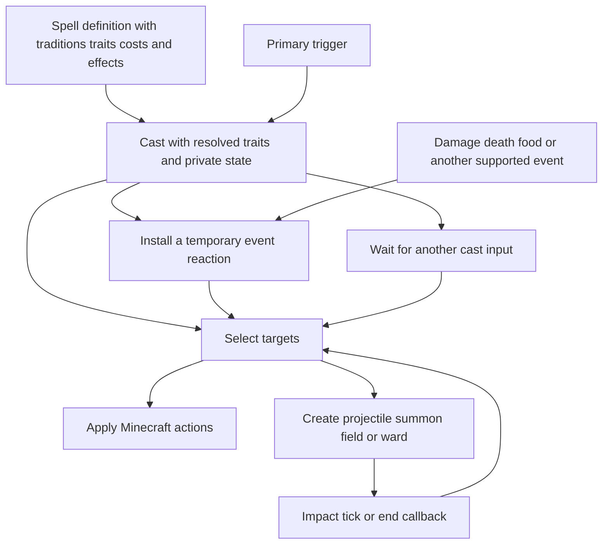

# Vestige spell reference

This guide explains the **214 spells currently defined in Vestige**: 110 native adaptations of the pinned Iron catalog, 100 Pathfinder 2e adaptations, and four native examples. It describes their behavior, rarity, traditions, trait ratings, targeting, timing, effects, and current presentation. Start with the worked examples, then use the catalog to inspect any spell in detail.

All 214 spells have an initial native gameplay balance pass: outcome tuning, resource costs, charge times, cooldowns, and limits. See the [complete balance review](spell-balance-review.md). Every definition has a composed animation recipe, including alternate modes and relevant callbacks. Dedicated creature/weapon models and some source rules remain deliberate adaptation limits; The [effects workshop](effects-workshop.md) now includes actual Minecraft recordings for every visual phase and eight real cast examples; exhaustive encounter and multiplayer review remains further work. Our own wands, discovery, and progression remain deferred. The spells run through Vestige without Iron installed. Pathfinder conversions use `pf2_` IDs; source rank, cantrip status, source rarity, publication and exact AoN URL are separate from native rarity and costs. See the [Pathfinder conversion ledger](design/pathfinder-spell-conversions.md). This reference describes the checked-in definitions and native Minecraft adapter as of October 1, 2026.

Jump to [spell structure](#how-to-read-a-spell), [trait behavior](#what-traits-actually-do), [worked examples](#worked-spell-examples), [current presentation](#shared-rules-and-current-presentation), [playtest commands](#trying-spells-now), or the [complete catalog](#complete-catalog).

The [100-source Pathfinder selection](pathfinder-spell-selection.md) lists all 100 implemented sources, including the latest 36. Earlier proposals are retained as design history. Browse and record their actual animation recipes in the [effects workshop](effects-workshop.md).

## How to read a spell

| Part | What it tells us | Example |
|---|---|---|
| Identity | Stable name used by commands and data packs | `vestige:fireball` |
| Rarity | Expected overall value and eventual availability, independent of traits | Common, uncommon, rare, or mythic |
| Traditions | The magical traditions associated with the spell; more than one is allowed | Arcane and primal |
| Traits | A flat set of names and numerical ratings | Fire 4, evocation 4, amplify 1 |
| Costs | Authored resources, charge, and recovery | 28 mana, 20 ticks of charge, 100 ticks of recovery |
| Triggers | Events that start the spell or activate its temporary reactions | Primary interaction; incoming damage |
| Targets | Which subjects an effect selects | A hostile creature on the aim ray; enemies near an impact |
| Effect plan | Ordered actions, delays, repetitions, branches, and callbacks | Launch, then damage and ignite on impact |
| Cast state | Values and target anchors owned by this particular cast | First portal position; damage deferred by Heartstop |
| Bindings | Temporary reactions attached to a subject | Echo the next three ordinary damage events |
| Manifestations | Owned things or ongoing effects created by a spell | Projectile, summon, field, portal, ward, tether |
| Source provenance | Historical source identity and tuning | Iron spell ID, school, revision, original cooldown |

A spell definition is immutable. Each cast resolves its own traits, captures its own state, and executes the effect plan while retaining its authored rarity. One Fireball definition can therefore produce casts with different numerical values without rewriting the catalog. The [rarity and balance guide](design/spell-balance.md) explains relative ratings, formula calibration, and modifier math, and the [catalog audit](spell-balance-audit.md) records current responses.



The same primitives implement many spells. Fireball and Magma Bomb share projectile and area targeting; Heartstop and Oakskin share incoming damage reactions; Portal and Wall of Fire share a captured first point and a recast continuation. There is no separate Java orchestration class for each converted spell.

### An actual definition in data

This is the complete [Force Arrow definition](../src/main/resources/data/vestige/runtime_spells/force_arrow.json), with formatting compressed for readability:

```json
{
  "rarity": "common",
  "traditions": [
    "arcane"
  ],
  "traits": {
    "vestige:force": 4,
    "vestige:evocation": 4,
    "vestige:amplify": 1,
    "vestige:range": 1
  },
  "costs": [
    {
      "type": "mana",
      "amount": 14
    },
    {
      "type": "cooldown",
      "ticks": 40
    }
  ],
  "triggers": [
    {
      "id": "vestige:primary",
      "event": "vestige:interact"
    }
  ],
  "effects": [
    {
      "type": "create_manifestation",
      "target": {
        "selection": "self"
      },
      "manifestation": {
        "kind": "vestige:projectile",
        "duration": 100,
        "values": {
          "damage": {
            "product": [
              7,
              {
                "trait": "vestige:amplify"
              }
            ]
          },
          "distance": {
            "product": [
              20,
              {
                "trait": "vestige:range"
              }
            ]
          },
          "speed": 1.5
        },
        "identifiers": {
          "item": "minecraft:amethyst_shard"
        }
      }
    }
  ]
}
```

The file path supplies the identity `vestige:force_arrow`. This example uses the projectile's default creature-impact damage path; Fireball instead supplies an explicit `on_hit` plan to select an area, damage its targets, and ignite them. Both execute through the same delivery implementation.

| Code boundary | Responsibility |
|---|---|
| [SpellDefinition](../src/main/java/com/quzzar/vestige/magic/definition/SpellDefinition.java) and [SpellRarity](../src/main/java/com/quzzar/vestige/magic/definition/SpellRarity.java) | Immutable identity, rarity, traditions, traits, costs, triggers, effects, modes, and provenance |
| [SpellEffects](../src/main/java/com/quzzar/vestige/magic/effect/SpellEffects.java) and [SpellValue](../src/main/java/com/quzzar/vestige/magic/expression/SpellValue.java) | Composed plans and numerical expressions |
| [RuntimeSpellLoader](../src/main/java/com/quzzar/vestige/magic/data/RuntimeSpellLoader.java) | Data pack definitions and catalog replacement on reload |
| [SpellRuntime](../src/main/java/com/quzzar/vestige/magic/runtime/SpellRuntime.java) | Cast sessions, continuations, reactions, owned manifestations, and cleanup |
| [MinecraftSpellWorld](../src/main/java/com/quzzar/vestige/magic/world/MinecraftSpellWorld.java) | Target selection, resources, facts, and Minecraft adapter boundary |
| [SpellActions](../src/main/java/com/quzzar/vestige/magic/world/SpellActions.java) and [SpellManifestations](../src/main/java/com/quzzar/vestige/magic/world/SpellManifestations.java) | Concrete world actions and native delivery or backing entities |

## What traits actually do

Traits describe magical character. `fire`, `blood`, `necromancy`, and `teleportation` do not automatically burn, drain life, summon undead, or move anyone. The effect plan supplies those behaviors. Multiple school traits can coexist, and source schools are provenance rather than exclusive native spell categories.

The initial 110 adaptations give each semantic trait a rating of **4**, with `amplify`, `range`, and `area` each at **1**. These are authoring conventions; raw magnitudes and totals do not measure spell power or determine rarity. The Pathfinder batch uses relative unit **1** for descriptive traits, with explicit outcome coefficients; source rank and rarity remain inert provenance. No existing trait profiles were rescaled. The four native examples have their own profiles. Formula coefficients determine what ratings produce, so equivalent scales can use smaller numbers when coefficients and other consumers are adjusted together. Missing traits have rating zero. The accepted built-in vocabulary has [50 traits](design/trait-catalog.md), and addon namespaces can extend it.

| Scaling trait | Common explicit use | Fireball formula |
|---|---|---|
| `amplify` | Multiply a damage or healing amount | `8 × amplify` damage |
| `range` | Multiply reach or projectile travel budget | `32 × range` blocks |
| `area` | Multiply a radius | `3 × area` blocks around impact |

A listed trait matters numerically only where the plan reads it. Heartstop lists all three scaling traits but reads none of them: its duration and repayment fraction are fixed. Portal reads `range`, while its endpoint lifetime stays fixed. Each catalog entry identifies **traits actually read** and **listed scaling traits unused by the plan**.

`volatile` is the sole trait with inherent runtime semantics: it can cause a cast to forfeit. None of the current 214 definitions authors it. Delivery and outcome words such as projectile, beam, damage, healing, shield, and summon are capabilities derived from effects, rather than additional traits.

## Worked spell examples

### Fireball as a projectile with an impact plan

**Traditions:** arcane and primal. **Traits:** fire 4, evocation 4, amplify 1, range 1, area 1. **Authored cost:** 28 mana, 20-tick charge (1 seconds), and a 5-second native cooldown.

The caster launches a projectile at speed 1 block per tick, with a travel budget of `32 × range` blocks. On impact, it selects up to six hostile living creatures within `3 × area` blocks, deals `8 × amplify` damage to each, and ignites them for two seconds. At baseline, the authored hit is eight health points, equivalent to four hearts before mitigation; burning is additional vanilla behavior.

For an illustrative cast resolved to amplify 2, range 1.5, and area 2, the formulas yield 16 damage, a 48-block travel budget, and a six-block radius. This is how trait scaling works; there is no normal wand interface for choosing those values yet.

**Current appearance:** a vanilla fire-charge item model travels with end-rod particles. Victims receive enchanted-hit particles and vanilla fire. Its impact plan supplies area damage; it does not currently draw a bespoke fireball explosion or destroy terrain.

### Heartstop as deferred damage

**Tradition:** occult. **Traits:** blood 4, abjuration 4, time 4, amplify 1, range 1, area 1. **Authored cost:** 80 mana, no initial charge, and a 30-second native cooldown.

The spell attaches a six-second status manifestation to the caster and initializes a damage accumulator. Its incoming damage binding runs before damage commits, stores the amount it defers, and reduces that pending amount to zero. When the manifestation ends normally, its end callback deals half the stored amount to the caster. For example, 20 deferred damage produces an authored repayment of 10 damage.

The binding has 10,000 finite charges. Amplify, range, and area do not change this recipe. Dispel and replacement can invoke the repayment callback; server stop, unavailable ownership, and removed backing close the effect without that callback. The active accumulator is not restored after restart.

**Current appearance:** an attached blood-colored shell/ring with sparks, plus composed reaction and repayment cues. A dedicated heartbeat overlay remains a possible art refinement.

### Echoing Strikes as an attacker reaction

**Tradition:** arcane. **Traits:** ender 4, evocation 4, time 4, amplify 1, range 1, area 1. **Authored cost:** 38 mana, no initial charge, and a 15-second native cooldown.

A ten-second status manifestation installs a binding on the attacker with three charges. Each eligible nonmagical damage event selects that event's victim and applies another hit worth `0.5 × reported event damage × amplify`. An event reporting eight damage therefore produces an authored four-damage echo at baseline. Range and area are unused.

The magical-event guard keeps its own magical echo from consuming further charges, and causal history also bounds repeated reactions. The native adapter currently classifies magical damage through Minecraft's `WITCH_RESISTANT_TO` damage-type tag.

**Current appearance:** default enchant particles on the caster and enchanted-hit particles on the victim. There are no custom spectral weapon models yet.

### Portal as a cast with a second placement

**Tradition:** arcane. **Traits:** ender 4, space 4, teleportation 4, amplify 1, range 1, area 1. **Authored cost:** 48 mana, no initial charge, and a 20-second native cooldown.

The first input captures an aimed position within `48 × range` blocks. The session waits up to 2,400 ticks, or two minutes, for another input of the same spell and mode. The next input captures a second position and creates linked endpoints for 1,200 ticks, or one minute. A resumed session pays once; the second placement is a continuation of the original cast.

Endpoints in the same dimension must be at least two blocks apart. They transfer eligible nearby entities in either direction, with a 30-tick per-entity cooldown to prevent immediate bouncing. Amplify and area are unused. The active endpoints are removed on reload or restart.

**Current appearance:** portal particles at both positions, with invisible native backing entities. Oriented portal frames and custom portal models are still absent.

### Raise Dead as an owned summon cohort

**Tradition:** occult. **Traits:** death 4, necromancy 4, conjuration 4, amplify 1, range 1, area 1. **Authored cost:** 60 mana, 30-tick charge (1.5 seconds), and a 30-second native cooldown.

The effect plan creates two zombies with iron swords and one skeleton with a bow. Leather helmets protect those bodies from ordinary daylight burning. The native ownership layer supplies following and combat behavior. Their maximum lifetime is 600 ticks, or thirty seconds; recasting the waiting session dismisses its cohort early.

None of its scaling traits is read. Its source school is Blood, while its native semantic profile emphasizes death, necromancy, and conjuration. This is an example of classifying the actual spell instead of copying its source school's label onto every adaptation.

**Current appearance:** vanilla equipped zombies and skeletons. Custom Iron undead bodies and advanced source AI are not reproduced.

### Root as a destructible restraint

**Tradition:** primal. **Traits:** plant 4, abjuration 4, amplify 1, range 1, area 1. **Authored cost:** 26 mana, 20-tick charge (1 seconds), and a 10-second native cooldown.

The spell selects an aimed hostile creature within `24 × range` blocks and creates a tether lasting four seconds. The tether has a backing anchor authored with ten health points and constrains the target around its initial position, with a radius of half a block. Every five ticks, it refreshes 25 ticks of vanilla Slowness V. Destroying or dispelling the anchor stops the tether and refreshes; the last slowness application can remain briefly until its own expiry.

Amplify and area are unused. Root is a restraint built from tether and status primitives; its plant trait does not independently create terrain or vines.

**Current appearance:** a finite plant-colored tether cue on its destructible anchor, with composed pulses. A detailed growing tendril mesh remains a possible art refinement.

### Chain Lightning as reusable chained targeting

**Traditions:** arcane and primal. **Traits:** lightning 4, evocation 4, amplify 1, range 1, area 1. **Authored cost:** 32 mana, 10-tick charge (0.5 seconds), and a 6-second native cooldown.

A chain selector finds an initial aimed hostile creature within `32 × range` blocks and follows up to three more nearby hostiles, for four targets total. Each jump has a fixed six-block search distance and respects the selector's visibility rules. Every selected creature receives `6 × amplify` damage. Area is unused, and range scales initial reach rather than the six-block jump distance.

**Current appearance:** enchanted-hit particles on the selected victims. Chaining is implemented as target selection; an animated lightning arc between victims has not been implemented.

## Pathfinder batch examples

The batches add 48, 16 and 36 independent definitions, for 100 `pf2_` IDs. The source rank/cantrip flag describes the published spell; these native costs and outcomes come from Vestige tuning. Source rarity is retained per spell, while native rarity reflects its Minecraft role.

| Spell / native ID | Native rarity | Mana / charge / recovery | Current native outcome |
|---|---|---|---|
| `pf2_electric_arc` | common | 8 / immediate / 1.2 s | Four HP each to at most two distinct creatures; sixteen-block initial reach, four-block visible jump. |
| `pf2_shield` | common | 6 / immediate / 3 s | Personal three-second ward, reducing one hit by three HP. Existing Iron Shield remains a stationary destructible barrier. |
| `pf2_bind_undead` | rare | 34 / 0.8 s / 15 s | Control one existing undead mob for eight seconds; expiry/dispel releases the body and restores its prior target. |
| `pf2_field_of_life` | rare | 40 / 1 s / 11 s | Six delayed one-second pulses: heal living creatures one HP or damage undead two HP, up to six creatures per pulse. Living enemies and the caster can receive healing. |
| `pf2_regenerate` | rare | 38 / 0.8 s / 13 s | Eight delayed healing pulses of 1.5 HP; fire damage ends the cast. |
| `pf2_gentle_breeze` | uncommon | 26 / 0.6 s / 8 s | Six HP once per living recipient after three seconds of continuous sampled occupancy; leaving resets progress, undead excluded. |
| `pf2_flicker` | uncommon | 28 / 0.5 s / 9 s | Four quarter-hit nonmagical reductions and three safe random teleport attempts over six seconds; blocked destinations skip the pulse. |
| `pf2_heal` / `pf2_harm` | uncommon | 24 / 0.6 s / 6 s | Eight HP restoration or harm to one aimed recipient, reversing living/undead eligibility. |
| `pf2_cataclysm` | mythic | 90 / 2 s / 30 s | Four eight-HP surges one second apart at a fixed area, with burning, slowing and a final launch. Maximum six targets per phase; leaving the area or interrupting the channel reduces the outcome. |

Pathfinder descriptive traits use relative unit one, with explicitly calibrated coefficients; source rank does not inflate trait ratings. Typed fire, freezing and lightning use Minecraft damage tags, while undead eligibility uses the entity-type tag. Tabletop saves, spell slots and automatic heightening are omitted. Full differences and citations appear in the [Pathfinder ledger](design/pathfinder-spell-conversions.md), and every executable plan appears below.

## Shared rules and current presentation

All time values use ticks; 20 ticks equal one second at the nominal server rate. Damage and healing amounts use health points; two health points equal one heart. Distances and radii use blocks. Projectile speeds are initial blocks per tick. Listed damage/healing values are authored amounts before world rules and reactions, not guaranteed final health changes.

An initial time cost delays execution. A repeated plan executes its first pulse immediately, then waits between pulses. For example, 25 pulses at four-tick intervals put the last pulse 96 ticks after the first. Recasts inside repeated plans can suspend execution longer. Manifestation tick callbacks are anchored to creation, begin after one interval, and include a final pulse at expiry when the duration is divisible by the interval. A 120-tick field at interval ten therefore has twelve pulses, regardless of server tick phase. Destruction, dispel, departure from the field, and mitigation reduce actual output.

Projectile duration is an upper bound. The native adapter also limits lifetime to `ceil(distance / speed)` ticks, and impact can end it earlier. The current projectile renderer uses a vanilla item model and an end-rod trail. Homing, spread, rain, gravity, and piercing change delivery behavior, without supplying custom models. Ordinary damage actions add enchanted-hit particles. Beam and cone selection do not automatically render a matching beam or cone.

All 214 spells author composed visual phases. Shared geometry includes arcs, beams, spheres, rings, boxes, body silhouettes, trees, water sheets, rain and veils; sparks, fire and smoke add emitters. Optional vanilla sounds are phase data. Solid entity constructs render their actual bounding boxes; Wall of Ice instead raises real, individually breakable ice blocks through vanilla block-display animation and frost particles, then retracts surviving owned cells. Ordinary summoned mobs retain vanilla bodies. The [effects workshop](effects-workshop.md) previews each phase and the `effects` command invokes the actual Minecraft renderer without gameplay. Appearance notes describe connected recipes, not completed visual playtesting of every spell.

Hostile, ally, and owned selections use the native relationship adapter. Hostile here means eligible creatures excluded by its ally rules, rather than a promise that every neutral creature is spared. Required selectors fail when no target exists; optional selectors accept an empty result. Target distance is bounded to 128 blocks, and several adapter values also have bounds. Vanilla status amplifier zero means level I, one means level II, and so on. `freeze` increases Minecraft's frozen-tick state; it does not inherently build an ice prison.

Reload or server stop closes active casts, reactions, projectiles, summons, and fields. Vanilla status applications may remain until their own expiry. Arcane Lock's container ownership and Pocket Dimension's room allocation and player return points are persistent exceptions. Active spell sessions are not serialized.

## Trying spells now

Use an operator account in a development world:

```text
/vestige_magic list
/vestige_magic cast vestige:fireball
/vestige_magic cast vestige:heartstop
/vestige_magic cast vestige:portal
/vestige_magic cast vestige:raise_dead
/vestige_magic interrupt
/vestige_magic dispel
```

`cast` explicitly bypasses resource costs and native cooldowns for development, while preserving charge/channel timing, recasts, and volatility. To exercise balance, use `/vestige_magic mana 100` followed by `/vestige_magic cast_balanced vestige:fireball` in Survival. Paid casts enforce authored mana and per-spell recovery; Creative bypasses resource payment but retains recovery. Recasts pay once and can resume during their existing cooldown. One active charge/channel per caster prevents simultaneous channel stacking; dormant recast sessions permit other spells. Players have 100 mana, full on first spawn and death/respawn, and recover 2 mana per second after a five-second expenditure delay. The mana gauge is visible only below full. Capacity progression remains deferred. Reload/restart resets active sessions and recovery timers. Normal wand controls, discovery, and progression remain deferred.

For Portal, aim at one position and cast, then aim somewhere else and cast again. For Raise Dead, cast once to summon and again to dismiss the waiting cohort. Interrupt stops unfinished casting work; dispel removes owned active manifestations. Spell-specific callbacks can make ending a spell consequential, as with Heartstop.

## Complete catalog

The groups below follow source schools for navigation; they are not native restrictions or trait hierarchies. Every entry includes its checked-in definition, classification, authored costs, explicit trait reads, a readable effect plan, current presentation, and adaptation notes. Numerical formulas preserve the data, including nested impact, tick, end, and event callbacks.

In plans, `fact(...)` reads cast, manifestation, event, or world state. `capture` snapshots a number; `store target` remembers a subject or position. Values without a formula are fixed. Projectile and field options are named explicitly where authored; the shared rules above and runtime design document cover adapter defaults and bounds. A selector's `angle` is its maximum deviation from the aim direction, and `radius` on a beam is its targeting tolerance. The legacy fact name `event/damage_amount` carries the pending healing amount during a healing reaction, as in Blight.
